<TABLE>
<TH>
Names
</TD>
<TR>
<TD>
Aishwarya Pawar
</TD>
</TR>
<TR>
<TD>
Amey Athaley
</TD>
</TR>
<TR>
<TD>
Kachi Ugo
</TD>
</TR>
<TR>
<TD>
Sadhana Koneni
</TD>
</TR>
</TABLE>

Question 1 - Green Buildings
============================

``` r
# only empl_gr - the year on year employment growth in the geographic region - has 74 null values among all columns
sapply(buildings,function(x) sum(is.na(x)))
```

    ##     CS_PropertyID           cluster              size           empl_gr 
    ##                 0                 0                 0                74 
    ##              Rent      leasing_rate           stories               age 
    ##                 0                 0                 0                 0 
    ##         renovated           class_a           class_b              LEED 
    ##                 0                 0                 0                 0 
    ##        Energystar      green_rating               net         amenities 
    ##                 0                 0                 0                 0 
    ##       cd_total_07        hd_total07       total_dd_07     Precipitation 
    ##                 0                 0                 0                 0 
    ##         Gas_Costs Electricity_Costs      cluster_rent 
    ##                 0                 0                 0

``` r
# very low leasing rates - outlier treatment
ggplot(buildings) +  
  geom_point(aes(x=leasing_rate, y = Rent, fill = factor(green_rating)), shape = 21, alpha = 0.5, size = 2) + 
  theme_classic()
```


Outlier Treatment:
------------------

Like the analyst mentioned, we observe here that the there are few
buildings with very low occupancy rates. These buildings also have rents
which are varying. These 215 buildings have been removed from further
analysis as these could potentially distort the analysis

``` r
dim(buildings)
```

    ## [1] 7894   23

``` r
buildings = buildings[buildings$leasing_rate > 10,]
dim(buildings)
```

    ## [1] 7679   23

``` r
## Calculating the premium on the green buildings - $27.6-$25 which is $2.6
buildings_summ = buildings %>%
  group_by(green_rating)  %>%  # group the data points by green_rating
  summarize(rent.mean = median(Rent))
buildings_summ
```

    ## # A tibble: 2 x 2
    ##   green_rating rent.mean
    ##          <int>     <dbl>
    ## 1            0      25.0
    ## 2            1      27.6

``` r
# rent distribution in green and non-green buildings: Green buildings have slightly higher rents
ggplot(data=buildings) + 
  geom_boxplot(mapping=aes(x=factor(green_rating),y=log(Rent)))
```


Class
-----

``` r
###########********** 1. Class **********###########

buildings$class = ifelse(buildings$class_a == 1, "A", ifelse(buildings$class_b == 1,"B","C") )

buildings_class = buildings %>% group_by(class, green_rating) %>% summarize(rent.median = median(Rent), rent.mean= mean(Rent))

ggplot(data = buildings_class) + 
  geom_bar(mapping = aes(x=class, y=rent.mean, fill=factor(green_rating)),
           position="dodge", stat='identity')
```


``` r
table(buildings$class, buildings$green_rating)
```

    ##    
    ##        0    1
    ##   A 2589  546
    ##   B 3391  131
    ##   C 1015    7

Our hypothesis is that the rents are higher for Class A buildings.

Findings: We observe that the class of the building makes a difference
but green vs. non-green buildings doesn’t show any significant changes
in rent except for Class C. On further investigation, we find that there
are only 7 green buildings so the average rent in this case may not be
an accurate representation.

Age
---

``` r
###########********** 2. Age **********###########
buildings_age = buildings %>%
  mutate(agecat = cut(age, c(-1, 20, 40, 60, 80, 100, 120, 140, 160, 180, 200)))
#summary(buildings_age)

buildings_age %>%
  group_by(agecat, green_rating)  %>%  # group the data points by age category
  summarize(rent.mean = mean(Rent), rent.median = median(Rent))
```

    ## # A tibble: 16 x 4
    ## # Groups:   agecat [10]
    ##    agecat    green_rating rent.mean rent.median
    ##    <fct>            <int>     <dbl>       <dbl>
    ##  1 (-1,20]              0      31.1        28.2
    ##  2 (-1,20]              1      30.6        28.2
    ##  3 (20,40]              0      28.8        25.7
    ##  4 (20,40]              1      29.2        27.0
    ##  5 (40,60]              0      28.7        24  
    ##  6 (40,60]              1      34.4        27.3
    ##  7 (60,80]              0      29.1        24  
    ##  8 (60,80]              1      46.7        32.0
    ##  9 (80,100]             0      26.9        25  
    ## 10 (80,100]             1      28.4        24.2
    ## 11 (100,120]            0      24.7        22  
    ## 12 (100,120]            1      18.1        20.9
    ## 13 (120,140]            0      18.2        18.1
    ## 14 (140,160]            0      16.8        19.9
    ## 15 (160,180]            0      18          18  
    ## 16 (180,200]            0      27.5        27.5

``` r
table(buildings_age$agecat, buildings_age$green_rating)
```

    ##            
    ##                0    1
    ##   (-1,20]   1039  265
    ##   (20,40]   2805  378
    ##   (40,60]    868   18
    ##   (60,80]    546    7
    ##   (80,100]  1237   13
    ##   (100,120]  424    3
    ##   (120,140]   51    0
    ##   (140,160]   22    0
    ##   (160,180]    2    0
    ##   (180,200]    1    0

``` r
ggplot(data = buildings) + 
  geom_histogram(mapping = aes(x=age, y=stat(density), fill=factor(green_rating)), binwidth = 3)
```


``` r
ggplot(buildings_age) +
  geom_boxplot(mapping=aes(x=agecat,y=Rent, fill=factor(green_rating)))
```


Findings: Most of the green buildings are less than 4 decades old and we
see that as the buildings get older, green buildings tend to have higher
rents compared to non-green buildings (we didn’t consider green
buildings older than 80 yrs as there are very few to make meaningful
conclusion about them). But in the initial decades, there is no
significant difference in rents between green and non-green categories.

Amenities
---------

``` r
###########********** 3. Amenities **********###########
buildings %>%
  group_by(amenities)  %>%  # group the data points by amenities
  summarize(rent.mean = mean(Rent), rent.median = median(Rent))
```

    ## # A tibble: 2 x 3
    ##   amenities rent.mean rent.median
    ##       <int>     <dbl>       <dbl>
    ## 1         0      27.7        25.2
    ## 2         1      29.3        25.4

``` r
buildings_am = buildings %>%
  group_by(green_rating) %>%
  summarize(am_pct = sum(amenities==1)/n())
buildings_am
```

    ## # A tibble: 2 x 2
    ##   green_rating am_pct
    ##          <int>  <dbl>
    ## 1            0  0.519
    ## 2            1  0.728

``` r
ggplot(data = buildings_am) + 
  geom_bar(mapping = aes(x=green_rating, y=am_pct), stat='identity')
```


Our hypothesis here was that buildings with amenities would have higher
rents.

Findings: We observed that the mean rent is higher for green buildings
with amenities. But, there are very few buildings with amenities in our
dataset and we have no information on the extra cost for providing these
amenities. Hence, amenities has been ruled out as a factor in our
analysis.

Net Contracts
-------------

``` r
###########********** 4. Net contracts **********########### 
buildings %>%
  group_by(net)  %>%  # group the data points by net contract
  summarize(rent.mean = mean(Rent), rent.median = median(Rent))
```

    ## # A tibble: 2 x 3
    ##     net rent.mean rent.median
    ##   <int>     <dbl>       <dbl>
    ## 1     0      28.7        25.5
    ## 2     1      24.3        22

``` r
buildings_net = buildings %>%
  group_by(green_rating) %>%
  summarize(net_pct = sum(net==1)/n())
buildings_net # green_rating = 1 -> 0.056, green_rating = 0 -> 0.032
```

    ## # A tibble: 2 x 2
    ##   green_rating net_pct
    ##          <int>   <dbl>
    ## 1            0  0.0335
    ## 2            1  0.0570

``` r
ggplot(data = buildings_net) + 
  geom_bar(mapping = aes(x=green_rating, y=net_pct), stat='identity')
```

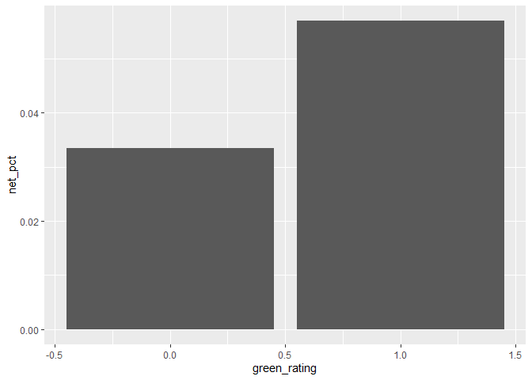

-Rent is lower when it is a net-contract -The net-contract buildings
form very small percentage of the datapoints(&lt;1%) and we do not have
information on the utilities bill. -Thus, we omitted this from our
analysis.

Leasing Rate
------------

``` r
###########********** 5. Leasing Rate **********########### 
# The leasing rate is higher for green buildings
ggplot(data=buildings) + 
  geom_boxplot(mapping=aes(x=factor(green_rating),y=leasing_rate))
```


``` r
leasing_rate_green = mean(buildings[buildings$green_rating==1,]$leasing_rate)
leasing_rate_nongreen = mean(buildings[buildings$green_rating==0,]$leasing_rate)

print(paste("The leasing rate for green buildings is", leasing_rate_green, "and for non-green buildings is", leasing_rate_nongreen))
```

    ## [1] "The leasing rate for green buildings is 89.4124269005848 and for non-green buildings is 84.4405203716941"

Conclusion:
-----------

The leasing rates are different for green and non-green buildings. Once
we account for the leasing rate in the calculation, we see that the
extra cost for green buildings can be recovered in 8.6
years(5mn/(premium for green buildings x leasing rate for green
buildings x square footage)). Once it is recovered, the green buildings
will earn $581,395 more than a non-green building an year.

Question 2 - Flights at ABIA
============================

Import the data and load the libraries
--------------------------------------

EDAs
----

``` r
# Unique Identifier of flights : UniqueCarrier ,FlightNum , TailNum 
# Get the unique values in each column:
#sapply(abia, function(x) length(unique(x)))
# Number of flights per unique carrier 
num_flights=data.frame(abia %>% group_by(UniqueCarrier) %>% 
                         summarize(count=n_distinct(FlightNum))%>%
                         arrange(desc(count)))
#Plot bar chart :
ggplot(data = num_flights) + 
  geom_bar(mapping = aes(x = reorder(UniqueCarrier, -count), y=count), stat='identity',col="steelblue")
```


Findings:
---------

<ol>
<li>
16 Unique carriers
<li>
‘WN’ carrier has the highest number of flights , followed by carrier
‘AA’
</ol>

Traffic Analysis for the Airport
--------------------------------

``` r
########## Traffic Analysis for the Airport ##############
#Create a flag with 'Incoming' or 'Outgoing' flag 
abia$flight_type=if_else(abia$Origin=='AUS','Outgoing','Incoming')
#Trend :
#Monthly Trend :
flight_freq = abia %>%
  group_by(Month,flight_type)  %>%
  summarize(flight_Frequency = n()) 
abia$Month=as.factor(abia$Month)
ggplot(flight_freq, aes(x=factor(Month), y=flight_Frequency)) + 
  geom_bar(stat='identity')+ facet_wrap(~ flight_type, nrow = 2)
```


Findings:
---------

<ol>
<li>
Summer is observed to be the most busy time for the airlines
<li>
Low traffic is observed during the winter
</ol>

Weekly trend :
--------------

``` r
abia$DayOfWeek=as.factor(abia$DayOfWeek)
week_freq = abia %>%
  group_by(DayOfWeek,flight_type)  %>%
  summarize(flight_Frequency = n()) 
ggplot(week_freq, aes(factor(DayOfWeek),flight_Frequency , fill = flight_type)) + 
  geom_bar(stat="identity", position = "dodge") + 
  scale_fill_brewer(palette = "Set1")
```

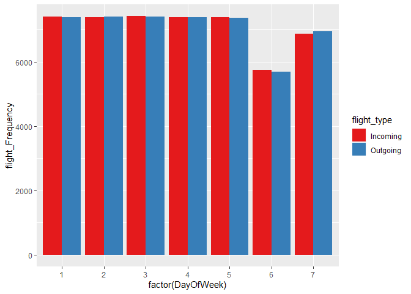

Finding:
--------

-   Less traffic is observed on Fridays (6th days of the week)

Arrival and Departure Time Analysis
-----------------------------------

``` r
abia$CRSDepTime <- sprintf("%04d", abia$CRSDepTime)
abia$CRSDepTime =format(strptime(abia$CRSDepTime , format="%H%M"), format = "%H:%M")
abia$CRSDepHour =format(strptime(abia$CRSDepTime , format="%H:%M"), format = "%H")
abia$CRSArrTime <- sprintf("%04d", abia$CRSArrTime)
abia$CRSArrTime =format(strptime(abia$CRSArrTime , format="%H%M"), format = "%H:%M")
abia$CRSArrHour =format(strptime(abia$CRSArrTime , format="%H:%M"), format = "%H")
# Hourly incoming and outgoing flight analysis
arr_freq = abia %>%
  group_by(CRSArrHour,flight_type)  %>%
  summarize(Arr_Frequency = n()) 
dep_freq = abia %>%
  group_by(CRSDepHour,flight_type)  %>%
  summarize(Dep_Frequency = n()) 
ggplot(data=arr_freq, aes(x=CRSArrHour, y=Arr_Frequency, group=flight_type)) +
  geom_line(aes(color=flight_type))+
  geom_point()
```


Finding:
--------

-   8-9 AM (CRS) is observed to be peak arrival time, followed by
    evening 6PM, 4PM and 8PM

Peak Arrival Time
-----------------

``` r
ggplot(data=dep_freq, aes(x=CRSDepHour, y=Dep_Frequency, group=flight_type)) +
  geom_line(aes(color=flight_type))+
  geom_point()
```


Finding:
--------

-   6-8 AM (CRS) is observed to be peak departure time for the flights

<!-- -->

    ## Warning: Removed 1601 rows containing non-finite values (stat_boxplot).


Finding:
--------

-   On an average flights have 100 mins of travel time from 1
    destination to another

Origin - Dest analysis
----------------------

``` r
org_dest_flights=abia%>%
  group_by(Origin,Dest,flight_type)  %>%
  summarize(daily_flights = ceiling(n()/360) )
ggplot(org_dest_flights, aes(x=daily_flights)) +
  geom_histogram(binwidth=1, colour="blue", fill="white") 
```


``` r
#Top incoming flights
inc_flights=org_dest_flights[which(org_dest_flights$flight_type=='Incoming'),]
top_inc=data.frame(head(arrange(inc_flights,desc(daily_flights)), n = 10))
ggplot(top_inc, aes(x=reorder(Origin,daily_flights),y=daily_flights)) +
  geom_bar(stat='identity') +
  coord_flip()
```


Finding:
--------

-   DFW, DAL and IAH are the high frequency incoming flights

``` r
#Top Outgoing Flights
out_flights=org_dest_flights[which(org_dest_flights$flight_type=='Outgoing'),]
top_out=data.frame(head(arrange(out_flights,desc(daily_flights)), n = 10))
ggplot(top_out, aes(x=reorder(Dest,daily_flights),y=daily_flights)) +
  geom_bar(stat='identity') +
  coord_flip()
```


Finding:
--------

-   DFW, DAL and IAH are the high frequency outgoing flights

Question 3 - Portfolio Modeling
===============================

We have to create 3 portfolios. We are particularly interested in
creating the following portfolios:
<OL>
<LI>
Emerging Markets ETFs
<LI>
Technology ETFs
<LI>
Diversified ETFs
</OL>

Emerging Markets ETFs
---------------------

``` r
#1. A portfolio of Emerging Markets ETFs
#VWO : Vanguard FTSE Emerging Markets ETF
#IEMG : iShares Core MSCI Emerging Markets ETF
#EEM : iShares MSCI Emerging Markets ETF
#SCHE : Schwab Emerging Markets Equity ETF
mystocks = c("VWO", "IEMG", "EEM", "SCHE")
myprices = getSymbols(mystocks, from = "2014-01-01")
# A chunk of code for adjusting all stocks
# creates a new object adding 'a' to the end
# For example, WMT becomes WMTa, etc
for(ticker in mystocks) {
    expr = paste0(ticker, "a = adjustOHLC(", ticker, ")")
    eval(parse(text=expr))
}
# Combine all the returns in a matrix
all_returns = cbind(ClCl(VWOa),
                                ClCl(IEMGa),
                                ClCl(EEMa),
                                ClCl(SCHEa))
all_returns = as.matrix(na.omit(all_returns))
summary(all_returns)
```

    ##    ClCl.VWOa            ClCl.IEMGa           ClCl.EEMa         
    ##  Min.   :-0.0566357   Min.   :-0.0585308   Min.   :-0.0607018  
    ##  1st Qu.:-0.0065954   1st Qu.:-0.0064596   1st Qu.:-0.0068144  
    ##  Median : 0.0006923   Median : 0.0004299   Median : 0.0005357  
    ##  Mean   : 0.0001669   Mean   : 0.0001479   Mean   : 0.0001375  
    ##  3rd Qu.: 0.0072591   3rd Qu.: 0.0072625   3rd Qu.: 0.0076300  
    ##  Max.   : 0.0402844   Max.   : 0.0396985   Max.   : 0.0442478  
    ##    ClCl.SCHEa        
    ##  Min.   :-0.0559179  
    ##  1st Qu.:-0.0065314  
    ##  Median : 0.0004451  
    ##  Mean   : 0.0001787  
    ##  3rd Qu.: 0.0075236  
    ##  Max.   : 0.0402750

Out of all the ETFs, VWO seems like a bit more volatile than the rest
(because of the spread) so let’s assign it a slighly lower weight of
0.10 and assigning equal weights to the rest.

``` r
# Now simulate many different possible scenarios  
initial_wealth = 100000
weights = c(0.10, 0.30, 0.30, 0.30)
sim1 = foreach(i=1:5000, .combine='rbind') %do% {
    total_wealth = initial_wealth
    holdings = weights * total_wealth
    n_days = 20
    wealthtracker = rep(0, n_days)
    for(today in 1:n_days) {
        return.today = resample(all_returns, 1, orig.ids=FALSE)
        holdings = holdings + holdings*return.today
        total_wealth = sum(holdings)
        wealthtracker[today] = total_wealth
        holdings = weights * total_wealth
    }
    wealthtracker
}
head(sim1)
```

    ##               [,1]      [,2]      [,3]      [,4]      [,5]      [,6]
    ## result.1 100878.37 102446.95 103766.84 103646.12 104767.27 104204.21
    ## result.2  98482.10  99063.65  99272.51  99883.00  99266.90  98065.57
    ## result.3  98943.59  99681.66  99680.42  99434.05 100872.53 101649.78
    ## result.4  99159.96  98510.09  99480.34 100871.50 101302.23 100903.90
    ## result.5  99423.84  98772.24  98947.57 100066.14  99808.79 100296.18
    ## result.6 100093.29  98121.07  97147.27  99217.51  98231.58  95717.36
    ##               [,7]      [,8]      [,9]     [,10]     [,11]     [,12]
    ## result.1 104246.94 103862.82 103965.96 105920.92 105492.99 105891.09
    ## result.2  98771.84  97288.57  96361.12  95418.14  95053.13  94442.29
    ## result.3 103655.68 104193.80 103093.09 103472.15 102963.41 106004.05
    ## result.4  99293.57 101353.08 103150.24 102051.49 102205.53 101543.95
    ## result.5 101185.66 101353.76 100822.23  99966.54 100462.73 101590.10
    ## result.6  95861.58  95739.22  96391.42  96594.81  96462.18  97806.24
    ##              [,13]     [,14]     [,15]     [,16]     [,17]     [,18]
    ## result.1 106670.60 107721.50 106148.25 106924.61 106112.95 104085.77
    ## result.2  94400.62  93978.56  92108.03  92744.05  93143.10  91889.56
    ## result.3 106880.19 107424.97 107157.52 106514.32 106538.98 105394.16
    ## result.4 101798.94 101645.34 102163.85 101329.72 102962.72 102793.28
    ## result.5 103559.73 104529.62 104468.27 104807.08 104386.76 104838.25
    ## result.6  97627.42  97469.44  97001.79  97547.13  97273.23  99039.94
    ##              [,19]     [,20]
    ## result.1 102930.35 102787.49
    ## result.2  92695.42  93363.81
    ## result.3 104714.60 105021.84
    ## result.4 103540.23 102911.48
    ## result.5 101557.02 101141.26
    ## result.6  99064.17  98804.98

``` r
hist(sim1[,n_days], 25)
```


``` r
# Profit/loss
mean(sim1[,n_days])
```

    ## [1] 100278.3

``` r
hist(sim1[,n_days]- initial_wealth, breaks=30,xlab = "Returns",main="Distribution of returns")
```


The tail risk at 5% level :

``` r
quantile(sim1[,n_days]- initial_wealth, 0.05)
```

    ##        5% 
    ## -7991.856

Technology ETFs
---------------

``` r
#2. A portfolio of TECHNOLOGY ETFs
#XLK : Technology Select Sector SPDR Fund
#VGT : Vanguard Information Technology ETF
#IXN: iShares Global Tech ETF
#TDIV : First Trust NASDAQ Technology Dividend Index Fund
mystocks2 = c("XLK", "VGT", "IXN", "TDIV")
myprices2 = getSymbols(mystocks2, from = "2014-01-01")
for(ticker in mystocks2) {
    expr = paste0(ticker, "a = adjustOHLC(", ticker, ")")
    eval(parse(text=expr))
}
# Combine all the returns in a matrix
all_returns2 = cbind(   
                ClCl(XLKa),
                                ClCl(VGTa),
                                ClCl(IXNa),
                                ClCl(TDIVa)
                                )
all_returns2 = as.matrix(na.omit(all_returns2))
# Compute the returns from the closing prices
summary(all_returns2)
```

    ##    ClCl.XLKa            ClCl.VGTa            ClCl.IXNa         
    ##  Min.   :-0.0504676   Min.   :-0.0494219   Min.   :-0.0498789  
    ##  1st Qu.:-0.0038254   1st Qu.:-0.0041368   1st Qu.:-0.0041001  
    ##  Median : 0.0010270   Median : 0.0012837   Median : 0.0012247  
    ##  Mean   : 0.0006823   Mean   : 0.0007191   Mean   : 0.0006435  
    ##  3rd Qu.: 0.0062065   3rd Qu.: 0.0063324   3rd Qu.: 0.0062657  
    ##  Max.   : 0.0603957   Max.   : 0.0603967   Max.   : 0.0556586  
    ##    ClCl.TDIVa        
    ##  Min.   :-0.0430586  
    ##  1st Qu.:-0.0040939  
    ##  Median : 0.0008417  
    ##  Mean   : 0.0004593  
    ##  3rd Qu.: 0.0057159  
    ##  Max.   : 0.0490384

Again we use the spread of the data to assess the assignment of weights
and we notice that XLK and VGT give higher returns at some point. Let’s
assign slighly higher weights to both these ETFs and create an
aggressive portfolio and see how it works!

``` r
# Now simulate many different possible scenarios  
initial_wealth = 100000
weights = c(0.30, 0.30, 0.20, 0.20) 
sim1 = foreach(i=1:1000, .combine='rbind') %do% {
    total_wealth = initial_wealth
    holdings = weights * total_wealth
    n_days = 20
    wealthtracker = rep(0, n_days)
    for(today in 1:n_days) 
      {
        return.today = resample(all_returns, 1, orig.ids=FALSE)
        holdings = holdings + holdings*return.today
        total_wealth = sum(holdings)
        wealthtracker[today] = total_wealth
        holdings = weights * total_wealth
      }
    wealthtracker
}
head(sim1)
```

    ##               [,1]      [,2]      [,3]      [,4]      [,5]      [,6]
    ## result.1 101206.03  99875.27  96176.89  97747.18  97772.19  95702.55
    ## result.2  98908.83 100744.08 101404.80 100465.15  99981.65  99917.58
    ## result.3 101483.21 101205.78 100686.92 101558.79 102438.20 102553.36
    ## result.4 101004.73 102128.03 104638.06 105243.49 107286.37 107649.30
    ## result.5  97773.14 101772.01 101642.34 101083.47  99489.66  98889.35
    ## result.6 100663.19  99980.90 100444.47 100293.90 100780.92 100535.00
    ##               [,7]      [,8]      [,9]     [,10]     [,11]     [,12]
    ## result.1  96581.80  95936.03  95563.38  94809.13  92871.78  91888.10
    ## result.2 101841.36 102614.78 102088.70 102892.55 103511.71 103388.63
    ## result.3  99783.37 100060.06 101392.91 102263.45 100986.21 101987.86
    ## result.4 107294.07 108308.62 108823.68 107062.47 108307.72 110238.05
    ## result.5  99230.34  99368.36  99100.49  95587.44  96266.81  96500.17
    ## result.6 100843.16 100568.04 100727.30 101364.93 100468.21 100398.38
    ##              [,13]     [,14]     [,15]     [,16]     [,17]     [,18]
    ## result.1  91123.16  91364.77  89696.73  91445.22  93542.93  92901.06
    ## result.2 103360.97 103128.36 103574.39 105090.47 103989.96 102644.44
    ## result.3 103064.05 102079.61 102276.60 101083.01  99584.69 100196.41
    ## result.4 110910.34 110090.70 110284.24 110766.34 111408.32 112205.63
    ## result.5  96363.07  97022.24  96994.51  94968.85  96469.28  96648.44
    ## result.6 101445.28 101698.99 101240.62 100186.88  99153.18  98534.05
    ##              [,19]     [,20]
    ## result.1  92815.41  91704.68
    ## result.2 105001.02 103945.11
    ## result.3 101201.86 101291.43
    ## result.4 112840.77 113188.20
    ## result.5  98626.68 100705.58
    ## result.6  97237.83  97788.24

``` r
hist(sim1[,n_days], 25)
```


``` r
# Profit/loss
mean(sim1[,n_days])
```

    ## [1] 100497.3

``` r
hist(sim1[,n_days]- initial_wealth, breaks=30,xlab = "Returns",main="Distribution of returns")
```

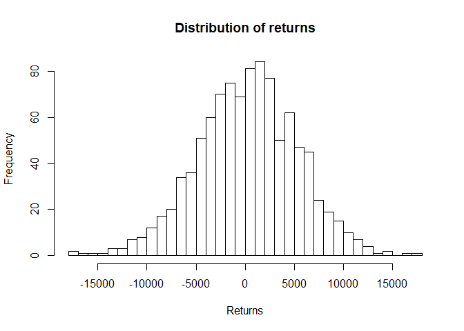

The tail risk at 5% level :

``` r
quantile(sim1[,n_days]- initial_wealth, 0.05)
```

    ##        5% 
    ## -7885.498

Diversified ETFs
----------------

Assigning equal weights to each of them to create a balanced portfolio

``` r
#3. A portfolio of diversified ETFs
#AOR : iShares Core Growth Allocation ETF
#YYY : YieldShares High Income ETF
#MDIV :     First Trust Multi-Asset Diversified Income Index Fund
#GAL :      SPDR SSgA Global Allocation ETF
mystocks3 = c("AOR", "YYY", "GAL", "MDIV")
myprices3 = getSymbols(mystocks3, from = "2014-01-01")
# A chunk of code for adjusting all stocks
# creates a new object adding 'a' to the end
# For example, WMT becomes WMTa, etc
for(ticker in mystocks3) 
{
    expr = paste0(ticker, "a = adjustOHLC(", ticker, ")")
    eval(parse(text=expr))
}
# Combine all the returns in a matrix
all_returns3 = cbind(
                                ClCl(AORa),
                                ClCl(YYYa),
                                ClCl(GALa),
                                ClCl(MDIVa))
all_returns3 = as.matrix(na.omit(all_returns3))
# Compute the returns from the closing prices
summary(all_returns3)
```

    ##    ClCl.AORa            ClCl.YYYa            ClCl.GALa         
    ##  Min.   :-0.0314434   Min.   :-0.0384463   Min.   :-0.0313433  
    ##  1st Qu.:-0.0022443   1st Qu.:-0.0020632   1st Qu.:-0.0026193  
    ##  Median : 0.0004404   Median : 0.0005462   Median : 0.0003064  
    ##  Mean   : 0.0002336   Mean   : 0.0001812   Mean   : 0.0001902  
    ##  3rd Qu.: 0.0030432   3rd Qu.: 0.0030082   3rd Qu.: 0.0034201  
    ##  Max.   : 0.0205751   Max.   : 0.0438560   Max.   : 0.0209423  
    ##    ClCl.MDIVa        
    ##  Min.   :-0.0307452  
    ##  1st Qu.:-0.0026254  
    ##  Median : 0.0004492  
    ##  Mean   : 0.0001552  
    ##  3rd Qu.: 0.0033012  
    ##  Max.   : 0.0326959

``` r
# Now simulate many different possible scenarios  
initial_wealth = 100000
weights = c(0.25, 0.25, 0.25, 0.25)
sim3 = foreach(i=1:5000, .combine='rbind') %do% {
    total_wealth = initial_wealth
    holdings = weights * total_wealth
    n_days = 20
    wealthtracker = rep(0, n_days)
    for(today in 1:n_days) {
        return.today = resample(all_returns, 1, orig.ids=FALSE)
        holdings = holdings + holdings*return.today
        total_wealth = sum(holdings)
        wealthtracker[today] = total_wealth
        holdings = weights * total_wealth
    }
    wealthtracker
}
hist(sim3[,n_days], 25)
```

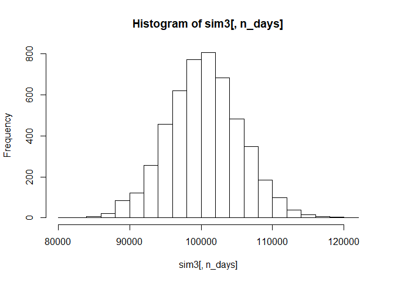

``` r
# Profit/loss
mean(sim3[,n_days])
```

    ## [1] 100497.5

``` r
hist(sim3[,n_days]- initial_wealth, breaks=30,xlab = "Returns",main="Distribution of returns")
```

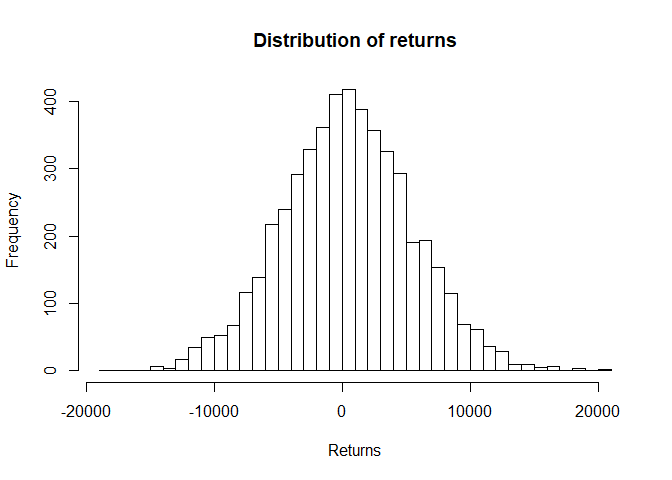

The tail risk at 5% level :

``` r
quantile(sim3[,n_days]- initial_wealth, 0.05)
```

    ##       5% 
    ## -7867.57

Summary:
--------

<OL>
<LI>
We created three ETF portfolios
<OL>
<LI>
Emerging markets (stable because we assign a lower weight to the most
volatile ETF)
<LI>
Technology sector ETFs (aggressive because we select the two most
volatile high yielding ETFs and assign them higher weights than the
rest)
<LI>
Diversified portfolio of ETFs (balanced because of equal weights)
</OL>

    <LI> We then use bootrap resampling on each of these portfolios to assess the holdings and returns by redistributing the holdings in a fair way split at the end of each day. 
    <LI> We plot histograms for returns and find out the lower tail VaR for each portfolio at the 5% level
    </OL>

Question 4 - Market Segmentation
================================

``` r
library(ggplot2)
library(ggcorrplot)
library(LICORS)  # for kmeans++
library(foreach)
library(mosaic)
library(tidyverse)
library(dplyr)
```

Reading data
------------

EDA
---

Upon looking at the data set, we observe that there were only a few rows
with values in the spam category with over 7000 zeroes, this was
significantly higher than other categories and so it was excluded. We
also excluded the chatter and uncategorized columns because they do not
tell much about user interests. We used a correlation plot to see how
much the variables are related to each other and saw that there was high
correlation amogst them.

``` r
social_s = scale(social, center=TRUE, scale=TRUE)
cormat <- round(cor(social_s), 2)
ggcorrplot(cormat, hc.order = TRUE )+
  theme(axis.text.x = element_text(angle=90, vjust=0.6))
```

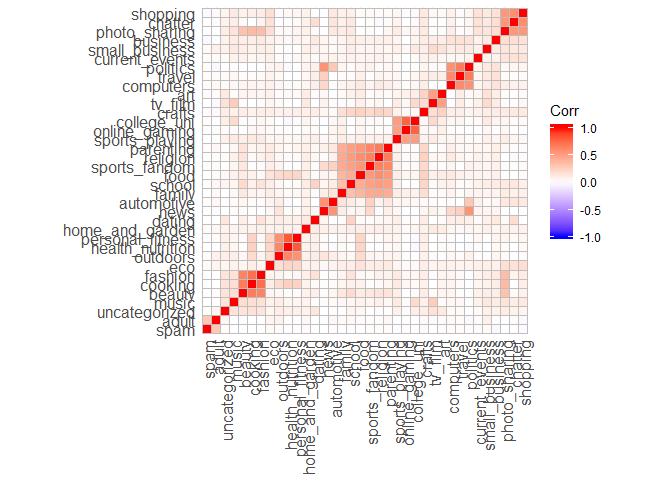

``` r
categories = c(colnames(social))
max_val = apply(social,2,max)
max.val = as.integer(max_val)
totals=colSums(social)
total.s = as.integer(totals)
n_total = cbind(categories,total.s)
zero_count = colSums(social==0)
zero.count = as.integer(zero_count)
n_zero = cbind(categories,zero.count)
tops = data.frame(cbind(categories,max.val))

#number of tweets for each column
ggplot(data = data.frame(n_total)) + 
  geom_bar(mapping = aes(x=reorder(categories, totals), y=totals), stat='identity')+
  coord_flip()
```


``` r
#number of rows with zeroes for each column
ggplot(data = data.frame(n_zero)) + 
  geom_bar(mapping = aes(x=reorder(categories, zero_count), y=zero_count), stat='identity')+
  coord_flip()
```


``` r
#checking for outliers, maximum value in each column
ggplot(data = tops) + 
  geom_bar(mapping = aes(x=reorder(categories, max_val), y=max_val), stat='identity')+
  coord_flip()
```

 \#\#
PCA Due to the number of variables and correlation in our dataset, we
used PCA to reduce the number of dimensions but still capture most of
the variance. We proceeded to create a plot showing the proportion of
variance explained by each principal component and decided that
components PC1 to PC6 were adequate to use as input for clustering.

``` r
social2=social %>% select(-one_of(c("chatter","uncategorized", "spam")))
S = social2/rowSums(social2)

pca_s = prcomp(S, center=TRUE, scale= TRUE)
plot(pca_s)
```


``` r
plot(pca_s, type='l')
```

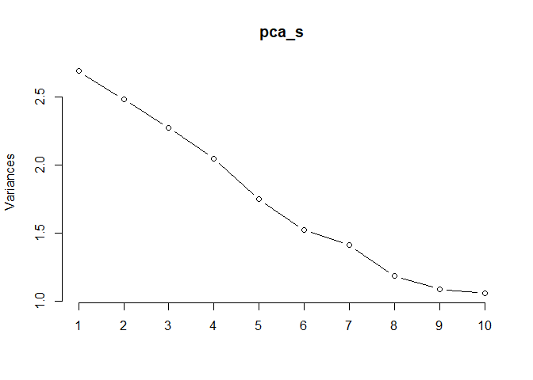

``` r
pca_var <-  pca_s$sdev ^ 2
pve <- pca_var / sum(pca_var)
#plot of pca variance proportion
plot(pve, xlab = "Principal Component", ylab = "Proportion of Variance Explained", ylim = c(0,1), type = 'b')
```

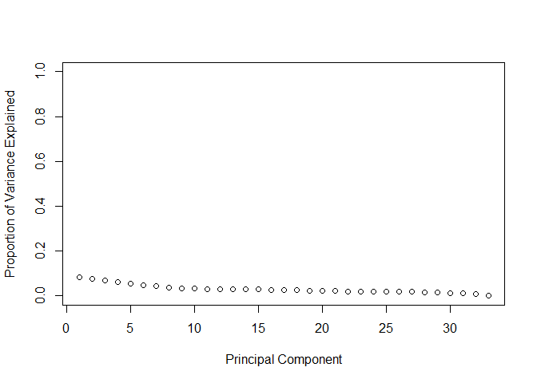

``` r
comp = data.frame(pca_s$x[,1:6])
```

K-Means++ Clustering
--------------------

In order to choose the number of clusters, we used a for loop to run the
k-means++ algorithm on values from 1:15. We then plotted the within sum
of squares value from each of those (an elbow plot) and decided to go
with 6 clusters.

``` r
wss = (nrow(comp)-1)*sum(apply(comp,2,var))
for (i in 2:15) 
  wss[i] = sum(kmeans(comp,centers=i)$withinss)
```

    ## Warning: did not converge in 10 iterations

``` r
plot(1:15, wss, type="b", xlab="Number of Clusters",
     ylab="Within groups sum of squares")
```

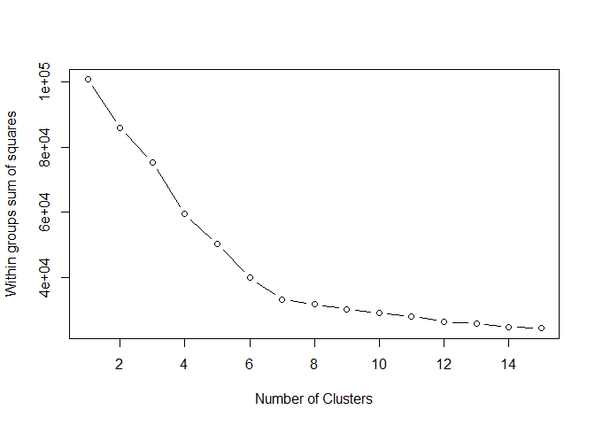

``` r
#kmeans++ using PCA scores and 6 clusters
set.seed(5)
k = kmeanspp(comp, 6, nstart=25, iter.max=1000)

#Plotting pc1 and pc2
qplot(comp[,1], comp[,2], data=comp, xlab='Component 1', ylab='Component 2')
```


``` r
#Plotting pc1 and pc2 showing clusters
qplot(comp[,1], comp[,2], data=comp, col=factor(k$cluster), xlab='Component 1', 
      ylab='Component 2')
```


``` r
loadings = pca_s$rotation[, 1:6]
clust2 = kmeanspp(loadings, 6, nstart=25, iter.max=1000)
which(clust2$cluster == 1)
```

    ## sports_fandom          food        family      religion     parenting 
    ##             5             7             8            25            27 
    ##        school 
    ##            29

``` r
which(clust2$cluster == 2)
```

    ## health_nutrition         outdoors personal_fitness 
    ##               14               21               30

``` r
which(clust2$cluster == 3)
```

    ## cooking  beauty fashion 
    ##      17      26      31

``` r
which(clust2$cluster == 4)
```

    ##  current_events   photo_sharing         tv_film home_and_garden 
    ##               1               3               4               9 
    ##           music        shopping             eco        business 
    ##              10              13              18              20 
    ##          crafts             art          dating  small_business 
    ##              22              24              28              32 
    ##           adult 
    ##              33

``` r
which(clust2$cluster == 5)
```

    ##  online_gaming    college_uni sports_playing 
    ##             12             15             16

``` r
which(clust2$cluster == 6)
```

    ##     travel   politics       news  computers automotive 
    ##          2          6         11         19         23

To figure out which categories were highly related to each cluster, we
looked at the PCA loadings to see the top associated variables. We also
clustered the PCA loadings to see which categories were grouped
together. We then used these variables to create biplots on the original
scaled data and colored the points by cluster.

How are the individual PCs loaded on the original variables? The top
variables associated with each component

``` r
o1 = order(loadings[,1], decreasing=TRUE)
colnames(S)[head(o1,10)]
```

    ##  [1] "cooking"          "health_nutrition" "personal_fitness"
    ##  [4] "fashion"          "outdoors"         "photo_sharing"   
    ##  [7] "beauty"           "online_gaming"    "college_uni"     
    ## [10] "shopping"

``` r
colnames(S)[tail(o1,5)]
```

    ## [1] "school"        "food"          "parenting"     "religion"     
    ## [5] "sports_fandom"

``` r
o2 = order(loadings[,2], decreasing=TRUE)
colnames(S)[head(o2,10)]
```

    ##  [1] "politics"       "travel"         "college_uni"    "tv_film"       
    ##  [5] "photo_sharing"  "shopping"       "online_gaming"  "current_events"
    ##  [9] "news"           "computers"

``` r
colnames(S)[tail(o2,5)]
```

    ## [1] "religion"         "food"             "outdoors"        
    ## [4] "personal_fitness" "health_nutrition"

``` r
o3 = order(loadings[,3], decreasing=TRUE)
colnames(S)[head(o3,10)]
```

    ##  [1] "politics"         "news"             "health_nutrition"
    ##  [4] "outdoors"         "personal_fitness" "travel"          
    ##  [7] "automotive"       "computers"        "adult"           
    ## [10] "eco"

``` r
colnames(S)[tail(o3,5)]
```

    ## [1] "school"        "photo_sharing" "cooking"       "beauty"       
    ## [5] "fashion"

``` r
o4 = order(loadings[,4], decreasing=TRUE)
colnames(S)[head(o4,10)]
```

    ##  [1] "fashion"       "beauty"        "cooking"       "politics"     
    ##  [5] "photo_sharing" "news"          "computers"     "automotive"   
    ##  [9] "shopping"      "travel"

``` r
colnames(S)[tail(o4,5)]
```

    ## [1] "food"           "tv_film"        "sports_playing" "online_gaming" 
    ## [5] "college_uni"

``` r
o5 = order(loadings[,5], decreasing=TRUE)
colnames(S)[head(o5,10)]
```

    ##  [1] "fashion"        "cooking"        "beauty"         "news"          
    ##  [5] "online_gaming"  "politics"       "college_uni"    "sports_playing"
    ##  [9] "travel"         "dating"

``` r
colnames(S)[tail(o5,5)]
```

    ## [1] "crafts"         "eco"            "current_events" "photo_sharing" 
    ## [5] "shopping"

``` r
o6 = order(loadings[,6], decreasing=TRUE)
colnames(S)[head(o6,10)]
```

    ##  [1] "art"            "tv_film"        "travel"         "crafts"        
    ##  [5] "small_business" "music"          "food"           "computers"     
    ##  [9] "dating"         "beauty"

``` r
colnames(S)[tail(o6,5)]
```

    ## [1] "family"        "online_gaming" "shopping"      "photo_sharing"
    ## [5] "automotive"

Market Segments According to Correlated Interests
-------------------------------------------------

K-means++ clustering with 6 clusters of sizes 2254, 976, 719, 1208,
1280, 1445: \* Young to middle-aged women (Cluster 1): Photo sharing,
shopping, home & garden are interests largely related with young women
in their mid-twenties to forties. \* Fashion, Food and Beauty
Enthusiasts (Cluster 2): Customer interests include fashion, beauty and
cooking. \* College Students (Cluster 3): This group of customers tweet
daily about their college life, online gaming and sports playing. \*
Parents (Cluster 4): Customer interests include parenting, family,
religion, school \* Middle-aged working-class men (Cluster 5): Customer
interests include politics, travel, automotive. \* Fitness Enthusiasts
(Cluster 6): Customer interests include health & nutrition, personal
fitness, outdoors.

``` r
#cluster1
qplot(shopping, photo_sharing, data=S, col=factor(k$cluster), xlab='shopping', 
      ylab='photo sharing')
```

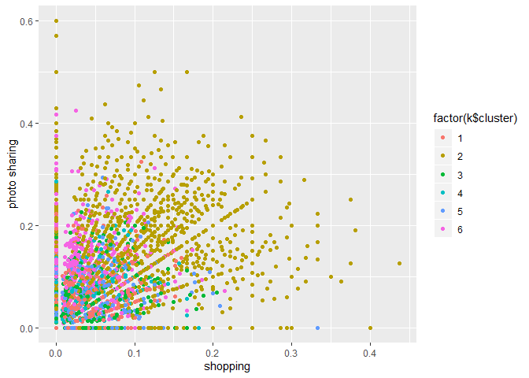

``` r
#cluster2
qplot(fashion, beauty, data=S, col=factor(k$cluster), xlab='fashion', 
      ylab='beauty')
```

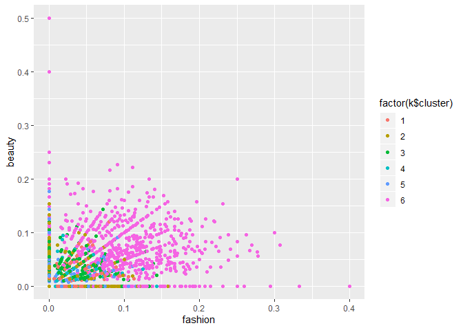

``` r
#cluster3
qplot(college_uni, online_gaming, data=S, col=factor(k$cluster), xlab='College_uni', 
      ylab='Online Gaming')
```

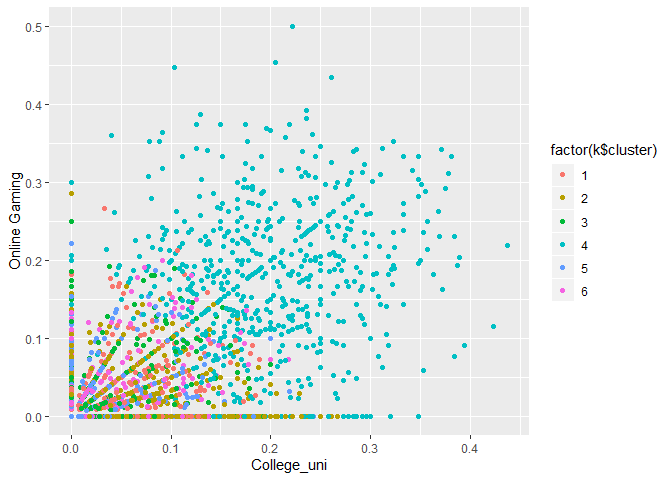

``` r
#cluster4
qplot(religion, family, data=S, col=factor(k$cluster), xlab='religion', 
      ylab='family')
```

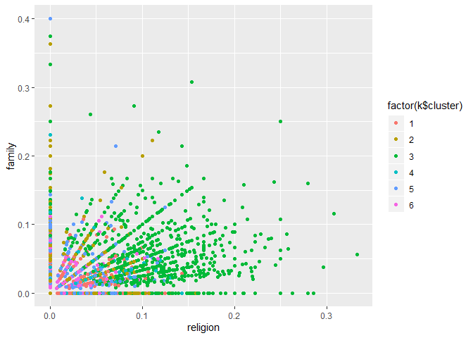

``` r
qplot(sports_fandom, parenting, data=S, col=factor(k$cluster), xlab='sports fandom', 
      ylab='parenting')
```


``` r
#cluster5
qplot(politics, automotive, data=S, col=factor(k$cluster), xlab='politics', 
      ylab='automotive')
```


``` r
#cluster6
qplot(health_nutrition, personal_fitness, data=S, col=factor(k$cluster), xlab='health & nutrition', 
      ylab='personal fitness')
```


Question 5 - Author Attribution
===============================

Loading necessary libraries
---------------------------

Reading Train and Test data from the files
------------------------------------------

``` r
#Function to clean the names :

clean_list = function(list1) 
{
   clean_lst<- list1 %>%
    { strsplit(., '/', fixed=TRUE) } %>%
    { lapply(., tail, n=2) } %>%
    { lapply(., paste0, collapse = '') } %>%
    unlist
   
   return(clean_lst)
}

train_names=clean_list(train_list)
names(train_data) = train_names

test_names=clean_list(test_list)
names(test_data) = test_names

# Clean Author name list :

author_train= clean_list(train_list)
author_train= gsub('[0-9]+', '', author_train)
author_train= gsub('newsML.txt', '', author_train)

author_test= clean_list(test_list) 
author_test= gsub('[0-9]+', '', author_test)
author_test= gsub('newsML.txt', '', author_test)
```

Generating the Corpus for train and test data
---------------------------------------------

``` r
documents_raw_train = Corpus(VectorSource(train_data))
documents_raw_test = Corpus(VectorSource(test_data))
```

Tokenization
------------

``` r
#Function for text pre-processing 

text_pre_proc= function(dat1) 
{
  my_documents = dat1
  my_documents = tm_map(my_documents, content_transformer(tolower)) # make everything lowercase 
  my_documents = tm_map(my_documents, content_transformer(removeNumbers)) # remove numbers
  my_documents = tm_map(my_documents, content_transformer(removePunctuation)) # remove punctuation
  my_documents = tm_map(my_documents, content_transformer(stripWhitespace)) ## remove excess white-space
  my_documents = tm_map(my_documents, content_transformer(removeWords), stopwords("en"))  # remove stop words
  return(my_documents)
}

# Pre-processing for train data :

train_doc=text_pre_proc(documents_raw_train)
test_doc=text_pre_proc(documents_raw_test)
```

Creating Doc-term-matrix and calculating TF-IDF weights
-------------------------------------------------------

``` r
## Function to create doc matrix and fund TF-IDF weights 

DTM_mat = DocumentTermMatrix(train_doc)  # Convert to matrix
DTM_mat = removeSparseTerms(DTM_mat, 0.95) # Removing the longtail terms (5%)


tf_idf_train = weightTfIdf(DTM_mat)

# A suboptimal but practical solution: ignore words you haven't seen before
# can do this by pre-specifying a dictionary in the construction of a DTM
DTM_test = DocumentTermMatrix(test_doc, control=list(dictionary=Terms(DTM_mat)))

tf_idf_test=weightTfIdf(DTM_test)
```

Dimensionlity Reduction: Principal Component Analysis
-----------------------------------------------------

``` r
# Data Pre-Processing for PCA : 
#1. create a matrix 
#2. Remove the columns with 0 values

X_train = as.matrix(tf_idf_train)
X_test = as.matrix(tf_idf_test)

#Removing columns with entries with 0 values
scrub_cols = which(colSums(X_train) == 0)
scrub_cols_test = which(colSums(X_test) == 0)
X_train = X_train[,-scrub_cols]
X_test = X_test[,-scrub_cols_test]

# drop uncommon words
X_test = X_test[,intersect(colnames(X_test),colnames(X_train))]
X_train = X_train[,intersect(colnames(X_test),colnames(X_train))]
```

Train PCA on training dataset and predict for test dataset
----------------------------------------------------------

``` r
pca_train = prcomp(X_train, scale=TRUE)
pca_test=predict(pca_train,newdata = X_test )
```

Choosing number of PCs to be selected
-------------------------------------

``` r
plot(pca_train,type='line')
```

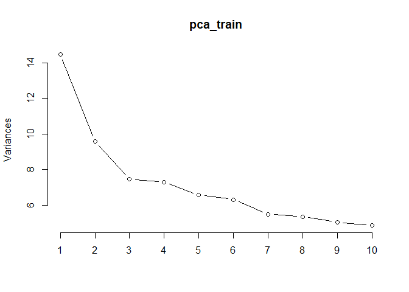

``` r
#summary(pca_train)
vars <- apply(pca_train$x, 2, var)  
props <- vars / sum(vars)
cumsum(props)
```

Choosing 75% varability hence taking 338 PCs (As both train and train1 )

Create the final dataset with reduced dimensions and with authornames
---------------------------------------------------------------------

``` r
final_train = data.frame(pca_train$x[,1:338])
final_train['author']=author_train
# Form PCs similar to training dataset
loading_train <- pca_train$rotation[,1:338]

# multiply to get a test matrix with the principal component values
X_test_pc <- scale(X_test) %*% loading_train
final_test = data.frame(pca_test[,1:338])
final_test['author']=author_test
```

LDA
---

``` r
library(MASS)
```

    ## 
    ## Attaching package: 'MASS'

    ## The following object is masked from 'package:dplyr':
    ## 
    ##     select

``` r
lda_model <- lda(as.factor(author)~., data=final_train)

lda_pred <- predict(lda_model, newdata = final_test)

#Calculate the accuracy:

answer_lda <- as.data.frame(cbind(lda_pred, final_test$author))
answer_lda$correct <- ifelse(lda_pred$class==final_test$author, 1, 0)
sum(answer_lda$correct )*100/nrow(answer_lda)
```

Naive Bayes model
-----------------

``` r
naive_model =naiveBayes(as.factor(author) ~., data=final_train)
naive_pred = predict(naive_model,final_test)
# Calculating the accuracy
answer_naive <- as.data.frame(cbind(naive_pred, final_test$author))
answer_naive$correct <- ifelse(naive_pred==final_test$author, 1, 0)
sum(answer_naive$correct)*100/nrow(answer_naive)
```

    ## [1] 46.64

Random Forest
-------------

``` r
library('randomForest')
```

    ## randomForest 4.6-14

    ## Type rfNews() to see new features/changes/bug fixes.

    ## 
    ## Attaching package: 'randomForest'

    ## The following object is masked from 'package:dplyr':
    ## 
    ##     combine

    ## The following object is masked from 'package:ggplot2':
    ## 
    ##     margin

``` r
rf_model = randomForest(as.factor(author) ~ ., data=final_train, ntree=1000, importance=TRUE)
rf_pred_test = predict(rf_model,final_test, type='response')
# Calculating the accuracy
answer <- as.data.frame(cbind(rf_pred_test, final_test$author))
answer$correct <- ifelse(rf_pred_test==final_test$author, 1, 0)
sum(answer$correct )*100/nrow(answer)
```

KNN
---

``` r
library(kknn)
```

    ## 
    ## Attaching package: 'kknn'

    ## The following object is masked from 'package:caret':
    ## 
    ##     contr.dummy

``` r
accuracies = list()
for (i in c(7,9,11,13,15,17))
{
  knn_model = kknn(as.factor(author) ~ ., final_train, final_test,
                    distance = 1,
                    k= i,
                    kernel = 'rectangular')
  
  accuracies <- c(accuracies,sum(knn_model$fitted.values == final_test$author)/nrow(final_test))
}
plot(c(7,9,11,13,15,17), accuracies, main = "KNN accuracy vs K", xlab = "K-Values", ylab = "Accuracy Score", lty = 1)
```


Considering 10 nearest neighbours

    ## [1] 26.48

Findings:
---------

-   LDA gave us the best accuracy (58.92%) among all the models we tried
    out (Naive Bayes, Random forest and KNN)

Methodology:
------------

-   We removed terms which don’t appear in 95% of the documents
-   We used Principle component analysis (PCA) to reduce the dimensions
    as including all the dimensions becomes computationally heavy
    However, accuracy is compromised due to reducing the number of
    dimensions

Quesion 6 - Association Rules
=============================

EDA
---

``` r
str(groceries)
```

    ## 'data.frame':    15296 obs. of  4 variables:
    ##  $ V1: chr  "citrus fruit" "tropical fruit" "whole milk" "pip fruit" ...
    ##  $ V2: chr  "semi-finished bread" "yogurt" "" "yogurt" ...
    ##  $ V3: chr  "margarine" "coffee" "" "cream cheese " ...
    ##  $ V4: chr  "ready soups" "" "" "meat spreads" ...

``` r
# number of baskets
dim(groceries)[1]
```

    ## [1] 15296

``` r
# distribution of items sold
product_list = c(as.list(groceries['V1']), as.list(groceries['V2']),as.list(groceries['V3']), as.list(groceries['V4']))

product_list = unlist(product_list)
freq_of_products = as.data.frame(table(product_list))[-1,]
# total number of products sold
sum(freq_of_products['Freq'])
```

    ## [1] 43367

``` r
# number of unique products sold
dim(freq_of_products)[1]
```

    ## [1] 169

``` r
# most popular products
data_plot = freq_of_products %>% arrange(-Freq) %>% head(20)

ggplot(data=data_plot,aes(x=reorder(product_list,Freq), y=Freq)) + 
  geom_bar(stat='identity') + 
    labs(title="Most popular products", 
       y="Frequency",
       x = "Products") +
  coord_flip() 
```


``` r
# least popular products
data_plot = freq_of_products %>% arrange(Freq) %>% head(20)

ggplot(data=data_plot,aes(x=reorder(product_list,-Freq), y=Freq)) + 
  geom_bar(stat='identity') + 
    labs(title="Least popular products", 
       y="Frequency",
       x = "Products") +
  coord_flip() 
```

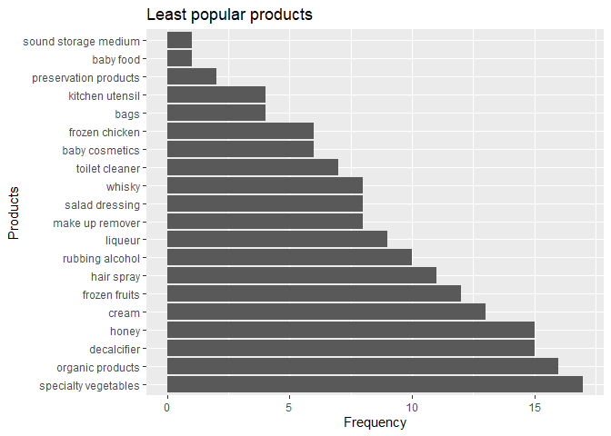

Findings:
---------

-   Most frequently bought item is whole milk
-   Number of unique items bought is 169
-   Total number of products sold is 43367

Association rules
-----------------

``` r
grocery_trans = as(grocery_baskets, "transactions")
summary(grocery_trans)
```

    ## transactions as itemMatrix in sparse format with
    ##  9835 rows (elements/itemsets/transactions) and
    ##  168 columns (items) and a density of 0.02029438 
    ## 
    ## most frequent items:
    ##       whole milk       rolls/buns other vegetables             soda 
    ##             1796             1473             1443             1421 
    ##           yogurt          (Other) 
    ##             1147            26252 
    ## 
    ## element (itemset/transaction) length distribution:
    ## sizes
    ##    0    1    2    3    4    5    6    7    8    9   10   11   12   13   14 
    ## 2159 1643 1299 1005  855  645  545  438  350  246  182  117   78   77   55 
    ##   15   16   17   18   19   20   21   22   23   25   26   27   28   31 
    ##   46   29   14   14    9   11    4    6    1    1    1    1    3    1 
    ## 
    ##    Min. 1st Qu.  Median    Mean 3rd Qu.    Max. 
    ##   0.000   1.000   2.000   3.409   5.000  31.000 
    ## 
    ## includes extended item information - examples:
    ##             labels
    ## 1 abrasive cleaner
    ## 2 artif. sweetener
    ## 3   baby cosmetics
    ## 
    ## includes extended transaction information - examples:
    ##    transactionID
    ## 1   citrus fruit
    ## 2 tropical fruit
    ## 3     whole milk

``` r
# Whole milk is the most popular product as confirmed in our EDA
groceryrules = apriori(grocery_trans, 
    parameter=list(support=.05, confidence=.1, maxlen=1))
```

    ## Apriori
    ## 
    ## Parameter specification:
    ##  confidence minval smax arem  aval originalSupport maxtime support minlen
    ##         0.1    0.1    1 none FALSE            TRUE       5    0.05      1
    ##  maxlen target   ext
    ##       1  rules FALSE
    ## 
    ## Algorithmic control:
    ##  filter tree heap memopt load sort verbose
    ##     0.1 TRUE TRUE  FALSE TRUE    2    TRUE
    ## 
    ## Absolute minimum support count: 491 
    ## 
    ## set item appearances ...[0 item(s)] done [0.00s].
    ## set transactions ...[168 item(s), 9835 transaction(s)] done [0.01s].
    ## sorting and recoding items ... [18 item(s)] done [0.00s].
    ## creating transaction tree ... done [0.00s].
    ## checking subsets of size 1

    ## Warning in apriori(grocery_trans, parameter = list(support = 0.05,
    ## confidence = 0.1, : Mining stopped (maxlen reached). Only patterns up to a
    ## length of 1 returned!

    ##  done [0.00s].
    ## writing ... [5 rule(s)] done [0.00s].
    ## creating S4 object  ... done [0.00s].

``` r
# Look at the output rules
arules::inspect(head(groceryrules, n = 10, by ="lift"))
```

    ##     lhs    rhs                support   confidence lift count
    ## [1] {}  => {soda}             0.1444840 0.1444840  1    1421 
    ## [2] {}  => {yogurt}           0.1166243 0.1166243  1    1147 
    ## [3] {}  => {rolls/buns}       0.1497712 0.1497712  1    1473 
    ## [4] {}  => {other vegetables} 0.1467209 0.1467209  1    1443 
    ## [5] {}  => {whole milk}       0.1826131 0.1826131  1    1796

``` r
groceryrules = apriori(grocery_trans, 
    parameter=list(support=.001, confidence=.50, maxlen=4))
```

    ## Apriori
    ## 
    ## Parameter specification:
    ##  confidence minval smax arem  aval originalSupport maxtime support minlen
    ##         0.5    0.1    1 none FALSE            TRUE       5   0.001      1
    ##  maxlen target   ext
    ##       4  rules FALSE
    ## 
    ## Algorithmic control:
    ##  filter tree heap memopt load sort verbose
    ##     0.1 TRUE TRUE  FALSE TRUE    2    TRUE
    ## 
    ## Absolute minimum support count: 9 
    ## 
    ## set item appearances ...[0 item(s)] done [0.00s].
    ## set transactions ...[168 item(s), 9835 transaction(s)] done [0.00s].
    ## sorting and recoding items ... [154 item(s)] done [0.00s].
    ## creating transaction tree ... done [0.00s].
    ## checking subsets of size 1 2 3 4

    ## Warning in apriori(grocery_trans, parameter = list(support = 0.001,
    ## confidence = 0.5, : Mining stopped (maxlen reached). Only patterns up to a
    ## length of 4 returned!

    ##  done [0.01s].
    ## writing ... [3231 rule(s)] done [0.00s].
    ## creating S4 object  ... done [0.00s].

``` r
# Look at the output rules
arules::inspect(head(groceryrules, n = 10, by ="lift"))
```

    ##      lhs                        rhs                  support confidence     lift count
    ## [1]  {bottled beer,                                                                   
    ##       liquor}                => {red/blush wine} 0.001220132  0.5000000 27.94034    12
    ## [2]  {hamburger meat,                                                                 
    ##       pork}                  => {beef}           0.001016777  0.5882353 27.28912    10
    ## [3]  {beef,                                                                           
    ##       hamburger meat}        => {pork}           0.001016777  0.5000000 27.01923    10
    ## [4]  {popcorn,                                                                        
    ##       soda}                  => {salty snack}    0.001220132  0.6315789 18.65339    12
    ## [5]  {baking powder,                                                                  
    ##       flour}                 => {sugar}          0.001016777  0.5555556 17.56877    10
    ## [6]  {frozen fish,                                                                    
    ##       other vegetables,                                                               
    ##       tropical fruit}        => {pip fruit}      0.001016777  0.7142857 15.04283    10
    ## [7]  {fruit/vegetable juice,                                                          
    ##       oil,                                                                            
    ##       other vegetables}      => {citrus fruit}   0.001016777  0.5263158 14.33882    10
    ## [8]  {brown bread,                                                                    
    ##       root vegetables,                                                                
    ##       tropical fruit}        => {citrus fruit}   0.001016777  0.5263158 14.33882    10
    ## [9]  {domestic eggs,                                                                  
    ##       processed cheese}      => {white bread}    0.001118454  0.5238095 13.34629    11
    ## [10] {hard cheese,                                                                    
    ##       whipped/sour cream,                                                             
    ##       yogurt}                => {butter}         0.001016777  0.6250000 13.10634    10

``` r
plot(head(groceryrules, n = 10, by ="lift"), method = "graph", 
     main = "Top 10 Association Rules")
```

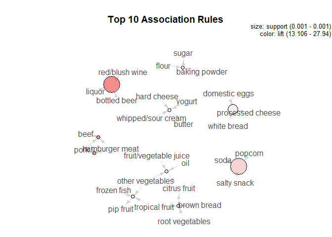

Findings:
---------

-   Whole milk is the most commonly bought item which matches our
    findings from the EDA
-   People frequently add other salty snacks when they buy soda and
    popcorn
-   Liquor, blush wine and bottled beer are sold together
-   Baking items - flour, baking powder and sugar are bought together
-   Dairy products - Hard cheese, butter, whipped/sour cream and yogurt
    are bought together
-   White bread, domestic eggs and processed cheese sell together etc.
