<TABLE>
<TH>
Names
</TD>
<TR>
<TD>
Aishwarya Pawar
</TD>
</TR>
<TR>
<TD>
Amey Athaley
</TD>
</TR>
<TR>
<TD>
Kachi Ugo
</TD>
</TR>
<TR>
<TD>
Sadhana Koneni
</TD>
</TR>
</TABLE>

Question 1 - Green Buildings
============================

``` r
library(tidyverse)
```

    ## -- Attaching packages -------------------------------------------------------------------------------------------------- tidyverse 1.2.1 --

    ## v ggplot2 3.2.0     v purrr   0.3.2
    ## v tibble  2.1.3     v dplyr   0.8.3
    ## v tidyr   0.8.3     v stringr 1.4.0
    ## v readr   1.3.1     v forcats 0.4.0

    ## -- Conflicts ----------------------------------------------------------------------------------------------------- tidyverse_conflicts() --
    ## x dplyr::filter() masks stats::filter()
    ## x dplyr::lag()    masks stats::lag()

``` r
library(mosaic)
```

    ## Loading required package: lattice

    ## Loading required package: ggformula

    ## Loading required package: ggstance

    ## 
    ## Attaching package: 'ggstance'

    ## The following objects are masked from 'package:ggplot2':
    ## 
    ##     geom_errorbarh, GeomErrorbarh

    ## 
    ## New to ggformula?  Try the tutorials: 
    ##  learnr::run_tutorial("introduction", package = "ggformula")
    ##  learnr::run_tutorial("refining", package = "ggformula")

    ## Loading required package: mosaicData

    ## Loading required package: Matrix

    ## 
    ## Attaching package: 'Matrix'

    ## The following object is masked from 'package:tidyr':
    ## 
    ##     expand

    ## Registered S3 method overwritten by 'mosaic':
    ##   method                           from   
    ##   fortify.SpatialPolygonsDataFrame ggplot2

    ## 
    ## The 'mosaic' package masks several functions from core packages in order to add 
    ## additional features.  The original behavior of these functions should not be affected by this.
    ## 
    ## Note: If you use the Matrix package, be sure to load it BEFORE loading mosaic.

    ## 
    ## Attaching package: 'mosaic'

    ## The following object is masked from 'package:Matrix':
    ## 
    ##     mean

    ## The following objects are masked from 'package:dplyr':
    ## 
    ##     count, do, tally

    ## The following object is masked from 'package:purrr':
    ## 
    ##     cross

    ## The following object is masked from 'package:ggplot2':
    ## 
    ##     stat

    ## The following objects are masked from 'package:stats':
    ## 
    ##     binom.test, cor, cor.test, cov, fivenum, IQR, median,
    ##     prop.test, quantile, sd, t.test, var

    ## The following objects are masked from 'package:base':
    ## 
    ##     max, mean, min, prod, range, sample, sum

``` r
buildings = read.csv('C:/Users/Pranay/OneDrive/Documents/STA 380/STA380/data/greenbuildings.csv')

# only empl_gr - the year on year employment growth in the geographic region - has 74 null values among all columns
sapply(buildings,function(x) sum(is.na(x)))
```

    ##     CS_PropertyID           cluster              size           empl_gr 
    ##                 0                 0                 0                74 
    ##              Rent      leasing_rate           stories               age 
    ##                 0                 0                 0                 0 
    ##         renovated           class_a           class_b              LEED 
    ##                 0                 0                 0                 0 
    ##        Energystar      green_rating               net         amenities 
    ##                 0                 0                 0                 0 
    ##       cd_total_07        hd_total07       total_dd_07     Precipitation 
    ##                 0                 0                 0                 0 
    ##         Gas_Costs Electricity_Costs      cluster_rent 
    ##                 0                 0                 0

``` r
# very low leasing rates - outlier treatment
ggplot(buildings) +  
  geom_point(aes(x=leasing_rate, y = Rent, fill = factor(green_rating)), shape = 21, alpha = 0.5, size = 2) + 
  theme_classic()
```

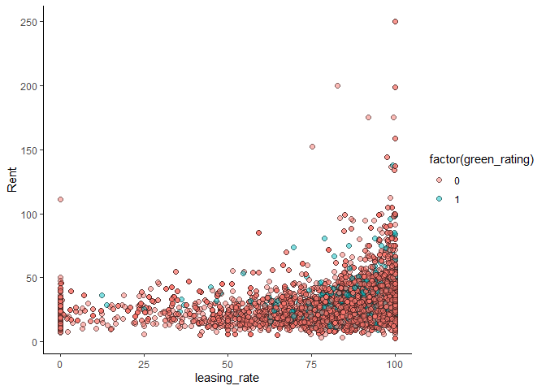

Outlier Treatment:
------------------

Like the analyst mentioned, we observe here that the there are few
buildings with very low occupancy rates. These buildings also have rents
which are varying. These 215 buildings have been removed from further
analysis as these could potentially distort the analysis

``` r
dim(buildings)
```

    ## [1] 7894   23

``` r
buildings = buildings[buildings$leasing_rate > 10,]
dim(buildings)
```

    ## [1] 7679   23

``` r
## Calculating the premium on the green buildings - $27.6-$25 which is $2.6
buildings_summ = buildings %>%
  group_by(green_rating)  %>%  # group the data points by green_rating
  summarize(rent.mean = median(Rent))
buildings_summ
```

    ## # A tibble: 2 x 2
    ##   green_rating rent.mean
    ##          <int>     <dbl>
    ## 1            0      25.0
    ## 2            1      27.6

``` r
# rent distribution in green and non-green buildings: Green buildings have slightly higher rents
ggplot(data=buildings) + 
  geom_boxplot(mapping=aes(x=factor(green_rating),y=log(Rent)))
```

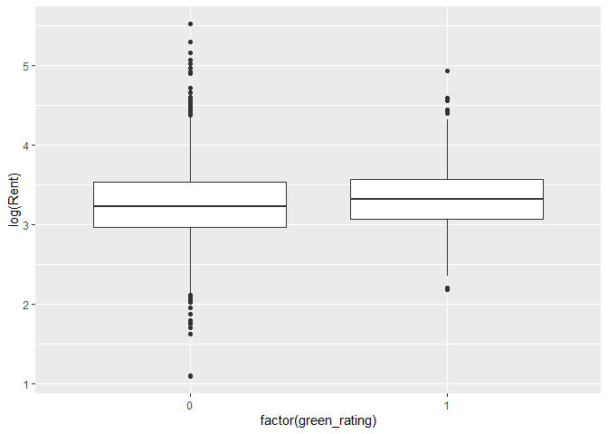

Class
-----

``` r
###########********** 1. Class **********###########

buildings$class = ifelse(buildings$class_a == 1, "A", ifelse(buildings$class_b == 1,"B","C") )

buildings_class = buildings %>% group_by(class, green_rating) %>% summarize(rent.median = median(Rent), rent.mean= mean(Rent))

ggplot(data = buildings_class) + 
  geom_bar(mapping = aes(x=class, y=rent.mean, fill=factor(green_rating)),
           position="dodge", stat='identity')
```


``` r
table(buildings$class, buildings$green_rating)
```

    ##    
    ##        0    1
    ##   A 2589  546
    ##   B 3391  131
    ##   C 1015    7

Our hypothesis is that the rents are higher for Class A buildings.

Findings: We observe that the class of the building makes a difference
but green vs. non-green buildings doesn’t show any significant changes
in rent except for Class C. On further investigation, we find that there
are only 7 green buildings so the average rent in this case may not be
an accurate representation.

Age
---

``` r
###########********** 2. Age **********###########
buildings_age = buildings %>%
  mutate(agecat = cut(age, c(-1, 20, 40, 60, 80, 100, 120, 140, 160, 180, 200)))
summary(buildings_age)
```

    ##  CS_PropertyID        cluster            size            empl_gr       
    ##  Min.   :      1   Min.   :   1.0   Min.   :   2378   Min.   :-24.950  
    ##  1st Qu.: 157426   1st Qu.: 272.0   1st Qu.:  52000   1st Qu.:  1.740  
    ##  Median : 313238   Median : 479.0   Median : 132417   Median :  1.970  
    ##  Mean   : 435335   Mean   : 590.1   Mean   : 239465   Mean   :  3.188  
    ##  3rd Qu.: 440780   3rd Qu.:1044.0   3rd Qu.: 302375   3rd Qu.:  2.380  
    ##  Max.   :6208103   Max.   :1230.0   Max.   :3781045   Max.   : 67.780  
    ##                                                       NA's   :73       
    ##       Rent         leasing_rate       stories            age        
    ##  Min.   :  2.98   Min.   : 10.68   Min.   :  1.00   Min.   :  0.00  
    ##  1st Qu.: 19.50   1st Qu.: 79.51   1st Qu.:  4.00   1st Qu.: 23.00  
    ##  Median : 25.29   Median : 90.24   Median : 10.00   Median : 34.00  
    ##  Mean   : 28.59   Mean   : 84.88   Mean   : 13.83   Mean   : 47.04  
    ##  3rd Qu.: 34.20   3rd Qu.: 96.66   3rd Qu.: 20.00   3rd Qu.: 79.00  
    ##  Max.   :250.00   Max.   :100.00   Max.   :110.00   Max.   :187.00  
    ##                                                                     
    ##    renovated         class_a          class_b            LEED         
    ##  Min.   :0.0000   Min.   :0.0000   Min.   :0.0000   Min.   :0.000000  
    ##  1st Qu.:0.0000   1st Qu.:0.0000   1st Qu.:0.0000   1st Qu.:0.000000  
    ##  Median :0.0000   Median :0.0000   Median :0.0000   Median :0.000000  
    ##  Mean   :0.3814   Mean   :0.4083   Mean   :0.4587   Mean   :0.007032  
    ##  3rd Qu.:1.0000   3rd Qu.:1.0000   3rd Qu.:1.0000   3rd Qu.:0.000000  
    ##  Max.   :1.0000   Max.   :1.0000   Max.   :1.0000   Max.   :1.000000  
    ##                                                                       
    ##    Energystar       green_rating          net            amenities    
    ##  Min.   :0.00000   Min.   :0.00000   Min.   :0.00000   Min.   :0.000  
    ##  1st Qu.:0.00000   1st Qu.:0.00000   1st Qu.:0.00000   1st Qu.:0.000  
    ##  Median :0.00000   Median :0.00000   Median :0.00000   Median :1.000  
    ##  Mean   :0.08295   Mean   :0.08907   Mean   :0.03555   Mean   :0.538  
    ##  3rd Qu.:0.00000   3rd Qu.:0.00000   3rd Qu.:0.00000   3rd Qu.:1.000  
    ##  Max.   :1.00000   Max.   :1.00000   Max.   :1.00000   Max.   :1.000  
    ##                                                                       
    ##   cd_total_07     hd_total07    total_dd_07   Precipitation  
    ##  Min.   :  39   Min.   :   0   Min.   :2103   Min.   :10.46  
    ##  1st Qu.: 684   1st Qu.:1419   1st Qu.:2869   1st Qu.:22.71  
    ##  Median : 966   Median :2739   Median :4979   Median :23.16  
    ##  Mean   :1217   Mean   :3440   Mean   :4657   Mean   :31.10  
    ##  3rd Qu.:1620   3rd Qu.:4796   3rd Qu.:6413   3rd Qu.:43.89  
    ##  Max.   :5240   Max.   :7200   Max.   :8244   Max.   :58.02  
    ##                                                              
    ##    Gas_Costs        Electricity_Costs  cluster_rent      class          
    ##  Min.   :0.009487   Min.   :0.01780   Min.   : 9.00   Length:7679       
    ##  1st Qu.:0.010296   1st Qu.:0.02330   1st Qu.:20.25   Class :character  
    ##  Median :0.010296   Median :0.03274   Median :25.20   Mode  :character  
    ##  Mean   :0.011329   Mean   :0.03095   Mean   :27.60                     
    ##  3rd Qu.:0.011816   3rd Qu.:0.03781   3rd Qu.:34.15                     
    ##  Max.   :0.028914   Max.   :0.06280   Max.   :71.44                     
    ##                                                                         
    ##        agecat    
    ##  (20,40]  :3183  
    ##  (-1,20]  :1304  
    ##  (80,100] :1250  
    ##  (40,60]  : 886  
    ##  (60,80]  : 553  
    ##  (100,120]: 427  
    ##  (Other)  :  76

``` r
buildings_age %>%
  group_by(agecat, green_rating)  %>%  # group the data points by age category
  summarize(rent.mean = mean(Rent), rent.median = median(Rent))
```

    ## # A tibble: 16 x 4
    ## # Groups:   agecat [10]
    ##    agecat    green_rating rent.mean rent.median
    ##    <fct>            <int>     <dbl>       <dbl>
    ##  1 (-1,20]              0      31.1        28.2
    ##  2 (-1,20]              1      30.6        28.2
    ##  3 (20,40]              0      28.8        25.7
    ##  4 (20,40]              1      29.2        27.0
    ##  5 (40,60]              0      28.7        24  
    ##  6 (40,60]              1      34.4        27.3
    ##  7 (60,80]              0      29.1        24  
    ##  8 (60,80]              1      46.7        32.0
    ##  9 (80,100]             0      26.9        25  
    ## 10 (80,100]             1      28.4        24.2
    ## 11 (100,120]            0      24.7        22  
    ## 12 (100,120]            1      18.1        20.9
    ## 13 (120,140]            0      18.2        18.1
    ## 14 (140,160]            0      16.8        19.9
    ## 15 (160,180]            0      18          18  
    ## 16 (180,200]            0      27.5        27.5

``` r
table(buildings_age$agecat, buildings_age$green_rating)
```

    ##            
    ##                0    1
    ##   (-1,20]   1039  265
    ##   (20,40]   2805  378
    ##   (40,60]    868   18
    ##   (60,80]    546    7
    ##   (80,100]  1237   13
    ##   (100,120]  424    3
    ##   (120,140]   51    0
    ##   (140,160]   22    0
    ##   (160,180]    2    0
    ##   (180,200]    1    0

``` r
ggplot(data = buildings) + 
  geom_histogram(mapping = aes(x=age, y=stat(density), fill=factor(green_rating)), binwidth = 3)
```


``` r
ggplot(buildings_age) +
  geom_boxplot(mapping=aes(x=agecat,y=Rent, fill=factor(green_rating)))
```


Findings: Most of the green buildings are less than 4 decades old and we
see that as the buildings get older, green buildings tend to have higher
rents compared to non-green buildings (we didn’t consider green
buildings older than 80 yrs as there are very few to make meaningful
conclusion about them). But in the initial decades, there is no
significant difference in rents between green and non-green categories.

Amenities
---------

``` r
###########********** 3. Amenities **********###########
buildings %>%
  group_by(amenities)  %>%  # group the data points by amenities
  summarize(rent.mean = mean(Rent), rent.median = median(Rent))
```

    ## # A tibble: 2 x 3
    ##   amenities rent.mean rent.median
    ##       <int>     <dbl>       <dbl>
    ## 1         0      27.7        25.2
    ## 2         1      29.3        25.4

``` r
buildings_am = buildings %>%
  group_by(green_rating) %>%
  summarize(am_pct = sum(amenities==1)/n())
buildings_am
```

    ## # A tibble: 2 x 2
    ##   green_rating am_pct
    ##          <int>  <dbl>
    ## 1            0  0.519
    ## 2            1  0.728

``` r
ggplot(data = buildings_am) + 
  geom_bar(mapping = aes(x=green_rating, y=am_pct), stat='identity')
```

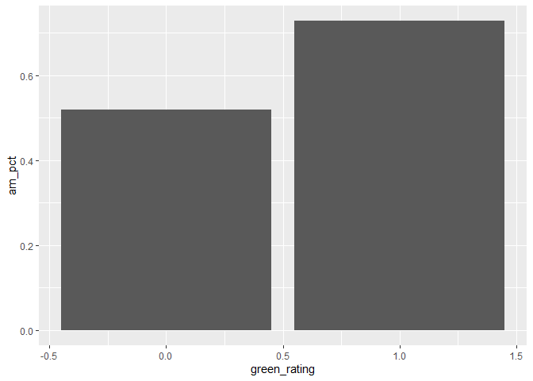

Our hypothesis here was that buildings with amenities would have higher
rents.

Findings: We observed that the mean rent is higher for green buildings
with amenities. But, there are very few buildings with amenities in our
dataset and we have no information on the extra cost for providing these
amenities. Hence, amenities has been ruled out as a factor in our
analysis.

Net Contracts
-------------

``` r
###########********** 4. Net contracts **********########### 
buildings %>%
  group_by(net)  %>%  # group the data points by net contract
  summarize(rent.mean = mean(Rent), rent.median = median(Rent))
```

    ## # A tibble: 2 x 3
    ##     net rent.mean rent.median
    ##   <int>     <dbl>       <dbl>
    ## 1     0      28.7        25.5
    ## 2     1      24.3        22

``` r
buildings_net = buildings %>%
  group_by(green_rating) %>%
  summarize(net_pct = sum(net==1)/n())
buildings_net # green_rating = 1 -> 0.056, green_rating = 0 -> 0.032
```

    ## # A tibble: 2 x 2
    ##   green_rating net_pct
    ##          <int>   <dbl>
    ## 1            0  0.0335
    ## 2            1  0.0570

``` r
ggplot(data = buildings_net) + 
  geom_bar(mapping = aes(x=green_rating, y=net_pct), stat='identity')
```

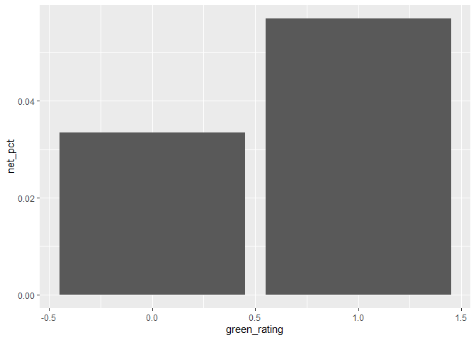

-Rent is lower when it is a net-contract -The net-contract buildings
form very small percentage of the datapoints(&lt;1%) and we do not have
information on the utilities bill. -Thus, we omitted this from our
analysis.

Leasing Rate
------------

``` r
###########********** 5. Leasing Rate **********########### 
# The leasing rate is higher for green buildings
ggplot(data=buildings) + 
  geom_boxplot(mapping=aes(x=factor(green_rating),y=leasing_rate))
```


``` r
leasing_rate_green = mean(buildings[buildings$green_rating==1,]$leasing_rate)
leasing_rate_nongreen = mean(buildings[buildings$green_rating==0,]$leasing_rate)

print(paste("The leasing rate for green buildings is", leasing_rate_green, "and for non-green buildings is", leasing_rate_nongreen))
```

    ## [1] "The leasing rate for green buildings is 89.4124269005848 and for non-green buildings is 84.4405203716941"

Conclusion:
-----------

The leasing rates are different for green and non-green buildings. Once
we account for the leasing rate in the calculation, we see that the
extra cost for green buildings can be recovered in 8.6
years(5mn/(premium for green buildings x leasing rate for green
buildings x square footage)). Once it is recovered, the green buildings
will earn $581,395 more than a non-green building an year.

Question 4 - Market Segmentation
================================

``` r
library(ggplot2)
library(ggcorrplot)
library(LICORS)  # for kmeans++
library(foreach)
```

    ## 
    ## Attaching package: 'foreach'

    ## The following objects are masked from 'package:purrr':
    ## 
    ##     accumulate, when

``` r
library(mosaic)
library(tidyverse)
library(dplyr)
```

Reading data
------------

``` r
social = read.csv('C:/Users/Pranay/OneDrive/Documents/STA 380/STA380/data/social_marketing.csv', header=TRUE, row.names=1)
head(social)
```

    ##           chatter current_events travel photo_sharing uncategorized
    ## hmjoe4g3k       2              0      2             2             2
    ## clk1m5w8s       3              3      2             1             1
    ## jcsovtak3       6              3      4             3             1
    ## 3oeb4hiln       1              5      2             2             0
    ## fd75x1vgk       5              2      0             6             1
    ## h6nvj91yp       6              4      2             7             0
    ##           tv_film sports_fandom politics food family home_and_garden music
    ## hmjoe4g3k       1             1        0    4      1               2     0
    ## clk1m5w8s       1             4        1    2      2               1     0
    ## jcsovtak3       5             0        2    1      1               1     1
    ## 3oeb4hiln       1             0        1    0      1               0     0
    ## fd75x1vgk       0             0        2    0      1               0     0
    ## h6nvj91yp       1             1        0    2      1               1     1
    ##           news online_gaming shopping health_nutrition college_uni
    ## hmjoe4g3k    0             0        1               17           0
    ## clk1m5w8s    0             0        0                0           0
    ## jcsovtak3    1             0        2                0           0
    ## 3oeb4hiln    0             0        0                0           1
    ## fd75x1vgk    0             3        2                0           4
    ## h6nvj91yp    0             0        5                0           0
    ##           sports_playing cooking eco computers business outdoors crafts
    ## hmjoe4g3k              2       5   1         1        0        2      1
    ## clk1m5w8s              1       0   0         0        1        0      2
    ## jcsovtak3              0       2   1         0        0        0      2
    ## 3oeb4hiln              0       0   0         0        1        0      3
    ## fd75x1vgk              0       1   0         1        0        1      0
    ## h6nvj91yp              0       0   0         1        1        0      0
    ##           automotive art religion beauty parenting dating school
    ## hmjoe4g3k          0   0        1      0         1      1      0
    ## clk1m5w8s          0   0        0      0         0      1      4
    ## jcsovtak3          0   8        0      1         0      1      0
    ## 3oeb4hiln          0   2        0      1         0      0      0
    ## fd75x1vgk          0   0        0      0         0      0      0
    ## h6nvj91yp          1   0        0      0         0      0      0
    ##           personal_fitness fashion small_business spam adult
    ## hmjoe4g3k               11       0              0    0     0
    ## clk1m5w8s                0       0              0    0     0
    ## jcsovtak3                0       1              0    0     0
    ## 3oeb4hiln                0       0              0    0     0
    ## fd75x1vgk                0       0              1    0     0
    ## h6nvj91yp                0       0              0    0     0

``` r
social_s = scale(social, center=TRUE, scale=TRUE)
```

EDA
---

Upon looking at the data set, we observe that there were only a few rows
with values in the spam category with over 7000 zeroes, this was
significantly higher than other categories and so it was excluded. We
also excluded the chatter and uncategorized columns because they do not
tell much about user interests. We used a correlation plot to see how
much the variables are related to each other and saw that there was high
correlation amogst them.

``` r
cormat <- round(cor(social_s), 2)
ggcorrplot(cormat, hc.order = TRUE )+
  theme(axis.text.x = element_text(angle=90, vjust=0.6))
```

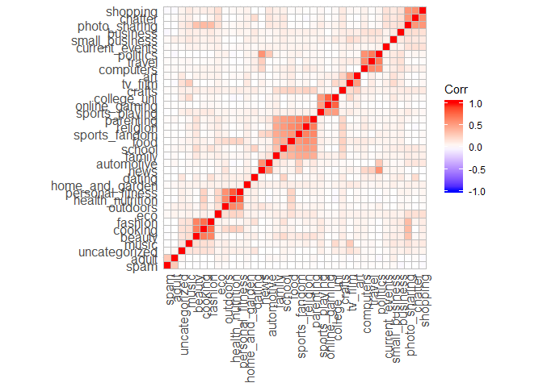

``` r
categories = c(colnames(social))
max_val = apply(social,2,max)
max.val = as.integer(max_val)
totals=colSums(social)
total.s = as.integer(totals)
n_total = cbind(categories,total.s)
zero_count = colSums(social==0)
zero.count = as.integer(zero_count)
n_zero = cbind(categories,zero.count)
tops = data.frame(cbind(categories,max.val))

#number of tweets for each column
ggplot(data = data.frame(n_total)) + 
  geom_bar(mapping = aes(x=reorder(categories, totals), y=totals), stat='identity')+
  coord_flip()
```

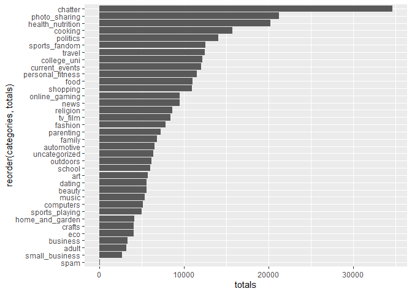

``` r
#number of rows with zeroes for each column
ggplot(data = data.frame(n_zero)) + 
  geom_bar(mapping = aes(x=reorder(categories, zero_count), y=zero_count), stat='identity')+
  coord_flip()
```

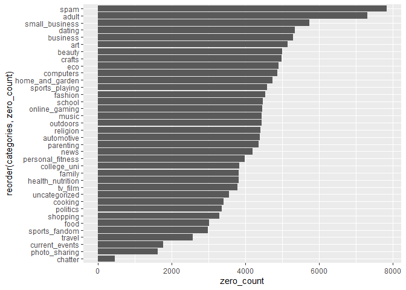

``` r
#checking for outliers, maximum value in each column
ggplot(data = tops) + 
  geom_bar(mapping = aes(x=reorder(categories, max_val), y=max_val), stat='identity')+
  coord_flip()
```

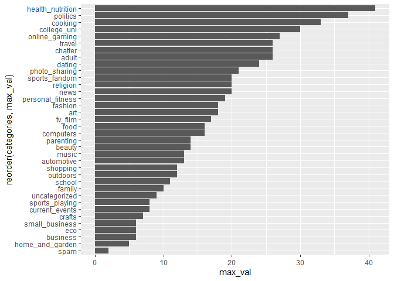 \#\#
PCA Due to the number of variables and correlation in our dataset, we
used PCA to reduce the number of dimensions but still capture most of
the variance. We proceeded to create a plot showing the proportion of
variance explained by each principal component and decided that
components PC1 to PC6 were adequate to use as input for clustering.

``` r
social2=social %>% select(-one_of(c("chatter","uncategorized", "spam")))
S = social2/rowSums(social2)

pca_s = prcomp(S, center=TRUE, scale= TRUE)
plot(pca_s)
```

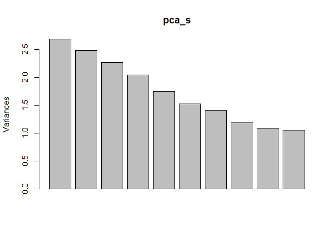

``` r
plot(pca_s, type='l')
```

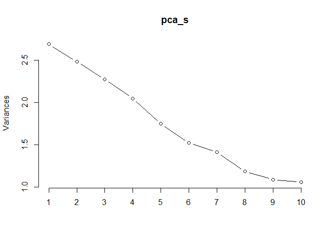

``` r
pca_var <-  pca_s$sdev ^ 2
pve <- pca_var / sum(pca_var)
#plot of pca variance proportion
plot(pve, xlab = "Principal Component", ylab = "Proportion of Variance Explained", ylim = c(0,1), type = 'b')
```

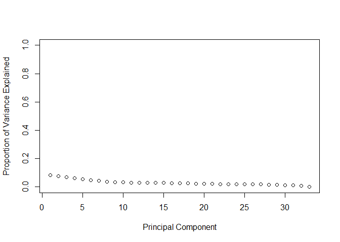

``` r
comp = data.frame(pca_s$x[,1:6])
```

K-Means++ Clustering
--------------------

In order to choose the number of clusters, we used a for loop to run the
k-means++ algorithm on values from 1:15. We then plotted the within sum
of squares value from each of those (an elbow plot) and decided to go
with 6 clusters.

``` r
wss = (nrow(comp)-1)*sum(apply(comp,2,var))
for (i in 2:15) 
  wss[i] = sum(kmeans(comp,centers=i)$withinss)
plot(1:15, wss, type="b", xlab="Number of Clusters",
     ylab="Within groups sum of squares")
```

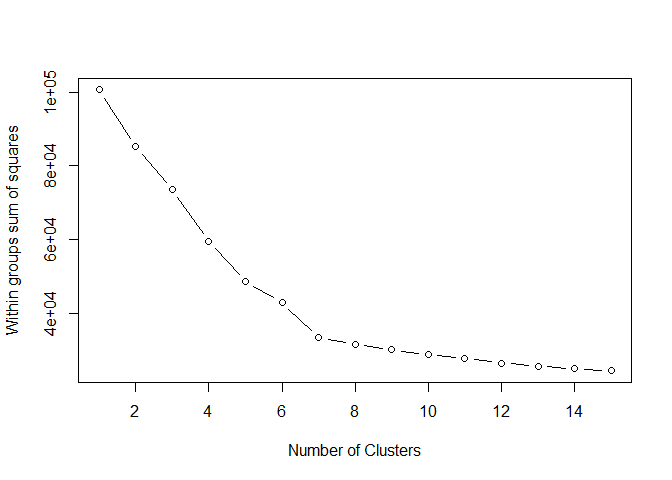

``` r
#kmeans++ using PCA scores and 6 clusters
set.seed(5)
k = kmeanspp(comp, 6, nstart=25, iter.max=1000)

#Plotting pc1 and pc2
qplot(comp[,1], comp[,2], data=comp, xlab='Component 1', ylab='Component 2')
```

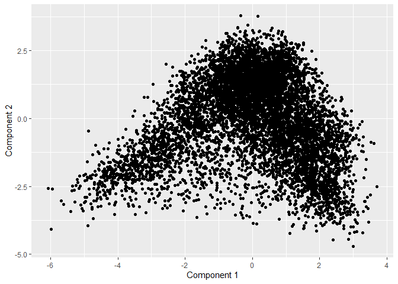

``` r
#Plotting pc1 and pc2 showing clusters
qplot(comp[,1], comp[,2], data=comp, col=factor(k$cluster), xlab='Component 1', 
      ylab='Component 2')
```

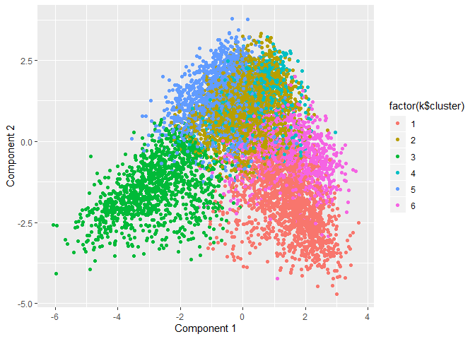

``` r
loadings = pca_s$rotation[, 1:6]
clust2 = kmeanspp(loadings, 6, nstart=25, iter.max=1000)
which(clust2$cluster == 1)
```

    ## sports_fandom          food        family      religion     parenting 
    ##             5             7             8            25            27 
    ##        school 
    ##            29

``` r
which(clust2$cluster == 2)
```

    ## health_nutrition         outdoors personal_fitness 
    ##               14               21               30

``` r
which(clust2$cluster == 3)
```

    ## cooking  beauty fashion 
    ##      17      26      31

``` r
which(clust2$cluster == 4)
```

    ##  current_events   photo_sharing         tv_film home_and_garden 
    ##               1               3               4               9 
    ##           music        shopping             eco        business 
    ##              10              13              18              20 
    ##          crafts             art          dating  small_business 
    ##              22              24              28              32 
    ##           adult 
    ##              33

``` r
which(clust2$cluster == 5)
```

    ##  online_gaming    college_uni sports_playing 
    ##             12             15             16

``` r
which(clust2$cluster == 6)
```

    ##     travel   politics       news  computers automotive 
    ##          2          6         11         19         23

To figure out which categories were highly related to each cluster, we
looked at the PCA loadings to see the top associated variables. We also
clustered the PCA loadings to see which categories were grouped
together. We then used these variables to create biplots on the original
scaled data and colored the points by cluster.

How are the individual PCs loaded on the original variables? The top
variables associated with each component

``` r
o1 = order(loadings[,1], decreasing=TRUE)
colnames(S)[head(o1,10)]
```

    ##  [1] "cooking"          "health_nutrition" "personal_fitness"
    ##  [4] "fashion"          "outdoors"         "photo_sharing"   
    ##  [7] "beauty"           "online_gaming"    "college_uni"     
    ## [10] "shopping"

``` r
colnames(S)[tail(o1,5)]
```

    ## [1] "school"        "food"          "parenting"     "religion"     
    ## [5] "sports_fandom"

``` r
o2 = order(loadings[,2], decreasing=TRUE)
colnames(S)[head(o2,10)]
```

    ##  [1] "politics"       "travel"         "college_uni"    "tv_film"       
    ##  [5] "photo_sharing"  "shopping"       "online_gaming"  "current_events"
    ##  [9] "news"           "computers"

``` r
colnames(S)[tail(o2,5)]
```

    ## [1] "religion"         "food"             "outdoors"        
    ## [4] "personal_fitness" "health_nutrition"

``` r
o3 = order(loadings[,3], decreasing=TRUE)
colnames(S)[head(o3,10)]
```

    ##  [1] "politics"         "news"             "health_nutrition"
    ##  [4] "outdoors"         "personal_fitness" "travel"          
    ##  [7] "automotive"       "computers"        "adult"           
    ## [10] "eco"

``` r
colnames(S)[tail(o3,5)]
```

    ## [1] "school"        "photo_sharing" "cooking"       "beauty"       
    ## [5] "fashion"

``` r
o4 = order(loadings[,4], decreasing=TRUE)
colnames(S)[head(o4,10)]
```

    ##  [1] "fashion"       "beauty"        "cooking"       "politics"     
    ##  [5] "photo_sharing" "news"          "computers"     "automotive"   
    ##  [9] "shopping"      "travel"

``` r
colnames(S)[tail(o4,5)]
```

    ## [1] "food"           "tv_film"        "sports_playing" "online_gaming" 
    ## [5] "college_uni"

``` r
o5 = order(loadings[,5], decreasing=TRUE)
colnames(S)[head(o5,10)]
```

    ##  [1] "fashion"        "cooking"        "beauty"         "news"          
    ##  [5] "online_gaming"  "politics"       "college_uni"    "sports_playing"
    ##  [9] "travel"         "dating"

``` r
colnames(S)[tail(o5,5)]
```

    ## [1] "crafts"         "eco"            "current_events" "photo_sharing" 
    ## [5] "shopping"

``` r
o6 = order(loadings[,6], decreasing=TRUE)
colnames(S)[head(o6,10)]
```

    ##  [1] "art"            "tv_film"        "travel"         "crafts"        
    ##  [5] "small_business" "music"          "food"           "computers"     
    ##  [9] "dating"         "beauty"

``` r
colnames(S)[tail(o6,5)]
```

    ## [1] "family"        "online_gaming" "shopping"      "photo_sharing"
    ## [5] "automotive"

Market Segments According to Correlated Interests
-------------------------------------------------

K-means++ clustering with 6 clusters of sizes 2254, 976, 719, 1208,
1280, 1445: \* Young to middle-aged women (Cluster 1): Photo sharing,
shopping, home & garden are interests largely related with young women
in their mid-twenties to forties. \* Fashion, Food and Beauty
Enthusiasts (Cluster 2): Customer interests include fashion, beauty and
cooking. \* College Students (Cluster 3): This group of customers tweet
daily about their college life, online gaming and sports playing. \*
Parents (Cluster 4): Customer interests include parenting, family,
religion, school \* Middle-aged working-class men (Cluster 5): Customer
interests include politics, travel, automotive. \* Fitness Enthusiasts
(Cluster 6): Customer interests include health & nutrition, personal
fitness, outdoors.

``` r
#cluster1
qplot(shopping, photo_sharing, data=S, col=factor(k$cluster), xlab='shopping', 
      ylab='photo sharing')
```

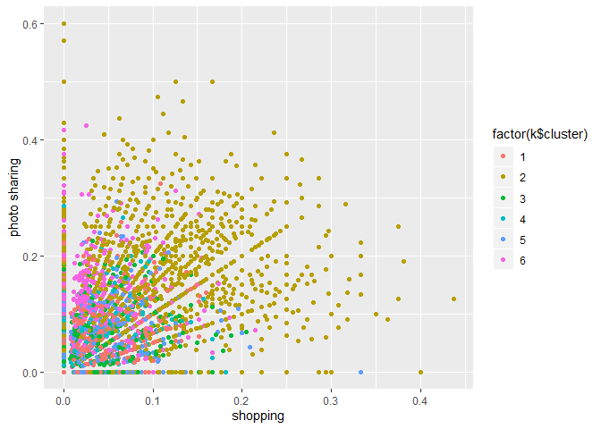

``` r
#cluster2
qplot(fashion, beauty, data=S, col=factor(k$cluster), xlab='fashion', 
      ylab='beauty')
```

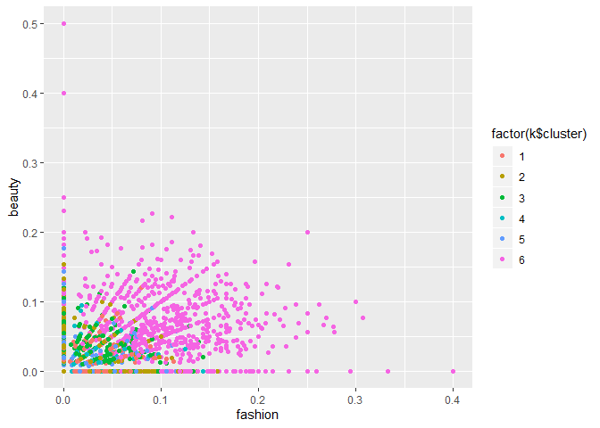

``` r
#cluster3
qplot(college_uni, online_gaming, data=S, col=factor(k$cluster), xlab='College_uni', 
      ylab='Online Gaming')
```

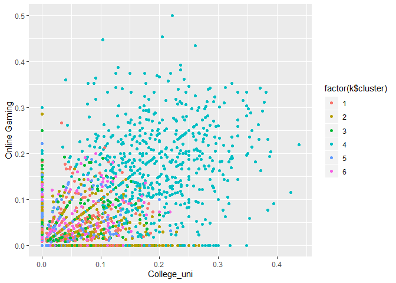

``` r
#cluster4
qplot(religion, family, data=S, col=factor(k$cluster), xlab='religion', 
      ylab='family')
```

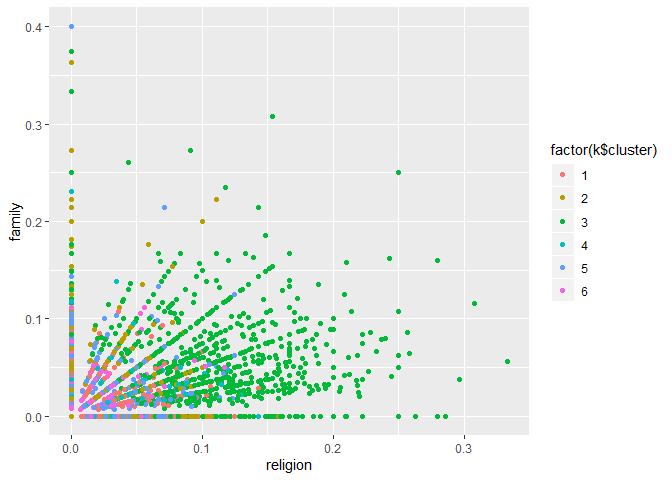

``` r
qplot(sports_fandom, parenting, data=S, col=factor(k$cluster), xlab='sports fandom', 
      ylab='parenting')
```

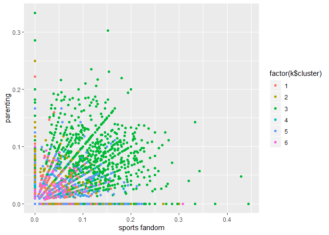

``` r
#cluster5
qplot(politics, automotive, data=S, col=factor(k$cluster), xlab='politics', 
      ylab='automotive')
```

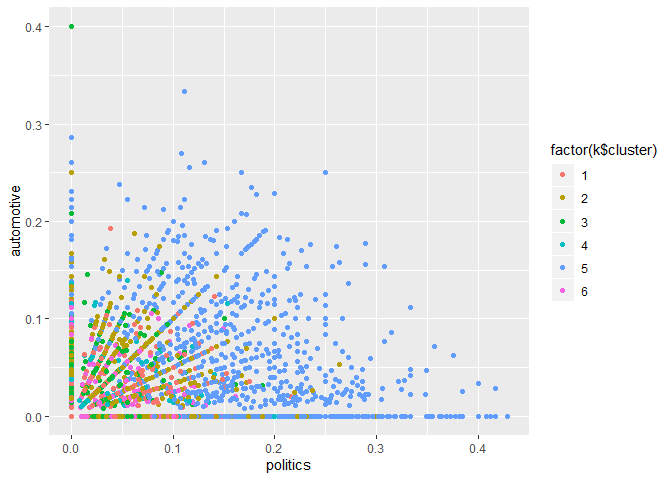

``` r
#cluster6
qplot(health_nutrition, personal_fitness, data=S, col=factor(k$cluster), xlab='health & nutrition', 
      ylab='personal fitness')
```


Question 5 - Author Attribution
===============================

Loading necessary libraries
---------------------------

``` r
library(tm) 
```

    ## Loading required package: NLP

    ## 
    ## Attaching package: 'NLP'

    ## The following object is masked from 'package:ggplot2':
    ## 
    ##     annotate

    ## 
    ## Attaching package: 'tm'

    ## The following object is masked from 'package:mosaic':
    ## 
    ##     inspect

``` r
library(magrittr)
```

    ## 
    ## Attaching package: 'magrittr'

    ## The following object is masked from 'package:purrr':
    ## 
    ##     set_names

    ## The following object is masked from 'package:tidyr':
    ## 
    ##     extract

``` r
library(slam)
library(proxy)
```

    ## 
    ## Attaching package: 'proxy'

    ## The following object is masked from 'package:Matrix':
    ## 
    ##     as.matrix

    ## The following objects are masked from 'package:stats':
    ## 
    ##     as.dist, dist

    ## The following object is masked from 'package:base':
    ## 
    ##     as.matrix

``` r
library('e1071')  # for naive bayes model
library(caret)
```

    ## 
    ## Attaching package: 'caret'

    ## The following object is masked from 'package:mosaic':
    ## 
    ##     dotPlot

    ## The following object is masked from 'package:purrr':
    ## 
    ##     lift

Reading Train and Test data from the files
------------------------------------------

``` r
readerPlain = function(fname){
  readPlain(elem=list(content=readLines(fname)), 
            id=fname, language='en') 
}
train_list = Sys.glob('C:/Users/Pranay/OneDrive/Documents/STA 380/STA380/data/ReutersC50/C50train/*/*.txt')
train_data = lapply(train_list, readerPlain) 
test_list = Sys.glob('C:/Users/Pranay/OneDrive/Documents/STA 380/STA380/data/ReutersC50/C50test/*/*.txt')
test_data = lapply(test_list, readerPlain) 

#Function to clean the names :

clean_list = function(list1) 
{
   clean_lst<- list1 %>%
    { strsplit(., '/', fixed=TRUE) } %>%
    { lapply(., tail, n=2) } %>%
    { lapply(., paste0, collapse = '') } %>%
    unlist
   
   return(clean_lst)
}

train_names=clean_list(train_list)
names(train_data) = train_names

test_names=clean_list(test_list)
names(test_data) = test_names

# Clean Author name list :

author_train= clean_list(train_list)
author_train= gsub('[0-9]+', '', author_train)
author_train= gsub('newsML.txt', '', author_train)

author_test= clean_list(test_list) 
author_test= gsub('[0-9]+', '', author_test)
author_test= gsub('newsML.txt', '', author_test)
```

Generating the Corpus for train and test data
---------------------------------------------

``` r
documents_raw_train = Corpus(VectorSource(train_data))
documents_raw_test = Corpus(VectorSource(test_data))
```

Tokenization
------------

``` r
#Function for text pre-processing 

text_pre_proc= function(dat1) 
{
  my_documents = dat1
  my_documents = tm_map(my_documents, content_transformer(tolower)) # make everything lowercase 
  my_documents = tm_map(my_documents, content_transformer(removeNumbers)) # remove numbers
  my_documents = tm_map(my_documents, content_transformer(removePunctuation)) # remove punctuation
  my_documents = tm_map(my_documents, content_transformer(stripWhitespace)) ## remove excess white-space
  my_documents = tm_map(my_documents, content_transformer(removeWords), stopwords("en"))  # remove stop words
  return(my_documents)
}

# Pre-processing for train data :

train_doc=text_pre_proc(documents_raw_train)
test_doc=text_pre_proc(documents_raw_test)
```

Creating Doc-term-matrix and calculating TF-IDF weights
-------------------------------------------------------

``` r
## Function to create doc matrix and fund TF-IDF weights 

DTM_mat = DocumentTermMatrix(train_doc)  # Convert to matrix
DTM_mat = removeSparseTerms(DTM_mat, 0.95) # Removing the longtail terms (5%)


tf_idf_train = weightTfIdf(DTM_mat)

# A suboptimal but practical solution: ignore words you haven't seen before
# can do this by pre-specifying a dictionary in the construction of a DTM
DTM_test = DocumentTermMatrix(test_doc, control=list(dictionary=Terms(DTM_mat)))

tf_idf_test=weightTfIdf(DTM_test)
```

Dimensionlity Reduction: Principal Component Analysis
-----------------------------------------------------

``` r
# Data Pre-Processing for PCA : 
#1. create a matrix 
#2. Remove the columns with 0 values

X_train = as.matrix(tf_idf_train)
X_test = as.matrix(tf_idf_test)

#Removing columns with entries with 0 values
scrub_cols = which(colSums(X_train) == 0)
scrub_cols_test = which(colSums(X_test) == 0)
X_train = X_train[,-scrub_cols]
X_test = X_test[,-scrub_cols_test]

# drop uncommon words
X_test = X_test[,intersect(colnames(X_test),colnames(X_train))]
X_train = X_train[,intersect(colnames(X_test),colnames(X_train))]
```

Train PCA on training dataset and predict for test dataset
----------------------------------------------------------

``` r
pca_train = prcomp(X_train, scale=TRUE)
pca_test=predict(pca_train,newdata = X_test )
```

Choosing number of PCs to be selected
-------------------------------------

``` r
plot(pca_train,type='line')
```

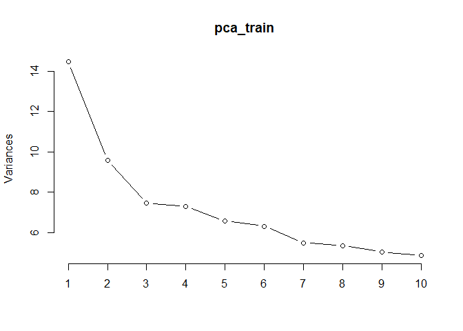

``` r
#summary(pca_train)
vars <- apply(pca_train$x, 2, var)  
props <- vars / sum(vars)
cumsum(props)
```

Choosing 75% varability hence taking 338 PCs (As both train and train1 )

Create the final dataset with reduced dimensions and with authornames
---------------------------------------------------------------------

``` r
final_train = data.frame(pca_train$x[,1:338])
final_train['author']=author_train
# Form PCs similar to training dataset
loading_train <- pca_train$rotation[,1:338]

# multiply to get a test matrix with the principal component values
X_test_pc <- scale(X_test) %*% loading_train
final_test = data.frame(pca_test[,1:338])
final_test['author']=author_test
```

LDA
---

``` r
library(MASS)
```

    ## 
    ## Attaching package: 'MASS'

    ## The following object is masked from 'package:dplyr':
    ## 
    ##     select

``` r
lda_model <- lda(as.factor(author)~., data=final_train)

lda_pred <- predict(lda_model, newdata = final_test)

#Calculate the accuracy:

answer_lda <- as.data.frame(cbind(lda_pred, final_test$author))
answer_lda$correct <- ifelse(lda_pred$class==final_test$author, 1, 0)
sum(answer_lda$correct )*100/nrow(answer_lda)
```

Naive Bayes model
-----------------

``` r
naive_model =naiveBayes(as.factor(author) ~., data=final_train)
naive_pred = predict(naive_model,final_test)
# Calculating the accuracy
answer_naive <- as.data.frame(cbind(naive_pred, final_test$author))
answer_naive$correct <- ifelse(naive_pred==final_test$author, 1, 0)
sum(answer_naive$correct)*100/nrow(answer_naive)
```

    ## [1] 46.64

Random Forest
-------------

``` r
library('randomForest')
```

    ## randomForest 4.6-14

    ## Type rfNews() to see new features/changes/bug fixes.

    ## 
    ## Attaching package: 'randomForest'

    ## The following object is masked from 'package:dplyr':
    ## 
    ##     combine

    ## The following object is masked from 'package:ggplot2':
    ## 
    ##     margin

``` r
rf_model = randomForest(as.factor(author) ~ ., data=final_train, ntree=1000, importance=TRUE)
rf_pred_test = predict(rf_model,final_test, type='response')
# Calculating the accuracy
answer <- as.data.frame(cbind(rf_pred_test, final_test$author))
answer$correct <- ifelse(rf_pred_test==final_test$author, 1, 0)
sum(answer$correct )*100/nrow(answer)
```

KNN
---

``` r
library(kknn)
```

    ## 
    ## Attaching package: 'kknn'

    ## The following object is masked from 'package:caret':
    ## 
    ##     contr.dummy

``` r
accuracies = list()
for (i in c(7,9,11,13,15,17))
{
  knn_model = kknn(as.factor(author) ~ ., final_train, final_test,
                    distance = 1,
                    k= i,
                    kernel = 'rectangular')
  
  accuracies <- c(accuracies,sum(knn_model$fitted.values == final_test$author)/nrow(final_test))
}
plot(c(7,9,11,13,15,17), accuracies, main = "KNN accuracy vs K", xlab = "K-Values", ylab = "Accuracy Score", lty = 1)
```

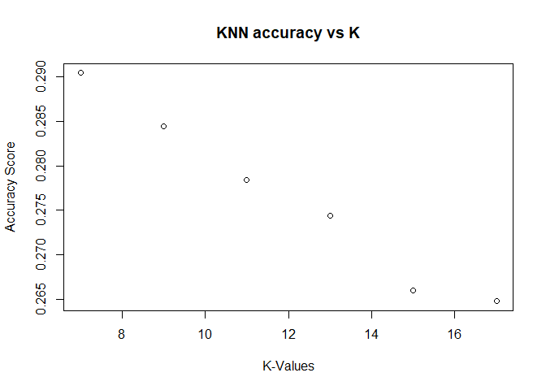

Considering 10 nearest neighbours

    ## [1] 26.48

Findings:
---------

-   LDA gave us the best accuracy (58.92%) among all the models we tried
    out (Naive Bayes, Random forest and KNN)

Methodology:
------------

-   We removed terms which don’t appear in 95% of the documents
-   We used Principle component analysis (PCA) to reduce the dimensions
    as including all the dimensions becomes computationally heavy
    However, accuracy is compromised due to reducing the number of
    dimensions

Quesion 6 - Association Rules
=============================

``` r
# Association rule mining
rm(list=ls())

library(tidyverse)
library(arules)  
```

    ## 
    ## Attaching package: 'arules'

    ## The following object is masked from 'package:tm':
    ## 
    ##     inspect

    ## The following objects are masked from 'package:mosaic':
    ## 
    ##     inspect, lhs, rhs

    ## The following object is masked from 'package:dplyr':
    ## 
    ##     recode

    ## The following objects are masked from 'package:base':
    ## 
    ##     abbreviate, write

``` r
library(arulesViz)
```

    ## Loading required package: grid

    ## Registered S3 methods overwritten by 'registry':
    ##   method               from 
    ##   print.registry_field proxy
    ##   print.registry_entry proxy

    ## Registered S3 method overwritten by 'seriation':
    ##   method         from 
    ##   reorder.hclust gclus

``` r
groceries = read.csv('C:/Users/Pranay/OneDrive/Documents/STA 380/STA380/data/groceries.txt', header=F, stringsAsFactors = F)
```

EDA
---

``` r
str(groceries)
```

    ## 'data.frame':    15296 obs. of  4 variables:
    ##  $ V1: chr  "citrus fruit" "tropical fruit" "whole milk" "pip fruit" ...
    ##  $ V2: chr  "semi-finished bread" "yogurt" "" "yogurt" ...
    ##  $ V3: chr  "margarine" "coffee" "" "cream cheese " ...
    ##  $ V4: chr  "ready soups" "" "" "meat spreads" ...

``` r
# number of baskets
dim(groceries)[1]
```

    ## [1] 15296

``` r
# distribution of items sold
product_list = c(as.list(groceries['V1']), as.list(groceries['V2']),as.list(groceries['V3']), as.list(groceries['V4']))

product_list = unlist(product_list)
freq_of_products = as.data.frame(table(product_list))[-1,]
# total number of products sold
sum(freq_of_products['Freq'])
```

    ## [1] 43367

``` r
# number of unique products sold
dim(freq_of_products)[1]
```

    ## [1] 169

``` r
# most popular products
data_plot = freq_of_products %>% arrange(-Freq) %>% head(20)

ggplot(data=data_plot,aes(x=reorder(product_list,Freq), y=Freq)) + 
  geom_bar(stat='identity') + 
    labs(title="Most popular products", 
       y="Frequency",
       x = "Products") +
  coord_flip() 
```

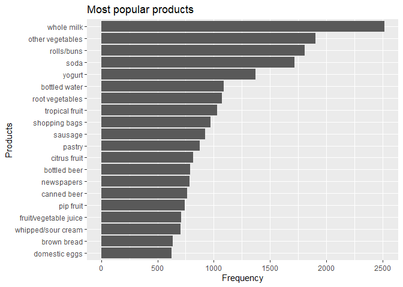

``` r
# least popular products
data_plot = freq_of_products %>% arrange(Freq) %>% head(20)

ggplot(data=data_plot,aes(x=reorder(product_list,-Freq), y=Freq)) + 
  geom_bar(stat='identity') + 
    labs(title="Least popular products", 
       y="Frequency",
       x = "Products") +
  coord_flip() 
```

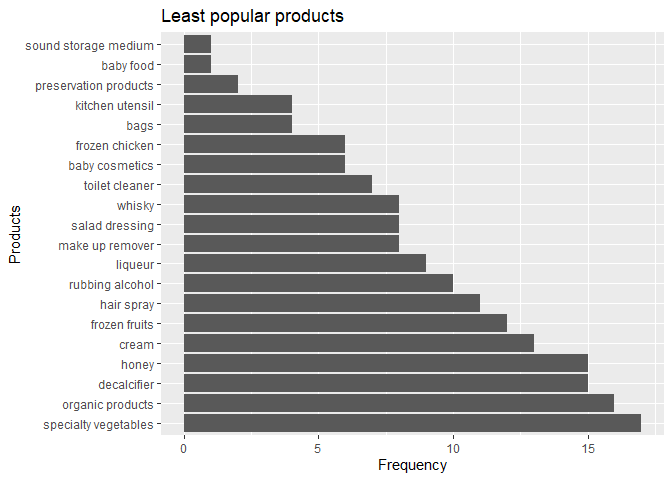

Findings:
---------

-   Most frequently bought item is whole milk
-   Number of unique items bought is 169
-   Total number of products sold is 43367

Association rules
-----------------

``` r
grocery_baskets = read.transactions(file="C:/Users/Pranay/OneDrive/Documents/STA 380/STA380/data/groceries.txt", rm.duplicates=F, format="basket",sep=",",cols=1,header=F)

grocery_trans = as(grocery_baskets, "transactions")
summary(grocery_trans)
```

    ## transactions as itemMatrix in sparse format with
    ##  9835 rows (elements/itemsets/transactions) and
    ##  168 columns (items) and a density of 0.02029438 
    ## 
    ## most frequent items:
    ##       whole milk       rolls/buns other vegetables             soda 
    ##             1796             1473             1443             1421 
    ##           yogurt          (Other) 
    ##             1147            26252 
    ## 
    ## element (itemset/transaction) length distribution:
    ## sizes
    ##    0    1    2    3    4    5    6    7    8    9   10   11   12   13   14 
    ## 2159 1643 1299 1005  855  645  545  438  350  246  182  117   78   77   55 
    ##   15   16   17   18   19   20   21   22   23   25   26   27   28   31 
    ##   46   29   14   14    9   11    4    6    1    1    1    1    3    1 
    ## 
    ##    Min. 1st Qu.  Median    Mean 3rd Qu.    Max. 
    ##   0.000   1.000   2.000   3.409   5.000  31.000 
    ## 
    ## includes extended item information - examples:
    ##             labels
    ## 1 abrasive cleaner
    ## 2 artif. sweetener
    ## 3   baby cosmetics
    ## 
    ## includes extended transaction information - examples:
    ##    transactionID
    ## 1   citrus fruit
    ## 2 tropical fruit
    ## 3     whole milk

``` r
# Whole milk is the most popular product as confirmed in our EDA
groceryrules = apriori(grocery_trans, 
    parameter=list(support=.05, confidence=.1, maxlen=1))
```

    ## Apriori
    ## 
    ## Parameter specification:
    ##  confidence minval smax arem  aval originalSupport maxtime support minlen
    ##         0.1    0.1    1 none FALSE            TRUE       5    0.05      1
    ##  maxlen target   ext
    ##       1  rules FALSE
    ## 
    ## Algorithmic control:
    ##  filter tree heap memopt load sort verbose
    ##     0.1 TRUE TRUE  FALSE TRUE    2    TRUE
    ## 
    ## Absolute minimum support count: 491 
    ## 
    ## set item appearances ...[0 item(s)] done [0.00s].
    ## set transactions ...[168 item(s), 9835 transaction(s)] done [0.00s].
    ## sorting and recoding items ... [18 item(s)] done [0.00s].
    ## creating transaction tree ... done [0.00s].
    ## checking subsets of size 1

    ## Warning in apriori(grocery_trans, parameter = list(support = 0.05,
    ## confidence = 0.1, : Mining stopped (maxlen reached). Only patterns up to a
    ## length of 1 returned!

    ##  done [0.00s].
    ## writing ... [5 rule(s)] done [0.00s].
    ## creating S4 object  ... done [0.00s].

``` r
# Look at the output rules
arules::inspect(groceryrules)
```

    ##     lhs    rhs                support   confidence lift count
    ## [1] {}  => {soda}             0.1444840 0.1444840  1    1421 
    ## [2] {}  => {yogurt}           0.1166243 0.1166243  1    1147 
    ## [3] {}  => {rolls/buns}       0.1497712 0.1497712  1    1473 
    ## [4] {}  => {other vegetables} 0.1467209 0.1467209  1    1443 
    ## [5] {}  => {whole milk}       0.1826131 0.1826131  1    1796

``` r
groceryrules = apriori(grocery_trans, 
    parameter=list(support=.001, confidence=.50, maxlen=4))
```

    ## Apriori
    ## 
    ## Parameter specification:
    ##  confidence minval smax arem  aval originalSupport maxtime support minlen
    ##         0.5    0.1    1 none FALSE            TRUE       5   0.001      1
    ##  maxlen target   ext
    ##       4  rules FALSE
    ## 
    ## Algorithmic control:
    ##  filter tree heap memopt load sort verbose
    ##     0.1 TRUE TRUE  FALSE TRUE    2    TRUE
    ## 
    ## Absolute minimum support count: 9 
    ## 
    ## set item appearances ...[0 item(s)] done [0.00s].
    ## set transactions ...[168 item(s), 9835 transaction(s)] done [0.00s].
    ## sorting and recoding items ... [154 item(s)] done [0.00s].
    ## creating transaction tree ... done [0.00s].
    ## checking subsets of size 1 2 3 4

    ## Warning in apriori(grocery_trans, parameter = list(support = 0.001,
    ## confidence = 0.5, : Mining stopped (maxlen reached). Only patterns up to a
    ## length of 4 returned!

    ##  done [0.02s].
    ## writing ... [3231 rule(s)] done [0.00s].
    ## creating S4 object  ... done [0.00s].

``` r
# Look at the output rules
arules::inspect(groceryrules)
```

    ##        lhs                            rhs                         support confidence      lift count
    ## [1]    {honey}                     => {whole milk}            0.001016777  0.7142857  3.911470    10
    ## [2]    {tidbits}                   => {rolls/buns}            0.001016777  0.5000000  3.338425    10
    ## [3]    {potato products}           => {whole milk}            0.001220132  0.5000000  2.738029    12
    ## [4]    {curd cheese}               => {whole milk}            0.002236909  0.5365854  2.938373    22
    ## [5]    {turkey}                    => {whole milk}            0.001830198  0.5806452  3.179647    18
    ## [6]    {cereals}                   => {whole milk}            0.002948653  0.5686275  3.113837    29
    ## [7]    {jam}                       => {whole milk}            0.002745297  0.5294118  2.899089    27
    ## [8]    {rice}                      => {whole milk}            0.004473818  0.5866667  3.212621    44
    ## [9]    {herbs}                     => {other vegetables}      0.007117438  0.5343511  3.641957    70
    ## [10]   {herbs}                     => {whole milk}            0.006914082  0.5190840  2.842534    68
    ## [11]   {chicken}                   => {other vegetables}      0.006202339  0.5495495  3.745544    61
    ## [12]   {chicken}                   => {whole milk}            0.006100661  0.5405405  2.960031    60
    ## [13]   {hamburger meat}            => {other vegetables}      0.008134215  0.5000000  3.407831    80
    ## [14]   {hamburger meat}            => {whole milk}            0.008439248  0.5187500  2.840705    83
    ## [15]   {beef}                      => {whole milk}            0.010879512  0.5047170  2.763859   107
    ## [16]   {onions}                    => {other vegetables}      0.012201322  0.5106383  3.480338   120
    ## [17]   {curd cheese,                                                                                
    ##         rolls/buns}                => {whole milk}            0.001016777  0.7692308  4.212352    10
    ## [18]   {curd cheese,                                                                                
    ##         other vegetables}          => {whole milk}            0.001118454  0.6111111  3.346480    11
    ## [19]   {curd cheese,                                                                                
    ##         whole milk}                => {other vegetables}      0.001118454  0.5000000  3.407831    11
    ## [20]   {pastry,                                                                                     
    ##         turkey}                    => {whole milk}            0.001016777  0.8333333  4.563382    10
    ## [21]   {turkey,                                                                                     
    ##         whole milk}                => {pastry}                0.001016777  0.5555556  7.353821    10
    ## [22]   {turkey,                                                                                     
    ##         yogurt}                    => {whole milk}            0.001016777  0.7692308  4.212352    10
    ## [23]   {turkey,                                                                                     
    ##         whole milk}                => {yogurt}                0.001016777  0.5555556  4.763635    10
    ## [24]   {other vegetables,                                                                           
    ##         turkey}                    => {whole milk}            0.001016777  0.6666667  3.650705    10
    ## [25]   {turkey,                                                                                     
    ##         whole milk}                => {other vegetables}      0.001016777  0.5555556  3.786479    10
    ## [26]   {cleaner,                                                                                    
    ##         other vegetables}          => {whole milk}            0.001016777  0.6666667  3.650705    10
    ## [27]   {cleaner,                                                                                    
    ##         whole milk}                => {other vegetables}      0.001016777  0.5263158  3.587190    10
    ## [28]   {liquor,                                                                                     
    ##         red/blush wine}            => {bottled beer}          0.001220132  0.5714286  9.153094    12
    ## [29]   {bottled beer,                                                                               
    ##         liquor}                    => {red/blush wine}        0.001220132  0.5000000 27.940341    12
    ## [30]   {cereals,                                                                                    
    ##         yogurt}                    => {whole milk}            0.001626843  0.8000000  4.380846    16
    ## [31]   {cereals,                                                                                    
    ##         whole milk}                => {yogurt}                0.001626843  0.5517241  4.730782    16
    ## [32]   {cereals,                                                                                    
    ##         other vegetables}          => {whole milk}            0.001016777  0.7142857  3.911470    10
    ## [33]   {butter,                                                                                     
    ##         jam}                       => {whole milk}            0.001016777  0.9090909  4.978234    10
    ## [34]   {jam,                                                                                        
    ##         root vegetables}           => {whole milk}            0.001016777  0.6666667  3.650705    10
    ## [35]   {jam,                                                                                        
    ##         other vegetables}          => {whole milk}            0.001118454  0.7857143  4.302617    11
    ## [36]   {kitchen towels,                                                                             
    ##         other vegetables}          => {whole milk}            0.001016777  0.5000000  2.738029    10
    ## [37]   {popcorn,                                                                                    
    ##         salty snack}               => {soda}                  0.001220132  0.5454545  3.775190    12
    ## [38]   {popcorn,                                                                                    
    ##         soda}                      => {salty snack}           0.001220132  0.6315789 18.653390    12
    ## [39]   {other vegetables,                                                                           
    ##         vinegar}                   => {whole milk}            0.001016777  0.5263158  2.882136    10
    ## [40]   {dog food,                                                                                   
    ##         tropical fruit}            => {yogurt}                0.001016777  0.7692308  6.595802    10
    ## [41]   {dog food,                                                                                   
    ##         yogurt}                    => {tropical fruit}        0.001016777  0.5882353 10.518717    10
    ## [42]   {dog food,                                                                                   
    ##         yogurt}                    => {whole milk}            0.001220132  0.7058824  3.865453    12
    ## [43]   {dog food,                                                                                   
    ##         whole milk}                => {yogurt}                0.001220132  0.5000000  4.287271    12
    ## [44]   {dog food,                                                                                   
    ##         other vegetables}          => {whole milk}            0.001016777  0.5882353  3.221211    10
    ## [45]   {bottled beer,                                                                               
    ##         soups}                     => {whole milk}            0.001118454  0.9166667  5.019720    11
    ## [46]   {soups,                                                                                      
    ##         whipped/sour cream}        => {other vegetables}      0.001016777  0.6666667  4.543775    10
    ## [47]   {root vegetables,                                                                            
    ##         soups}                     => {other vegetables}      0.001016777  0.7692308  5.242817    10
    ## [48]   {other vegetables,                                                                           
    ##         soups}                     => {whole milk}            0.001626843  0.5925926  3.245071    16
    ## [49]   {soups,                                                                                      
    ##         whole milk}                => {other vegetables}      0.001626843  0.5925926  4.038911    16
    ## [50]   {Instant food products,                                                                      
    ##         yogurt}                    => {whole milk}            0.001118454  0.7857143  4.302617    11
    ## [51]   {Instant food products,                                                                      
    ##         rolls/buns}                => {whole milk}            0.001118454  0.5500000  3.011832    11
    ## [52]   {Instant food products,                                                                      
    ##         other vegetables}          => {whole milk}            0.001321810  0.5416667  2.966198    13
    ## [53]   {root vegetables,                                                                            
    ##         specialty cheese}          => {yogurt}                0.001118454  0.6111111  5.239998    11
    ## [54]   {root vegetables,                                                                            
    ##         specialty cheese}          => {other vegetables}      0.001321810  0.7222222  4.922422    13
    ## [55]   {root vegetables,                                                                            
    ##         specialty cheese}          => {whole milk}            0.001118454  0.6111111  3.346480    11
    ## [56]   {specialty cheese,                                                                           
    ##         yogurt}                    => {whole milk}            0.001931876  0.6785714  3.715896    19
    ## [57]   {specialty cheese,                                                                           
    ##         whole milk}                => {yogurt}                0.001931876  0.5588235  4.791656    19
    ## [58]   {other vegetables,                                                                           
    ##         specialty cheese}          => {whole milk}            0.001626843  0.5333333  2.920564    16
    ## [59]   {chocolate marshmallow,                                                                      
    ##         rolls/buns}                => {soda}                  0.001016777  0.5000000  3.460591    10
    ## [60]   {frozen potato products,                                                                     
    ##         fruit/vegetable juice}     => {whole milk}            0.001016777  0.6250000  3.422536    10
    ## [61]   {frozen potato products,                                                                     
    ##         yogurt}                    => {whole milk}            0.001321810  0.5909091  3.235852    13
    ## [62]   {frozen potato products,                                                                     
    ##         rolls/buns}                => {whole milk}            0.001118454  0.6111111  3.346480    11
    ## [63]   {frozen potato products,                                                                     
    ##         other vegetables}          => {whole milk}            0.001321810  0.7222222  3.954931    13
    ## [64]   {sweet spreads,                                                                              
    ##         yogurt}                    => {soda}                  0.001118454  0.5789474  4.007000    11
    ## [65]   {ham,                                                                                        
    ##         pip fruit}                 => {other vegetables}      0.001016777  0.6250000  4.259789    10
    ## [66]   {ham,                                                                                        
    ##         tropical fruit}            => {other vegetables}      0.001016777  0.6666667  4.543775    10
    ## [67]   {ham,                                                                                        
    ##         tropical fruit}            => {whole milk}            0.001118454  0.7333333  4.015776    11
    ## [68]   {fruit/vegetable juice,                                                                      
    ##         ham}                       => {whole milk}            0.001016777  0.7142857  3.911470    10
    ## [69]   {ham,                                                                                        
    ##         yogurt}                    => {whole milk}            0.001525165  0.7142857  3.911470    15
    ## [70]   {ham,                                                                                        
    ##         other vegetables}          => {whole milk}            0.001626843  0.5000000  2.738029    16
    ## [71]   {ham,                                                                                        
    ##         whole milk}                => {other vegetables}      0.001626843  0.5161290  3.517761    16
    ## [72]   {house keeping products,                                                                     
    ##         napkins}                   => {whole milk}            0.001220132  0.7500000  4.107043    12
    ## [73]   {house keeping products,                                                                     
    ##         whipped/sour cream}        => {whole milk}            0.001220132  0.9230769  5.054823    12
    ## [74]   {house keeping products,                                                                     
    ##         root vegetables}           => {whole milk}            0.001220132  0.7500000  4.107043    12
    ## [75]   {house keeping products,                                                                     
    ##         yogurt}                    => {other vegetables}      0.001016777  0.5882353  4.009213    10
    ## [76]   {house keeping products,                                                                     
    ##         yogurt}                    => {whole milk}            0.001016777  0.5882353  3.221211    10
    ## [77]   {house keeping products,                                                                     
    ##         rolls/buns}                => {whole milk}            0.001016777  0.6250000  3.422536    10
    ## [78]   {house keeping products,                                                                     
    ##         other vegetables}          => {whole milk}            0.001728521  0.7083333  3.878874    17
    ## [79]   {house keeping products,                                                                     
    ##         whole milk}                => {other vegetables}      0.001728521  0.5000000  3.407831    17
    ## [80]   {newspapers,                                                                                 
    ##         spread cheese}             => {rolls/buns}            0.001016777  0.7692308  5.136038    10
    ## [81]   {other vegetables,                                                                           
    ##         spread cheese}             => {yogurt}                0.001423488  0.5185185  4.446059    14
    ## [82]   {packaged fruit/vegetables,                                                                  
    ##         soda}                      => {whole milk}            0.001016777  0.5882353  3.221211    10
    ## [83]   {rolls/buns,                                                                                 
    ##         white wine}                => {soda}                  0.001220132  0.5000000  3.460591    12
    ## [84]   {meat,                                                                                       
    ##         yogurt}                    => {rolls/buns}            0.001016777  0.5000000  3.338425    10
    ## [85]   {meat,                                                                                       
    ##         yogurt}                    => {other vegetables}      0.001321810  0.6500000  4.430180    13
    ## [86]   {meat,                                                                                       
    ##         yogurt}                    => {whole milk}            0.001118454  0.5500000  3.011832    11
    ## [87]   {rice,                                                                                       
    ##         sugar}                     => {whole milk}            0.001220132  1.0000000  5.476058    12
    ## [88]   {frozen vegetables,                                                                          
    ##         rice}                      => {other vegetables}      0.001016777  0.7142857  4.868330    10
    ## [89]   {frozen vegetables,                                                                          
    ##         rice}                      => {whole milk}            0.001016777  0.7142857  3.911470    10
    ## [90]   {butter,                                                                                     
    ##         rice}                      => {yogurt}                0.001016777  0.5555556  4.763635    10
    ## [91]   {butter,                                                                                     
    ##         rice}                      => {other vegetables}      0.001220132  0.6666667  4.543775    12
    ## [92]   {butter,                                                                                     
    ##         rice}                      => {whole milk}            0.001423488  0.7777778  4.259156    14
    ## [93]   {domestic eggs,                                                                              
    ##         rice}                      => {whole milk}            0.001118454  0.8461538  4.633587    11
    ## [94]   {rice,                                                                                       
    ##         tropical fruit}            => {whole milk}            0.001220132  0.8000000  4.380846    12
    ## [95]   {fruit/vegetable juice,                                                                      
    ##         rice}                      => {other vegetables}      0.001220132  0.6315789  4.304629    12
    ## [96]   {fruit/vegetable juice,                                                                      
    ##         rice}                      => {whole milk}            0.001321810  0.6842105  3.746776    13
    ## [97]   {bottled water,                                                                              
    ##         rice}                      => {whole milk}            0.001220132  0.9230769  5.054823    12
    ## [98]   {rice,                                                                                       
    ##         root vegetables}           => {yogurt}                0.001423488  0.5384615  4.617061    14
    ## [99]   {rice,                                                                                       
    ##         yogurt}                    => {root vegetables}       0.001423488  0.6086957  7.635870    14
    ## [100]  {rice,                                                                                       
    ##         root vegetables}           => {other vegetables}      0.002033554  0.7692308  5.242817    20
    ## [101]  {other vegetables,                                                                           
    ##         rice}                      => {root vegetables}       0.002033554  0.5555556  6.969246    20
    ## [102]  {rice,                                                                                       
    ##         root vegetables}           => {whole milk}            0.002033554  0.7692308  4.212352    20
    ## [103]  {rice,                                                                                       
    ##         yogurt}                    => {other vegetables}      0.001830198  0.7826087  5.333996    18
    ## [104]  {other vegetables,                                                                           
    ##         rice}                      => {yogurt}                0.001830198  0.5000000  4.287271    18
    ## [105]  {rice,                                                                                       
    ##         yogurt}                    => {whole milk}            0.001728521  0.7391304  4.047521    17
    ## [106]  {other vegetables,                                                                           
    ##         rice}                      => {whole milk}            0.002541942  0.6944444  3.802818    25
    ## [107]  {rice,                                                                                       
    ##         whole milk}                => {other vegetables}      0.002541942  0.5681818  3.872535    25
    ## [108]  {domestic eggs,                                                                              
    ##         salt}                      => {whole milk}            0.001220132  0.6315789  3.458563    12
    ## [109]  {root vegetables,                                                                            
    ##         salt}                      => {other vegetables}      0.001220132  0.5454545  3.717634    12
    ## [110]  {root vegetables,                                                                            
    ##         salt}                      => {whole milk}            0.001321810  0.5909091  3.235852    13
    ## [111]  {salt,                                                                                       
    ##         yogurt}                    => {whole milk}            0.001118454  0.5789474  3.170349    11
    ## [112]  {frozen dessert,                                                                             
    ##         root vegetables}           => {other vegetables}      0.001423488  0.7368421  5.022067    14
    ## [113]  {frozen dessert,                                                                             
    ##         root vegetables}           => {whole milk}            0.001016777  0.5263158  2.882136    10
    ## [114]  {frozen dessert,                                                                             
    ##         yogurt}                    => {whole milk}            0.001118454  0.6875000  3.764790    11
    ## [115]  {frozen dessert,                                                                             
    ##         other vegetables}          => {whole milk}            0.001830198  0.5625000  3.080283    18
    ## [116]  {frozen dessert,                                                                             
    ##         whole milk}                => {other vegetables}      0.001830198  0.5142857  3.505198    18
    ## [117]  {chocolate,                                                                                  
    ##         mayonnaise}                => {other vegetables}      0.001118454  0.6875000  4.685767    11
    ## [118]  {mayonnaise,                                                                                 
    ##         whipped/sour cream}        => {whole milk}            0.001016777  0.6666667  3.650705    10
    ## [119]  {mayonnaise,                                                                                 
    ##         root vegetables}           => {yogurt}                0.001321810  0.6500000  5.573452    13
    ## [120]  {mayonnaise,                                                                                 
    ##         yogurt}                    => {root vegetables}       0.001321810  0.5000000  6.272321    13
    ## [121]  {mayonnaise,                                                                                 
    ##         root vegetables}           => {other vegetables}      0.001423488  0.7000000  4.770963    14
    ## [122]  {mayonnaise,                                                                                 
    ##         yogurt}                    => {other vegetables}      0.001525165  0.5769231  3.932113    15
    ## [123]  {mayonnaise,                                                                                 
    ##         whole milk}                => {other vegetables}      0.001525165  0.5172414  3.525342    15
    ## [124]  {canned vegetables,                                                                          
    ##         pip fruit}                 => {other vegetables}      0.001016777  0.6666667  4.543775    10
    ## [125]  {canned vegetables,                                                                          
    ##         root vegetables}           => {other vegetables}      0.001423488  0.7000000  4.770963    14
    ## [126]  {canned vegetables,                                                                          
    ##         root vegetables}           => {whole milk}            0.001118454  0.5500000  3.011832    11
    ## [127]  {sausage,                                                                                    
    ##         tropical fruit}            => {root vegetables}       0.001016777  0.5000000  6.272321    10
    ## [128]  {sausage,                                                                                    
    ##         tropical fruit}            => {whole milk}            0.001423488  0.7000000  3.833241    14
    ## [129]  {pastry,                                                                                     
    ##         sausage}                   => {whole milk}            0.001016777  0.5000000  2.738029    10
    ## [130]  {root vegetables,                                                                            
    ##         sausage}                   => {yogurt}                0.001321810  0.5200000  4.458762    13
    ## [131]  {sausage,                                                                                    
    ##         yogurt}                    => {root vegetables}       0.001321810  0.5416667  6.795015    13
    ## [132]  {root vegetables,                                                                            
    ##         sausage}                   => {rolls/buns}            0.001423488  0.5600000  3.739036    14
    ## [133]  {root vegetables,                                                                            
    ##         sausage}                   => {whole milk}            0.001423488  0.5600000  3.066592    14
    ## [134]  {sausage,                                                                                    
    ##         yogurt}                    => {whole milk}            0.001525165  0.6250000  3.422536    15
    ## [135]  {butter,                                                                                     
    ##         roll products}             => {whole milk}            0.001118454  0.7857143  4.302617    11
    ## [136]  {margarine,                                                                                  
    ##         roll products}             => {other vegetables}      0.001118454  0.6111111  4.165127    11
    ## [137]  {roll products,                                                                              
    ##         tropical fruit}            => {whole milk}            0.001016777  0.5263158  2.882136    10
    ## [138]  {roll products,                                                                              
    ##         yogurt}                    => {other vegetables}      0.001220132  0.5454545  3.717634    12
    ## [139]  {roll products,                                                                              
    ##         yogurt}                    => {whole milk}            0.001220132  0.5454545  2.986941    12
    ## [140]  {roll products,                                                                              
    ##         rolls/buns}                => {whole milk}            0.001220132  0.6000000  3.285635    12
    ## [141]  {other vegetables,                                                                           
    ##         roll products}             => {whole milk}            0.002033554  0.5000000  2.738029    20
    ## [142]  {roll products,                                                                              
    ##         whole milk}                => {other vegetables}      0.002033554  0.5128205  3.495211    20
    ## [143]  {frozen fish,                                                                                
    ##         frozen vegetables}         => {whole milk}            0.001016777  0.5882353  3.221211    10
    ## [144]  {frozen fish,                                                                                
    ##         pip fruit}                 => {tropical fruit}        0.001220132  0.6666667 11.921212    12
    ## [145]  {frozen fish,                                                                                
    ##         tropical fruit}            => {pip fruit}             0.001220132  0.5217391 10.987804    12
    ## [146]  {frozen fish,                                                                                
    ##         pip fruit}                 => {other vegetables}      0.001423488  0.7777778  5.301070    14
    ## [147]  {frozen fish,                                                                                
    ##         pip fruit}                 => {whole milk}            0.001220132  0.6666667  3.650705    12
    ## [148]  {frozen fish,                                                                                
    ##         tropical fruit}            => {other vegetables}      0.001423488  0.6086957  4.148664    14
    ## [149]  {frozen fish,                                                                                
    ##         tropical fruit}            => {whole milk}            0.001423488  0.6086957  3.333253    14
    ## [150]  {frozen fish,                                                                                
    ##         root vegetables}           => {yogurt}                0.001118454  0.5789474  4.964209    11
    ## [151]  {frozen fish,                                                                                
    ##         root vegetables}           => {whole milk}            0.001220132  0.6315789  3.458563    12
    ## [152]  {frozen fish,                                                                                
    ##         yogurt}                    => {whole milk}            0.002135231  0.7000000  3.833241    21
    ## [153]  {frozen fish,                                                                                
    ##         other vegetables}          => {whole milk}            0.002643620  0.7027027  3.848041    26
    ## [154]  {frozen fish,                                                                                
    ##         whole milk}                => {other vegetables}      0.002643620  0.5652174  3.852331    26
    ## [155]  {cake bar,                                                                                   
    ##         pastry}                    => {soda}                  0.001016777  0.5263158  3.642728    10
    ## [156]  {cake bar,                                                                                   
    ##         pastry}                    => {whole milk}            0.001220132  0.6315789  3.458563    12
    ## [157]  {cake bar,                                                                                   
    ##         rolls/buns}                => {whole milk}            0.001728521  0.5666667  3.103099    17
    ## [158]  {cake bar,                                                                                   
    ##         other vegetables}          => {whole milk}            0.001626843  0.5517241  3.021273    16
    ## [159]  {butter,                                                                                     
    ##         dishes}                    => {whole milk}            0.001016777  0.7142857  3.911470    10
    ## [160]  {bottled water,                                                                              
    ##         dishes}                    => {rolls/buns}            0.001016777  0.5263158  3.514132    10
    ## [161]  {dishes,                                                                                     
    ##         root vegetables}           => {other vegetables}      0.001220132  0.6315789  4.304629    12
    ## [162]  {dishes,                                                                                     
    ##         soda}                      => {other vegetables}      0.001220132  0.5714286  3.894664    12
    ## [163]  {dishes,                                                                                     
    ##         other vegetables}          => {whole milk}            0.002236909  0.5000000  2.738029    22
    ## [164]  {fruit/vegetable juice,                                                                      
    ##         red/blush wine}            => {shopping bags}         0.001016777  0.5555556  5.932561    10
    ## [165]  {red/blush wine,                                                                             
    ##         root vegetables}           => {other vegetables}      0.001220132  0.5714286  3.894664    12
    ## [166]  {red/blush wine,                                                                             
    ##         yogurt}                    => {whole milk}            0.001016777  0.5000000  2.738029    10
    ## [167]  {chewing gum,                                                                                
    ##         tropical fruit}            => {whole milk}            0.001118454  0.7333333  4.015776    11
    ## [168]  {chewing gum,                                                                                
    ##         root vegetables}           => {other vegetables}      0.001016777  0.6666667  4.543775    10
    ## [169]  {chewing gum,                                                                                
    ##         yogurt}                    => {other vegetables}      0.001016777  0.5263158  3.587190    10
    ## [170]  {chewing gum,                                                                                
    ##         yogurt}                    => {whole milk}            0.001118454  0.5789474  3.170349    11
    ## [171]  {mustard,                                                                                    
    ##         oil}                       => {whole milk}            0.001220132  0.8571429  4.693764    12
    ## [172]  {mustard,                                                                                    
    ##         tropical fruit}            => {whole milk}            0.001118454  0.5500000  3.011832    11
    ## [173]  {bottled water,                                                                              
    ##         mustard}                   => {whole milk}            0.001016777  0.5000000  2.738029    10
    ## [174]  {pot plants,                                                                                 
    ##         tropical fruit}            => {other vegetables}      0.001118454  0.6111111  4.165127    11
    ## [175]  {pot plants,                                                                                 
    ##         tropical fruit}            => {whole milk}            0.001321810  0.7222222  3.954931    13
    ## [176]  {pot plants,                                                                                 
    ##         yogurt}                    => {whole milk}            0.002033554  0.6060606  3.318823    20
    ## [177]  {pot plants,                                                                                 
    ##         rolls/buns}                => {whole milk}            0.001423488  0.5185185  2.839437    14
    ## [178]  {other vegetables,                                                                           
    ##         pot plants}                => {whole milk}            0.002135231  0.5384615  2.948647    21
    ## [179]  {citrus fruit,                                                                               
    ##         herbs}                     => {root vegetables}       0.001220132  0.6315789  7.922932    12
    ## [180]  {citrus fruit,                                                                               
    ##         herbs}                     => {other vegetables}      0.001423488  0.7368421  5.022067    14
    ## [181]  {citrus fruit,                                                                               
    ##         herbs}                     => {whole milk}            0.001321810  0.6842105  3.746776    13
    ## [182]  {curd,                                                                                       
    ##         herbs}                     => {root vegetables}       0.001220132  0.5454545  6.842532    12
    ## [183]  {curd,                                                                                       
    ##         herbs}                     => {other vegetables}      0.001321810  0.5909091  4.027437    13
    ## [184]  {curd,                                                                                       
    ##         herbs}                     => {whole milk}            0.001728521  0.7727273  4.231499    17
    ## [185]  {bottled beer,                                                                               
    ##         herbs}                     => {bottled water}         0.001016777  0.6250000  6.703244    10
    ## [186]  {bottled beer,                                                                               
    ##         herbs}                     => {root vegetables}       0.001118454  0.6875000  8.624442    11
    ## [187]  {frozen vegetables,                                                                          
    ##         herbs}                     => {whole milk}            0.001321810  0.5909091  3.235852    13
    ## [188]  {brown bread,                                                                                
    ##         herbs}                     => {other vegetables}      0.001118454  0.7333333  4.998152    11
    ## [189]  {butter,                                                                                     
    ##         herbs}                     => {root vegetables}       0.001220132  0.5000000  6.272321    12
    ## [190]  {butter,                                                                                     
    ##         herbs}                     => {other vegetables}      0.001423488  0.5833333  3.975803    14
    ## [191]  {butter,                                                                                     
    ##         herbs}                     => {whole milk}            0.001423488  0.5833333  3.194367    14
    ## [192]  {herbs,                                                                                      
    ##         pip fruit}                 => {root vegetables}       0.001321810  0.6842105  8.583177    13
    ## [193]  {herbs,                                                                                      
    ##         pip fruit}                 => {other vegetables}      0.001321810  0.6842105  4.663348    13
    ## [194]  {herbs,                                                                                      
    ##         pip fruit}                 => {whole milk}            0.001118454  0.5789474  3.170349    11
    ## [195]  {domestic eggs,                                                                              
    ##         herbs}                     => {root vegetables}       0.001016777  0.5263158  6.602444    10
    ## [196]  {domestic eggs,                                                                              
    ##         herbs}                     => {other vegetables}      0.001118454  0.5789474  3.945909    11
    ## [197]  {domestic eggs,                                                                              
    ##         herbs}                     => {whole milk}            0.001423488  0.7368421  4.034990    14
    ## [198]  {herbs,                                                                                      
    ##         tropical fruit}            => {root vegetables}       0.001525165  0.6250000  7.840402    15
    ## [199]  {herbs,                                                                                      
    ##         tropical fruit}            => {other vegetables}      0.001626843  0.6666667  4.543775    16
    ## [200]  {herbs,                                                                                      
    ##         tropical fruit}            => {whole milk}            0.002135231  0.8750000  4.791551    21
    ## [201]  {fruit/vegetable juice,                                                                      
    ##         herbs}                     => {other vegetables}      0.001118454  0.7857143  5.355163    11
    ## [202]  {fruit/vegetable juice,                                                                      
    ##         herbs}                     => {whole milk}            0.001118454  0.7857143  4.302617    11
    ## [203]  {herbs,                                                                                      
    ##         whipped/sour cream}        => {other vegetables}      0.001830198  0.6428571  4.381497    18
    ## [204]  {herbs,                                                                                      
    ##         whipped/sour cream}        => {whole milk}            0.001931876  0.6785714  3.715896    19
    ## [205]  {herbs,                                                                                      
    ##         shopping bags}             => {other vegetables}      0.001728521  0.8500000  5.793313    17
    ## [206]  {bottled water,                                                                              
    ##         herbs}                     => {root vegetables}       0.001525165  0.6000000  7.526786    15
    ## [207]  {bottled water,                                                                              
    ##         herbs}                     => {other vegetables}      0.001423488  0.5600000  3.816771    14
    ## [208]  {bottled water,                                                                              
    ##         herbs}                     => {whole milk}            0.001525165  0.6000000  3.285635    15
    ## [209]  {herbs,                                                                                      
    ##         rolls/buns}                => {root vegetables}       0.001423488  0.5000000  6.272321    14
    ## [210]  {herbs,                                                                                      
    ##         root vegetables}           => {other vegetables}      0.002745297  0.5625000  3.833810    27
    ## [211]  {herbs,                                                                                      
    ##         root vegetables}           => {whole milk}            0.003253686  0.6666667  3.650705    32
    ## [212]  {herbs,                                                                                      
    ##         yogurt}                    => {other vegetables}      0.002033554  0.6250000  4.259789    20
    ## [213]  {herbs,                                                                                      
    ##         yogurt}                    => {whole milk}            0.001931876  0.5937500  3.251409    19
    ## [214]  {herbs,                                                                                      
    ##         rolls/buns}                => {other vegetables}      0.001830198  0.6428571  4.381497    18
    ## [215]  {herbs,                                                                                      
    ##         rolls/buns}                => {whole milk}            0.002236909  0.7857143  4.302617    22
    ## [216]  {herbs,                                                                                      
    ##         other vegetables}          => {whole milk}            0.003965430  0.5571429  3.050947    39
    ## [217]  {herbs,                                                                                      
    ##         whole milk}                => {other vegetables}      0.003965430  0.5735294  3.908983    39
    ## [218]  {beverages,                                                                                  
    ##         pip fruit}                 => {tropical fruit}        0.001016777  0.5555556  9.934343    10
    ## [219]  {beverages,                                                                                  
    ##         tropical fruit}            => {other vegetables}      0.001626843  0.5925926  4.038911    16
    ## [220]  {beverages,                                                                                  
    ##         fruit/vegetable juice}     => {yogurt}                0.001220132  0.5000000  4.287271    12
    ## [221]  {beverages,                                                                                  
    ##         root vegetables}           => {other vegetables}      0.001423488  0.6086957  4.148664    14
    ## [222]  {canned fish,                                                                                
    ##         hygiene articles}          => {whole milk}            0.001016777  0.9090909  4.978234    10
    ## [223]  {canned fish,                                                                                
    ##         frozen vegetables}         => {other vegetables}      0.001016777  0.6666667  4.543775    10
    ## [224]  {canned fish,                                                                                
    ##         root vegetables}           => {other vegetables}      0.001220132  0.5454545  3.717634    12
    ## [225]  {pasta,                                                                                      
    ##         pip fruit}                 => {whole milk}            0.001016777  0.5882353  3.221211    10
    ## [226]  {domestic eggs,                                                                              
    ##         pasta}                     => {whole milk}            0.001016777  0.6250000  3.422536    10
    ## [227]  {fruit/vegetable juice,                                                                      
    ##         pasta}                     => {whole milk}            0.001016777  0.5263158  2.882136    10
    ## [228]  {pasta,                                                                                      
    ##         root vegetables}           => {whole milk}            0.002135231  0.6176471  3.382271    21
    ## [229]  {pasta,                                                                                      
    ##         yogurt}                    => {whole milk}            0.001626843  0.5333333  2.920564    16
    ## [230]  {pasta,                                                                                      
    ##         rolls/buns}                => {whole milk}            0.001118454  0.5000000  2.738029    11
    ## [231]  {other vegetables,                                                                           
    ##         pasta}                     => {whole milk}            0.002033554  0.5128205  2.808235    20
    ## [232]  {ice cream,                                                                                  
    ##         napkins}                   => {soda}                  0.001016777  0.6666667  4.614122    10
    ## [233]  {butter,                                                                                     
    ##         ice cream}                 => {other vegetables}      0.001016777  0.6250000  4.259789    10
    ## [234]  {butter,                                                                                     
    ##         ice cream}                 => {whole milk}            0.001016777  0.6250000  3.422536    10
    ## [235]  {ice cream,                                                                                  
    ##         newspapers}                => {other vegetables}      0.001626843  0.5925926  4.038911    16
    ## [236]  {fruit/vegetable juice,                                                                      
    ##         ice cream}                 => {other vegetables}      0.001118454  0.5789474  3.945909    11
    ## [237]  {ice cream,                                                                                  
    ##         pastry}                    => {whole milk}            0.001016777  0.5263158  2.882136    10
    ## [238]  {ice cream,                                                                                  
    ##         whipped/sour cream}        => {other vegetables}      0.001626843  0.6666667  4.543775    16
    ## [239]  {bottled water,                                                                              
    ##         ice cream}                 => {whole milk}            0.001118454  0.5500000  3.011832    11
    ## [240]  {ice cream,                                                                                  
    ##         root vegetables}           => {other vegetables}      0.001728521  0.6538462  4.456394    17
    ## [241]  {ice cream,                                                                                  
    ##         other vegetables}          => {whole milk}            0.002135231  0.5000000  2.738029    21
    ## [242]  {chicken,                                                                                    
    ##         pork}                      => {root vegetables}       0.001220132  0.5217391  6.545031    12
    ## [243]  {chicken,                                                                                    
    ##         pork}                      => {other vegetables}      0.001220132  0.5217391  3.555997    12
    ## [244]  {chicken,                                                                                    
    ##         pork}                      => {whole milk}            0.001321810  0.5652174  3.095163    13
    ## [245]  {chicken,                                                                                    
    ##         dessert}                   => {other vegetables}      0.001016777  0.7692308  5.242817    10
    ## [246]  {chicken,                                                                                    
    ##         cream cheese}              => {other vegetables}      0.001016777  0.7142857  4.868330    10
    ## [247]  {chicken,                                                                                    
    ##         citrus fruit}              => {root vegetables}       0.001728521  0.5862069  7.353756    17
    ## [248]  {chicken,                                                                                    
    ##         citrus fruit}              => {other vegetables}      0.001525165  0.5172414  3.525342    15
    ## [249]  {chicken,                                                                                    
    ##         citrus fruit}              => {whole milk}            0.001525165  0.5172414  2.832444    15
    ## [250]  {chicken,                                                                                    
    ##         frozen vegetables}         => {yogurt}                0.001220132  0.5000000  4.287271    12
    ## [251]  {chicken,                                                                                    
    ##         frozen vegetables}         => {other vegetables}      0.001525165  0.6250000  4.259789    15
    ## [252]  {butter,                                                                                     
    ##         chicken}                   => {other vegetables}      0.001321810  0.5652174  3.852331    13
    ## [253]  {butter,                                                                                     
    ##         chicken}                   => {whole milk}            0.001525165  0.6521739  3.571342    15
    ## [254]  {chicken,                                                                                    
    ##         domestic eggs}             => {other vegetables}      0.001423488  0.5000000  3.407831    14
    ## [255]  {chicken,                                                                                    
    ##         domestic eggs}             => {whole milk}            0.001830198  0.6428571  3.520323    18
    ## [256]  {chicken,                                                                                    
    ##         tropical fruit}            => {root vegetables}       0.001016777  0.5000000  6.272321    10
    ## [257]  {chicken,                                                                                    
    ##         tropical fruit}            => {yogurt}                0.001118454  0.5500000  4.715998    11
    ## [258]  {chicken,                                                                                    
    ##         tropical fruit}            => {other vegetables}      0.001118454  0.5500000  3.748614    11
    ## [259]  {chicken,                                                                                    
    ##         tropical fruit}            => {whole milk}            0.001118454  0.5500000  3.011832    11
    ## [260]  {chicken,                                                                                    
    ##         fruit/vegetable juice}     => {whole milk}            0.001016777  0.6250000  3.422536    10
    ## [261]  {chicken,                                                                                    
    ##         whipped/sour cream}        => {other vegetables}      0.002236909  0.6666667  4.543775    22
    ## [262]  {chicken,                                                                                    
    ##         whipped/sour cream}        => {whole milk}            0.002033554  0.6060606  3.318823    20
    ## [263]  {chicken,                                                                                    
    ##         shopping bags}             => {other vegetables}      0.001016777  0.7692308  5.242817    10
    ## [264]  {chicken,                                                                                    
    ##         root vegetables}           => {other vegetables}      0.002440264  0.5454545  3.717634    24
    ## [265]  {chicken,                                                                                    
    ##         root vegetables}           => {whole milk}            0.002745297  0.6136364  3.360308    27
    ## [266]  {chicken,                                                                                    
    ##         soda}                      => {other vegetables}      0.001423488  0.5185185  3.534047    14
    ## [267]  {chicken,                                                                                    
    ##         soda}                      => {whole milk}            0.001423488  0.5185185  2.839437    14
    ## [268]  {chicken,                                                                                    
    ##         yogurt}                    => {other vegetables}      0.002643620  0.6842105  4.663348    26
    ## [269]  {chicken,                                                                                    
    ##         yogurt}                    => {whole milk}            0.001931876  0.5000000  2.738029    19
    ## [270]  {chicken,                                                                                    
    ##         rolls/buns}                => {other vegetables}      0.002135231  0.6176471  4.209673    21
    ## [271]  {chicken,                                                                                    
    ##         rolls/buns}                => {whole milk}            0.002135231  0.6176471  3.382271    21
    ## [272]  {chicken,                                                                                    
    ##         other vegetables}          => {whole milk}            0.003253686  0.5245902  2.872686    32
    ## [273]  {chicken,                                                                                    
    ##         whole milk}                => {other vegetables}      0.003253686  0.5333333  3.635020    32
    ## [274]  {domestic eggs,                                                                              
    ##         processed cheese}          => {white bread}           0.001118454  0.5238095 13.346287    11
    ## [275]  {processed cheese,                                                                           
    ##         white bread}               => {whole milk}            0.002135231  0.5250000  2.874930    21
    ## [276]  {frozen vegetables,                                                                          
    ##         processed cheese}          => {whole milk}            0.001321810  0.7222222  3.954931    13
    ## [277]  {napkins,                                                                                    
    ##         processed cheese}          => {whole milk}            0.001220132  0.8000000  4.380846    12
    ## [278]  {butter,                                                                                     
    ##         processed cheese}          => {whole milk}            0.001220132  0.5000000  2.738029    12
    ## [279]  {margarine,                                                                                  
    ##         processed cheese}          => {other vegetables}      0.001016777  0.5000000  3.407831    10
    ## [280]  {margarine,                                                                                  
    ##         processed cheese}          => {whole milk}            0.001220132  0.6000000  3.285635    12
    ## [281]  {domestic eggs,                                                                              
    ##         processed cheese}          => {whole milk}            0.001321810  0.6190476  3.389941    13
    ## [282]  {processed cheese,                                                                           
    ##         tropical fruit}            => {other vegetables}      0.001525165  0.5172414  3.525342    15
    ## [283]  {processed cheese,                                                                           
    ##         tropical fruit}            => {whole milk}            0.001525165  0.5172414  2.832444    15
    ## [284]  {fruit/vegetable juice,                                                                      
    ##         processed cheese}          => {whole milk}            0.001931876  0.6785714  3.715896    19
    ## [285]  {pastry,                                                                                     
    ##         processed cheese}          => {whole milk}            0.001626843  0.5517241  3.021273    16
    ## [286]  {processed cheese,                                                                           
    ##         whipped/sour cream}        => {other vegetables}      0.001220132  0.6315789  4.304629    12
    ## [287]  {processed cheese,                                                                           
    ##         shopping bags}             => {whole milk}            0.001118454  0.6111111  3.346480    11
    ## [288]  {bottled water,                                                                              
    ##         processed cheese}          => {soda}                  0.001118454  0.5000000  3.460591    11
    ## [289]  {bottled water,                                                                              
    ##         processed cheese}          => {whole milk}            0.001118454  0.5000000  2.738029    11
    ## [290]  {processed cheese,                                                                           
    ##         root vegetables}           => {other vegetables}      0.001830198  0.6666667  4.543775    18
    ## [291]  {processed cheese,                                                                           
    ##         root vegetables}           => {whole milk}            0.001728521  0.6296296  3.447888    17
    ## [292]  {other vegetables,                                                                           
    ##         processed cheese}          => {whole milk}            0.002338587  0.5000000  2.738029    23
    ## [293]  {pork,                                                                                       
    ##         semi-finished bread}       => {other vegetables}      0.001016777  0.8333333  5.679718    10
    ## [294]  {curd,                                                                                       
    ##         semi-finished bread}       => {other vegetables}      0.001118454  0.6111111  4.165127    11
    ## [295]  {brown bread,                                                                                
    ##         semi-finished bread}       => {whole milk}            0.001016777  0.6250000  3.422536    10
    ## [296]  {newspapers,                                                                                 
    ##         semi-finished bread}       => {whole milk}            0.001220132  0.5000000  2.738029    12
    ## [297]  {semi-finished bread,                                                                        
    ##         tropical fruit}            => {other vegetables}      0.001931876  0.5757576  3.924169    19
    ## [298]  {semi-finished bread,                                                                        
    ##         tropical fruit}            => {whole milk}            0.001728521  0.5151515  2.821000    17
    ## [299]  {fruit/vegetable juice,                                                                      
    ##         semi-finished bread}       => {whole milk}            0.001525165  0.6521739  3.571342    15
    ## [300]  {pastry,                                                                                     
    ##         semi-finished bread}       => {whole milk}            0.001626843  0.5333333  2.920564    16
    ## [301]  {semi-finished bread,                                                                        
    ##         whipped/sour cream}        => {other vegetables}      0.001423488  0.6086957  4.148664    14
    ## [302]  {root vegetables,                                                                            
    ##         semi-finished bread}       => {other vegetables}      0.001118454  0.5238095  3.570109    11
    ## [303]  {root vegetables,                                                                            
    ##         semi-finished bread}       => {whole milk}            0.001321810  0.6190476  3.389941    13
    ## [304]  {semi-finished bread,                                                                        
    ##         yogurt}                    => {other vegetables}      0.002135231  0.6176471  4.209673    21
    ## [305]  {semi-finished bread,                                                                        
    ##         yogurt}                    => {whole milk}            0.001931876  0.5588235  3.060150    19
    ## [306]  {detergent,                                                                                  
    ##         oil}                       => {other vegetables}      0.001118454  0.6470588  4.410134    11
    ## [307]  {detergent,                                                                                  
    ##         white bread}               => {whole milk}            0.001118454  0.6470588  3.543332    11
    ## [308]  {detergent,                                                                                  
    ##         frozen vegetables}         => {other vegetables}      0.001321810  0.5000000  3.407831    13
    ## [309]  {detergent,                                                                                  
    ##         frozen vegetables}         => {whole milk}            0.001525165  0.5769231  3.159264    15
    ## [310]  {detergent,                                                                                  
    ##         napkins}                   => {whole milk}            0.001118454  0.6111111  3.346480    11
    ## [311]  {butter,                                                                                     
    ##         detergent}                 => {other vegetables}      0.001016777  0.5263158  3.587190    10
    ## [312]  {butter,                                                                                     
    ##         detergent}                 => {whole milk}            0.001220132  0.6315789  3.458563    12
    ## [313]  {detergent,                                                                                  
    ##         pip fruit}                 => {whole milk}            0.001321810  0.6500000  3.559438    13
    ## [314]  {detergent,                                                                                  
    ##         tropical fruit}            => {other vegetables}      0.001525165  0.6000000  4.089397    15
    ## [315]  {detergent,                                                                                  
    ##         tropical fruit}            => {whole milk}            0.001728521  0.6800000  3.723719    17
    ## [316]  {detergent,                                                                                  
    ##         pastry}                    => {other vegetables}      0.001220132  0.5217391  3.555997    12
    ## [317]  {detergent,                                                                                  
    ##         whipped/sour cream}        => {other vegetables}      0.001220132  0.6315789  4.304629    12
    ## [318]  {detergent,                                                                                  
    ##         whipped/sour cream}        => {whole milk}            0.001423488  0.7368421  4.034990    14
    ## [319]  {bottled water,                                                                              
    ##         detergent}                 => {whole milk}            0.001220132  0.5217391  2.857074    12
    ## [320]  {detergent,                                                                                  
    ##         root vegetables}           => {other vegetables}      0.001931876  0.5428571  3.699931    19
    ## [321]  {detergent,                                                                                  
    ##         root vegetables}           => {whole milk}            0.002135231  0.6000000  3.285635    21
    ## [322]  {detergent,                                                                                  
    ##         soda}                      => {whole milk}            0.001728521  0.5312500  2.909156    17
    ## [323]  {detergent,                                                                                  
    ##         rolls/buns}                => {whole milk}            0.001728521  0.6071429  3.324749    17
    ## [324]  {detergent,                                                                                  
    ##         other vegetables}          => {whole milk}            0.003152008  0.5740741  3.143663    31
    ## [325]  {frozen meals,                                                                               
    ##         grapes}                    => {other vegetables}      0.001016777  0.7692308  5.242817    10
    ## [326]  {berries,                                                                                    
    ##         grapes}                    => {other vegetables}      0.001118454  0.6111111  4.165127    11
    ## [327]  {grapes,                                                                                     
    ##         onions}                    => {other vegetables}      0.001118454  1.0000000  6.815662    11
    ## [328]  {chocolate,                                                                                  
    ##         grapes}                    => {other vegetables}      0.001118454  0.5500000  3.748614    11
    ## [329]  {chocolate,                                                                                  
    ##         grapes}                    => {whole milk}            0.001118454  0.5500000  3.011832    11
    ## [330]  {curd,                                                                                       
    ##         grapes}                    => {other vegetables}      0.001118454  0.6875000  4.685767    11
    ## [331]  {frozen vegetables,                                                                          
    ##         grapes}                    => {other vegetables}      0.001321810  0.8125000  5.537725    13
    ## [332]  {frozen vegetables,                                                                          
    ##         grapes}                    => {whole milk}            0.001118454  0.6875000  3.764790    11
    ## [333]  {grapes,                                                                                     
    ##         napkins}                   => {other vegetables}      0.001016777  0.5263158  3.587190    10
    ## [334]  {brown bread,                                                                                
    ##         grapes}                    => {other vegetables}      0.001220132  0.6666667  4.543775    12
    ## [335]  {brown bread,                                                                                
    ##         grapes}                    => {whole milk}            0.001016777  0.5555556  3.042254    10
    ## [336]  {butter,                                                                                     
    ##         grapes}                    => {other vegetables}      0.001016777  0.6666667  4.543775    10
    ## [337]  {butter,                                                                                     
    ##         grapes}                    => {whole milk}            0.001118454  0.7333333  4.015776    11
    ## [338]  {grapes,                                                                                     
    ##         pip fruit}                 => {other vegetables}      0.001830198  0.5806452  3.957481    18
    ## [339]  {domestic eggs,                                                                              
    ##         grapes}                    => {other vegetables}      0.001118454  0.6470588  4.410134    11
    ## [340]  {grapes,                                                                                     
    ##         tropical fruit}            => {other vegetables}      0.003050330  0.7317073  4.987070    30
    ## [341]  {fruit/vegetable juice,                                                                      
    ##         grapes}                    => {bottled water}         0.001321810  0.5000000  5.362595    13
    ## [342]  {fruit/vegetable juice,                                                                      
    ##         grapes}                    => {other vegetables}      0.001423488  0.5384615  3.669972    14
    ## [343]  {fruit/vegetable juice,                                                                      
    ##         grapes}                    => {whole milk}            0.001423488  0.5384615  2.948647    14
    ## [344]  {grapes,                                                                                     
    ##         pastry}                    => {other vegetables}      0.001728521  0.5483871  3.737621    17
    ## [345]  {grapes,                                                                                     
    ##         pastry}                    => {whole milk}            0.001626843  0.5161290  2.826352    16
    ## [346]  {grapes,                                                                                     
    ##         whipped/sour cream}        => {other vegetables}      0.001525165  0.5769231  3.932113    15
    ## [347]  {grapes,                                                                                     
    ##         whipped/sour cream}        => {whole milk}            0.001321810  0.5000000  2.738029    13
    ## [348]  {grapes,                                                                                     
    ##         root vegetables}           => {other vegetables}      0.002236909  0.6666667  4.543775    22
    ## [349]  {grapes,                                                                                     
    ##         root vegetables}           => {whole milk}            0.001728521  0.5151515  2.821000    17
    ## [350]  {grapes,                                                                                     
    ##         yogurt}                    => {other vegetables}      0.002541942  0.6250000  4.259789    25
    ## [351]  {grapes,                                                                                     
    ##         yogurt}                    => {whole milk}            0.002338587  0.5750000  3.148733    23
    ## [352]  {grapes,                                                                                     
    ##         whole milk}                => {other vegetables}      0.003558719  0.5645161  3.847551    35
    ## [353]  {beef,                                                                                       
    ##         pickled vegetables}        => {other vegetables}      0.001118454  0.7857143  5.355163    11
    ## [354]  {citrus fruit,                                                                               
    ##         pickled vegetables}        => {root vegetables}       0.001016777  0.5000000  6.272321    10
    ## [355]  {citrus fruit,                                                                               
    ##         pickled vegetables}        => {other vegetables}      0.001220132  0.6000000  4.089397    12
    ## [356]  {citrus fruit,                                                                               
    ##         pickled vegetables}        => {whole milk}            0.001220132  0.6000000  3.285635    12
    ## [357]  {chocolate,                                                                                  
    ##         pickled vegetables}        => {whole milk}            0.001016777  0.7142857  3.911470    10
    ## [358]  {domestic eggs,                                                                              
    ##         pickled vegetables}        => {whole milk}            0.001321810  0.5416667  2.966198    13
    ## [359]  {pickled vegetables,                                                                         
    ##         tropical fruit}            => {other vegetables}      0.001525165  0.5769231  3.932113    15
    ## [360]  {pickled vegetables,                                                                         
    ##         tropical fruit}            => {whole milk}            0.001321810  0.5000000  2.738029    13
    ## [361]  {pastry,                                                                                     
    ##         pickled vegetables}        => {whole milk}            0.001016777  0.5555556  3.042254    10
    ## [362]  {pickled vegetables,                                                                         
    ##         root vegetables}           => {other vegetables}      0.001525165  0.5000000  3.407831    15
    ## [363]  {pickled vegetables,                                                                         
    ##         root vegetables}           => {whole milk}            0.001525165  0.5000000  2.738029    15
    ## [364]  {coffee,                                                                                     
    ##         specialty bar}             => {yogurt}                0.001016777  0.6250000  5.359089    10
    ## [365]  {bottled water,                                                                              
    ##         specialty bar}             => {soda}                  0.001220132  0.5000000  3.460591    12
    ## [366]  {baking powder,                                                                              
    ##         flour}                     => {sugar}                 0.001016777  0.5555556 17.568775    10
    ## [367]  {baking powder,                                                                              
    ##         hard cheese}               => {whole milk}            0.001016777  0.7692308  4.212352    10
    ## [368]  {baking powder,                                                                              
    ##         long life bakery product}  => {other vegetables}      0.001220132  0.6315789  4.304629    12
    ## [369]  {baking powder,                                                                              
    ##         long life bakery product}  => {whole milk}            0.001016777  0.5263158  2.882136    10
    ## [370]  {baking powder,                                                                              
    ##         cream cheese}              => {other vegetables}      0.001016777  0.5882353  4.009213    10
    ## [371]  {baking powder,                                                                              
    ##         citrus fruit}              => {other vegetables}      0.001220132  0.6666667  4.543775    12
    ## [372]  {baking powder,                                                                              
    ##         citrus fruit}              => {whole milk}            0.001118454  0.6111111  3.346480    11
    ## [373]  {baking powder,                                                                              
    ##         chocolate}                 => {whole milk}            0.001016777  0.5263158  2.882136    10
    ## [374]  {baking powder,                                                                              
    ##         frozen vegetables}         => {other vegetables}      0.001220132  0.5000000  3.407831    12
    ## [375]  {baking powder,                                                                              
    ##         frozen vegetables}         => {whole milk}            0.001525165  0.6250000  3.422536    15
    ## [376]  {baking powder,                                                                              
    ##         butter}                    => {other vegetables}      0.001423488  0.5185185  3.534047    14
    ## [377]  {baking powder,                                                                              
    ##         butter}                    => {whole milk}            0.001525165  0.5555556  3.042254    15
    ## [378]  {baking powder,                                                                              
    ##         margarine}                 => {whole milk}            0.001728521  0.5666667  3.103099    17
    ## [379]  {baking powder,                                                                              
    ##         pip fruit}                 => {other vegetables}      0.001220132  0.6315789  4.304629    12
    ## [380]  {baking powder,                                                                              
    ##         pip fruit}                 => {whole milk}            0.001220132  0.6315789  3.458563    12
    ## [381]  {baking powder,                                                                              
    ##         domestic eggs}             => {whole milk}            0.001728521  0.5483871  3.002999    17
    ## [382]  {baking powder,                                                                              
    ##         tropical fruit}            => {whole milk}            0.001525165  0.5769231  3.159264    15
    ## [383]  {baking powder,                                                                              
    ##         fruit/vegetable juice}     => {whole milk}            0.001423488  0.6363636  3.484764    14
    ## [384]  {baking powder,                                                                              
    ##         pastry}                    => {whole milk}            0.001016777  0.6666667  3.650705    10
    ## [385]  {baking powder,                                                                              
    ##         whipped/sour cream}        => {whole milk}            0.002338587  0.5227273  2.862485    23
    ## [386]  {baking powder,                                                                              
    ##         bottled water}             => {whole milk}            0.001423488  0.5185185  2.839437    14
    ## [387]  {baking powder,                                                                              
    ##         root vegetables}           => {other vegetables}      0.002033554  0.7407407  5.048638    20
    ## [388]  {baking powder,                                                                              
    ##         root vegetables}           => {whole milk}            0.001830198  0.6666667  3.650705    18
    ## [389]  {baking powder,                                                                              
    ##         yogurt}                    => {other vegetables}      0.002033554  0.5000000  3.407831    20
    ## [390]  {baking powder,                                                                              
    ##         yogurt}                    => {whole milk}            0.002948653  0.7250000  3.970142    29
    ## [391]  {baking powder,                                                                              
    ##         rolls/buns}                => {other vegetables}      0.002033554  0.5882353  4.009213    20
    ## [392]  {baking powder,                                                                              
    ##         rolls/buns}                => {whole milk}            0.002033554  0.5882353  3.221211    20
    ## [393]  {baking powder,                                                                              
    ##         other vegetables}          => {whole milk}            0.003863752  0.5937500  3.251409    38
    ## [394]  {baking powder,                                                                              
    ##         whole milk}                => {other vegetables}      0.003863752  0.5066667  3.453269    38
    ## [395]  {flour,                                                                                      
    ##         oil}                       => {whole milk}            0.001321810  0.7222222  3.954931    13
    ## [396]  {flour,                                                                                      
    ##         hygiene articles}          => {whole milk}            0.001016777  0.6250000  3.422536    10
    ## [397]  {flour,                                                                                      
    ##         sugar}                     => {whole milk}            0.002541942  0.5319149  2.912797    25
    ## [398]  {citrus fruit,                                                                               
    ##         flour}                     => {other vegetables}      0.001016777  0.5555556  3.786479    10
    ## [399]  {curd,                                                                                       
    ##         flour}                     => {whole milk}            0.001525165  0.6250000  3.422536    15
    ## [400]  {butter,                                                                                     
    ##         flour}                     => {whole milk}            0.001118454  0.5238095  2.868411    11
    ## [401]  {flour,                                                                                      
    ##         tropical fruit}            => {margarine}             0.001118454  0.5000000  8.924682    11
    ## [402]  {flour,                                                                                      
    ##         pip fruit}                 => {yogurt}                0.001016777  0.5263158  4.512917    10
    ## [403]  {domestic eggs,                                                                              
    ##         flour}                     => {whole milk}            0.001626843  0.5333333  2.920564    16
    ## [404]  {flour,                                                                                      
    ##         tropical fruit}            => {yogurt}                0.001220132  0.5454545  4.677023    12
    ## [405]  {flour,                                                                                      
    ##         tropical fruit}            => {other vegetables}      0.001525165  0.6818182  4.647042    15
    ## [406]  {flour,                                                                                      
    ##         tropical fruit}            => {whole milk}            0.001220132  0.5454545  2.986941    12
    ## [407]  {flour,                                                                                      
    ##         fruit/vegetable juice}     => {yogurt}                0.001220132  0.5217391  4.473674    12
    ## [408]  {flour,                                                                                      
    ##         whipped/sour cream}        => {whole milk}            0.002541942  0.6578947  3.602670    25
    ## [409]  {flour,                                                                                      
    ##         shopping bags}             => {whole milk}            0.001016777  0.5555556  3.042254    10
    ## [410]  {flour,                                                                                      
    ##         root vegetables}           => {other vegetables}      0.001830198  0.5000000  3.407831    18
    ## [411]  {flour,                                                                                      
    ##         root vegetables}           => {whole milk}            0.002338587  0.6388889  3.498593    23
    ## [412]  {flour,                                                                                      
    ##         yogurt}                    => {other vegetables}      0.002541942  0.5434783  3.704164    25
    ## [413]  {flour,                                                                                      
    ##         yogurt}                    => {whole milk}            0.002541942  0.5434783  2.976118    25
    ## [414]  {flour,                                                                                      
    ##         other vegetables}          => {whole milk}            0.003152008  0.5636364  3.086505    31
    ## [415]  {hard cheese,                                                                                
    ##         soft cheese}               => {other vegetables}      0.001118454  0.7333333  4.998152    11
    ## [416]  {beef,                                                                                       
    ##         soft cheese}               => {other vegetables}      0.001016777  0.6250000  4.259789    10
    ## [417]  {sliced cheese,                                                                              
    ##         soft cheese}               => {other vegetables}      0.001016777  0.5555556  3.786479    10
    ## [418]  {sliced cheese,                                                                              
    ##         soft cheese}               => {whole milk}            0.001118454  0.6111111  3.346480    11
    ## [419]  {onions,                                                                                     
    ##         soft cheese}               => {other vegetables}      0.001220132  0.7500000  5.111746    12
    ## [420]  {long life bakery product,                                                                   
    ##         soft cheese}               => {whole milk}            0.001016777  0.5555556  3.042254    10
    ## [421]  {cream cheese,                                                                               
    ##         soft cheese}               => {yogurt}                0.001016777  0.5263158  4.512917    10
    ## [422]  {cream cheese,                                                                               
    ##         soft cheese}               => {other vegetables}      0.001016777  0.5263158  3.587190    10
    ## [423]  {cream cheese,                                                                               
    ##         soft cheese}               => {whole milk}            0.001423488  0.7368421  4.034990    14
    ## [424]  {chocolate,                                                                                  
    ##         soft cheese}               => {other vegetables}      0.001016777  0.5263158  3.587190    10
    ## [425]  {chocolate,                                                                                  
    ##         soft cheese}               => {whole milk}            0.001321810  0.6842105  3.746776    13
    ## [426]  {coffee,                                                                                     
    ##         soft cheese}               => {yogurt}                0.001016777  0.5000000  4.287271    10
    ## [427]  {coffee,                                                                                     
    ##         soft cheese}               => {other vegetables}      0.001118454  0.5500000  3.748614    11
    ## [428]  {coffee,                                                                                     
    ##         soft cheese}               => {whole milk}            0.001016777  0.5000000  2.738029    10
    ## [429]  {curd,                                                                                       
    ##         soft cheese}               => {yogurt}                0.001525165  0.6818182  5.846279    15
    ## [430]  {curd,                                                                                       
    ##         soft cheese}               => {other vegetables}      0.001118454  0.5000000  3.407831    11
    ## [431]  {curd,                                                                                       
    ##         soft cheese}               => {whole milk}            0.001321810  0.5909091  3.235852    13
    ## [432]  {frozen vegetables,                                                                          
    ##         soft cheese}               => {other vegetables}      0.001626843  0.7272727  4.956845    16
    ## [433]  {frozen vegetables,                                                                          
    ##         soft cheese}               => {whole milk}            0.001423488  0.6363636  3.484764    14
    ## [434]  {butter,                                                                                     
    ##         soft cheese}               => {yogurt}                0.001525165  0.5555556  4.763635    15
    ## [435]  {butter,                                                                                     
    ##         soft cheese}               => {other vegetables}      0.001626843  0.5925926  4.038911    16
    ## [436]  {butter,                                                                                     
    ##         soft cheese}               => {whole milk}            0.001830198  0.6666667  3.650705    18
    ## [437]  {margarine,                                                                                  
    ##         soft cheese}               => {yogurt}                0.001118454  0.5000000  4.287271    11
    ## [438]  {margarine,                                                                                  
    ##         soft cheese}               => {other vegetables}      0.001321810  0.5909091  4.027437    13
    ## [439]  {margarine,                                                                                  
    ##         soft cheese}               => {whole milk}            0.001423488  0.6363636  3.484764    14
    ## [440]  {pip fruit,                                                                                  
    ##         soft cheese}               => {other vegetables}      0.001220132  0.5714286  3.894664    12
    ## [441]  {domestic eggs,                                                                              
    ##         soft cheese}               => {yogurt}                0.001728521  0.5666667  4.858907    17
    ## [442]  {domestic eggs,                                                                              
    ##         soft cheese}               => {other vegetables}      0.001931876  0.6333333  4.316586    19
    ## [443]  {domestic eggs,                                                                              
    ##         soft cheese}               => {whole milk}            0.002033554  0.6666667  3.650705    20
    ## [444]  {soft cheese,                                                                                
    ##         tropical fruit}            => {yogurt}                0.001525165  0.5769231  4.946851    15
    ## [445]  {soft cheese,                                                                                
    ##         tropical fruit}            => {other vegetables}      0.001830198  0.6923077  4.718535    18
    ## [446]  {soft cheese,                                                                                
    ##         tropical fruit}            => {whole milk}            0.001728521  0.6538462  3.580499    17
    ## [447]  {fruit/vegetable juice,                                                                      
    ##         soft cheese}               => {yogurt}                0.001830198  0.6666667  5.716362    18
    ## [448]  {fruit/vegetable juice,                                                                      
    ##         soft cheese}               => {other vegetables}      0.001626843  0.5925926  4.038911    16
    ## [449]  {fruit/vegetable juice,                                                                      
    ##         soft cheese}               => {whole milk}            0.001728521  0.6296296  3.447888    17
    ## [450]  {pastry,                                                                                     
    ##         soft cheese}               => {other vegetables}      0.001423488  0.5185185  3.534047    14
    ## [451]  {soft cheese,                                                                                
    ##         whipped/sour cream}        => {yogurt}                0.001525165  0.5000000  4.287271    15
    ## [452]  {soft cheese,                                                                                
    ##         whipped/sour cream}        => {other vegetables}      0.002236909  0.7333333  4.998152    22
    ## [453]  {soft cheese,                                                                                
    ##         whipped/sour cream}        => {whole milk}            0.001830198  0.6000000  3.285635    18
    ## [454]  {bottled water,                                                                              
    ##         soft cheese}               => {yogurt}                0.001321810  0.6500000  5.573452    13
    ## [455]  {root vegetables,                                                                            
    ##         soft cheese}               => {other vegetables}      0.002135231  0.7777778  5.301070    21
    ## [456]  {root vegetables,                                                                            
    ##         soft cheese}               => {whole milk}            0.001830198  0.6666667  3.650705    18
    ## [457]  {soda,                                                                                       
    ##         soft cheese}               => {other vegetables}      0.001220132  0.5000000  3.407831    12
    ## [458]  {soft cheese,                                                                                
    ##         yogurt}                    => {whole milk}            0.003253686  0.5614035  3.074278    32
    ## [459]  {other vegetables,                                                                           
    ##         soft cheese}               => {whole milk}            0.003457041  0.5312500  2.909156    34
    ## [460]  {soft cheese,                                                                                
    ##         whole milk}                => {other vegetables}      0.003457041  0.5230769  3.565115    34
    ## [461]  {hygiene articles,                                                                           
    ##         misc. beverages}           => {whole milk}            0.001016777  0.6250000  3.422536    10
    ## [462]  {chocolate,                                                                                  
    ##         misc. beverages}           => {soda}                  0.001220132  0.6000000  4.152709    12
    ## [463]  {coffee,                                                                                     
    ##         misc. beverages}           => {soda}                  0.001016777  0.8333333  5.767652    10
    ## [464]  {curd,                                                                                       
    ##         misc. beverages}           => {whole milk}            0.001118454  0.6111111  3.346480    11
    ## [465]  {butter,                                                                                     
    ##         misc. beverages}           => {whole milk}            0.001220132  0.5000000  2.738029    12
    ## [466]  {domestic eggs,                                                                              
    ##         misc. beverages}           => {whole milk}            0.001626843  0.5714286  3.129176    16
    ## [467]  {misc. beverages,                                                                            
    ##         pastry}                    => {soda}                  0.001118454  0.6470588  4.478412    11
    ## [468]  {hamburger meat,                                                                             
    ##         pork}                      => {beef}                  0.001016777  0.5882353 27.289123    10
    ## [469]  {beef,                                                                                       
    ##         hamburger meat}            => {pork}                  0.001016777  0.5000000 27.019231    10
    ## [470]  {hamburger meat,                                                                             
    ##         pork}                      => {other vegetables}      0.001118454  0.6470588  4.410134    11
    ## [471]  {hamburger meat,                                                                             
    ##         pork}                      => {whole milk}            0.001321810  0.7647059  4.187574    13
    ## [472]  {butter milk,                                                                                
    ##         hamburger meat}            => {other vegetables}      0.001016777  0.7692308  5.242817    10
    ## [473]  {beef,                                                                                       
    ##         hamburger meat}            => {other vegetables}      0.001118454  0.5500000  3.748614    11
    ## [474]  {beef,                                                                                       
    ##         hamburger meat}            => {whole milk}            0.001423488  0.7000000  3.833241    14
    ## [475]  {hamburger meat,                                                                             
    ##         onions}                    => {other vegetables}      0.001423488  0.8235294  5.612898    14
    ## [476]  {dessert,                                                                                    
    ##         hamburger meat}            => {other vegetables}      0.001220132  0.7500000  5.111746    12
    ## [477]  {hamburger meat,                                                                             
    ##         white bread}               => {other vegetables}      0.001220132  0.6000000  4.089397    12
    ## [478]  {hamburger meat,                                                                             
    ##         white bread}               => {whole milk}            0.001321810  0.6500000  3.559438    13
    ## [479]  {citrus fruit,                                                                               
    ##         hamburger meat}            => {other vegetables}      0.001321810  0.5200000  3.544144    13
    ## [480]  {citrus fruit,                                                                               
    ##         hamburger meat}            => {whole milk}            0.001626843  0.6400000  3.504677    16
    ## [481]  {chocolate,                                                                                  
    ##         hamburger meat}            => {whole milk}            0.001321810  0.6500000  3.559438    13
    ## [482]  {coffee,                                                                                     
    ##         hamburger meat}            => {other vegetables}      0.001016777  0.5263158  3.587190    10
    ## [483]  {coffee,                                                                                     
    ##         hamburger meat}            => {whole milk}            0.001118454  0.5789474  3.170349    11
    ## [484]  {curd,                                                                                       
    ##         hamburger meat}            => {other vegetables}      0.001321810  0.8125000  5.537725    13
    ## [485]  {curd,                                                                                       
    ##         hamburger meat}            => {whole milk}            0.001321810  0.8125000  4.449297    13
    ## [486]  {bottled beer,                                                                               
    ##         hamburger meat}            => {whole milk}            0.001016777  0.9090909  4.978234    10
    ## [487]  {frozen vegetables,                                                                          
    ##         hamburger meat}            => {whole milk}            0.001016777  0.5882353  3.221211    10
    ## [488]  {brown bread,                                                                                
    ##         hamburger meat}            => {other vegetables}      0.001321810  0.6190476  4.219219    13
    ## [489]  {butter,                                                                                     
    ##         hamburger meat}            => {other vegetables}      0.001728521  0.5312500  3.620820    17
    ## [490]  {butter,                                                                                     
    ##         hamburger meat}            => {whole milk}            0.002338587  0.7187500  3.935917    23
    ## [491]  {hamburger meat,                                                                             
    ##         margarine}                 => {whole milk}            0.001016777  0.6666667  3.650705    10
    ## [492]  {hamburger meat,                                                                             
    ##         pip fruit}                 => {other vegetables}      0.002338587  0.7419355  5.056781    23
    ## [493]  {hamburger meat,                                                                             
    ##         pip fruit}                 => {whole milk}            0.001830198  0.5806452  3.179647    18
    ## [494]  {domestic eggs,                                                                              
    ##         hamburger meat}            => {other vegetables}      0.001525165  0.5769231  3.932113    15
    ## [495]  {domestic eggs,                                                                              
    ##         hamburger meat}            => {whole milk}            0.001830198  0.6923077  3.791117    18
    ## [496]  {hamburger meat,                                                                             
    ##         tropical fruit}            => {other vegetables}      0.001728521  0.6538462  4.456394    17
    ## [497]  {hamburger meat,                                                                             
    ##         tropical fruit}            => {whole milk}            0.001321810  0.5000000  2.738029    13
    ## [498]  {fruit/vegetable juice,                                                                      
    ##         hamburger meat}            => {yogurt}                0.001220132  0.5714286  4.899738    12
    ## [499]  {fruit/vegetable juice,                                                                      
    ##         hamburger meat}            => {other vegetables}      0.001118454  0.5238095  3.570109    11
    ## [500]  {fruit/vegetable juice,                                                                      
    ##         hamburger meat}            => {whole milk}            0.001423488  0.6666667  3.650705    14
    ## [501]  {hamburger meat,                                                                             
    ##         pastry}                    => {other vegetables}      0.001321810  0.5200000  3.544144    13
    ## [502]  {hamburger meat,                                                                             
    ##         pastry}                    => {whole milk}            0.001423488  0.5600000  3.066592    14
    ## [503]  {hamburger meat,                                                                             
    ##         whipped/sour cream}        => {other vegetables}      0.001525165  0.5769231  3.932113    15
    ## [504]  {hamburger meat,                                                                             
    ##         whipped/sour cream}        => {whole milk}            0.001830198  0.6923077  3.791117    18
    ## [505]  {bottled water,                                                                              
    ##         hamburger meat}            => {whole milk}            0.001118454  0.6875000  3.764790    11
    ## [506]  {hamburger meat,                                                                             
    ##         root vegetables}           => {other vegetables}      0.002033554  0.5882353  4.009213    20
    ## [507]  {hamburger meat,                                                                             
    ##         root vegetables}           => {whole milk}            0.002541942  0.7352941  4.026513    25
    ## [508]  {hamburger meat,                                                                             
    ##         yogurt}                    => {other vegetables}      0.002440264  0.5714286  3.894664    24
    ## [509]  {hamburger meat,                                                                             
    ##         yogurt}                    => {whole milk}            0.002440264  0.5714286  3.129176    24
    ## [510]  {hamburger meat,                                                                             
    ##         rolls/buns}                => {other vegetables}      0.003355363  0.6226415  4.243714    33
    ## [511]  {hamburger meat,                                                                             
    ##         rolls/buns}                => {whole milk}            0.003152008  0.5849057  3.202977    31
    ## [512]  {citrus fruit,                                                                               
    ##         specialty chocolate}       => {whole milk}            0.001016777  0.7142857  3.911470    10
    ## [513]  {frozen vegetables,                                                                          
    ##         specialty chocolate}       => {fruit/vegetable juice} 0.001016777  0.6666667  9.756944    10
    ## [514]  {brown bread,                                                                                
    ##         specialty chocolate}       => {whole milk}            0.001220132  0.5217391  2.857074    12
    ## [515]  {specialty chocolate,                                                                        
    ##         whipped/sour cream}        => {whole milk}            0.001525165  0.6000000  3.285635    15
    ## [516]  {root vegetables,                                                                            
    ##         specialty chocolate}       => {other vegetables}      0.001220132  0.5217391  3.555997    12
    ## [517]  {root vegetables,                                                                            
    ##         specialty chocolate}       => {whole milk}            0.001220132  0.5217391  2.857074    12
    ## [518]  {cat food,                                                                                   
    ##         hygiene articles}          => {whole milk}            0.001220132  0.6666667  3.650705    12
    ## [519]  {cat food,                                                                                   
    ##         citrus fruit}              => {other vegetables}      0.001118454  0.5500000  3.748614    11
    ## [520]  {cat food,                                                                                   
    ##         curd}                      => {whole milk}            0.001423488  0.7368421  4.034990    14
    ## [521]  {brown bread,                                                                                
    ##         cat food}                  => {other vegetables}      0.001016777  0.5000000  3.407831    10
    ## [522]  {butter,                                                                                     
    ##         cat food}                  => {whole milk}            0.001626843  0.6956522  3.809432    16
    ## [523]  {cat food,                                                                                   
    ##         tropical fruit}            => {yogurt}                0.001728521  0.5151515  4.417188    17
    ## [524]  {cat food,                                                                                   
    ##         tropical fruit}            => {whole milk}            0.001830198  0.5454545  2.986941    18
    ## [525]  {cat food,                                                                                   
    ##         fruit/vegetable juice}     => {whole milk}            0.001321810  0.5652174  3.095163    13
    ## [526]  {cat food,                                                                                   
    ##         whipped/sour cream}        => {other vegetables}      0.001830198  0.6666667  4.543775    18
    ## [527]  {cat food,                                                                                   
    ##         whipped/sour cream}        => {whole milk}            0.001423488  0.5185185  2.839437    14
    ## [528]  {cat food,                                                                                   
    ##         root vegetables}           => {other vegetables}      0.002643620  0.7027027  4.789384    26
    ## [529]  {butter milk,                                                                                
    ##         pork}                      => {other vegetables}      0.001118454  0.9166667  6.247690    11
    ## [530]  {beef,                                                                                       
    ##         pork}                      => {other vegetables}      0.002135231  0.6562500  4.472778    21
    ## [531]  {beef,                                                                                       
    ##         pork}                      => {whole milk}            0.002135231  0.6562500  3.593663    21
    ## [532]  {hygiene articles,                                                                           
    ##         pork}                      => {whole milk}            0.001016777  0.6666667  3.650705    10
    ## [533]  {pork,                                                                                       
    ##         sugar}                     => {whole milk}            0.001118454  0.7333333  4.015776    11
    ## [534]  {pork,                                                                                       
    ##         waffles}                   => {other vegetables}      0.001016777  0.6250000  4.259789    10
    ## [535]  {citrus fruit,                                                                               
    ##         pork}                      => {other vegetables}      0.001830198  0.5806452  3.957481    18
    ## [536]  {chocolate,                                                                                  
    ##         pork}                      => {other vegetables}      0.001118454  0.5238095  3.570109    11
    ## [537]  {chocolate,                                                                                  
    ##         pork}                      => {whole milk}            0.001321810  0.6190476  3.389941    13
    ## [538]  {coffee,                                                                                     
    ##         pork}                      => {other vegetables}      0.001016777  0.6250000  4.259789    10
    ## [539]  {curd,                                                                                       
    ##         pork}                      => {whole milk}            0.001321810  0.6500000  3.559438    13
    ## [540]  {bottled beer,                                                                               
    ##         pork}                      => {whole milk}            0.001220132  0.7058824  3.865453    12
    ## [541]  {frozen vegetables,                                                                          
    ##         pork}                      => {whole milk}            0.001525165  0.5769231  3.159264    15
    ## [542]  {napkins,                                                                                    
    ##         pork}                      => {whole milk}            0.001118454  0.5789474  3.170349    11
    ## [543]  {brown bread,                                                                                
    ##         pork}                      => {whole milk}            0.001931876  0.6333333  3.468170    19
    ## [544]  {butter,                                                                                     
    ##         pork}                      => {other vegetables}      0.001423488  0.5384615  3.669972    14
    ## [545]  {butter,                                                                                     
    ##         pork}                      => {whole milk}            0.001830198  0.6923077  3.791117    18
    ## [546]  {margarine,                                                                                  
    ##         pork}                      => {other vegetables}      0.001016777  0.5000000  3.407831    10
    ## [547]  {margarine,                                                                                  
    ##         pork}                      => {whole milk}            0.001016777  0.5000000  2.738029    10
    ## [548]  {pip fruit,                                                                                  
    ##         pork}                      => {other vegetables}      0.001728521  0.6800000  4.634650    17
    ## [549]  {pip fruit,                                                                                  
    ##         pork}                      => {whole milk}            0.001626843  0.6400000  3.504677    16
    ## [550]  {newspapers,                                                                                 
    ##         pork}                      => {other vegetables}      0.001220132  0.5217391  3.555997    12
    ## [551]  {domestic eggs,                                                                              
    ##         pork}                      => {other vegetables}      0.001423488  0.6666667  4.543775    14
    ## [552]  {domestic eggs,                                                                              
    ##         pork}                      => {whole milk}            0.001423488  0.6666667  3.650705    14
    ## [553]  {pork,                                                                                       
    ##         tropical fruit}            => {other vegetables}      0.002236909  0.6111111  4.165127    22
    ## [554]  {pork,                                                                                       
    ##         tropical fruit}            => {whole milk}            0.002135231  0.5833333  3.194367    21
    ## [555]  {fruit/vegetable juice,                                                                      
    ##         pork}                      => {root vegetables}       0.001118454  0.5500000  6.899554    11
    ## [556]  {fruit/vegetable juice,                                                                      
    ##         pork}                      => {other vegetables}      0.001118454  0.5500000  3.748614    11
    ## [557]  {fruit/vegetable juice,                                                                      
    ##         pork}                      => {whole milk}            0.001118454  0.5500000  3.011832    11
    ## [558]  {pastry,                                                                                     
    ##         pork}                      => {whole milk}            0.001525165  0.5555556  3.042254    15
    ## [559]  {pork,                                                                                       
    ##         whipped/sour cream}        => {other vegetables}      0.001525165  0.5000000  3.407831    15
    ## [560]  {pork,                                                                                       
    ##         whipped/sour cream}        => {whole milk}            0.002033554  0.6666667  3.650705    20
    ## [561]  {bottled water,                                                                              
    ##         pork}                      => {other vegetables}      0.001626843  0.5714286  3.894664    16
    ## [562]  {pork,                                                                                       
    ##         root vegetables}           => {other vegetables}      0.002948653  0.5918367  4.033759    29
    ## [563]  {pork,                                                                                       
    ##         root vegetables}           => {whole milk}            0.002948653  0.5918367  3.240932    29
    ## [564]  {pork,                                                                                       
    ##         yogurt}                    => {other vegetables}      0.002236909  0.5500000  3.748614    22
    ## [565]  {pork,                                                                                       
    ##         yogurt}                    => {whole milk}            0.002236909  0.5500000  3.011832    22
    ## [566]  {pork,                                                                                       
    ##         rolls/buns}                => {other vegetables}      0.003152008  0.6078431  4.142853    31
    ## [567]  {pork,                                                                                       
    ##         rolls/buns}                => {whole milk}            0.003152008  0.6078431  3.328584    31
    ## [568]  {other vegetables,                                                                           
    ##         pork}                      => {whole milk}            0.004778851  0.5340909  2.924713    47
    ## [569]  {pork,                                                                                       
    ##         whole milk}                => {other vegetables}      0.004778851  0.5529412  3.768660    47
    ## [570]  {frozen meals,                                                                               
    ##         sliced cheese}             => {whole milk}            0.001220132  0.6666667  3.650705    12
    ## [571]  {frozen meals,                                                                               
    ##         salty snack}               => {other vegetables}      0.001118454  0.5238095  3.570109    11
    ## [572]  {dessert,                                                                                    
    ##         frozen meals}              => {other vegetables}      0.001016777  0.6250000  4.259789    10
    ## [573]  {frozen meals,                                                                               
    ##         white bread}               => {whole milk}            0.001423488  0.5833333  3.194367    14
    ## [574]  {citrus fruit,                                                                               
    ##         frozen meals}              => {yogurt}                0.001016777  0.5000000  4.287271    10
    ## [575]  {curd,                                                                                       
    ##         frozen meals}              => {root vegetables}       0.001118454  0.5000000  6.272321    11
    ## [576]  {curd,                                                                                       
    ##         frozen meals}              => {yogurt}                0.001321810  0.5909091  5.066775    13
    ## [577]  {curd,                                                                                       
    ##         frozen meals}              => {whole milk}            0.001626843  0.7272727  3.982588    16
    ## [578]  {brown bread,                                                                                
    ##         frozen meals}              => {whole milk}            0.001423488  0.5384615  2.948647    14
    ## [579]  {butter,                                                                                     
    ##         frozen meals}              => {yogurt}                0.001525165  0.6000000  5.144725    15
    ## [580]  {butter,                                                                                     
    ##         frozen meals}              => {whole milk}            0.001423488  0.5600000  3.066592    14
    ## [581]  {frozen meals,                                                                               
    ##         pip fruit}                 => {yogurt}                0.001830198  0.5000000  4.287271    18
    ## [582]  {frozen meals,                                                                               
    ##         pip fruit}                 => {whole milk}            0.002236909  0.6111111  3.346480    22
    ## [583]  {domestic eggs,                                                                              
    ##         frozen meals}              => {whole milk}            0.001728521  0.5483871  3.002999    17
    ## [584]  {frozen meals,                                                                               
    ##         tropical fruit}            => {other vegetables}      0.002033554  0.5555556  3.786479    20
    ## [585]  {frozen meals,                                                                               
    ##         tropical fruit}            => {whole milk}            0.002440264  0.6666667  3.650705    24
    ## [586]  {frozen meals,                                                                               
    ##         whipped/sour cream}        => {other vegetables}      0.001931876  0.7037037  4.796206    19
    ## [587]  {frozen meals,                                                                               
    ##         whipped/sour cream}        => {whole milk}            0.001626843  0.5925926  3.245071    16
    ## [588]  {frozen meals,                                                                               
    ##         root vegetables}           => {yogurt}                0.001728521  0.5666667  4.858907    17
    ## [589]  {frozen meals,                                                                               
    ##         root vegetables}           => {other vegetables}      0.002033554  0.6666667  4.543775    20
    ## [590]  {frozen meals,                                                                               
    ##         root vegetables}           => {whole milk}            0.002033554  0.6666667  3.650705    20
    ## [591]  {frozen meals,                                                                               
    ##         other vegetables}          => {whole milk}            0.003253686  0.5245902  2.872686    32
    ## [592]  {butter milk,                                                                                
    ##         sliced cheese}             => {yogurt}                0.001321810  0.5652174  4.846480    13
    ## [593]  {butter milk,                                                                                
    ##         onions}                    => {other vegetables}      0.001220132  0.8000000  5.452529    12
    ## [594]  {butter milk,                                                                                
    ##         onions}                    => {whole milk}            0.001016777  0.6666667  3.650705    10
    ## [595]  {butter milk,                                                                                
    ##         dessert}                   => {yogurt}                0.001626843  0.5925926  5.081210    16
    ## [596]  {butter milk,                                                                                
    ##         dessert}                   => {whole milk}            0.001830198  0.6666667  3.650705    18
    ## [597]  {butter milk,                                                                                
    ##         waffles}                   => {yogurt}                0.001016777  0.6250000  5.359089    10
    ## [598]  {butter milk,                                                                                
    ##         waffles}                   => {other vegetables}      0.001118454  0.6875000  4.685767    11
    ## [599]  {butter milk,                                                                                
    ##         long life bakery product}  => {whole milk}            0.001118454  0.5789474  3.170349    11
    ## [600]  {butter milk,                                                                                
    ##         cream cheese}              => {yogurt}                0.001423488  0.5000000  4.287271    14
    ## [601]  {butter milk,                                                                                
    ##         cream cheese}              => {whole milk}            0.001626843  0.5714286  3.129176    16
    ## [602]  {butter milk,                                                                                
    ##         white bread}               => {yogurt}                0.001118454  0.5789474  4.964209    11
    ## [603]  {butter milk,                                                                                
    ##         white bread}               => {other vegetables}      0.001220132  0.6315789  4.304629    12
    ## [604]  {butter milk,                                                                                
    ##         white bread}               => {whole milk}            0.001118454  0.5789474  3.170349    11
    ## [605]  {butter milk,                                                                                
    ##         citrus fruit}              => {rolls/buns}            0.001118454  0.5238095  3.497398    11
    ## [606]  {butter milk,                                                                                
    ##         chocolate}                 => {whole milk}            0.001220132  0.5714286  3.129176    12
    ## [607]  {butter milk,                                                                                
    ##         curd}                      => {other vegetables}      0.001728521  0.5862069  3.995388    17
    ## [608]  {butter milk,                                                                                
    ##         curd}                      => {whole milk}            0.001728521  0.5862069  3.210103    17
    ## [609]  {butter milk,                                                                                
    ##         frozen vegetables}         => {other vegetables}      0.001118454  0.5238095  3.570109    11
    ## [610]  {butter milk,                                                                                
    ##         napkins}                   => {whole milk}            0.001016777  0.5555556  3.042254    10
    ## [611]  {butter,                                                                                     
    ##         butter milk}               => {yogurt}                0.001016777  0.5000000  4.287271    10
    ## [612]  {butter,                                                                                     
    ##         butter milk}               => {other vegetables}      0.001016777  0.5000000  3.407831    10
    ## [613]  {butter,                                                                                     
    ##         butter milk}               => {whole milk}            0.001016777  0.5000000  2.738029    10
    ## [614]  {butter milk,                                                                                
    ##         margarine}                 => {other vegetables}      0.001016777  0.5000000  3.407831    10
    ## [615]  {butter milk,                                                                                
    ##         pip fruit}                 => {other vegetables}      0.002541942  0.6944444  4.733098    25
    ## [616]  {butter milk,                                                                                
    ##         pip fruit}                 => {whole milk}            0.002135231  0.5833333  3.194367    21
    ## [617]  {butter milk,                                                                                
    ##         newspapers}                => {rolls/buns}            0.001016777  0.5555556  3.709361    10
    ## [618]  {butter milk,                                                                                
    ##         newspapers}                => {whole milk}            0.001016777  0.5555556  3.042254    10
    ## [619]  {butter milk,                                                                                
    ##         domestic eggs}             => {whole milk}            0.001321810  0.6190476  3.389941    13
    ## [620]  {butter milk,                                                                                
    ##         tropical fruit}            => {yogurt}                0.001728521  0.5000000  4.287271    17
    ## [621]  {butter milk,                                                                                
    ##         tropical fruit}            => {other vegetables}      0.002033554  0.5882353  4.009213    20
    ## [622]  {butter milk,                                                                                
    ##         tropical fruit}            => {whole milk}            0.001830198  0.5294118  2.899089    18
    ## [623]  {butter milk,                                                                                
    ##         pastry}                    => {yogurt}                0.001931876  0.6551724  5.617804    19
    ## [624]  {butter milk,                                                                                
    ##         pastry}                    => {whole milk}            0.001830198  0.6206897  3.398932    18
    ## [625]  {butter milk,                                                                                
    ##         whipped/sour cream}        => {other vegetables}      0.002236909  0.5945946  4.052556    22
    ## [626]  {butter milk,                                                                                
    ##         whipped/sour cream}        => {whole milk}            0.002846975  0.7567568  4.144044    28
    ## [627]  {butter milk,                                                                                
    ##         root vegetables}           => {other vegetables}      0.002440264  0.5714286  3.894664    24
    ## [628]  {butter milk,                                                                                
    ##         root vegetables}           => {whole milk}            0.002745297  0.6428571  3.520323    27
    ## [629]  {butter milk,                                                                                
    ##         yogurt}                    => {whole milk}            0.004067107  0.5128205  2.808235    40
    ## [630]  {beef,                                                                                       
    ##         berries}                   => {other vegetables}      0.001423488  0.5384615  3.669972    14
    ## [631]  {beef,                                                                                       
    ##         berries}                   => {whole milk}            0.001626843  0.6153846  3.369882    16
    ## [632]  {berries,                                                                                    
    ##         salty snack}               => {other vegetables}      0.001016777  0.6250000  4.259789    10
    ## [633]  {berries,                                                                                    
    ##         dessert}                   => {other vegetables}      0.001118454  0.6111111  4.165127    11
    ## [634]  {berries,                                                                                    
    ##         dessert}                   => {whole milk}            0.001118454  0.6111111  3.346480    11
    ## [635]  {berries,                                                                                    
    ##         cream cheese}              => {yogurt}                0.001118454  0.6875000  5.894998    11
    ## [636]  {berries,                                                                                    
    ##         white bread}               => {whole milk}            0.001016777  0.5882353  3.221211    10
    ## [637]  {berries,                                                                                    
    ##         citrus fruit}              => {whole milk}            0.001626843  0.5000000  2.738029    16
    ## [638]  {berries,                                                                                    
    ##         chocolate}                 => {whole milk}            0.001118454  0.6111111  3.346480    11
    ## [639]  {berries,                                                                                    
    ##         curd}                      => {other vegetables}      0.001118454  0.5000000  3.407831    11
    ## [640]  {berries,                                                                                    
    ##         frozen vegetables}         => {whole milk}            0.001118454  0.5000000  2.738029    11
    ## [641]  {berries,                                                                                    
    ##         napkins}                   => {whole milk}            0.001728521  0.6538462  3.580499    17
    ## [642]  {berries,                                                                                    
    ##         brown bread}               => {whole milk}            0.001525165  0.5357143  2.933602    15
    ## [643]  {berries,                                                                                    
    ##         butter}                    => {whole milk}            0.002135231  0.6562500  3.593663    21
    ## [644]  {berries,                                                                                    
    ##         margarine}                 => {other vegetables}      0.001016777  0.5555556  3.786479    10
    ## [645]  {berries,                                                                                    
    ##         margarine}                 => {whole milk}            0.001423488  0.7777778  4.259156    14
    ## [646]  {berries,                                                                                    
    ##         pip fruit}                 => {other vegetables}      0.001525165  0.5357143  3.651247    15
    ## [647]  {berries,                                                                                    
    ##         pip fruit}                 => {whole milk}            0.001423488  0.5000000  2.738029    14
    ## [648]  {berries,                                                                                    
    ##         newspapers}                => {other vegetables}      0.001016777  0.5263158  3.587190    10
    ## [649]  {berries,                                                                                    
    ##         domestic eggs}             => {whole milk}            0.001423488  0.5185185  2.839437    14
    ## [650]  {berries,                                                                                    
    ##         tropical fruit}            => {whole milk}            0.002440264  0.5853659  3.205497    24
    ## [651]  {berries,                                                                                    
    ##         fruit/vegetable juice}     => {whole milk}            0.001626843  0.5925926  3.245071    16
    ## [652]  {berries,                                                                                    
    ##         pastry}                    => {other vegetables}      0.001728521  0.5151515  3.511099    17
    ## [653]  {berries,                                                                                    
    ##         pastry}                    => {whole milk}            0.002135231  0.6363636  3.484764    21
    ## [654]  {berries,                                                                                    
    ##         whipped/sour cream}        => {whole milk}            0.003152008  0.5636364  3.086505    31
    ## [655]  {berries,                                                                                    
    ##         bottled water}             => {other vegetables}      0.001525165  0.5000000  3.407831    15
    ## [656]  {berries,                                                                                    
    ##         root vegetables}           => {other vegetables}      0.002541942  0.5102041  3.477378    25
    ## [657]  {berries,                                                                                    
    ##         root vegetables}           => {whole milk}            0.002846975  0.5714286  3.129176    28
    ## [658]  {berries,                                                                                    
    ##         other vegetables}          => {whole milk}            0.004372140  0.5733333  3.139607    43
    ## [659]  {bottled beer,                                                                               
    ##         UHT-milk}                  => {bottled water}         0.001118454  0.5000000  5.362595    11
    ## [660]  {pip fruit,                                                                                  
    ##         UHT-milk}                  => {other vegetables}      0.001321810  0.5000000  3.407831    13
    ## [661]  {tropical fruit,                                                                             
    ##         UHT-milk}                  => {other vegetables}      0.001525165  0.5555556  3.786479    15
    ## [662]  {UHT-milk,                                                                                   
    ##         whipped/sour cream}        => {other vegetables}      0.001423488  0.5000000  3.407831    14
    ## [663]  {candy,                                                                                      
    ##         hard cheese}               => {other vegetables}      0.001118454  0.6470588  4.410134    11
    ## [664]  {hard cheese,                                                                                
    ##         sliced cheese}             => {yogurt}                0.001016777  0.5555556  4.763635    10
    ## [665]  {hard cheese,                                                                                
    ##         sliced cheese}             => {whole milk}            0.001220132  0.6666667  3.650705    12
    ## [666]  {hard cheese,                                                                                
    ##         onions}                    => {other vegetables}      0.001118454  0.6470588  4.410134    11
    ## [667]  {hard cheese,                                                                                
    ##         sugar}                     => {whole milk}            0.001016777  0.6250000  3.422536    10
    ## [668]  {cream cheese,                                                                               
    ##         hard cheese}               => {other vegetables}      0.001016777  0.5263158  3.587190    10
    ## [669]  {hard cheese,                                                                                
    ##         white bread}               => {yogurt}                0.001118454  0.5789474  4.964209    11
    ## [670]  {hard cheese,                                                                                
    ##         white bread}               => {whole milk}            0.001016777  0.5263158  2.882136    10
    ## [671]  {citrus fruit,                                                                               
    ##         hard cheese}               => {other vegetables}      0.001220132  0.5714286  3.894664    12
    ## [672]  {chocolate,                                                                                  
    ##         hard cheese}               => {other vegetables}      0.001118454  0.5238095  3.570109    11
    ## [673]  {curd,                                                                                       
    ##         hard cheese}               => {whole milk}            0.001118454  0.5238095  2.868411    11
    ## [674]  {frozen vegetables,                                                                          
    ##         hard cheese}               => {other vegetables}      0.001220132  0.5217391  3.555997    12
    ## [675]  {hard cheese,                                                                                
    ##         napkins}                   => {whole milk}            0.001626843  0.5000000  2.738029    16
    ## [676]  {butter,                                                                                     
    ##         hard cheese}               => {whipped/sour cream}    0.002033554  0.5405405  8.465312    20
    ## [677]  {butter,                                                                                     
    ##         hard cheese}               => {other vegetables}      0.002033554  0.5405405  3.684142    20
    ## [678]  {butter,                                                                                     
    ##         hard cheese}               => {whole milk}            0.001931876  0.5135135  2.812030    19
    ## [679]  {hard cheese,                                                                                
    ##         margarine}                 => {whole milk}            0.001423488  0.6666667  3.650705    14
    ## [680]  {hard cheese,                                                                                
    ##         pip fruit}                 => {other vegetables}      0.001321810  0.5416667  3.691817    13
    ## [681]  {hard cheese,                                                                                
    ##         pip fruit}                 => {whole milk}            0.001321810  0.5416667  2.966198    13
    ## [682]  {hard cheese,                                                                                
    ##         newspapers}                => {whole milk}            0.001321810  0.5652174  3.095163    13
    ## [683]  {domestic eggs,                                                                              
    ##         hard cheese}               => {other vegetables}      0.001931876  0.5000000  3.407831    19
    ## [684]  {domestic eggs,                                                                              
    ##         hard cheese}               => {whole milk}            0.002135231  0.5526316  3.026243    21
    ## [685]  {hard cheese,                                                                                
    ##         tropical fruit}            => {yogurt}                0.001423488  0.5185185  4.446059    14
    ## [686]  {hard cheese,                                                                                
    ##         tropical fruit}            => {other vegetables}      0.001525165  0.5555556  3.786479    15
    ## [687]  {hard cheese,                                                                                
    ##         tropical fruit}            => {whole milk}            0.001626843  0.5925926  3.245071    16
    ## [688]  {fruit/vegetable juice,                                                                      
    ##         hard cheese}               => {whole milk}            0.002135231  0.5121951  2.804810    21
    ## [689]  {hard cheese,                                                                                
    ##         pastry}                    => {whole milk}            0.001321810  0.5200000  2.847550    13
    ## [690]  {hard cheese,                                                                                
    ##         whipped/sour cream}        => {other vegetables}      0.002643620  0.5909091  4.027437    26
    ## [691]  {hard cheese,                                                                                
    ##         whipped/sour cream}        => {whole milk}            0.002440264  0.5454545  2.986941    24
    ## [692]  {bottled water,                                                                              
    ##         hard cheese}               => {other vegetables}      0.001728521  0.5000000  3.407831    17
    ## [693]  {hard cheese,                                                                                
    ##         root vegetables}           => {other vegetables}      0.002846975  0.6511628  4.438105    28
    ## [694]  {hard cheese,                                                                                
    ##         root vegetables}           => {whole milk}            0.002541942  0.5813953  3.183755    25
    ## [695]  {hard cheese,                                                                                
    ##         yogurt}                    => {whole milk}            0.003965430  0.6500000  3.559438    39
    ## [696]  {hard cheese,                                                                                
    ##         rolls/buns}                => {other vegetables}      0.002846975  0.5090909  3.469791    28
    ## [697]  {candy,                                                                                      
    ##         canned beer}               => {soda}                  0.001016777  0.5263158  3.642728    10
    ## [698]  {candy,                                                                                      
    ##         waffles}                   => {soda}                  0.001525165  0.5357143  3.707776    15
    ## [699]  {candy,                                                                                      
    ##         waffles}                   => {other vegetables}      0.001525165  0.5357143  3.651247    15
    ## [700]  {candy,                                                                                      
    ##         curd}                      => {yogurt}                0.001016777  0.5000000  4.287271    10
    ## [701]  {candy,                                                                                      
    ##         curd}                      => {whole milk}            0.001118454  0.5500000  3.011832    11
    ## [702]  {candy,                                                                                      
    ##         frozen vegetables}         => {other vegetables}      0.001016777  0.5000000  3.407831    10
    ## [703]  {candy,                                                                                      
    ##         frozen vegetables}         => {whole milk}            0.001016777  0.5000000  2.738029    10
    ## [704]  {brown bread,                                                                                
    ##         candy}                     => {yogurt}                0.001220132  0.5454545  4.677023    12
    ## [705]  {butter,                                                                                     
    ##         candy}                     => {other vegetables}      0.001626843  0.6666667  4.543775    16
    ## [706]  {candy,                                                                                      
    ##         pip fruit}                 => {rolls/buns}            0.001016777  0.5555556  3.709361    10
    ## [707]  {candy,                                                                                      
    ##         pip fruit}                 => {other vegetables}      0.001016777  0.5555556  3.786479    10
    ## [708]  {candy,                                                                                      
    ##         domestic eggs}             => {whole milk}            0.001321810  0.5416667  2.966198    13
    ## [709]  {candy,                                                                                      
    ##         tropical fruit}            => {other vegetables}      0.001423488  0.5000000  3.407831    14
    ## [710]  {candy,                                                                                      
    ##         pastry}                    => {whole milk}            0.001728521  0.5312500  2.909156    17
    ## [711]  {candy,                                                                                      
    ##         root vegetables}           => {other vegetables}      0.002033554  0.5555556  3.786479    20
    ## [712]  {candy,                                                                                      
    ##         root vegetables}           => {whole milk}            0.002135231  0.5833333  3.194367    21
    ## [713]  {beef,                                                                                       
    ##         oil}                       => {whole milk}            0.001220132  0.7500000  4.107043    12
    ## [714]  {beef,                                                                                       
    ##         hygiene articles}          => {yogurt}                0.001016777  0.5882353  5.043848    10
    ## [715]  {beef,                                                                                       
    ##         hygiene articles}          => {whole milk}            0.001220132  0.7058824  3.865453    12
    ## [716]  {beef,                                                                                       
    ##         sugar}                     => {whole milk}            0.001118454  0.7333333  4.015776    11
    ## [717]  {beef,                                                                                       
    ##         waffles}                   => {other vegetables}      0.001016777  0.5882353  4.009213    10
    ## [718]  {beef,                                                                                       
    ##         waffles}                   => {whole milk}            0.001118454  0.6470588  3.543332    11
    ## [719]  {beef,                                                                                       
    ##         cream cheese}              => {yogurt}                0.001118454  0.5000000  4.287271    11
    ## [720]  {beef,                                                                                       
    ##         cream cheese}              => {whole milk}            0.001525165  0.6818182  3.733676    15
    ## [721]  {beef,                                                                                       
    ##         citrus fruit}              => {root vegetables}       0.001728521  0.5151515  6.462392    17
    ## [722]  {beef,                                                                                       
    ##         citrus fruit}              => {other vegetables}      0.001728521  0.5151515  3.511099    17
    ## [723]  {beef,                                                                                       
    ##         citrus fruit}              => {whole milk}            0.002338587  0.6969697  3.816646    23
    ## [724]  {beef,                                                                                       
    ##         chocolate}                 => {other vegetables}      0.001016777  0.5000000  3.407831    10
    ## [725]  {beef,                                                                                       
    ##         coffee}                    => {whole milk}            0.001321810  0.5909091  3.235852    13
    ## [726]  {beef,                                                                                       
    ##         curd}                      => {root vegetables}       0.001220132  0.5217391  6.545031    12
    ## [727]  {beef,                                                                                       
    ##         curd}                      => {yogurt}                0.001423488  0.6086957  5.219287    14
    ## [728]  {beef,                                                                                       
    ##         curd}                      => {other vegetables}      0.001321810  0.5652174  3.852331    13
    ## [729]  {beef,                                                                                       
    ##         curd}                      => {whole milk}            0.001321810  0.5652174  3.095163    13
    ## [730]  {beef,                                                                                       
    ##         bottled beer}              => {whole milk}            0.001220132  0.8000000  4.380846    12
    ## [731]  {beef,                                                                                       
    ##         frozen vegetables}         => {other vegetables}      0.001525165  0.6000000  4.089397    15
    ## [732]  {beef,                                                                                       
    ##         frozen vegetables}         => {whole milk}            0.001321810  0.5200000  2.847550    13
    ## [733]  {beef,                                                                                       
    ##         brown bread}               => {whole milk}            0.001016777  0.5263158  2.882136    10
    ## [734]  {beef,                                                                                       
    ##         butter}                    => {root vegetables}       0.001931876  0.5277778  6.620784    19
    ## [735]  {beef,                                                                                       
    ##         butter}                    => {yogurt}                0.001830198  0.5000000  4.287271    18
    ## [736]  {beef,                                                                                       
    ##         butter}                    => {other vegetables}      0.001830198  0.5000000  3.407831    18
    ## [737]  {beef,                                                                                       
    ##         butter}                    => {whole milk}            0.002236909  0.6111111  3.346480    22
    ## [738]  {beef,                                                                                       
    ##         pip fruit}                 => {root vegetables}       0.001321810  0.5000000  6.272321    13
    ## [739]  {beef,                                                                                       
    ##         pip fruit}                 => {other vegetables}      0.001423488  0.5384615  3.669972    14
    ## [740]  {beef,                                                                                       
    ##         pip fruit}                 => {whole milk}            0.001728521  0.6538462  3.580499    17
    ## [741]  {beef,                                                                                       
    ##         newspapers}                => {root vegetables}       0.001525165  0.5172414  6.488608    15
    ## [742]  {beef,                                                                                       
    ##         newspapers}                => {other vegetables}      0.001626843  0.5517241  3.760365    16
    ## [743]  {beef,                                                                                       
    ##         domestic eggs}             => {other vegetables}      0.001931876  0.5588235  3.808752    19
    ## [744]  {beef,                                                                                       
    ##         domestic eggs}             => {whole milk}            0.002338587  0.6764706  3.704392    23
    ## [745]  {beef,                                                                                       
    ##         tropical fruit}            => {other vegetables}      0.002846975  0.6829268  4.654598    28
    ## [746]  {beef,                                                                                       
    ##         tropical fruit}            => {whole milk}            0.002541942  0.6097561  3.339060    25
    ## [747]  {beef,                                                                                       
    ##         fruit/vegetable juice}     => {other vegetables}      0.001118454  0.5000000  3.407831    11
    ## [748]  {beef,                                                                                       
    ##         fruit/vegetable juice}     => {whole milk}            0.001423488  0.6363636  3.484764    14
    ## [749]  {beef,                                                                                       
    ##         pastry}                    => {whole milk}            0.002033554  0.6451613  3.532941    20
    ## [750]  {beef,                                                                                       
    ##         whipped/sour cream}        => {other vegetables}      0.001931876  0.5588235  3.808752    19
    ## [751]  {beef,                                                                                       
    ##         whipped/sour cream}        => {whole milk}            0.002135231  0.6176471  3.382271    21
    ## [752]  {beef,                                                                                       
    ##         shopping bags}             => {other vegetables}      0.001220132  0.5000000  3.407831    12
    ## [753]  {beef,                                                                                       
    ##         bottled water}             => {whole milk}            0.001728521  0.5151515  2.821000    17
    ## [754]  {beef,                                                                                       
    ##         root vegetables}           => {other vegetables}      0.003863752  0.5277778  3.597155    38
    ## [755]  {beef,                                                                                       
    ##         root vegetables}           => {whole milk}            0.004270463  0.5833333  3.194367    42
    ## [756]  {beef,                                                                                       
    ##         soda}                      => {whole milk}            0.001931876  0.5000000  2.738029    19
    ## [757]  {beef,                                                                                       
    ##         yogurt}                    => {other vegetables}      0.003152008  0.5535714  3.772956    31
    ## [758]  {beef,                                                                                       
    ##         yogurt}                    => {whole milk}            0.002948653  0.5178571  2.835816    29
    ## [759]  {beef,                                                                                       
    ##         rolls/buns}                => {whole milk}            0.003355363  0.5593220  3.062880    33
    ## [760]  {beef,                                                                                       
    ##         other vegetables}          => {whole milk}            0.005388917  0.5353535  2.931627    53
    ## [761]  {onions,                                                                                     
    ##         sliced cheese}             => {other vegetables}      0.001525165  0.8333333  5.679718    15
    ## [762]  {onions,                                                                                     
    ##         sliced cheese}             => {whole milk}            0.001016777  0.5555556  3.042254    10
    ## [763]  {dessert,                                                                                    
    ##         sliced cheese}             => {whole milk}            0.001016777  0.5000000  2.738029    10
    ## [764]  {sliced cheese,                                                                              
    ##         sugar}                     => {whole milk}            0.001016777  0.7142857  3.911470    10
    ## [765]  {cream cheese,                                                                               
    ##         sliced cheese}             => {whole milk}            0.001321810  0.5416667  2.966198    13
    ## [766]  {sliced cheese,                                                                              
    ##         white bread}               => {other vegetables}      0.001118454  0.5000000  3.407831    11
    ## [767]  {citrus fruit,                                                                               
    ##         sliced cheese}             => {other vegetables}      0.001016777  0.5882353  4.009213    10
    ## [768]  {citrus fruit,                                                                               
    ##         sliced cheese}             => {whole milk}            0.001220132  0.7058824  3.865453    12
    ## [769]  {chocolate,                                                                                  
    ##         sliced cheese}             => {other vegetables}      0.001118454  0.6470588  4.410134    11
    ## [770]  {chocolate,                                                                                  
    ##         sliced cheese}             => {whole milk}            0.001016777  0.5882353  3.221211    10
    ## [771]  {coffee,                                                                                     
    ##         sliced cheese}             => {whole milk}            0.001321810  0.5652174  3.095163    13
    ## [772]  {curd,                                                                                       
    ##         sliced cheese}             => {yogurt}                0.001525165  0.5555556  4.763635    15
    ## [773]  {bottled beer,                                                                               
    ##         sliced cheese}             => {whole milk}            0.001118454  0.6875000  3.764790    11
    ## [774]  {frozen vegetables,                                                                          
    ##         sliced cheese}             => {root vegetables}       0.001220132  0.5454545  6.842532    12
    ## [775]  {frozen vegetables,                                                                          
    ##         sliced cheese}             => {other vegetables}      0.001118454  0.5000000  3.407831    11
    ## [776]  {napkins,                                                                                    
    ##         sliced cheese}             => {other vegetables}      0.001626843  0.5333333  3.635020    16
    ## [777]  {napkins,                                                                                    
    ##         sliced cheese}             => {whole milk}            0.001525165  0.5000000  2.738029    15
    ## [778]  {butter,                                                                                     
    ##         sliced cheese}             => {yogurt}                0.001728521  0.5666667  4.858907    17
    ## [779]  {butter,                                                                                     
    ##         sliced cheese}             => {other vegetables}      0.001626843  0.5333333  3.635020    16
    ## [780]  {butter,                                                                                     
    ##         sliced cheese}             => {whole milk}            0.001931876  0.6333333  3.468170    19
    ## [781]  {margarine,                                                                                  
    ##         sliced cheese}             => {other vegetables}      0.001423488  0.5185185  3.534047    14
    ## [782]  {margarine,                                                                                  
    ##         sliced cheese}             => {whole milk}            0.001423488  0.5185185  2.839437    14
    ## [783]  {pip fruit,                                                                                  
    ##         sliced cheese}             => {yogurt}                0.001728521  0.5312500  4.555226    17
    ## [784]  {pip fruit,                                                                                  
    ##         sliced cheese}             => {other vegetables}      0.001830198  0.5625000  3.833810    18
    ## [785]  {pip fruit,                                                                                  
    ##         sliced cheese}             => {whole milk}            0.001931876  0.5937500  3.251409    19
    ## [786]  {newspapers,                                                                                 
    ##         sliced cheese}             => {other vegetables}      0.001626843  0.5333333  3.635020    16
    ## [787]  {domestic eggs,                                                                              
    ##         sliced cheese}             => {whole milk}            0.001626843  0.5161290  2.826352    16
    ## [788]  {sliced cheese,                                                                              
    ##         tropical fruit}            => {yogurt}                0.002236909  0.6285714  5.389712    22
    ## [789]  {sliced cheese,                                                                              
    ##         tropical fruit}            => {other vegetables}      0.002541942  0.7142857  4.868330    25
    ## [790]  {sliced cheese,                                                                              
    ##         tropical fruit}            => {whole milk}            0.002236909  0.6285714  3.442094    22
    ## [791]  {pastry,                                                                                     
    ##         sliced cheese}             => {whole milk}            0.001931876  0.5428571  2.972717    19
    ## [792]  {sliced cheese,                                                                              
    ##         whipped/sour cream}        => {yogurt}                0.001931876  0.5135135  4.403143    19
    ## [793]  {sliced cheese,                                                                              
    ##         whipped/sour cream}        => {other vegetables}      0.002135231  0.5675676  3.868349    21
    ## [794]  {sliced cheese,                                                                              
    ##         whipped/sour cream}        => {whole milk}            0.002643620  0.7027027  3.848041    26
    ## [795]  {root vegetables,                                                                            
    ##         sliced cheese}             => {other vegetables}      0.003457041  0.6800000  4.634650    34
    ## [796]  {root vegetables,                                                                            
    ##         sliced cheese}             => {whole milk}            0.002846975  0.5600000  3.066592    28
    ## [797]  {sliced cheese,                                                                              
    ##         yogurt}                    => {whole milk}            0.004270463  0.5526316  3.026243    42
    ## [798]  {other vegetables,                                                                           
    ##         sliced cheese}             => {whole milk}            0.004168785  0.5061728  2.771832    41
    ## [799]  {hygiene articles,                                                                           
    ##         onions}                    => {whole milk}            0.001016777  0.6666667  3.650705    10
    ## [800]  {onions,                                                                                     
    ##         waffles}                   => {other vegetables}      0.001220132  0.8000000  5.452529    12
    ## [801]  {cream cheese,                                                                               
    ##         onions}                    => {other vegetables}      0.001118454  0.5500000  3.748614    11
    ## [802]  {cream cheese,                                                                               
    ##         onions}                    => {whole milk}            0.001118454  0.5500000  3.011832    11
    ## [803]  {onions,                                                                                     
    ##         white bread}               => {other vegetables}      0.001728521  0.7727273  5.266648    17
    ## [804]  {citrus fruit,                                                                               
    ##         onions}                    => {other vegetables}      0.002033554  0.7142857  4.868330    20
    ## [805]  {citrus fruit,                                                                               
    ##         onions}                    => {whole milk}            0.001525165  0.5357143  2.933602    15
    ## [806]  {chocolate,                                                                                  
    ##         onions}                    => {other vegetables}      0.001118454  0.5789474  3.945909    11
    ## [807]  {chocolate,                                                                                  
    ##         onions}                    => {whole milk}            0.001016777  0.5263158  2.882136    10
    ## [808]  {curd,                                                                                       
    ##         onions}                    => {yogurt}                0.001118454  0.5000000  4.287271    11
    ## [809]  {curd,                                                                                       
    ##         onions}                    => {other vegetables}      0.001321810  0.5909091  4.027437    13
    ## [810]  {curd,                                                                                       
    ##         onions}                    => {whole milk}            0.001525165  0.6818182  3.733676    15
    ## [811]  {frozen vegetables,                                                                          
    ##         onions}                    => {other vegetables}      0.002033554  0.7142857  4.868330    20
    ## [812]  {frozen vegetables,                                                                          
    ##         onions}                    => {whole milk}            0.001423488  0.5000000  2.738029    14
    ## [813]  {napkins,                                                                                    
    ##         onions}                    => {other vegetables}      0.001525165  0.6250000  4.259789    15
    ## [814]  {napkins,                                                                                    
    ##         onions}                    => {whole milk}            0.001321810  0.5416667  2.966198    13
    ## [815]  {brown bread,                                                                                
    ##         onions}                    => {other vegetables}      0.001423488  0.5185185  3.534047    14
    ## [816]  {brown bread,                                                                                
    ##         onions}                    => {whole milk}            0.001423488  0.5185185  2.839437    14
    ## [817]  {butter,                                                                                     
    ##         onions}                    => {root vegetables}       0.001830198  0.5142857  6.451531    18
    ## [818]  {butter,                                                                                     
    ##         onions}                    => {other vegetables}      0.002236909  0.6285714  4.284130    22
    ## [819]  {butter,                                                                                     
    ##         onions}                    => {whole milk}            0.002745297  0.7714286  4.224388    27
    ## [820]  {margarine,                                                                                  
    ##         onions}                    => {yogurt}                0.001220132  0.5454545  4.677023    12
    ## [821]  {margarine,                                                                                  
    ##         onions}                    => {whole milk}            0.001220132  0.5454545  2.986941    12
    ## [822]  {onions,                                                                                     
    ##         pip fruit}                 => {other vegetables}      0.001728521  0.6071429  4.138080    17
    ## [823]  {onions,                                                                                     
    ##         pip fruit}                 => {whole milk}            0.001931876  0.6785714  3.715896    19
    ## [824]  {newspapers,                                                                                 
    ##         onions}                    => {other vegetables}      0.001423488  0.5833333  3.975803    14
    ## [825]  {newspapers,                                                                                 
    ##         onions}                    => {whole milk}            0.001220132  0.5000000  2.738029    12
    ## [826]  {domestic eggs,                                                                              
    ##         onions}                    => {other vegetables}      0.002440264  0.6000000  4.089397    24
    ## [827]  {domestic eggs,                                                                              
    ##         onions}                    => {whole milk}            0.002135231  0.5250000  2.874930    21
    ## [828]  {onions,                                                                                     
    ##         tropical fruit}            => {other vegetables}      0.003050330  0.6976744  4.755113    30
    ## [829]  {fruit/vegetable juice,                                                                      
    ##         onions}                    => {other vegetables}      0.001626843  0.5925926  4.038911    16
    ## [830]  {onions,                                                                                     
    ##         pastry}                    => {other vegetables}      0.001220132  0.5000000  3.407831    12
    ## [831]  {onions,                                                                                     
    ##         whipped/sour cream}        => {other vegetables}      0.002846975  0.6363636  4.337239    28
    ## [832]  {onions,                                                                                     
    ##         whipped/sour cream}        => {whole milk}            0.002541942  0.5681818  3.111397    25
    ## [833]  {onions,                                                                                     
    ##         shopping bags}             => {other vegetables}      0.001830198  0.5142857  3.505198    18
    ## [834]  {bottled water,                                                                              
    ##         onions}                    => {other vegetables}      0.002643620  0.5416667  3.691817    26
    ## [835]  {onions,                                                                                     
    ##         root vegetables}           => {other vegetables}      0.004575496  0.6428571  4.381497    45
    ## [836]  {onions,                                                                                     
    ##         root vegetables}           => {whole milk}            0.003558719  0.5000000  2.738029    35
    ## [837]  {onions,                                                                                     
    ##         soda}                      => {other vegetables}      0.002236909  0.5000000  3.407831    22
    ## [838]  {onions,                                                                                     
    ##         yogurt}                    => {other vegetables}      0.003253686  0.5614035  3.826336    32
    ## [839]  {onions,                                                                                     
    ##         yogurt}                    => {whole milk}            0.003050330  0.5263158  2.882136    30
    ## [840]  {onions,                                                                                     
    ##         rolls/buns}                => {other vegetables}      0.003050330  0.5172414  3.525342    30
    ## [841]  {onions,                                                                                     
    ##         whole milk}                => {other vegetables}      0.005897306  0.6041667  4.117796    58
    ## [842]  {dessert,                                                                                    
    ##         oil}                       => {other vegetables}      0.001016777  0.5263158  3.587190    10
    ## [843]  {oil,                                                                                        
    ##         sugar}                     => {whole milk}            0.001525165  0.6818182  3.733676    15
    ## [844]  {cream cheese,                                                                               
    ##         oil}                       => {other vegetables}      0.001016777  0.5882353  4.009213    10
    ## [845]  {oil,                                                                                        
    ##         white bread}               => {whole milk}            0.001016777  0.5555556  3.042254    10
    ## [846]  {citrus fruit,                                                                               
    ##         oil}                       => {root vegetables}       0.001525165  0.6000000  7.526786    15
    ## [847]  {citrus fruit,                                                                               
    ##         oil}                       => {other vegetables}      0.001728521  0.6800000  4.634650    17
    ## [848]  {citrus fruit,                                                                               
    ##         oil}                       => {whole milk}            0.001423488  0.5600000  3.066592    14
    ## [849]  {coffee,                                                                                     
    ##         oil}                       => {other vegetables}      0.001931876  0.5937500  4.046799    19
    ## [850]  {coffee,                                                                                     
    ##         oil}                       => {whole milk}            0.001728521  0.5312500  2.909156    17
    ## [851]  {curd,                                                                                       
    ##         oil}                       => {whole milk}            0.001525165  0.6000000  3.285635    15
    ## [852]  {frozen vegetables,                                                                          
    ##         oil}                       => {other vegetables}      0.001220132  0.6000000  4.089397    12
    ## [853]  {frozen vegetables,                                                                          
    ##         oil}                       => {whole milk}            0.001016777  0.5000000  2.738029    10
    ## [854]  {brown bread,                                                                                
    ##         oil}                       => {other vegetables}      0.001220132  0.6000000  4.089397    12
    ## [855]  {butter,                                                                                     
    ##         oil}                       => {other vegetables}      0.001830198  0.5454545  3.717634    18
    ## [856]  {butter,                                                                                     
    ##         oil}                       => {whole milk}            0.001830198  0.5454545  2.986941    18
    ## [857]  {margarine,                                                                                  
    ##         oil}                       => {other vegetables}      0.001830198  0.5142857  3.505198    18
    ## [858]  {oil,                                                                                        
    ##         pip fruit}                 => {other vegetables}      0.001321810  0.5416667  3.691817    13
    ## [859]  {oil,                                                                                        
    ##         pip fruit}                 => {whole milk}            0.001525165  0.6250000  3.422536    15
    ## [860]  {newspapers,                                                                                 
    ##         oil}                       => {whole milk}            0.001423488  0.5000000  2.738029    14
    ## [861]  {oil,                                                                                        
    ##         tropical fruit}            => {root vegetables}       0.001931876  0.5277778  6.620784    19
    ## [862]  {oil,                                                                                        
    ##         tropical fruit}            => {other vegetables}      0.002135231  0.5833333  3.975803    21
    ## [863]  {oil,                                                                                        
    ##         tropical fruit}            => {whole milk}            0.002338587  0.6388889  3.498593    23
    ## [864]  {fruit/vegetable juice,                                                                      
    ##         oil}                       => {other vegetables}      0.001931876  0.5428571  3.699931    19
    ## [865]  {oil,                                                                                        
    ##         pastry}                    => {whole milk}            0.001728521  0.6296296  3.447888    17
    ## [866]  {oil,                                                                                        
    ##         root vegetables}           => {other vegetables}      0.003660397  0.6000000  4.089397    36
    ## [867]  {oil,                                                                                        
    ##         root vegetables}           => {whole milk}            0.003863752  0.6333333  3.468170    38
    ## [868]  {oil,                                                                                        
    ##         yogurt}                    => {other vegetables}      0.003152008  0.6078431  4.142853    31
    ## [869]  {oil,                                                                                        
    ##         yogurt}                    => {whole milk}            0.002948653  0.5686275  3.113837    29
    ## [870]  {oil,                                                                                        
    ##         rolls/buns}                => {whole milk}            0.002846975  0.5833333  3.194367    28
    ## [871]  {oil,                                                                                        
    ##         other vegetables}          => {whole milk}            0.004982206  0.5568182  3.049169    49
    ## [872]  {canned beer,                                                                                
    ##         domestic eggs}             => {whole milk}            0.001626843  0.5517241  3.021273    16
    ## [873]  {canned beer,                                                                                
    ##         tropical fruit}            => {soda}                  0.001423488  0.6666667  4.614122    14
    ## [874]  {canned beer,                                                                                
    ##         root vegetables}           => {other vegetables}      0.001525165  0.5172414  3.525342    15
    ## [875]  {salty snack,                                                                                
    ##         sugar}                     => {whole milk}            0.001220132  0.5217391  2.857074    12
    ## [876]  {citrus fruit,                                                                               
    ##         salty snack}               => {whipped/sour cream}    0.001016777  0.5263158  8.242541    10
    ## [877]  {curd,                                                                                       
    ##         salty snack}               => {whipped/sour cream}    0.001321810  0.5000000  7.830414    13
    ## [878]  {curd,                                                                                       
    ##         salty snack}               => {other vegetables}      0.001321810  0.5000000  3.407831    13
    ## [879]  {curd,                                                                                       
    ##         salty snack}               => {whole milk}            0.001626843  0.6153846  3.369882    16
    ## [880]  {frozen vegetables,                                                                          
    ##         salty snack}               => {whole milk}            0.001423488  0.5000000  2.738029    14
    ## [881]  {brown bread,                                                                                
    ##         salty snack}               => {other vegetables}      0.001118454  0.5000000  3.407831    11
    ## [882]  {pip fruit,                                                                                  
    ##         salty snack}               => {other vegetables}      0.001728521  0.5000000  3.407831    17
    ## [883]  {pip fruit,                                                                                  
    ##         salty snack}               => {whole milk}            0.001830198  0.5294118  2.899089    18
    ## [884]  {domestic eggs,                                                                              
    ##         salty snack}               => {whole milk}            0.001728521  0.5000000  2.738029    17
    ## [885]  {salty snack,                                                                                
    ##         tropical fruit}            => {other vegetables}      0.001931876  0.6129032  4.177341    19
    ## [886]  {salty snack,                                                                                
    ##         tropical fruit}            => {whole milk}            0.001626843  0.5161290  2.826352    16
    ## [887]  {salty snack,                                                                                
    ##         whipped/sour cream}        => {other vegetables}      0.002541942  0.5102041  3.477378    25
    ## [888]  {salty snack,                                                                                
    ##         whipped/sour cream}        => {whole milk}            0.002541942  0.5102041  2.793907    25
    ## [889]  {root vegetables,                                                                            
    ##         salty snack}               => {other vegetables}      0.002440264  0.5714286  3.894664    24
    ## [890]  {hygiene articles,                                                                           
    ##         sugar}                     => {whole milk}            0.001321810  0.5200000  2.847550    13
    ## [891]  {cream cheese,                                                                               
    ##         hygiene articles}          => {yogurt}                0.001220132  0.5714286  4.899738    12
    ## [892]  {cream cheese,                                                                               
    ##         hygiene articles}          => {other vegetables}      0.001118454  0.5238095  3.570109    11
    ## [893]  {cream cheese,                                                                               
    ##         hygiene articles}          => {whole milk}            0.001118454  0.5238095  2.868411    11
    ## [894]  {hygiene articles,                                                                           
    ##         white bread}               => {whole milk}            0.001321810  0.5652174  3.095163    13
    ## [895]  {citrus fruit,                                                                               
    ##         hygiene articles}          => {whole milk}            0.001423488  0.5000000  2.738029    14
    ## [896]  {frozen vegetables,                                                                          
    ##         hygiene articles}          => {whole milk}            0.001626843  0.5517241  3.021273    16
    ## [897]  {butter,                                                                                     
    ##         hygiene articles}          => {other vegetables}      0.002135231  0.5250000  3.578222    21
    ## [898]  {butter,                                                                                     
    ##         hygiene articles}          => {whole milk}            0.003050330  0.7500000  4.107043    30
    ## [899]  {hygiene articles,                                                                           
    ##         margarine}                 => {whole milk}            0.002135231  0.5675676  3.108033    21
    ## [900]  {hygiene articles,                                                                           
    ##         pip fruit}                 => {whole milk}            0.002541942  0.6578947  3.602670    25
    ## [901]  {domestic eggs,                                                                              
    ##         hygiene articles}          => {whole milk}            0.002643620  0.6341463  3.472622    26
    ## [902]  {hygiene articles,                                                                           
    ##         tropical fruit}            => {other vegetables}      0.002338587  0.5476190  3.732386    23
    ## [903]  {hygiene articles,                                                                           
    ##         tropical fruit}            => {whole milk}            0.002541942  0.5952381  3.259558    25
    ## [904]  {hygiene articles,                                                                           
    ##         pastry}                    => {whole milk}            0.002338587  0.5111111  2.798874    23
    ## [905]  {hygiene articles,                                                                           
    ##         whipped/sour cream}        => {other vegetables}      0.002236909  0.5641026  3.844732    22
    ## [906]  {hygiene articles,                                                                           
    ##         whipped/sour cream}        => {whole milk}            0.002440264  0.6153846  3.369882    24
    ## [907]  {bottled water,                                                                              
    ##         hygiene articles}          => {whole milk}            0.002948653  0.5272727  2.887376    29
    ## [908]  {hygiene articles,                                                                           
    ##         root vegetables}           => {other vegetables}      0.002440264  0.5106383  3.480338    24
    ## [909]  {hygiene articles,                                                                           
    ##         root vegetables}           => {whole milk}            0.003152008  0.6595745  3.611868    31
    ## [910]  {hygiene articles,                                                                           
    ##         yogurt}                    => {whole milk}            0.003762074  0.5781250  3.165846    37
    ## [911]  {hygiene articles,                                                                           
    ##         rolls/buns}                => {whole milk}            0.002948653  0.5272727  2.887376    29
    ## [912]  {hygiene articles,                                                                           
    ##         other vegetables}          => {whole milk}            0.004677173  0.5679012  3.109860    46
    ## [913]  {dessert,                                                                                    
    ##         long life bakery product}  => {yogurt}                0.001321810  0.5416667  4.644544    13
    ## [914]  {dessert,                                                                                    
    ##         long life bakery product}  => {whole milk}            0.001626843  0.6666667  3.650705    16
    ## [915]  {citrus fruit,                                                                               
    ##         dessert}                   => {other vegetables}      0.001220132  0.5714286  3.894664    12
    ## [916]  {chocolate,                                                                                  
    ##         dessert}                   => {whole milk}            0.001728521  0.5483871  3.002999    17
    ## [917]  {coffee,                                                                                     
    ##         dessert}                   => {whole milk}            0.001220132  0.5454545  2.986941    12
    ## [918]  {curd,                                                                                       
    ##         dessert}                   => {whole milk}            0.002440264  0.5217391  2.857074    24
    ## [919]  {dessert,                                                                                    
    ##         napkins}                   => {soda}                  0.001626843  0.5161290  3.572223    16
    ## [920]  {butter,                                                                                     
    ##         dessert}                   => {whole milk}            0.001626843  0.6400000  3.504677    16
    ## [921]  {dessert,                                                                                    
    ##         pip fruit}                 => {other vegetables}      0.002541942  0.6250000  4.259789    25
    ## [922]  {dessert,                                                                                    
    ##         pip fruit}                 => {whole milk}            0.002440264  0.6000000  3.285635    24
    ## [923]  {dessert,                                                                                    
    ##         whipped/sour cream}        => {other vegetables}      0.002846975  0.5833333  3.975803    28
    ## [924]  {dessert,                                                                                    
    ##         whipped/sour cream}        => {whole milk}            0.002440264  0.5000000  2.738029    24
    ## [925]  {bottled water,                                                                              
    ##         dessert}                   => {other vegetables}      0.002135231  0.5000000  3.407831    21
    ## [926]  {dessert,                                                                                    
    ##         root vegetables}           => {other vegetables}      0.003050330  0.6250000  4.259789    30
    ## [927]  {long life bakery product,                                                                   
    ##         sugar}                     => {whole milk}            0.001016777  0.5000000  2.738029    10
    ## [928]  {cream cheese,                                                                               
    ##         sugar}                     => {whole milk}            0.001830198  0.6666667  3.650705    18
    ## [929]  {sugar,                                                                                      
    ##         white bread}               => {whole milk}            0.001525165  0.5555556  3.042254    15
    ## [930]  {citrus fruit,                                                                               
    ##         sugar}                     => {other vegetables}      0.001321810  0.5200000  3.544144    13
    ## [931]  {citrus fruit,                                                                               
    ##         sugar}                     => {whole milk}            0.001830198  0.7200000  3.942762    18
    ## [932]  {chocolate,                                                                                  
    ##         sugar}                     => {whole milk}            0.001321810  0.5416667  2.966198    13
    ## [933]  {curd,                                                                                       
    ##         sugar}                     => {whole milk}            0.002236909  0.6875000  3.764790    22
    ## [934]  {frozen vegetables,                                                                          
    ##         sugar}                     => {other vegetables}      0.001728521  0.5666667  3.862208    17
    ## [935]  {frozen vegetables,                                                                          
    ##         sugar}                     => {whole milk}            0.001728521  0.5666667  3.103099    17
    ## [936]  {napkins,                                                                                    
    ##         sugar}                     => {whole milk}            0.001931876  0.5757576  3.152882    19
    ## [937]  {butter,                                                                                     
    ##         sugar}                     => {whole milk}            0.001728521  0.5862069  3.210103    17
    ## [938]  {pip fruit,                                                                                  
    ##         sugar}                     => {other vegetables}      0.002135231  0.5675676  3.868349    21
    ## [939]  {pip fruit,                                                                                  
    ##         sugar}                     => {whole milk}            0.002236909  0.5945946  3.256034    22
    ## [940]  {domestic eggs,                                                                              
    ##         sugar}                     => {whole milk}            0.003457041  0.6938776  3.799714    34
    ## [941]  {sugar,                                                                                      
    ##         tropical fruit}            => {whole milk}            0.002135231  0.6774194  3.709588    21
    ## [942]  {sugar,                                                                                      
    ##         whipped/sour cream}        => {other vegetables}      0.002541942  0.5434783  3.704164    25
    ## [943]  {sugar,                                                                                      
    ##         whipped/sour cream}        => {whole milk}            0.002948653  0.6304348  3.452297    29
    ## [944]  {bottled water,                                                                              
    ##         sugar}                     => {whole milk}            0.002338587  0.5227273  2.862485    23
    ## [945]  {root vegetables,                                                                            
    ##         sugar}                     => {other vegetables}      0.002948653  0.5576923  3.801042    29
    ## [946]  {root vegetables,                                                                            
    ##         sugar}                     => {whole milk}            0.002948653  0.5576923  3.053955    29
    ## [947]  {sugar,                                                                                      
    ##         yogurt}                    => {whole milk}            0.003253686  0.5245902  2.872686    32
    ## [948]  {other vegetables,                                                                           
    ##         sugar}                     => {whole milk}            0.005693950  0.5894737  3.227992    56
    ## [949]  {cream cheese,                                                                               
    ##         waffles}                   => {whole milk}            0.001423488  0.5000000  2.738029    14
    ## [950]  {frozen vegetables,                                                                          
    ##         waffles}                   => {yogurt}                0.001016777  0.5000000  4.287271    10
    ## [951]  {frozen vegetables,                                                                          
    ##         waffles}                   => {other vegetables}      0.001118454  0.5500000  3.748614    11
    ## [952]  {brown bread,                                                                                
    ##         waffles}                   => {whole milk}            0.001220132  0.5217391  2.857074    12
    ## [953]  {butter,                                                                                     
    ##         waffles}                   => {other vegetables}      0.001931876  0.6129032  4.177341    19
    ## [954]  {butter,                                                                                     
    ##         waffles}                   => {whole milk}            0.001830198  0.5806452  3.179647    18
    ## [955]  {pip fruit,                                                                                  
    ##         waffles}                   => {other vegetables}      0.001830198  0.5142857  3.505198    18
    ## [956]  {domestic eggs,                                                                              
    ##         waffles}                   => {whole milk}            0.001728521  0.5666667  3.103099    17
    ## [957]  {waffles,                                                                                    
    ##         whipped/sour cream}        => {whole milk}            0.002745297  0.5625000  3.080283    27
    ## [958]  {root vegetables,                                                                            
    ##         waffles}                   => {other vegetables}      0.002745297  0.5094340  3.472130    27
    ## [959]  {root vegetables,                                                                            
    ##         waffles}                   => {whole milk}            0.003050330  0.5660377  3.099655    30
    ## [960]  {rolls/buns,                                                                                 
    ##         waffles}                   => {whole milk}            0.004372140  0.5375000  2.943381    43
    ## [961]  {cream cheese,                                                                               
    ##         long life bakery product}  => {other vegetables}      0.001626843  0.5714286  3.894664    16
    ## [962]  {long life bakery product,                                                                   
    ##         white bread}               => {whole milk}            0.002135231  0.5250000  2.874930    21
    ## [963]  {curd,                                                                                       
    ##         long life bakery product}  => {whole milk}            0.001423488  0.5600000  3.066592    14
    ## [964]  {frozen vegetables,                                                                          
    ##         long life bakery product}  => {whole milk}            0.001931876  0.5135135  2.812030    19
    ## [965]  {long life bakery product,                                                                   
    ##         napkins}                   => {whole milk}            0.002541942  0.5319149  2.912797    25
    ## [966]  {butter,                                                                                     
    ##         long life bakery product}  => {other vegetables}      0.002440264  0.6153846  4.194253    24
    ## [967]  {butter,                                                                                     
    ##         long life bakery product}  => {whole milk}            0.002338587  0.5897436  3.229470    23
    ## [968]  {long life bakery product,                                                                   
    ##         pip fruit}                 => {whole milk}            0.002236909  0.6111111  3.346480    22
    ## [969]  {long life bakery product,                                                                   
    ##         newspapers}                => {whole milk}            0.001626843  0.5161290  2.826352    16
    ## [970]  {domestic eggs,                                                                              
    ##         long life bakery product}  => {whole milk}            0.001830198  0.5000000  2.738029    18
    ## [971]  {long life bakery product,                                                                   
    ##         tropical fruit}            => {yogurt}                0.002135231  0.5121951  4.391839    21
    ## [972]  {long life bakery product,                                                                   
    ##         tropical fruit}            => {whole milk}            0.002440264  0.5853659  3.205497    24
    ## [973]  {long life bakery product,                                                                   
    ##         whipped/sour cream}        => {whole milk}            0.003050330  0.5454545  2.986941    30
    ## [974]  {long life bakery product,                                                                   
    ##         root vegetables}           => {other vegetables}      0.002745297  0.6585366  4.488363    27
    ## [975]  {long life bakery product,                                                                   
    ##         root vegetables}           => {whole milk}            0.002135231  0.5121951  2.804810    21
    ## [976]  {long life bakery product,                                                                   
    ##         yogurt}                    => {whole milk}            0.004067107  0.5405405  2.960031    40
    ## [977]  {long life bakery product,                                                                   
    ##         other vegetables}          => {whole milk}            0.004575496  0.5113636  2.800257    45
    ## [978]  {citrus fruit,                                                                               
    ##         cream cheese}              => {whole milk}            0.001626843  0.5161290  2.826352    16
    ## [979]  {cream cheese,                                                                               
    ##         curd}                      => {yogurt}                0.002440264  0.5333333  4.573089    24
    ## [980]  {cream cheese,                                                                               
    ##         curd}                      => {other vegetables}      0.002440264  0.5333333  3.635020    24
    ## [981]  {cream cheese,                                                                               
    ##         curd}                      => {whole milk}            0.002440264  0.5333333  2.920564    24
    ## [982]  {bottled beer,                                                                               
    ##         cream cheese}              => {other vegetables}      0.001016777  0.5555556  3.786479    10
    ## [983]  {cream cheese,                                                                               
    ##         frozen vegetables}         => {whole milk}            0.001525165  0.5172414  2.832444    15
    ## [984]  {cream cheese,                                                                               
    ##         napkins}                   => {whole milk}            0.002236909  0.5641026  3.089058    22
    ## [985]  {brown bread,                                                                                
    ##         cream cheese}              => {whole milk}            0.002338587  0.5111111  2.798874    23
    ## [986]  {butter,                                                                                     
    ##         cream cheese}              => {yogurt}                0.002033554  0.5405405  4.634888    20
    ## [987]  {butter,                                                                                     
    ##         cream cheese}              => {whole milk}            0.002643620  0.7027027  3.848041    26
    ## [988]  {cream cheese,                                                                               
    ##         pip fruit}                 => {whole milk}            0.003050330  0.6818182  3.733676    30
    ## [989]  {cream cheese,                                                                               
    ##         domestic eggs}             => {other vegetables}      0.002643620  0.5200000  3.544144    26
    ## [990]  {cream cheese,                                                                               
    ##         domestic eggs}             => {whole milk}            0.003355363  0.6600000  3.614198    33
    ## [991]  {cream cheese,                                                                               
    ##         tropical fruit}            => {other vegetables}      0.002236909  0.5641026  3.844732    22
    ## [992]  {cream cheese,                                                                               
    ##         pastry}                    => {whole milk}            0.002440264  0.5581395  3.056404    24
    ## [993]  {cream cheese,                                                                               
    ##         whipped/sour cream}        => {yogurt}                0.003355363  0.5409836  4.638687    33
    ## [994]  {cream cheese,                                                                               
    ##         whipped/sour cream}        => {other vegetables}      0.003253686  0.5245902  3.575429    32
    ## [995]  {cream cheese,                                                                               
    ##         whipped/sour cream}        => {whole milk}            0.003660397  0.5901639  3.231772    36
    ## [996]  {cream cheese,                                                                               
    ##         root vegetables}           => {yogurt}                0.003152008  0.5166667  4.430180    31
    ## [997]  {cream cheese,                                                                               
    ##         root vegetables}           => {other vegetables}      0.003863752  0.6333333  4.316586    38
    ## [998]  {cream cheese,                                                                               
    ##         root vegetables}           => {whole milk}            0.003457041  0.5666667  3.103099    34
    ## [999]  {cream cheese,                                                                               
    ##         yogurt}                    => {whole milk}            0.006202339  0.5258621  2.879651    61
    ## [1000] {cream cheese,                                                                               
    ##         other vegetables}          => {whole milk}            0.005592272  0.5140187  2.814796    55
    ## [1001] {citrus fruit,                                                                               
    ##         white bread}               => {other vegetables}      0.001423488  0.5000000  3.407831    14
    ## [1002] {chocolate,                                                                                  
    ##         white bread}               => {whole milk}            0.002135231  0.5121951  2.804810    21
    ## [1003] {coffee,                                                                                     
    ##         white bread}               => {whole milk}            0.001626843  0.5517241  3.021273    16
    ## [1004] {curd,                                                                                       
    ##         white bread}               => {whole milk}            0.002033554  0.6666667  3.650705    20
    ## [1005] {bottled beer,                                                                               
    ##         white bread}               => {whole milk}            0.001830198  0.5294118  2.899089    18
    ## [1006] {frozen vegetables,                                                                          
    ##         white bread}               => {whole milk}            0.001830198  0.5142857  2.816258    18
    ## [1007] {napkins,                                                                                    
    ##         white bread}               => {whole milk}            0.002338587  0.6764706  3.704392    23
    ## [1008] {butter,                                                                                     
    ##         white bread}               => {other vegetables}      0.002236909  0.5500000  3.748614    22
    ## [1009] {butter,                                                                                     
    ##         white bread}               => {whole milk}            0.002338587  0.5750000  3.148733    23
    ## [1010] {margarine,                                                                                  
    ##         white bread}               => {whole milk}            0.002236909  0.5945946  3.256034    22
    ## [1011] {pip fruit,                                                                                  
    ##         white bread}               => {whole milk}            0.002643620  0.5098039  2.791716    26
    ## [1012] {domestic eggs,                                                                              
    ##         white bread}               => {whole milk}            0.003050330  0.5454545  2.986941    30
    ## [1013] {tropical fruit,                                                                             
    ##         white bread}               => {other vegetables}      0.003152008  0.5166667  3.521425    31
    ## [1014] {tropical fruit,                                                                             
    ##         white bread}               => {whole milk}            0.003355363  0.5500000  3.011832    33
    ## [1015] {whipped/sour cream,                                                                         
    ##         white bread}               => {other vegetables}      0.003152008  0.5740741  3.912695    31
    ## [1016] {whipped/sour cream,                                                                         
    ##         white bread}               => {whole milk}            0.002846975  0.5185185  2.839437    28
    ## [1017] {root vegetables,                                                                            
    ##         white bread}               => {other vegetables}      0.003457041  0.5762712  3.927670    34
    ## [1018] {root vegetables,                                                                            
    ##         white bread}               => {whole milk}            0.003355363  0.5593220  3.062880    33
    ## [1019] {white bread,                                                                                
    ##         yogurt}                    => {whole milk}            0.004473818  0.5000000  2.738029    44
    ## [1020] {chocolate,                                                                                  
    ##         citrus fruit}              => {whole milk}            0.001728521  0.5151515  2.821000    17
    ## [1021] {citrus fruit,                                                                               
    ##         curd}                      => {other vegetables}      0.002033554  0.5405405  3.684142    20
    ## [1022] {bottled beer,                                                                               
    ##         citrus fruit}              => {whole milk}            0.002135231  0.6562500  3.593663    21
    ## [1023] {citrus fruit,                                                                               
    ##         frozen vegetables}         => {yogurt}                0.001931876  0.5135135  4.403143    19
    ## [1024] {citrus fruit,                                                                               
    ##         frozen vegetables}         => {whole milk}            0.002236909  0.5945946  3.256034    22
    ## [1025] {butter,                                                                                     
    ##         citrus fruit}              => {other vegetables}      0.002440264  0.5217391  3.555997    24
    ## [1026] {butter,                                                                                     
    ##         citrus fruit}              => {whole milk}            0.002643620  0.5652174  3.095163    26
    ## [1027] {citrus fruit,                                                                               
    ##         newspapers}                => {other vegetables}      0.002135231  0.5384615  3.669972    21
    ## [1028] {citrus fruit,                                                                               
    ##         domestic eggs}             => {other vegetables}      0.002948653  0.5000000  3.407831    29
    ## [1029] {citrus fruit,                                                                               
    ##         domestic eggs}             => {whole milk}            0.003457041  0.5862069  3.210103    34
    ## [1030] {citrus fruit,                                                                               
    ##         tropical fruit}            => {other vegetables}      0.004575496  0.5487805  3.740302    45
    ## [1031] {citrus fruit,                                                                               
    ##         tropical fruit}            => {whole milk}            0.004778851  0.5731707  3.138716    47
    ## [1032] {citrus fruit,                                                                               
    ##         pastry}                    => {whole milk}            0.002948653  0.6170213  3.378844    29
    ## [1033] {citrus fruit,                                                                               
    ##         whipped/sour cream}        => {other vegetables}      0.003863752  0.5671642  3.865599    38
    ## [1034] {citrus fruit,                                                                               
    ##         whipped/sour cream}        => {whole milk}            0.003660397  0.5373134  2.942359    36
    ## [1035] {citrus fruit,                                                                               
    ##         root vegetables}           => {other vegetables}      0.006812405  0.6036036  4.113958    67
    ## [1036] {citrus fruit,                                                                               
    ##         root vegetables}           => {whole milk}            0.006100661  0.5405405  2.960031    60
    ## [1037] {citrus fruit,                                                                               
    ##         rolls/buns}                => {whole milk}            0.004575496  0.5000000  2.738029    45
    ## [1038] {citrus fruit,                                                                               
    ##         other vegetables}          => {whole milk}            0.007727504  0.5033113  2.756162    76
    ## [1039] {chocolate,                                                                                  
    ##         curd}                      => {whole milk}            0.001321810  0.5200000  2.847550    13
    ## [1040] {chocolate,                                                                                  
    ##         frozen vegetables}         => {other vegetables}      0.001423488  0.5600000  3.816771    14
    ## [1041] {chocolate,                                                                                  
    ##         frozen vegetables}         => {whole milk}            0.001728521  0.6800000  3.723719    17
    ## [1042] {chocolate,                                                                                  
    ##         napkins}                   => {whole milk}            0.002643620  0.5652174  3.095163    26
    ## [1043] {butter,                                                                                     
    ##         chocolate}                 => {whole milk}            0.003050330  0.5357143  2.933602    30
    ## [1044] {chocolate,                                                                                  
    ##         margarine}                 => {whole milk}            0.001728521  0.5483871  3.002999    17
    ## [1045] {chocolate,                                                                                  
    ##         pip fruit}                 => {whole milk}            0.002338587  0.5348837  2.929054    23
    ## [1046] {chocolate,                                                                                  
    ##         newspapers}                => {whole milk}            0.002745297  0.5000000  2.738029    27
    ## [1047] {chocolate,                                                                                  
    ##         domestic eggs}             => {whole milk}            0.001931876  0.5588235  3.060150    19
    ## [1048] {chocolate,                                                                                  
    ##         tropical fruit}            => {other vegetables}      0.002846975  0.5384615  3.669972    28
    ## [1049] {chocolate,                                                                                  
    ##         tropical fruit}            => {whole milk}            0.002846975  0.5384615  2.948647    28
    ## [1050] {chocolate,                                                                                  
    ##         root vegetables}           => {whole milk}            0.003253686  0.6037736  3.306299    32
    ## [1051] {bottled beer,                                                                               
    ##         coffee}                    => {whole milk}            0.002338587  0.5111111  2.798874    23
    ## [1052] {coffee,                                                                                     
    ##         napkins}                   => {whole milk}            0.002135231  0.5675676  3.108033    21
    ## [1053] {butter,                                                                                     
    ##         coffee}                    => {whole milk}            0.002846975  0.5957447  3.262332    28
    ## [1054] {coffee,                                                                                     
    ##         domestic eggs}             => {whole milk}            0.002541942  0.5434783  2.976118    25
    ## [1055] {coffee,                                                                                     
    ##         tropical fruit}            => {other vegetables}      0.002135231  0.5526316  3.766550    21
    ## [1056] {coffee,                                                                                     
    ##         whipped/sour cream}        => {whole milk}            0.003152008  0.5166667  2.829297    31
    ## [1057] {coffee,                                                                                     
    ##         root vegetables}           => {other vegetables}      0.003050330  0.5172414  3.525342    30
    ## [1058] {coffee,                                                                                     
    ##         root vegetables}           => {whole milk}            0.003558719  0.6034483  3.304518    35
    ## [1059] {bottled beer,                                                                               
    ##         curd}                      => {whole milk}            0.001728521  0.5312500  2.909156    17
    ## [1060] {curd,                                                                                       
    ##         frozen vegetables}         => {whole milk}            0.002643620  0.6046512  3.311105    26
    ## [1061] {curd,                                                                                       
    ##         napkins}                   => {whole milk}            0.002541942  0.5555556  3.042254    25
    ## [1062] {butter,                                                                                     
    ##         curd}                      => {whole milk}            0.004372140  0.6825397  3.737627    43
    ## [1063] {curd,                                                                                       
    ##         pip fruit}                 => {yogurt}                0.003355363  0.5409836  4.638687    33
    ## [1064] {curd,                                                                                       
    ##         pip fruit}                 => {whole milk}            0.003965430  0.6393443  3.501086    39
    ## [1065] {curd,                                                                                       
    ##         domestic eggs}             => {whole milk}            0.004778851  0.7580645  4.151205    47
    ## [1066] {curd,                                                                                       
    ##         tropical fruit}            => {yogurt}                0.003355363  0.5238095  4.491427    33
    ## [1067] {curd,                                                                                       
    ##         tropical fruit}            => {other vegetables}      0.003965430  0.6190476  4.219219    39
    ## [1068] {curd,                                                                                       
    ##         tropical fruit}            => {whole milk}            0.004372140  0.6825397  3.737627    43
    ## [1069] {curd,                                                                                       
    ##         fruit/vegetable juice}     => {other vegetables}      0.002338587  0.5227273  3.562732    23
    ## [1070] {curd,                                                                                       
    ##         fruit/vegetable juice}     => {whole milk}            0.002236909  0.5000000  2.738029    22
    ## [1071] {curd,                                                                                       
    ##         pastry}                    => {whole milk}            0.003965430  0.5820896  3.187556    39
    ## [1072] {curd,                                                                                       
    ##         whipped/sour cream}        => {whole milk}            0.005185562  0.5483871  3.002999    51
    ## [1073] {curd,                                                                                       
    ##         root vegetables}           => {other vegetables}      0.004982206  0.5326087  3.630081    49
    ## [1074] {curd,                                                                                       
    ##         root vegetables}           => {whole milk}            0.005388917  0.5760870  3.154686    53
    ## [1075] {curd,                                                                                       
    ##         yogurt}                    => {whole milk}            0.009049314  0.5933333  3.249128    89
    ## [1076] {curd,                                                                                       
    ##         rolls/buns}                => {whole milk}            0.005185562  0.5666667  3.103099    51
    ## [1077] {curd,                                                                                       
    ##         other vegetables}          => {whole milk}            0.008540925  0.5874126  3.216705    84
    ## [1078] {bottled beer,                                                                               
    ##         frozen vegetables}         => {whole milk}            0.002033554  0.5263158  2.882136    20
    ## [1079] {bottled beer,                                                                               
    ##         butter}                    => {whole milk}            0.002643620  0.5200000  2.847550    26
    ## [1080] {bottled beer,                                                                               
    ##         domestic eggs}             => {other vegetables}      0.002440264  0.5333333  3.635020    24
    ## [1081] {bottled beer,                                                                               
    ##         domestic eggs}             => {whole milk}            0.002948653  0.6444444  3.529015    29
    ## [1082] {bottled beer,                                                                               
    ##         whipped/sour cream}        => {whole milk}            0.002033554  0.5128205  2.808235    20
    ## [1083] {bottled beer,                                                                               
    ##         yogurt}                    => {whole milk}            0.004575496  0.5696203  3.119273    45
    ## [1084] {bottled beer,                                                                               
    ##         other vegetables}          => {whole milk}            0.006405694  0.5206612  2.851171    63
    ## [1085] {frozen vegetables,                                                                          
    ##         napkins}                   => {whole milk}            0.002541942  0.5555556  3.042254    25
    ## [1086] {brown bread,                                                                                
    ##         frozen vegetables}         => {whole milk}            0.002236909  0.5945946  3.256034    22
    ## [1087] {butter,                                                                                     
    ##         frozen vegetables}         => {whole milk}            0.002846975  0.5283019  2.893012    28
    ## [1088] {frozen vegetables,                                                                          
    ##         margarine}                 => {whole milk}            0.002440264  0.5106383  2.796285    24
    ## [1089] {frozen vegetables,                                                                          
    ##         pip fruit}                 => {other vegetables}      0.002643620  0.5000000  3.407831    26
    ## [1090] {frozen vegetables,                                                                          
    ##         pip fruit}                 => {whole milk}            0.002948653  0.5576923  3.053955    29
    ## [1091] {frozen vegetables,                                                                          
    ##         tropical fruit}            => {other vegetables}      0.003253686  0.5333333  3.635020    32
    ## [1092] {frozen vegetables,                                                                          
    ##         tropical fruit}            => {whole milk}            0.003863752  0.6333333  3.468170    38
    ## [1093] {frozen vegetables,                                                                          
    ##         fruit/vegetable juice}     => {whole milk}            0.004168785  0.5324675  2.915823    41
    ## [1094] {frozen vegetables,                                                                          
    ##         whipped/sour cream}        => {whole milk}            0.003762074  0.5138889  2.814085    37
    ## [1095] {frozen vegetables,                                                                          
    ##         root vegetables}           => {other vegetables}      0.004880529  0.5333333  3.635020    48
    ## [1096] {frozen vegetables,                                                                          
    ##         root vegetables}           => {whole milk}            0.005083884  0.5555556  3.042254    50
    ## [1097] {frozen vegetables,                                                                          
    ##         yogurt}                    => {whole milk}            0.005693950  0.5045045  2.762696    56
    ## [1098] {frozen vegetables,                                                                          
    ##         other vegetables}          => {whole milk}            0.008540925  0.5454545  2.986941    84
    ## [1099] {butter,                                                                                     
    ##         napkins}                   => {whole milk}            0.003152008  0.6739130  3.690387    31
    ## [1100] {napkins,                                                                                    
    ##         pip fruit}                 => {whole milk}            0.002440264  0.5217391  2.857074    24
    ## [1101] {domestic eggs,                                                                              
    ##         napkins}                   => {whole milk}            0.003355363  0.5892857  3.226963    33
    ## [1102] {napkins,                                                                                    
    ##         whipped/sour cream}        => {whole milk}            0.003863752  0.5671642  3.105824    38
    ## [1103] {napkins,                                                                                    
    ##         yogurt}                    => {whole milk}            0.005592272  0.5045872  2.763148    55
    ## [1104] {brown bread,                                                                                
    ##         butter}                    => {whole milk}            0.002643620  0.5098039  2.791716    26
    ## [1105] {brown bread,                                                                                
    ##         pip fruit}                 => {other vegetables}      0.003152008  0.5166667  3.521425    31
    ## [1106] {brown bread,                                                                                
    ##         pip fruit}                 => {whole milk}            0.003050330  0.5000000  2.738029    30
    ## [1107] {brown bread,                                                                                
    ##         domestic eggs}             => {whole milk}            0.003762074  0.5781250  3.165846    37
    ## [1108] {brown bread,                                                                                
    ##         tropical fruit}            => {other vegetables}      0.003253686  0.5517241  3.760365    32
    ## [1109] {brown bread,                                                                                
    ##         tropical fruit}            => {whole milk}            0.003457041  0.5862069  3.210103    34
    ## [1110] {brown bread,                                                                                
    ##         whipped/sour cream}        => {other vegetables}      0.002846975  0.6222222  4.240856    28
    ## [1111] {brown bread,                                                                                
    ##         root vegetables}           => {whole milk}            0.005083884  0.5882353  3.221211    50
    ## [1112] {brown bread,                                                                                
    ##         other vegetables}          => {whole milk}            0.007625826  0.5102041  2.793907    75
    ## [1113] {butter,                                                                                     
    ##         margarine}                 => {other vegetables}      0.003152008  0.5254237  3.581110    31
    ## [1114] {butter,                                                                                     
    ##         pip fruit}                 => {other vegetables}      0.003355363  0.6226415  4.243714    33
    ## [1115] {butter,                                                                                     
    ##         pip fruit}                 => {whole milk}            0.003558719  0.6603774  3.616265    35
    ## [1116] {butter,                                                                                     
    ##         newspapers}                => {whole milk}            0.002643620  0.5098039  2.791716    26
    ## [1117] {butter,                                                                                     
    ##         domestic eggs}             => {whole milk}            0.005388917  0.5888889  3.224790    53
    ## [1118] {butter,                                                                                     
    ##         tropical fruit}            => {yogurt}                0.003762074  0.5441176  4.665560    37
    ## [1119] {butter,                                                                                     
    ##         tropical fruit}            => {other vegetables}      0.004473818  0.6470588  4.410134    44
    ## [1120] {butter,                                                                                     
    ##         tropical fruit}            => {whole milk}            0.004677173  0.6764706  3.704392    46
    ## [1121] {butter,                                                                                     
    ##         fruit/vegetable juice}     => {whole milk}            0.003762074  0.5362319  2.936437    37
    ## [1122] {butter,                                                                                     
    ##         pastry}                    => {other vegetables}      0.003457041  0.5074627  3.458694    34
    ## [1123] {butter,                                                                                     
    ##         pastry}                    => {whole milk}            0.003863752  0.5671642  3.105824    38
    ## [1124] {butter,                                                                                     
    ##         whipped/sour cream}        => {other vegetables}      0.005592272  0.5729167  3.904806    55
    ## [1125] {butter,                                                                                     
    ##         whipped/sour cream}        => {whole milk}            0.006202339  0.6354167  3.479578    61
    ## [1126] {bottled water,                                                                              
    ##         butter}                    => {whole milk}            0.004778851  0.5731707  3.138716    47
    ## [1127] {butter,                                                                                     
    ##         root vegetables}           => {other vegetables}      0.005490595  0.5242718  3.573260    54
    ## [1128] {butter,                                                                                     
    ##         root vegetables}           => {whole milk}            0.006914082  0.6601942  3.615262    68
    ## [1129] {butter,                                                                                     
    ##         yogurt}                    => {whole milk}            0.008134215  0.6060606  3.318823    80
    ## [1130] {butter,                                                                                     
    ##         other vegetables}          => {whole milk}            0.010777834  0.6022727  3.298080   106
    ## [1131] {domestic eggs,                                                                              
    ##         margarine}                 => {whole milk}            0.004982206  0.6202532  3.396542    49
    ## [1132] {fruit/vegetable juice,                                                                      
    ##         margarine}                 => {whole milk}            0.002948653  0.5000000  2.738029    29
    ## [1133] {margarine,                                                                                  
    ##         whipped/sour cream}        => {whole milk}            0.003762074  0.5781250  3.165846    37
    ## [1134] {margarine,                                                                                  
    ##         root vegetables}           => {other vegetables}      0.005185562  0.5666667  3.862208    51
    ## [1135] {margarine,                                                                                  
    ##         rolls/buns}                => {whole milk}            0.007117438  0.5185185  2.839437    70
    ## [1136] {domestic eggs,                                                                              
    ##         pip fruit}                 => {other vegetables}      0.003050330  0.5084746  3.465591    30
    ## [1137] {domestic eggs,                                                                              
    ##         pip fruit}                 => {whole milk}            0.003660397  0.6101695  3.341323    36
    ## [1138] {pip fruit,                                                                                  
    ##         tropical fruit}            => {other vegetables}      0.007829181  0.5746269  3.916462    77
    ## [1139] {fruit/vegetable juice,                                                                      
    ##         pip fruit}                 => {whole milk}            0.003660397  0.5538462  3.032894    36
    ## [1140] {pip fruit,                                                                                  
    ##         whipped/sour cream}        => {other vegetables}      0.004372140  0.6417910  4.374231    43
    ## [1141] {pip fruit,                                                                                  
    ##         whipped/sour cream}        => {whole milk}            0.004473818  0.6567164  3.596217    44
    ## [1142] {pip fruit,                                                                                  
    ##         root vegetables}           => {other vegetables}      0.006914082  0.5714286  3.894664    68
    ## [1143] {pip fruit,                                                                                  
    ##         root vegetables}           => {whole milk}            0.007320793  0.6050420  3.313245    72
    ## [1144] {pip fruit,                                                                                  
    ##         yogurt}                    => {other vegetables}      0.006812405  0.5114504  3.485873    67
    ## [1145] {pip fruit,                                                                                  
    ##         yogurt}                    => {whole milk}            0.007422471  0.5572519  3.051544    73
    ## [1146] {other vegetables,                                                                           
    ##         pip fruit}                 => {whole milk}            0.010676157  0.5223881  2.860627   105
    ## [1147] {pip fruit,                                                                                  
    ##         whole milk}                => {other vegetables}      0.010676157  0.5072464  3.457220   105
    ## [1148] {newspapers,                                                                                 
    ##         tropical fruit}            => {whole milk}            0.003355363  0.5238095  2.868411    33
    ## [1149] {newspapers,                                                                                 
    ##         root vegetables}           => {other vegetables}      0.005287239  0.5306122  3.616474    52
    ## [1150] {domestic eggs,                                                                              
    ##         tropical fruit}            => {whole milk}            0.004372140  0.6417910  3.514485    43
    ## [1151] {domestic eggs,                                                                              
    ##         fruit/vegetable juice}     => {whole milk}            0.004372140  0.5512821  3.018852    43
    ## [1152] {domestic eggs,                                                                              
    ##         whipped/sour cream}        => {whole milk}            0.005287239  0.5652174  3.095163    52
    ## [1153] {bottled water,                                                                              
    ##         domestic eggs}             => {whole milk}            0.004473818  0.5000000  2.738029    44
    ## [1154] {domestic eggs,                                                                              
    ##         root vegetables}           => {other vegetables}      0.006710727  0.5689655  3.877877    66
    ## [1155] {domestic eggs,                                                                              
    ##         root vegetables}           => {whole milk}            0.007320793  0.6206897  3.398932    72
    ## [1156] {domestic eggs,                                                                              
    ##         yogurt}                    => {whole milk}            0.007117438  0.5185185  2.839437    70
    ## [1157] {domestic eggs,                                                                              
    ##         other vegetables}          => {whole milk}            0.011082867  0.5736842  3.141528   109
    ## [1158] {fruit/vegetable juice,                                                                      
    ##         tropical fruit}            => {other vegetables}      0.005083884  0.5555556  3.786479    50
    ## [1159] {pastry,                                                                                     
    ##         tropical fruit}            => {whole milk}            0.004168785  0.5061728  2.771832    41
    ## [1160] {tropical fruit,                                                                             
    ##         whipped/sour cream}        => {other vegetables}      0.006202339  0.6489362  4.422929    61
    ## [1161] {tropical fruit,                                                                             
    ##         whipped/sour cream}        => {whole milk}            0.005998983  0.6276596  3.437100    59
    ## [1162] {root vegetables,                                                                            
    ##         tropical fruit}            => {other vegetables}      0.009456024  0.6549296  4.463779    93
    ## [1163] {root vegetables,                                                                            
    ##         tropical fruit}            => {whole milk}            0.008744281  0.6056338  3.316486    86
    ## [1164] {tropical fruit,                                                                             
    ##         yogurt}                    => {other vegetables}      0.009252669  0.5260116  3.585117    91
    ## [1165] {tropical fruit,                                                                             
    ##         yogurt}                    => {whole milk}            0.010472801  0.5953757  3.260312   103
    ## [1166] {rolls/buns,                                                                                 
    ##         tropical fruit}            => {whole milk}            0.007117438  0.5072464  2.777711    70
    ## [1167] {other vegetables,                                                                           
    ##         tropical fruit}            => {whole milk}            0.012506355  0.5125000  2.806480   123
    ## [1168] {tropical fruit,                                                                             
    ##         whole milk}                => {other vegetables}      0.012506355  0.5000000  3.407831   123
    ## [1169] {fruit/vegetable juice,                                                                      
    ##         whipped/sour cream}        => {whole milk}            0.004372140  0.5000000  2.738029    43
    ## [1170] {fruit/vegetable juice,                                                                      
    ##         root vegetables}           => {other vegetables}      0.005897306  0.6105263  4.161141    58
    ## [1171] {fruit/vegetable juice,                                                                      
    ##         root vegetables}           => {whole milk}            0.005083884  0.5263158  2.882136    50
    ## [1172] {fruit/vegetable juice,                                                                      
    ##         yogurt}                    => {whole milk}            0.008439248  0.5030303  2.754623    83
    ## [1173] {pastry,                                                                                     
    ##         whipped/sour cream}        => {other vegetables}      0.003660397  0.5294118  3.608292    36
    ## [1174] {pastry,                                                                                     
    ##         whipped/sour cream}        => {whole milk}            0.003863752  0.5588235  3.060150    38
    ## [1175] {pastry,                                                                                     
    ##         root vegetables}           => {other vegetables}      0.005287239  0.5842697  3.982184    52
    ## [1176] {pastry,                                                                                     
    ##         root vegetables}           => {whole milk}            0.005185562  0.5730337  3.137966    51
    ## [1177] {pastry,                                                                                     
    ##         yogurt}                    => {whole milk}            0.008642603  0.5414013  2.964745    85
    ## [1178] {root vegetables,                                                                            
    ##         whipped/sour cream}        => {other vegetables}      0.007422471  0.5328467  3.631703    73
    ## [1179] {root vegetables,                                                                            
    ##         whipped/sour cream}        => {whole milk}            0.008032537  0.5766423  3.157727    79
    ## [1180] {rolls/buns,                                                                                 
    ##         whipped/sour cream}        => {whole milk}            0.007117438  0.5035971  2.757727    70
    ## [1181] {other vegetables,                                                                           
    ##         whipped/sour cream}        => {whole milk}            0.013319776  0.5346939  2.928015   131
    ## [1182] {root vegetables,                                                                            
    ##         shopping bags}             => {other vegetables}      0.004982206  0.5384615  3.669972    49
    ## [1183] {root vegetables,                                                                            
    ##         yogurt}                    => {other vegetables}      0.010777834  0.5221675  3.558917   106
    ## [1184] {root vegetables,                                                                            
    ##         yogurt}                    => {whole milk}            0.012302999  0.5960591  3.264054   121
    ## [1185] {rolls/buns,                                                                                 
    ##         root vegetables}           => {other vegetables}      0.009862735  0.5132275  3.497985    97
    ## [1186] {rolls/buns,                                                                                 
    ##         root vegetables}           => {whole milk}            0.009964413  0.5185185  2.839437    98
    ## [1187] {other vegetables,                                                                           
    ##         root vegetables}           => {whole milk}            0.018708693  0.5054945  2.768117   184
    ## [1188] {other vegetables,                                                                           
    ##         yogurt}                    => {whole milk}            0.019013726  0.5180055  2.836628   187
    ## [1189] {other vegetables,                                                                           
    ##         specialty cheese,                                                                           
    ##         yogurt}                    => {whole milk}            0.001118454  0.8461538  4.633587    11
    ## [1190] {specialty cheese,                                                                           
    ##         whole milk,                                                                                 
    ##         yogurt}                    => {other vegetables}      0.001118454  0.5789474  3.945909    11
    ## [1191] {other vegetables,                                                                           
    ##         specialty cheese,                                                                           
    ##         whole milk}                => {yogurt}                0.001118454  0.6875000  5.894998    11
    ## [1192] {rice,                                                                                       
    ##         root vegetables,                                                                            
    ##         yogurt}                    => {other vegetables}      0.001321810  0.9285714  6.328829    13
    ## [1193] {other vegetables,                                                                           
    ##         rice,                                                                                       
    ##         root vegetables}           => {yogurt}                0.001321810  0.6500000  5.573452    13
    ## [1194] {other vegetables,                                                                           
    ##         rice,                                                                                       
    ##         yogurt}                    => {root vegetables}       0.001321810  0.7222222  9.060020    13
    ## [1195] {rice,                                                                                       
    ##         root vegetables,                                                                            
    ##         yogurt}                    => {whole milk}            0.001321810  0.9285714  5.084911    13
    ## [1196] {rice,                                                                                       
    ##         root vegetables,                                                                            
    ##         whole milk}                => {yogurt}                0.001321810  0.6500000  5.573452    13
    ## [1197] {rice,                                                                                       
    ##         whole milk,                                                                                 
    ##         yogurt}                    => {root vegetables}       0.001321810  0.7647059  9.592962    13
    ## [1198] {other vegetables,                                                                           
    ##         rice,                                                                                       
    ##         root vegetables}           => {whole milk}            0.001626843  0.8000000  4.380846    16
    ## [1199] {rice,                                                                                       
    ##         root vegetables,                                                                            
    ##         whole milk}                => {other vegetables}      0.001626843  0.8000000  5.452529    16
    ## [1200] {other vegetables,                                                                           
    ##         rice,                                                                                       
    ##         whole milk}                => {root vegetables}       0.001626843  0.6400000  8.028571    16
    ## [1201] {other vegetables,                                                                           
    ##         rice,                                                                                       
    ##         yogurt}                    => {whole milk}            0.001525165  0.8333333  4.563382    15
    ## [1202] {rice,                                                                                       
    ##         whole milk,                                                                                 
    ##         yogurt}                    => {other vegetables}      0.001525165  0.8823529  6.013819    15
    ## [1203] {other vegetables,                                                                           
    ##         rice,                                                                                       
    ##         whole milk}                => {yogurt}                0.001525165  0.6000000  5.144725    15
    ## [1204] {mayonnaise,                                                                                 
    ##         root vegetables,                                                                            
    ##         yogurt}                    => {other vegetables}      0.001016777  0.7692308  5.242817    10
    ## [1205] {mayonnaise,                                                                                 
    ##         other vegetables,                                                                           
    ##         root vegetables}           => {yogurt}                0.001016777  0.7142857  6.124673    10
    ## [1206] {mayonnaise,                                                                                 
    ##         other vegetables,                                                                           
    ##         yogurt}                    => {root vegetables}       0.001016777  0.6666667  8.363095    10
    ## [1207] {frozen fish,                                                                                
    ##         pip fruit,                                                                                  
    ##         tropical fruit}            => {other vegetables}      0.001016777  0.8333333  5.679718    10
    ## [1208] {frozen fish,                                                                                
    ##         other vegetables,                                                                           
    ##         pip fruit}                 => {tropical fruit}        0.001016777  0.7142857 12.772727    10
    ## [1209] {frozen fish,                                                                                
    ##         other vegetables,                                                                           
    ##         tropical fruit}            => {pip fruit}             0.001016777  0.7142857 15.042827    10
    ## [1210] {frozen fish,                                                                                
    ##         other vegetables,                                                                           
    ##         pip fruit}                 => {whole milk}            0.001118454  0.7857143  4.302617    11
    ## [1211] {frozen fish,                                                                                
    ##         pip fruit,                                                                                  
    ##         whole milk}                => {other vegetables}      0.001118454  0.9166667  6.247690    11
    ## [1212] {frozen fish,                                                                                
    ##         other vegetables,                                                                           
    ##         tropical fruit}            => {whole milk}            0.001016777  0.7142857  3.911470    10
    ## [1213] {frozen fish,                                                                                
    ##         tropical fruit,                                                                             
    ##         whole milk}                => {other vegetables}      0.001016777  0.7142857  4.868330    10
    ## [1214] {frozen fish,                                                                                
    ##         other vegetables,                                                                           
    ##         yogurt}                    => {whole milk}            0.001220132  0.8571429  4.693764    12
    ## [1215] {frozen fish,                                                                                
    ##         whole milk,                                                                                 
    ##         yogurt}                    => {other vegetables}      0.001220132  0.5714286  3.894664    12
    ## [1216] {citrus fruit,                                                                               
    ##         herbs,                                                                                      
    ##         root vegetables}           => {whole milk}            0.001016777  0.8333333  4.563382    10
    ## [1217] {citrus fruit,                                                                               
    ##         herbs,                                                                                      
    ##         whole milk}                => {root vegetables}       0.001016777  0.7692308  9.649725    10
    ## [1218] {citrus fruit,                                                                               
    ##         herbs,                                                                                      
    ##         other vegetables}          => {whole milk}            0.001016777  0.7142857  3.911470    10
    ## [1219] {citrus fruit,                                                                               
    ##         herbs,                                                                                      
    ##         whole milk}                => {other vegetables}      0.001016777  0.7692308  5.242817    10
    ## [1220] {curd,                                                                                       
    ##         herbs,                                                                                      
    ##         root vegetables}           => {whole milk}            0.001016777  0.8333333  4.563382    10
    ## [1221] {curd,                                                                                       
    ##         herbs,                                                                                      
    ##         whole milk}                => {root vegetables}       0.001016777  0.5882353  7.379202    10
    ## [1222] {curd,                                                                                       
    ##         herbs,                                                                                      
    ##         other vegetables}          => {whole milk}            0.001016777  0.7692308  4.212352    10
    ## [1223] {curd,                                                                                       
    ##         herbs,                                                                                      
    ##         whole milk}                => {other vegetables}      0.001016777  0.5882353  4.009213    10
    ## [1224] {domestic eggs,                                                                              
    ##         herbs,                                                                                      
    ##         other vegetables}          => {whole milk}            0.001016777  0.9090909  4.978234    10
    ## [1225] {domestic eggs,                                                                              
    ##         herbs,                                                                                      
    ##         whole milk}                => {other vegetables}      0.001016777  0.7142857  4.868330    10
    ## [1226] {herbs,                                                                                      
    ##         root vegetables,                                                                            
    ##         tropical fruit}            => {other vegetables}      0.001118454  0.7333333  4.998152    11
    ## [1227] {herbs,                                                                                      
    ##         other vegetables,                                                                           
    ##         tropical fruit}            => {root vegetables}       0.001118454  0.6875000  8.624442    11
    ## [1228] {herbs,                                                                                      
    ##         root vegetables,                                                                            
    ##         tropical fruit}            => {whole milk}            0.001423488  0.9333333  5.110987    14
    ## [1229] {herbs,                                                                                      
    ##         tropical fruit,                                                                             
    ##         whole milk}                => {root vegetables}       0.001423488  0.6666667  8.363095    14
    ## [1230] {herbs,                                                                                      
    ##         other vegetables,                                                                           
    ##         tropical fruit}            => {whole milk}            0.001321810  0.8125000  4.449297    13
    ## [1231] {herbs,                                                                                      
    ##         tropical fruit,                                                                             
    ##         whole milk}                => {other vegetables}      0.001321810  0.6190476  4.219219    13
    ## [1232] {fruit/vegetable juice,                                                                      
    ##         herbs,                                                                                      
    ##         other vegetables}          => {whole milk}            0.001016777  0.9090909  4.978234    10
    ## [1233] {fruit/vegetable juice,                                                                      
    ##         herbs,                                                                                      
    ##         whole milk}                => {other vegetables}      0.001016777  0.9090909  6.196056    10
    ## [1234] {herbs,                                                                                      
    ##         other vegetables,                                                                           
    ##         whipped/sour cream}        => {whole milk}            0.001321810  0.7222222  3.954931    13
    ## [1235] {herbs,                                                                                      
    ##         whipped/sour cream,                                                                         
    ##         whole milk}                => {other vegetables}      0.001321810  0.6842105  4.663348    13
    ## [1236] {bottled water,                                                                              
    ##         herbs,                                                                                      
    ##         root vegetables}           => {other vegetables}      0.001016777  0.6666667  4.543775    10
    ## [1237] {bottled water,                                                                              
    ##         herbs,                                                                                      
    ##         other vegetables}          => {root vegetables}       0.001016777  0.7142857  8.960459    10
    ## [1238] {bottled water,                                                                              
    ##         herbs,                                                                                      
    ##         root vegetables}           => {whole milk}            0.001016777  0.6666667  3.650705    10
    ## [1239] {bottled water,                                                                              
    ##         herbs,                                                                                      
    ##         whole milk}                => {root vegetables}       0.001016777  0.6666667  8.363095    10
    ## [1240] {bottled water,                                                                              
    ##         herbs,                                                                                      
    ##         other vegetables}          => {whole milk}            0.001016777  0.7142857  3.911470    10
    ## [1241] {bottled water,                                                                              
    ##         herbs,                                                                                      
    ##         whole milk}                => {other vegetables}      0.001016777  0.6666667  4.543775    10
    ## [1242] {herbs,                                                                                      
    ##         root vegetables,                                                                            
    ##         yogurt}                    => {other vegetables}      0.001016777  0.6666667  4.543775    10
    ## [1243] {herbs,                                                                                      
    ##         other vegetables,                                                                           
    ##         yogurt}                    => {root vegetables}       0.001016777  0.5000000  6.272321    10
    ## [1244] {herbs,                                                                                      
    ##         root vegetables,                                                                            
    ##         yogurt}                    => {whole milk}            0.001016777  0.6666667  3.650705    10
    ## [1245] {herbs,                                                                                      
    ##         whole milk,                                                                                 
    ##         yogurt}                    => {root vegetables}       0.001016777  0.5263158  6.602444    10
    ## [1246] {herbs,                                                                                      
    ##         rolls/buns,                                                                                 
    ##         root vegetables}           => {whole milk}            0.001118454  0.7857143  4.302617    11
    ## [1247] {herbs,                                                                                      
    ##         rolls/buns,                                                                                 
    ##         whole milk}                => {root vegetables}       0.001118454  0.5000000  6.272321    11
    ## [1248] {herbs,                                                                                      
    ##         other vegetables,                                                                           
    ##         root vegetables}           => {whole milk}            0.001931876  0.7037037  3.853522    19
    ## [1249] {herbs,                                                                                      
    ##         root vegetables,                                                                            
    ##         whole milk}                => {other vegetables}      0.001931876  0.5937500  4.046799    19
    ## [1250] {herbs,                                                                                      
    ##         other vegetables,                                                                           
    ##         yogurt}                    => {whole milk}            0.001321810  0.6500000  3.559438    13
    ## [1251] {herbs,                                                                                      
    ##         whole milk,                                                                                 
    ##         yogurt}                    => {other vegetables}      0.001321810  0.6842105  4.663348    13
    ## [1252] {herbs,                                                                                      
    ##         other vegetables,                                                                           
    ##         rolls/buns}                => {whole milk}            0.001321810  0.7222222  3.954931    13
    ## [1253] {herbs,                                                                                      
    ##         rolls/buns,                                                                                 
    ##         whole milk}                => {other vegetables}      0.001321810  0.5909091  4.027437    13
    ## [1254] {other vegetables,                                                                           
    ##         pasta,                                                                                      
    ##         root vegetables}           => {whole milk}            0.001118454  0.6875000  3.764790    11
    ## [1255] {pasta,                                                                                      
    ##         root vegetables,                                                                            
    ##         whole milk}                => {other vegetables}      0.001118454  0.5238095  3.570109    11
    ## [1256] {other vegetables,                                                                           
    ##         pasta,                                                                                      
    ##         whole milk}                => {root vegetables}       0.001118454  0.5500000  6.899554    11
    ## [1257] {chicken,                                                                                    
    ##         domestic eggs,                                                                              
    ##         other vegetables}          => {whole milk}            0.001016777  0.7142857  3.911470    10
    ## [1258] {chicken,                                                                                    
    ##         domestic eggs,                                                                              
    ##         whole milk}                => {other vegetables}      0.001016777  0.5555556  3.786479    10
    ## [1259] {chicken,                                                                                    
    ##         whipped/sour cream,                                                                         
    ##         yogurt}                    => {other vegetables}      0.001016777  0.7142857  4.868330    10
    ## [1260] {chicken,                                                                                    
    ##         rolls/buns,                                                                                 
    ##         whipped/sour cream}        => {other vegetables}      0.001118454  0.8461538  5.767098    11
    ## [1261] {chicken,                                                                                    
    ##         other vegetables,                                                                           
    ##         whipped/sour cream}        => {rolls/buns}            0.001118454  0.5000000  3.338425    11
    ## [1262] {chicken,                                                                                    
    ##         other vegetables,                                                                           
    ##         rolls/buns}                => {whipped/sour cream}    0.001118454  0.5238095  8.203291    11
    ## [1263] {chicken,                                                                                    
    ##         rolls/buns,                                                                                 
    ##         whipped/sour cream}        => {whole milk}            0.001016777  0.7692308  4.212352    10
    ## [1264] {chicken,                                                                                    
    ##         whipped/sour cream,                                                                         
    ##         whole milk}                => {rolls/buns}            0.001016777  0.5000000  3.338425    10
    ## [1265] {chicken,                                                                                    
    ##         other vegetables,                                                                           
    ##         whipped/sour cream}        => {whole milk}            0.001423488  0.6363636  3.484764    14
    ## [1266] {chicken,                                                                                    
    ##         whipped/sour cream,                                                                         
    ##         whole milk}                => {other vegetables}      0.001423488  0.7000000  4.770963    14
    ## [1267] {chicken,                                                                                    
    ##         root vegetables,                                                                            
    ##         yogurt}                    => {other vegetables}      0.001220132  0.7058824  4.811055    12
    ## [1268] {chicken,                                                                                    
    ##         other vegetables,                                                                           
    ##         root vegetables}           => {yogurt}                0.001220132  0.5000000  4.287271    12
    ## [1269] {chicken,                                                                                    
    ##         root vegetables,                                                                            
    ##         yogurt}                    => {whole milk}            0.001016777  0.5882353  3.221211    10
    ## [1270] {chicken,                                                                                    
    ##         whole milk,                                                                                 
    ##         yogurt}                    => {root vegetables}       0.001016777  0.5263158  6.602444    10
    ## [1271] {chicken,                                                                                    
    ##         rolls/buns,                                                                                 
    ##         root vegetables}           => {other vegetables}      0.001016777  0.7692308  5.242817    10
    ## [1272] {chicken,                                                                                    
    ##         other vegetables,                                                                           
    ##         root vegetables}           => {whole milk}            0.001321810  0.5416667  2.966198    13
    ## [1273] {chicken,                                                                                    
    ##         rolls/buns,                                                                                 
    ##         yogurt}                    => {other vegetables}      0.001016777  0.7142857  4.868330    10
    ## [1274] {chicken,                                                                                    
    ##         other vegetables,                                                                           
    ##         yogurt}                    => {whole milk}            0.001321810  0.5000000  2.738029    13
    ## [1275] {chicken,                                                                                    
    ##         whole milk,                                                                                 
    ##         yogurt}                    => {other vegetables}      0.001321810  0.6842105  4.663348    13
    ## [1276] {chicken,                                                                                    
    ##         other vegetables,                                                                           
    ##         rolls/buns}                => {whole milk}            0.001321810  0.6190476  3.389941    13
    ## [1277] {chicken,                                                                                    
    ##         rolls/buns,                                                                                 
    ##         whole milk}                => {other vegetables}      0.001321810  0.6190476  4.219219    13
    ## [1278] {processed cheese,                                                                           
    ##         soda,                                                                                       
    ##         white bread}               => {whole milk}            0.001016777  0.6250000  3.422536    10
    ## [1279] {other vegetables,                                                                           
    ##         processed cheese,                                                                           
    ##         root vegetables}           => {whole milk}            0.001321810  0.7222222  3.954931    13
    ## [1280] {processed cheese,                                                                           
    ##         root vegetables,                                                                            
    ##         whole milk}                => {other vegetables}      0.001321810  0.7647059  5.211977    13
    ## [1281] {other vegetables,                                                                           
    ##         processed cheese,                                                                           
    ##         whole milk}                => {root vegetables}       0.001321810  0.5652174  7.090450    13
    ## [1282] {semi-finished bread,                                                                        
    ##         tropical fruit,                                                                             
    ##         yogurt}                    => {other vegetables}      0.001220132  0.8571429  5.841996    12
    ## [1283] {other vegetables,                                                                           
    ##         semi-finished bread,                                                                        
    ##         tropical fruit}            => {yogurt}                0.001220132  0.6315789  5.415500    12
    ## [1284] {other vegetables,                                                                           
    ##         semi-finished bread,                                                                        
    ##         yogurt}                    => {tropical fruit}        0.001220132  0.5714286 10.218182    12
    ## [1285] {other vegetables,                                                                           
    ##         semi-finished bread,                                                                        
    ##         tropical fruit}            => {whole milk}            0.001118454  0.5789474  3.170349    11
    ## [1286] {semi-finished bread,                                                                        
    ##         tropical fruit,                                                                             
    ##         whole milk}                => {other vegetables}      0.001118454  0.6470588  4.410134    11
    ## [1287] {other vegetables,                                                                           
    ##         semi-finished bread,                                                                        
    ##         whole milk}                => {tropical fruit}        0.001118454  0.5238095  9.366667    11
    ## [1288] {other vegetables,                                                                           
    ##         semi-finished bread,                                                                        
    ##         yogurt}                    => {whole milk}            0.001220132  0.5714286  3.129176    12
    ## [1289] {semi-finished bread,                                                                        
    ##         whole milk,                                                                                 
    ##         yogurt}                    => {other vegetables}      0.001220132  0.6315789  4.304629    12
    ## [1290] {other vegetables,                                                                           
    ##         semi-finished bread,                                                                        
    ##         whole milk}                => {yogurt}                0.001220132  0.5714286  4.899738    12
    ## [1291] {detergent,                                                                                  
    ##         other vegetables,                                                                           
    ##         tropical fruit}            => {whole milk}            0.001016777  0.6666667  3.650705    10
    ## [1292] {detergent,                                                                                  
    ##         tropical fruit,                                                                             
    ##         whole milk}                => {other vegetables}      0.001016777  0.5882353  4.009213    10
    ## [1293] {detergent,                                                                                  
    ##         other vegetables,                                                                           
    ##         whipped/sour cream}        => {whole milk}            0.001016777  0.8333333  4.563382    10
    ## [1294] {detergent,                                                                                  
    ##         whipped/sour cream,                                                                         
    ##         whole milk}                => {other vegetables}      0.001016777  0.7142857  4.868330    10
    ## [1295] {detergent,                                                                                  
    ##         other vegetables,                                                                           
    ##         root vegetables}           => {whole milk}            0.001220132  0.6315789  3.458563    12
    ## [1296] {detergent,                                                                                  
    ##         root vegetables,                                                                            
    ##         whole milk}                => {other vegetables}      0.001220132  0.5714286  3.894664    12
    ## [1297] {detergent,                                                                                  
    ##         other vegetables,                                                                           
    ##         yogurt}                    => {whole milk}            0.001118454  0.6470588  3.543332    11
    ## [1298] {detergent,                                                                                  
    ##         whole milk,                                                                                 
    ##         yogurt}                    => {other vegetables}      0.001118454  0.6470588  4.410134    11
    ## [1299] {grapes,                                                                                     
    ##         pip fruit,                                                                                  
    ##         tropical fruit}            => {other vegetables}      0.001016777  0.6666667  4.543775    10
    ## [1300] {grapes,                                                                                     
    ##         other vegetables,                                                                           
    ##         pip fruit}                 => {tropical fruit}        0.001016777  0.5555556  9.934343    10
    ## [1301] {grapes,                                                                                     
    ##         other vegetables,                                                                           
    ##         pip fruit}                 => {whole milk}            0.001118454  0.6111111  3.346480    11
    ## [1302] {grapes,                                                                                     
    ##         pip fruit,                                                                                  
    ##         whole milk}                => {other vegetables}      0.001118454  0.7857143  5.355163    11
    ## [1303] {grapes,                                                                                     
    ##         root vegetables,                                                                            
    ##         tropical fruit}            => {other vegetables}      0.001118454  0.8461538  5.767098    11
    ## [1304] {grapes,                                                                                     
    ##         other vegetables,                                                                           
    ##         root vegetables}           => {tropical fruit}        0.001118454  0.5000000  8.940909    11
    ## [1305] {grapes,                                                                                     
    ##         tropical fruit,                                                                             
    ##         yogurt}                    => {other vegetables}      0.001220132  0.9230769  6.291380    12
    ## [1306] {grapes,                                                                                     
    ##         other vegetables,                                                                           
    ##         tropical fruit}            => {whole milk}            0.001830198  0.6000000  3.285635    18
    ## [1307] {grapes,                                                                                     
    ##         tropical fruit,                                                                             
    ##         whole milk}                => {other vegetables}      0.001830198  0.9000000  6.134096    18
    ## [1308] {grapes,                                                                                     
    ##         other vegetables,                                                                           
    ##         whole milk}                => {tropical fruit}        0.001830198  0.5142857  9.196364    18
    ## [1309] {fruit/vegetable juice,                                                                      
    ##         grapes,                                                                                     
    ##         other vegetables}          => {whole milk}            0.001016777  0.7142857  3.911470    10
    ## [1310] {fruit/vegetable juice,                                                                      
    ##         grapes,                                                                                     
    ##         whole milk}                => {other vegetables}      0.001016777  0.7142857  4.868330    10
    ## [1311] {grapes,                                                                                     
    ##         other vegetables,                                                                           
    ##         root vegetables}           => {whole milk}            0.001220132  0.5454545  2.986941    12
    ## [1312] {grapes,                                                                                     
    ##         root vegetables,                                                                            
    ##         whole milk}                => {other vegetables}      0.001220132  0.7058824  4.811055    12
    ## [1313] {grapes,                                                                                     
    ##         other vegetables,                                                                           
    ##         yogurt}                    => {whole milk}            0.001728521  0.6800000  3.723719    17
    ## [1314] {grapes,                                                                                     
    ##         whole milk,                                                                                 
    ##         yogurt}                    => {other vegetables}      0.001728521  0.7391304  5.037663    17
    ## [1315] {baking powder,                                                                              
    ##         other vegetables,                                                                           
    ##         sugar}                     => {whole milk}            0.001016777  0.6666667  3.650705    10
    ## [1316] {baking powder,                                                                              
    ##         sugar,                                                                                      
    ##         whole milk}                => {other vegetables}      0.001016777  0.6666667  4.543775    10
    ## [1317] {baking powder,                                                                              
    ##         other vegetables,                                                                           
    ##         whipped/sour cream}        => {whole milk}            0.001525165  0.7142857  3.911470    15
    ## [1318] {baking powder,                                                                              
    ##         whipped/sour cream,                                                                         
    ##         whole milk}                => {other vegetables}      0.001525165  0.6521739  4.444997    15
    ## [1319] {baking powder,                                                                              
    ##         other vegetables,                                                                           
    ##         root vegetables}           => {whole milk}            0.001321810  0.6500000  3.559438    13
    ## [1320] {baking powder,                                                                              
    ##         root vegetables,                                                                            
    ##         whole milk}                => {other vegetables}      0.001321810  0.7222222  4.922422    13
    ## [1321] {baking powder,                                                                              
    ##         other vegetables,                                                                           
    ##         yogurt}                    => {whole milk}            0.001423488  0.7000000  3.833241    14
    ## [1322] {baking powder,                                                                              
    ##         other vegetables,                                                                           
    ##         rolls/buns}                => {whole milk}            0.001220132  0.6000000  3.285635    12
    ## [1323] {baking powder,                                                                              
    ##         rolls/buns,                                                                                 
    ##         whole milk}                => {other vegetables}      0.001220132  0.6000000  4.089397    12
    ## [1324] {flour,                                                                                      
    ##         other vegetables,                                                                           
    ##         sugar}                     => {whole milk}            0.001220132  0.9230769  5.054823    12
    ## [1325] {flour,                                                                                      
    ##         margarine,                                                                                  
    ##         yogurt}                    => {whole milk}            0.001016777  0.6250000  3.422536    10
    ## [1326] {flour,                                                                                      
    ##         margarine,                                                                                  
    ##         whole milk}                => {yogurt}                0.001016777  0.5555556  4.763635    10
    ## [1327] {flour,                                                                                      
    ##         root vegetables,                                                                            
    ##         whipped/sour cream}        => {whole milk}            0.001525165  1.0000000  5.476058    15
    ## [1328] {flour,                                                                                      
    ##         whipped/sour cream,                                                                         
    ##         whole milk}                => {root vegetables}       0.001525165  0.6000000  7.526786    15
    ## [1329] {flour,                                                                                      
    ##         root vegetables,                                                                            
    ##         whole milk}                => {whipped/sour cream}    0.001525165  0.6521739 10.213583    15
    ## [1330] {flour,                                                                                      
    ##         whipped/sour cream,                                                                         
    ##         yogurt}                    => {whole milk}            0.001118454  0.7333333  4.015776    11
    ## [1331] {flour,                                                                                      
    ##         other vegetables,                                                                           
    ##         whipped/sour cream}        => {whole milk}            0.001220132  0.7058824  3.865453    12
    ## [1332] {flour,                                                                                      
    ##         other vegetables,                                                                           
    ##         root vegetables}           => {whole milk}            0.001220132  0.6666667  3.650705    12
    ## [1333] {flour,                                                                                      
    ##         root vegetables,                                                                            
    ##         whole milk}                => {other vegetables}      0.001220132  0.5217391  3.555997    12
    ## [1334] {flour,                                                                                      
    ##         other vegetables,                                                                           
    ##         yogurt}                    => {whole milk}            0.001423488  0.5600000  3.066592    14
    ## [1335] {flour,                                                                                      
    ##         whole milk,                                                                                 
    ##         yogurt}                    => {other vegetables}      0.001423488  0.5600000  3.816771    14
    ## [1336] {flour,                                                                                      
    ##         other vegetables,                                                                           
    ##         rolls/buns}                => {whole milk}            0.001016777  0.5555556  3.042254    10
    ## [1337] {flour,                                                                                      
    ##         rolls/buns,                                                                                 
    ##         whole milk}                => {other vegetables}      0.001016777  0.5555556  3.786479    10
    ## [1338] {curd,                                                                                       
    ##         soft cheese,                                                                                
    ##         yogurt}                    => {whole milk}            0.001016777  0.6666667  3.650705    10
    ## [1339] {curd,                                                                                       
    ##         soft cheese,                                                                                
    ##         whole milk}                => {yogurt}                0.001016777  0.7692308  6.595802    10
    ## [1340] {frozen vegetables,                                                                          
    ##         other vegetables,                                                                           
    ##         soft cheese}               => {whole milk}            0.001016777  0.6250000  3.422536    10
    ## [1341] {frozen vegetables,                                                                          
    ##         soft cheese,                                                                                
    ##         whole milk}                => {other vegetables}      0.001016777  0.7142857  4.868330    10
    ## [1342] {butter,                                                                                     
    ##         domestic eggs,                                                                              
    ##         soft cheese}               => {whole milk}            0.001016777  1.0000000  5.476058    10
    ## [1343] {butter,                                                                                     
    ##         soft cheese,                                                                                
    ##         whole milk}                => {domestic eggs}         0.001016777  0.5555556  9.552253    10
    ## [1344] {domestic eggs,                                                                              
    ##         soft cheese,                                                                                
    ##         whole milk}                => {butter}                0.001016777  0.5000000 10.485075    10
    ## [1345] {butter,                                                                                     
    ##         soft cheese,                                                                                
    ##         yogurt}                    => {whole milk}            0.001220132  0.8000000  4.380846    12
    ## [1346] {butter,                                                                                     
    ##         soft cheese,                                                                                
    ##         whole milk}                => {yogurt}                0.001220132  0.6666667  5.716362    12
    ## [1347] {butter,                                                                                     
    ##         other vegetables,                                                                           
    ##         soft cheese}               => {whole milk}            0.001220132  0.7500000  4.107043    12
    ## [1348] {butter,                                                                                     
    ##         soft cheese,                                                                                
    ##         whole milk}                => {other vegetables}      0.001220132  0.6666667  4.543775    12
    ## [1349] {margarine,                                                                                  
    ##         other vegetables,                                                                           
    ##         soft cheese}               => {whole milk}            0.001016777  0.7692308  4.212352    10
    ## [1350] {margarine,                                                                                  
    ##         soft cheese,                                                                                
    ##         whole milk}                => {other vegetables}      0.001016777  0.7142857  4.868330    10
    ## [1351] {domestic eggs,                                                                              
    ##         soft cheese,                                                                                
    ##         yogurt}                    => {other vegetables}      0.001016777  0.5882353  4.009213    10
    ## [1352] {domestic eggs,                                                                              
    ##         other vegetables,                                                                           
    ##         soft cheese}               => {yogurt}                0.001016777  0.5263158  4.512917    10
    ## [1353] {domestic eggs,                                                                              
    ##         soft cheese,                                                                                
    ##         yogurt}                    => {whole milk}            0.001220132  0.7058824  3.865453    12
    ## [1354] {domestic eggs,                                                                              
    ##         soft cheese,                                                                                
    ##         whole milk}                => {yogurt}                0.001220132  0.6000000  5.144725    12
    ## [1355] {domestic eggs,                                                                              
    ##         other vegetables,                                                                           
    ##         soft cheese}               => {whole milk}            0.001321810  0.6842105  3.746776    13
    ## [1356] {domestic eggs,                                                                              
    ##         soft cheese,                                                                                
    ##         whole milk}                => {other vegetables}      0.001321810  0.6500000  4.430180    13
    ## [1357] {soft cheese,                                                                                
    ##         tropical fruit,                                                                             
    ##         whipped/sour cream}        => {other vegetables}      0.001220132  1.0000000  6.815662    12
    ## [1358] {other vegetables,                                                                           
    ##         soft cheese,                                                                                
    ##         tropical fruit}            => {whipped/sour cream}    0.001220132  0.6666667 10.440552    12
    ## [1359] {other vegetables,                                                                           
    ##         soft cheese,                                                                                
    ##         whipped/sour cream}        => {tropical fruit}        0.001220132  0.5454545  9.753719    12
    ## [1360] {soft cheese,                                                                                
    ##         tropical fruit,                                                                             
    ##         yogurt}                    => {other vegetables}      0.001118454  0.7333333  4.998152    11
    ## [1361] {other vegetables,                                                                           
    ##         soft cheese,                                                                                
    ##         tropical fruit}            => {yogurt}                0.001118454  0.6111111  5.239998    11
    ## [1362] {soft cheese,                                                                                
    ##         tropical fruit,                                                                             
    ##         yogurt}                    => {whole milk}            0.001118454  0.7333333  4.015776    11
    ## [1363] {soft cheese,                                                                                
    ##         tropical fruit,                                                                             
    ##         whole milk}                => {yogurt}                0.001118454  0.6470588  5.548233    11
    ## [1364] {other vegetables,                                                                           
    ##         soft cheese,                                                                                
    ##         tropical fruit}            => {whole milk}            0.001118454  0.6111111  3.346480    11
    ## [1365] {soft cheese,                                                                                
    ##         tropical fruit,                                                                             
    ##         whole milk}                => {other vegetables}      0.001118454  0.6470588  4.410134    11
    ## [1366] {fruit/vegetable juice,                                                                      
    ##         soft cheese,                                                                                
    ##         yogurt}                    => {whole milk}            0.001220132  0.6666667  3.650705    12
    ## [1367] {fruit/vegetable juice,                                                                      
    ##         soft cheese,                                                                                
    ##         whole milk}                => {yogurt}                0.001220132  0.7058824  6.052618    12
    ## [1368] {soft cheese,                                                                                
    ##         whipped/sour cream,                                                                         
    ##         yogurt}                    => {other vegetables}      0.001016777  0.6666667  4.543775    10
    ## [1369] {soft cheese,                                                                                
    ##         whipped/sour cream,                                                                         
    ##         yogurt}                    => {whole milk}            0.001016777  0.6666667  3.650705    10
    ## [1370] {soft cheese,                                                                                
    ##         whipped/sour cream,                                                                         
    ##         whole milk}                => {yogurt}                0.001016777  0.5555556  4.763635    10
    ## [1371] {other vegetables,                                                                           
    ##         soft cheese,                                                                                
    ##         whipped/sour cream}        => {whole milk}            0.001321810  0.5909091  3.235852    13
    ## [1372] {soft cheese,                                                                                
    ##         whipped/sour cream,                                                                         
    ##         whole milk}                => {other vegetables}      0.001321810  0.7222222  4.922422    13
    ## [1373] {other vegetables,                                                                           
    ##         root vegetables,                                                                            
    ##         soft cheese}               => {whole milk}            0.001525165  0.7142857  3.911470    15
    ## [1374] {root vegetables,                                                                            
    ##         soft cheese,                                                                                
    ##         whole milk}                => {other vegetables}      0.001525165  0.8333333  5.679718    15
    ## [1375] {rolls/buns,                                                                                 
    ##         soft cheese,                                                                                
    ##         yogurt}                    => {other vegetables}      0.001118454  0.5500000  3.748614    11
    ## [1376] {other vegetables,                                                                           
    ##         rolls/buns,                                                                                 
    ##         soft cheese}               => {yogurt}                0.001118454  0.5238095  4.491427    11
    ## [1377] {other vegetables,                                                                           
    ##         soft cheese,                                                                                
    ##         yogurt}                    => {whole milk}            0.001626843  0.5925926  3.245071    16
    ## [1378] {soft cheese,                                                                                
    ##         whole milk,                                                                                 
    ##         yogurt}                    => {other vegetables}      0.001626843  0.5000000  3.407831    16
    ## [1379] {curd,                                                                                       
    ##         hamburger meat,                                                                             
    ##         other vegetables}          => {whole milk}            0.001016777  0.7692308  4.212352    10
    ## [1380] {curd,                                                                                       
    ##         hamburger meat,                                                                             
    ##         whole milk}                => {other vegetables}      0.001016777  0.7692308  5.242817    10
    ## [1381] {butter,                                                                                     
    ##         hamburger meat,                                                                             
    ##         whipped/sour cream}        => {whole milk}            0.001016777  0.8333333  4.563382    10
    ## [1382] {hamburger meat,                                                                             
    ##         whipped/sour cream,                                                                         
    ##         whole milk}                => {butter}                0.001016777  0.5555556 11.650083    10
    ## [1383] {butter,                                                                                     
    ##         hamburger meat,                                                                             
    ##         other vegetables}          => {whole milk}            0.001118454  0.6470588  3.543332    11
    ## [1384] {hamburger meat,                                                                             
    ##         other vegetables,                                                                           
    ##         pip fruit}                 => {whole milk}            0.001220132  0.5217391  2.857074    12
    ## [1385] {hamburger meat,                                                                             
    ##         pip fruit,                                                                                  
    ##         whole milk}                => {other vegetables}      0.001220132  0.6666667  4.543775    12
    ## [1386] {domestic eggs,                                                                              
    ##         hamburger meat,                                                                             
    ##         other vegetables}          => {whole milk}            0.001220132  0.8000000  4.380846    12
    ## [1387] {domestic eggs,                                                                              
    ##         hamburger meat,                                                                             
    ##         whole milk}                => {other vegetables}      0.001220132  0.6666667  4.543775    12
    ## [1388] {hamburger meat,                                                                             
    ##         other vegetables,                                                                           
    ##         whipped/sour cream}        => {whole milk}            0.001220132  0.8000000  4.380846    12
    ## [1389] {hamburger meat,                                                                             
    ##         whipped/sour cream,                                                                         
    ##         whole milk}                => {other vegetables}      0.001220132  0.6666667  4.543775    12
    ## [1390] {hamburger meat,                                                                             
    ##         root vegetables,                                                                            
    ##         yogurt}                    => {whole milk}            0.001016777  0.7692308  4.212352    10
    ## [1391] {hamburger meat,                                                                             
    ##         other vegetables,                                                                           
    ##         root vegetables}           => {whole milk}            0.001321810  0.6500000  3.559438    13
    ## [1392] {hamburger meat,                                                                             
    ##         root vegetables,                                                                            
    ##         whole milk}                => {other vegetables}      0.001321810  0.5200000  3.544144    13
    ## [1393] {hamburger meat,                                                                             
    ##         rolls/buns,                                                                                 
    ##         yogurt}                    => {other vegetables}      0.001220132  0.6666667  4.543775    12
    ## [1394] {hamburger meat,                                                                             
    ##         other vegetables,                                                                           
    ##         yogurt}                    => {rolls/buns}            0.001220132  0.5000000  3.338425    12
    ## [1395] {hamburger meat,                                                                             
    ##         rolls/buns,                                                                                 
    ##         yogurt}                    => {whole milk}            0.001118454  0.6111111  3.346480    11
    ## [1396] {hamburger meat,                                                                             
    ##         other vegetables,                                                                           
    ##         rolls/buns}                => {whole milk}            0.001728521  0.5151515  2.821000    17
    ## [1397] {hamburger meat,                                                                             
    ##         rolls/buns,                                                                                 
    ##         whole milk}                => {other vegetables}      0.001728521  0.5483871  3.737621    17
    ## [1398] {cat food,                                                                                   
    ##         other vegetables,                                                                           
    ##         whipped/sour cream}        => {whole milk}            0.001016777  0.5555556  3.042254    10
    ## [1399] {cat food,                                                                                   
    ##         whipped/sour cream,                                                                         
    ##         whole milk}                => {other vegetables}      0.001016777  0.7142857  4.868330    10
    ## [1400] {cat food,                                                                                   
    ##         root vegetables,                                                                            
    ##         whole milk}                => {other vegetables}      0.001118454  0.6470588  4.410134    11
    ## [1401] {beef,                                                                                       
    ##         other vegetables,                                                                           
    ##         pork}                      => {whole milk}            0.001321810  0.6190476  3.389941    13
    ## [1402] {beef,                                                                                       
    ##         pork,                                                                                       
    ##         whole milk}                => {other vegetables}      0.001321810  0.6190476  4.219219    13
    ## [1403] {butter,                                                                                     
    ##         other vegetables,                                                                           
    ##         pork}                      => {whole milk}            0.001220132  0.8571429  4.693764    12
    ## [1404] {butter,                                                                                     
    ##         pork,                                                                                       
    ##         whole milk}                => {other vegetables}      0.001220132  0.6666667  4.543775    12
    ## [1405] {other vegetables,                                                                           
    ##         pip fruit,                                                                                  
    ##         pork}                      => {whole milk}            0.001220132  0.7058824  3.865453    12
    ## [1406] {pip fruit,                                                                                  
    ##         pork,                                                                                       
    ##         whole milk}                => {other vegetables}      0.001220132  0.7500000  5.111746    12
    ## [1407] {domestic eggs,                                                                              
    ##         other vegetables,                                                                           
    ##         pork}                      => {whole milk}            0.001118454  0.7857143  4.302617    11
    ## [1408] {domestic eggs,                                                                              
    ##         pork,                                                                                       
    ##         whole milk}                => {other vegetables}      0.001118454  0.7857143  5.355163    11
    ## [1409] {pork,                                                                                       
    ##         root vegetables,                                                                            
    ##         tropical fruit}            => {other vegetables}      0.001016777  0.7142857  4.868330    10
    ## [1410] {pork,                                                                                       
    ##         tropical fruit,                                                                             
    ##         yogurt}                    => {other vegetables}      0.001016777  0.6666667  4.543775    10
    ## [1411] {other vegetables,                                                                           
    ##         pork,                                                                                       
    ##         tropical fruit}            => {whole milk}            0.001220132  0.5454545  2.986941    12
    ## [1412] {pork,                                                                                       
    ##         tropical fruit,                                                                             
    ##         whole milk}                => {other vegetables}      0.001220132  0.5714286  3.894664    12
    ## [1413] {other vegetables,                                                                           
    ##         pork,                                                                                       
    ##         whipped/sour cream}        => {whole milk}            0.001118454  0.7333333  4.015776    11
    ## [1414] {pork,                                                                                       
    ##         whipped/sour cream,                                                                         
    ##         whole milk}                => {other vegetables}      0.001118454  0.5500000  3.748614    11
    ## [1415] {pork,                                                                                       
    ##         root vegetables,                                                                            
    ##         yogurt}                    => {whole milk}            0.001118454  0.6470588  3.543332    11
    ## [1416] {pork,                                                                                       
    ##         whole milk,                                                                                 
    ##         yogurt}                    => {root vegetables}       0.001118454  0.5000000  6.272321    11
    ## [1417] {pork,                                                                                       
    ##         rolls/buns,                                                                                 
    ##         root vegetables}           => {whole milk}            0.001016777  0.6666667  3.650705    10
    ## [1418] {other vegetables,                                                                           
    ##         pork,                                                                                       
    ##         root vegetables}           => {whole milk}            0.001525165  0.5172414  2.832444    15
    ## [1419] {pork,                                                                                       
    ##         root vegetables,                                                                            
    ##         whole milk}                => {other vegetables}      0.001525165  0.5172414  3.525342    15
    ## [1420] {other vegetables,                                                                           
    ##         pork,                                                                                       
    ##         soda}                      => {whole milk}            0.001016777  0.5555556  3.042254    10
    ## [1421] {other vegetables,                                                                           
    ##         pork,                                                                                       
    ##         yogurt}                    => {whole milk}            0.001118454  0.5000000  2.738029    11
    ## [1422] {pork,                                                                                       
    ##         whole milk,                                                                                 
    ##         yogurt}                    => {other vegetables}      0.001118454  0.5000000  3.407831    11
    ## [1423] {other vegetables,                                                                           
    ##         pork,                                                                                       
    ##         rolls/buns}                => {whole milk}            0.001830198  0.5806452  3.179647    18
    ## [1424] {pork,                                                                                       
    ##         rolls/buns,                                                                                 
    ##         whole milk}                => {other vegetables}      0.001830198  0.5806452  3.957481    18
    ## [1425] {curd,                                                                                       
    ##         frozen meals,                                                                               
    ##         yogurt}                    => {whole milk}            0.001118454  0.8461538  4.633587    11
    ## [1426] {curd,                                                                                       
    ##         frozen meals,                                                                               
    ##         whole milk}                => {yogurt}                0.001118454  0.6875000  5.894998    11
    ## [1427] {butter,                                                                                     
    ##         frozen meals,                                                                               
    ##         tropical fruit}            => {whole milk}            0.001016777  0.9090909  4.978234    10
    ## [1428] {butter,                                                                                     
    ##         frozen meals,                                                                               
    ##         whole milk}                => {tropical fruit}        0.001016777  0.7142857 12.772727    10
    ## [1429] {frozen meals,                                                                               
    ##         pip fruit,                                                                                  
    ##         tropical fruit}            => {other vegetables}      0.001118454  0.7333333  4.998152    11
    ## [1430] {frozen meals,                                                                               
    ##         other vegetables,                                                                           
    ##         pip fruit}                 => {tropical fruit}        0.001118454  0.6470588 11.570588    11
    ## [1431] {frozen meals,                                                                               
    ##         other vegetables,                                                                           
    ##         tropical fruit}            => {pip fruit}             0.001118454  0.5500000 11.582976    11
    ## [1432] {frozen meals,                                                                               
    ##         pip fruit,                                                                                  
    ##         tropical fruit}            => {whole milk}            0.001118454  0.7333333  4.015776    11
    ## [1433] {frozen meals,                                                                               
    ##         pip fruit,                                                                                  
    ##         whole milk}                => {tropical fruit}        0.001118454  0.5000000  8.940909    11
    ## [1434] {frozen meals,                                                                               
    ##         pip fruit,                                                                                  
    ##         yogurt}                    => {whole milk}            0.001423488  0.7777778  4.259156    14
    ## [1435] {frozen meals,                                                                               
    ##         pip fruit,                                                                                  
    ##         whole milk}                => {yogurt}                0.001423488  0.6363636  5.456527    14
    ## [1436] {frozen meals,                                                                               
    ##         whole milk,                                                                                 
    ##         yogurt}                    => {pip fruit}             0.001423488  0.5384615 11.339977    14
    ## [1437] {frozen meals,                                                                               
    ##         other vegetables,                                                                           
    ##         pip fruit}                 => {whole milk}            0.001220132  0.7058824  3.865453    12
    ## [1438] {frozen meals,                                                                               
    ##         pip fruit,                                                                                  
    ##         whole milk}                => {other vegetables}      0.001220132  0.5454545  3.717634    12
    ## [1439] {frozen meals,                                                                               
    ##         root vegetables,                                                                            
    ##         tropical fruit}            => {whole milk}            0.001016777  0.8333333  4.563382    10
    ## [1440] {frozen meals,                                                                               
    ##         root vegetables,                                                                            
    ##         whole milk}                => {tropical fruit}        0.001016777  0.5000000  8.940909    10
    ## [1441] {frozen meals,                                                                               
    ##         tropical fruit,                                                                             
    ##         yogurt}                    => {whole milk}            0.001118454  0.8461538  4.633587    11
    ## [1442] {frozen meals,                                                                               
    ##         other vegetables,                                                                           
    ##         tropical fruit}            => {whole milk}            0.001423488  0.7000000  3.833241    14
    ## [1443] {frozen meals,                                                                               
    ##         tropical fruit,                                                                             
    ##         whole milk}                => {other vegetables}      0.001423488  0.5833333  3.975803    14
    ## [1444] {frozen meals,                                                                               
    ##         other vegetables,                                                                           
    ##         whipped/sour cream}        => {whole milk}            0.001220132  0.6315789  3.458563    12
    ## [1445] {frozen meals,                                                                               
    ##         whipped/sour cream,                                                                         
    ##         whole milk}                => {other vegetables}      0.001220132  0.7500000  5.111746    12
    ## [1446] {frozen meals,                                                                               
    ##         root vegetables,                                                                            
    ##         yogurt}                    => {other vegetables}      0.001220132  0.7058824  4.811055    12
    ## [1447] {frozen meals,                                                                               
    ##         other vegetables,                                                                           
    ##         root vegetables}           => {yogurt}                0.001220132  0.6000000  5.144725    12
    ## [1448] {frozen meals,                                                                               
    ##         other vegetables,                                                                           
    ##         yogurt}                    => {root vegetables}       0.001220132  0.6315789  7.922932    12
    ## [1449] {frozen meals,                                                                               
    ##         root vegetables,                                                                            
    ##         yogurt}                    => {whole milk}            0.001118454  0.6470588  3.543332    11
    ## [1450] {frozen meals,                                                                               
    ##         root vegetables,                                                                            
    ##         whole milk}                => {yogurt}                0.001118454  0.5500000  4.715998    11
    ## [1451] {frozen meals,                                                                               
    ##         other vegetables,                                                                           
    ##         root vegetables}           => {whole milk}            0.001423488  0.7000000  3.833241    14
    ## [1452] {frozen meals,                                                                               
    ##         root vegetables,                                                                            
    ##         whole milk}                => {other vegetables}      0.001423488  0.7000000  4.770963    14
    ## [1453] {frozen meals,                                                                               
    ##         other vegetables,                                                                           
    ##         yogurt}                    => {whole milk}            0.001016777  0.5263158  2.882136    10
    ## [1454] {butter milk,                                                                                
    ##         dessert,                                                                                    
    ##         yogurt}                    => {whole milk}            0.001220132  0.7500000  4.107043    12
    ## [1455] {butter milk,                                                                                
    ##         dessert,                                                                                    
    ##         whole milk}                => {yogurt}                0.001220132  0.6666667  5.716362    12
    ## [1456] {butter milk,                                                                                
    ##         cream cheese,                                                                               
    ##         yogurt}                    => {whole milk}            0.001118454  0.7857143  4.302617    11
    ## [1457] {butter milk,                                                                                
    ##         cream cheese,                                                                               
    ##         whole milk}                => {yogurt}                0.001118454  0.6875000  5.894998    11
    ## [1458] {butter milk,                                                                                
    ##         pip fruit,                                                                                  
    ##         root vegetables}           => {other vegetables}      0.001220132  0.9230769  6.291380    12
    ## [1459] {butter milk,                                                                                
    ##         other vegetables,                                                                           
    ##         root vegetables}           => {pip fruit}             0.001220132  0.5000000 10.529979    12
    ## [1460] {butter milk,                                                                                
    ##         pip fruit,                                                                                  
    ##         yogurt}                    => {other vegetables}      0.001220132  0.7058824  4.811055    12
    ## [1461] {butter milk,                                                                                
    ##         pip fruit,                                                                                  
    ##         yogurt}                    => {whole milk}            0.001118454  0.6470588  3.543332    11
    ## [1462] {butter milk,                                                                                
    ##         pip fruit,                                                                                  
    ##         whole milk}                => {yogurt}                0.001118454  0.5238095  4.491427    11
    ## [1463] {butter milk,                                                                                
    ##         other vegetables,                                                                           
    ##         pip fruit}                 => {whole milk}            0.001321810  0.5200000  2.847550    13
    ## [1464] {butter milk,                                                                                
    ##         pip fruit,                                                                                  
    ##         whole milk}                => {other vegetables}      0.001321810  0.6190476  4.219219    13
    ## [1465] {butter milk,                                                                                
    ##         tropical fruit,                                                                             
    ##         yogurt}                    => {other vegetables}      0.001220132  0.7058824  4.811055    12
    ## [1466] {butter milk,                                                                                
    ##         other vegetables,                                                                           
    ##         tropical fruit}            => {yogurt}                0.001220132  0.6000000  5.144725    12
    ## [1467] {butter milk,                                                                                
    ##         fruit/vegetable juice,                                                                      
    ##         yogurt}                    => {other vegetables}      0.001118454  0.6111111  4.165127    11
    ## [1468] {butter milk,                                                                                
    ##         fruit/vegetable juice,                                                                      
    ##         other vegetables}          => {yogurt}                0.001118454  0.5500000  4.715998    11
    ## [1469] {butter milk,                                                                                
    ##         fruit/vegetable juice,                                                                      
    ##         yogurt}                    => {whole milk}            0.001220132  0.6666667  3.650705    12
    ## [1470] {butter milk,                                                                                
    ##         fruit/vegetable juice,                                                                      
    ##         whole milk}                => {yogurt}                0.001220132  0.6666667  5.716362    12
    ## [1471] {butter milk,                                                                                
    ##         pastry,                                                                                     
    ##         yogurt}                    => {other vegetables}      0.001118454  0.5789474  3.945909    11
    ## [1472] {butter milk,                                                                                
    ##         other vegetables,                                                                           
    ##         pastry}                    => {yogurt}                0.001118454  0.8461538  7.255382    11
    ## [1473] {butter milk,                                                                                
    ##         pastry,                                                                                     
    ##         yogurt}                    => {whole milk}            0.001321810  0.6842105  3.746776    13
    ## [1474] {butter milk,                                                                                
    ##         pastry,                                                                                     
    ##         whole milk}                => {yogurt}                0.001321810  0.7222222  6.192725    13
    ## [1475] {butter milk,                                                                                
    ##         whipped/sour cream,                                                                         
    ##         yogurt}                    => {other vegetables}      0.001118454  0.6470588  4.410134    11
    ## [1476] {butter milk,                                                                                
    ##         other vegetables,                                                                           
    ##         whipped/sour cream}        => {yogurt}                0.001118454  0.5000000  4.287271    11
    ## [1477] {butter milk,                                                                                
    ##         whipped/sour cream,                                                                         
    ##         yogurt}                    => {whole milk}            0.001016777  0.5882353  3.221211    10
    ## [1478] {butter milk,                                                                                
    ##         rolls/buns,                                                                                 
    ##         whipped/sour cream}        => {whole milk}            0.001016777  0.7142857  3.911470    10
    ## [1479] {butter milk,                                                                                
    ##         other vegetables,                                                                           
    ##         whipped/sour cream}        => {whole milk}            0.001626843  0.7272727  3.982588    16
    ## [1480] {butter milk,                                                                                
    ##         whipped/sour cream,                                                                         
    ##         whole milk}                => {other vegetables}      0.001626843  0.5714286  3.894664    16
    ## [1481] {butter milk,                                                                                
    ##         root vegetables,                                                                            
    ##         yogurt}                    => {other vegetables}      0.001220132  0.7058824  4.811055    12
    ## [1482] {butter milk,                                                                                
    ##         other vegetables,                                                                           
    ##         root vegetables}           => {yogurt}                0.001220132  0.5000000  4.287271    12
    ## [1483] {butter milk,                                                                                
    ##         root vegetables,                                                                            
    ##         yogurt}                    => {whole milk}            0.001525165  0.8823529  4.831816    15
    ## [1484] {butter milk,                                                                                
    ##         root vegetables,                                                                            
    ##         whole milk}                => {yogurt}                0.001525165  0.5555556  4.763635    15
    ## [1485] {butter milk,                                                                                
    ##         other vegetables,                                                                           
    ##         root vegetables}           => {whole milk}            0.001626843  0.6666667  3.650705    16
    ## [1486] {butter milk,                                                                                
    ##         root vegetables,                                                                            
    ##         whole milk}                => {other vegetables}      0.001626843  0.5925926  4.038911    16
    ## [1487] {butter milk,                                                                                
    ##         rolls/buns,                                                                                 
    ##         yogurt}                    => {whole milk}            0.001423488  0.5384615  2.948647    14
    ## [1488] {butter milk,                                                                                
    ##         other vegetables,                                                                           
    ##         yogurt}                    => {whole milk}            0.001931876  0.5277778  2.890142    19
    ## [1489] {butter milk,                                                                                
    ##         other vegetables,                                                                           
    ##         rolls/buns}                => {whole milk}            0.001423488  0.5600000  3.066592    14
    ## [1490] {beef,                                                                                       
    ##         berries,                                                                                    
    ##         other vegetables}          => {whole milk}            0.001118454  0.7857143  4.302617    11
    ## [1491] {beef,                                                                                       
    ##         berries,                                                                                    
    ##         whole milk}                => {other vegetables}      0.001118454  0.6875000  4.685767    11
    ## [1492] {berries,                                                                                    
    ##         other vegetables,                                                                           
    ##         tropical fruit}            => {whole milk}            0.001220132  0.6315789  3.458563    12
    ## [1493] {berries,                                                                                    
    ##         tropical fruit,                                                                             
    ##         whole milk}                => {other vegetables}      0.001220132  0.5000000  3.407831    12
    ## [1494] {berries,                                                                                    
    ##         pastry,                                                                                     
    ##         yogurt}                    => {whole milk}            0.001016777  0.8333333  4.563382    10
    ## [1495] {berries,                                                                                    
    ##         other vegetables,                                                                           
    ##         pastry}                    => {whole milk}            0.001118454  0.6470588  3.543332    11
    ## [1496] {berries,                                                                                    
    ##         pastry,                                                                                     
    ##         whole milk}                => {other vegetables}      0.001118454  0.5238095  3.570109    11
    ## [1497] {berries,                                                                                    
    ##         whipped/sour cream,                                                                         
    ##         yogurt}                    => {whole milk}            0.001118454  0.5789474  3.170349    11
    ## [1498] {berries,                                                                                    
    ##         other vegetables,                                                                           
    ##         whipped/sour cream}        => {whole milk}            0.001220132  0.8000000  4.380846    12
    ## [1499] {berries,                                                                                    
    ##         rolls/buns,                                                                                 
    ##         root vegetables}           => {other vegetables}      0.001016777  0.7142857  4.868330    10
    ## [1500] {berries,                                                                                    
    ##         other vegetables,                                                                           
    ##         root vegetables}           => {whole milk}            0.001423488  0.5600000  3.066592    14
    ## [1501] {berries,                                                                                    
    ##         root vegetables,                                                                            
    ##         whole milk}                => {other vegetables}      0.001423488  0.5000000  3.407831    14
    ## [1502] {berries,                                                                                    
    ##         other vegetables,                                                                           
    ##         rolls/buns}                => {whole milk}            0.001321810  0.5652174  3.095163    13
    ## [1503] {berries,                                                                                    
    ##         rolls/buns,                                                                                 
    ##         whole milk}                => {other vegetables}      0.001321810  0.5652174  3.852331    13
    ## [1504] {butter,                                                                                     
    ##         domestic eggs,                                                                              
    ##         hard cheese}               => {other vegetables}      0.001016777  0.7142857  4.868330    10
    ## [1505] {butter,                                                                                     
    ##         hard cheese,                                                                                
    ##         other vegetables}          => {domestic eggs}         0.001016777  0.5000000  8.597028    10
    ## [1506] {domestic eggs,                                                                              
    ##         hard cheese,                                                                                
    ##         other vegetables}          => {butter}                0.001016777  0.5263158 11.036921    10
    ## [1507] {butter,                                                                                     
    ##         hard cheese,                                                                                
    ##         whipped/sour cream}        => {yogurt}                0.001016777  0.5000000  4.287271    10
    ## [1508] {butter,                                                                                     
    ##         hard cheese,                                                                                
    ##         yogurt}                    => {whipped/sour cream}    0.001016777  0.6250000  9.788018    10
    ## [1509] {hard cheese,                                                                                
    ##         whipped/sour cream,                                                                         
    ##         yogurt}                    => {butter}                0.001016777  0.6250000 13.106343    10
    ## [1510] {butter,                                                                                     
    ##         hard cheese,                                                                                
    ##         whipped/sour cream}        => {other vegetables}      0.001220132  0.6000000  4.089397    12
    ## [1511] {butter,                                                                                     
    ##         hard cheese,                                                                                
    ##         other vegetables}          => {whipped/sour cream}    0.001220132  0.6000000  9.396497    12
    ## [1512] {butter,                                                                                     
    ##         hard cheese,                                                                                
    ##         whipped/sour cream}        => {whole milk}            0.001321810  0.6500000  3.559438    13
    ## [1513] {butter,                                                                                     
    ##         hard cheese,                                                                                
    ##         whole milk}                => {whipped/sour cream}    0.001321810  0.6842105 10.715303    13
    ## [1514] {hard cheese,                                                                                
    ##         whipped/sour cream,                                                                         
    ##         whole milk}                => {butter}                0.001321810  0.5416667 11.358831    13
    ## [1515] {butter,                                                                                     
    ##         hard cheese,                                                                                
    ##         root vegetables}           => {whole milk}            0.001016777  0.7692308  4.212352    10
    ## [1516] {butter,                                                                                     
    ##         hard cheese,                                                                                
    ##         whole milk}                => {root vegetables}       0.001016777  0.5263158  6.602444    10
    ## [1517] {butter,                                                                                     
    ##         hard cheese,                                                                                
    ##         yogurt}                    => {whole milk}            0.001321810  0.8125000  4.449297    13
    ## [1518] {butter,                                                                                     
    ##         hard cheese,                                                                                
    ##         whole milk}                => {yogurt}                0.001321810  0.6842105  5.866792    13
    ## [1519] {butter,                                                                                     
    ##         hard cheese,                                                                                
    ##         other vegetables}          => {whole milk}            0.001118454  0.5500000  3.011832    11
    ## [1520] {butter,                                                                                     
    ##         hard cheese,                                                                                
    ##         whole milk}                => {other vegetables}      0.001118454  0.5789474  3.945909    11
    ## [1521] {domestic eggs,                                                                              
    ##         hard cheese,                                                                                
    ##         root vegetables}           => {other vegetables}      0.001220132  0.8000000  5.452529    12
    ## [1522] {domestic eggs,                                                                              
    ##         hard cheese,                                                                                
    ##         other vegetables}          => {root vegetables}       0.001220132  0.6315789  7.922932    12
    ## [1523] {domestic eggs,                                                                              
    ##         hard cheese,                                                                                
    ##         root vegetables}           => {whole milk}            0.001118454  0.7333333  4.015776    11
    ## [1524] {domestic eggs,                                                                              
    ##         hard cheese,                                                                                
    ##         whole milk}                => {root vegetables}       0.001118454  0.5238095  6.571003    11
    ## [1525] {domestic eggs,                                                                              
    ##         hard cheese,                                                                                
    ##         yogurt}                    => {whole milk}            0.001220132  0.7058824  3.865453    12
    ## [1526] {domestic eggs,                                                                              
    ##         hard cheese,                                                                                
    ##         whole milk}                => {yogurt}                0.001220132  0.5714286  4.899738    12
    ## [1527] {domestic eggs,                                                                              
    ##         hard cheese,                                                                                
    ##         other vegetables}          => {whole milk}            0.001016777  0.5263158  2.882136    10
    ## [1528] {hard cheese,                                                                                
    ##         tropical fruit,                                                                             
    ##         yogurt}                    => {whole milk}            0.001220132  0.8571429  4.693764    12
    ## [1529] {hard cheese,                                                                                
    ##         tropical fruit,                                                                             
    ##         whole milk}                => {yogurt}                0.001220132  0.7500000  6.430907    12
    ## [1530] {hard cheese,                                                                                
    ##         other vegetables,                                                                           
    ##         tropical fruit}            => {whole milk}            0.001016777  0.6666667  3.650705    10
    ## [1531] {hard cheese,                                                                                
    ##         tropical fruit,                                                                             
    ##         whole milk}                => {other vegetables}      0.001016777  0.6250000  4.259789    10
    ## [1532] {fruit/vegetable juice,                                                                      
    ##         hard cheese,                                                                                
    ##         yogurt}                    => {whole milk}            0.001118454  0.5789474  3.170349    11
    ## [1533] {fruit/vegetable juice,                                                                      
    ##         hard cheese,                                                                                
    ##         whole milk}                => {yogurt}                0.001118454  0.5238095  4.491427    11
    ## [1534] {fruit/vegetable juice,                                                                      
    ##         hard cheese,                                                                                
    ##         other vegetables}          => {whole milk}            0.001016777  0.5882353  3.221211    10
    ## [1535] {hard cheese,                                                                                
    ##         root vegetables,                                                                            
    ##         whipped/sour cream}        => {other vegetables}      0.001118454  0.8461538  5.767098    11
    ## [1536] {hard cheese,                                                                                
    ##         root vegetables,                                                                            
    ##         whipped/sour cream}        => {whole milk}            0.001118454  0.8461538  4.633587    11
    ## [1537] {hard cheese,                                                                                
    ##         whipped/sour cream,                                                                         
    ##         yogurt}                    => {other vegetables}      0.001118454  0.6875000  4.685767    11
    ## [1538] {hard cheese,                                                                                
    ##         whipped/sour cream,                                                                         
    ##         yogurt}                    => {whole milk}            0.001220132  0.7500000  4.107043    12
    ## [1539] {hard cheese,                                                                                
    ##         whipped/sour cream,                                                                         
    ##         whole milk}                => {yogurt}                0.001220132  0.5000000  4.287271    12
    ## [1540] {hard cheese,                                                                                
    ##         other vegetables,                                                                           
    ##         whipped/sour cream}        => {whole milk}            0.001830198  0.6923077  3.791117    18
    ## [1541] {hard cheese,                                                                                
    ##         whipped/sour cream,                                                                         
    ##         whole milk}                => {other vegetables}      0.001830198  0.7500000  5.111746    18
    ## [1542] {hard cheese,                                                                                
    ##         root vegetables,                                                                            
    ##         yogurt}                    => {other vegetables}      0.001220132  0.6000000  4.089397    12
    ## [1543] {hard cheese,                                                                                
    ##         root vegetables,                                                                            
    ##         yogurt}                    => {whole milk}            0.001626843  0.8000000  4.380846    16
    ## [1544] {hard cheese,                                                                                
    ##         root vegetables,                                                                            
    ##         whole milk}                => {yogurt}                0.001626843  0.6400000  5.487707    16
    ## [1545] {hard cheese,                                                                                
    ##         other vegetables,                                                                           
    ##         root vegetables}           => {whole milk}            0.001830198  0.6428571  3.520323    18
    ## [1546] {hard cheese,                                                                                
    ##         root vegetables,                                                                            
    ##         whole milk}                => {other vegetables}      0.001830198  0.7200000  4.907277    18
    ## [1547] {hard cheese,                                                                                
    ##         other vegetables,                                                                           
    ##         yogurt}                    => {whole milk}            0.001931876  0.7037037  3.853522    19
    ## [1548] {candy,                                                                                      
    ##         chocolate,                                                                                  
    ##         soda}                      => {rolls/buns}            0.001118454  0.6111111  4.080297    11
    ## [1549] {candy,                                                                                      
    ##         chocolate,                                                                                  
    ##         rolls/buns}                => {soda}                  0.001118454  0.6111111  4.229611    11
    ## [1550] {candy,                                                                                      
    ##         root vegetables,                                                                            
    ##         yogurt}                    => {whole milk}            0.001220132  0.7058824  3.865453    12
    ## [1551] {candy,                                                                                      
    ##         root vegetables,                                                                            
    ##         whole milk}                => {yogurt}                0.001220132  0.5714286  4.899738    12
    ## [1552] {candy,                                                                                      
    ##         whole milk,                                                                                 
    ##         yogurt}                    => {root vegetables}       0.001220132  0.5000000  6.272321    12
    ## [1553] {candy,                                                                                      
    ##         other vegetables,                                                                           
    ##         root vegetables}           => {whole milk}            0.001220132  0.6000000  3.285635    12
    ## [1554] {candy,                                                                                      
    ##         root vegetables,                                                                            
    ##         whole milk}                => {other vegetables}      0.001220132  0.5714286  3.894664    12
    ## [1555] {candy,                                                                                      
    ##         rolls/buns,                                                                                 
    ##         soda}                      => {other vegetables}      0.001423488  0.5000000  3.407831    14
    ## [1556] {candy,                                                                                      
    ##         other vegetables,                                                                           
    ##         soda}                      => {rolls/buns}            0.001423488  0.5833333  3.894829    14
    ## [1557] {candy,                                                                                      
    ##         other vegetables,                                                                           
    ##         rolls/buns}                => {soda}                  0.001423488  0.5600000  3.875862    14
    ## [1558] {candy,                                                                                      
    ##         soda,                                                                                       
    ##         whole milk}                => {rolls/buns}            0.001220132  0.5217391  3.483574    12
    ## [1559] {candy,                                                                                      
    ##         rolls/buns,                                                                                 
    ##         whole milk}                => {soda}                  0.001220132  0.5217391  3.611052    12
    ## [1560] {candy,                                                                                      
    ##         rolls/buns,                                                                                 
    ##         yogurt}                    => {whole milk}            0.001016777  0.5882353  3.221211    10
    ## [1561] {candy,                                                                                      
    ##         other vegetables,                                                                           
    ##         yogurt}                    => {whole milk}            0.001423488  0.6363636  3.484764    14
    ## [1562] {candy,                                                                                      
    ##         whole milk,                                                                                 
    ##         yogurt}                    => {other vegetables}      0.001423488  0.5833333  3.975803    14
    ## [1563] {candy,                                                                                      
    ##         other vegetables,                                                                           
    ##         whole milk}                => {yogurt}                0.001423488  0.5384615  4.617061    14
    ## [1564] {beef,                                                                                       
    ##         citrus fruit,                                                                               
    ##         root vegetables}           => {other vegetables}      0.001220132  0.7058824  4.811055    12
    ## [1565] {beef,                                                                                       
    ##         citrus fruit,                                                                               
    ##         other vegetables}          => {root vegetables}       0.001220132  0.7058824  8.855042    12
    ## [1566] {beef,                                                                                       
    ##         citrus fruit,                                                                               
    ##         root vegetables}           => {whole milk}            0.001525165  0.8823529  4.831816    15
    ## [1567] {beef,                                                                                       
    ##         citrus fruit,                                                                               
    ##         whole milk}                => {root vegetables}       0.001525165  0.6521739  8.181289    15
    ## [1568] {beef,                                                                                       
    ##         citrus fruit,                                                                               
    ##         other vegetables}          => {whole milk}            0.001525165  0.8823529  4.831816    15
    ## [1569] {beef,                                                                                       
    ##         citrus fruit,                                                                               
    ##         whole milk}                => {other vegetables}      0.001525165  0.6521739  4.444997    15
    ## [1570] {beef,                                                                                       
    ##         curd,                                                                                       
    ##         yogurt}                    => {other vegetables}      0.001016777  0.7142857  4.868330    10
    ## [1571] {beef,                                                                                       
    ##         curd,                                                                                       
    ##         other vegetables}          => {yogurt}                0.001016777  0.7692308  6.595802    10
    ## [1572] {beef,                                                                                       
    ##         butter,                                                                                     
    ##         root vegetables}           => {yogurt}                0.001016777  0.5263158  4.512917    10
    ## [1573] {beef,                                                                                       
    ##         butter,                                                                                     
    ##         yogurt}                    => {root vegetables}       0.001016777  0.5555556  6.969246    10
    ## [1574] {beef,                                                                                       
    ##         butter,                                                                                     
    ##         root vegetables}           => {whole milk}            0.001423488  0.7368421  4.034990    14
    ## [1575] {beef,                                                                                       
    ##         butter,                                                                                     
    ##         whole milk}                => {root vegetables}       0.001423488  0.6363636  7.982955    14
    ## [1576] {beef,                                                                                       
    ##         butter,                                                                                     
    ##         yogurt}                    => {other vegetables}      0.001016777  0.5555556  3.786479    10
    ## [1577] {beef,                                                                                       
    ##         butter,                                                                                     
    ##         other vegetables}          => {yogurt}                0.001016777  0.5555556  4.763635    10
    ## [1578] {beef,                                                                                       
    ##         butter,                                                                                     
    ##         yogurt}                    => {whole milk}            0.001118454  0.6111111  3.346480    11
    ## [1579] {beef,                                                                                       
    ##         butter,                                                                                     
    ##         whole milk}                => {yogurt}                0.001118454  0.5000000  4.287271    11
    ## [1580] {beef,                                                                                       
    ##         butter,                                                                                     
    ##         other vegetables}          => {whole milk}            0.001220132  0.6666667  3.650705    12
    ## [1581] {beef,                                                                                       
    ##         butter,                                                                                     
    ##         whole milk}                => {other vegetables}      0.001220132  0.5454545  3.717634    12
    ## [1582] {beef,                                                                                       
    ##         other vegetables,                                                                           
    ##         pip fruit}                 => {whole milk}            0.001016777  0.7142857  3.911470    10
    ## [1583] {beef,                                                                                       
    ##         pip fruit,                                                                                  
    ##         whole milk}                => {other vegetables}      0.001016777  0.5882353  4.009213    10
    ## [1584] {beef,                                                                                       
    ##         newspapers,                                                                                 
    ##         root vegetables}           => {other vegetables}      0.001118454  0.7333333  4.998152    11
    ## [1585] {beef,                                                                                       
    ##         newspapers,                                                                                 
    ##         other vegetables}          => {root vegetables}       0.001118454  0.6875000  8.624442    11
    ## [1586] {beef,                                                                                       
    ##         newspapers,                                                                                 
    ##         root vegetables}           => {whole milk}            0.001016777  0.6666667  3.650705    10
    ## [1587] {beef,                                                                                       
    ##         newspapers,                                                                                 
    ##         whole milk}                => {root vegetables}       0.001016777  0.7692308  9.649725    10
    ## [1588] {beef,                                                                                       
    ##         domestic eggs,                                                                              
    ##         other vegetables}          => {whole milk}            0.001525165  0.7894737  4.323204    15
    ## [1589] {beef,                                                                                       
    ##         domestic eggs,                                                                              
    ##         whole milk}                => {other vegetables}      0.001525165  0.6521739  4.444997    15
    ## [1590] {beef,                                                                                       
    ##         root vegetables,                                                                            
    ##         tropical fruit}            => {other vegetables}      0.001525165  0.7894737  5.380786    15
    ## [1591] {beef,                                                                                       
    ##         other vegetables,                                                                           
    ##         tropical fruit}            => {root vegetables}       0.001525165  0.5357143  6.720344    15
    ## [1592] {beef,                                                                                       
    ##         root vegetables,                                                                            
    ##         tropical fruit}            => {whole milk}            0.001525165  0.7894737  4.323204    15
    ## [1593] {beef,                                                                                       
    ##         tropical fruit,                                                                             
    ##         whole milk}                => {root vegetables}       0.001525165  0.6000000  7.526786    15
    ## [1594] {beef,                                                                                       
    ##         tropical fruit,                                                                             
    ##         yogurt}                    => {other vegetables}      0.001220132  0.7500000  5.111746    12
    ## [1595] {beef,                                                                                       
    ##         tropical fruit,                                                                             
    ##         yogurt}                    => {whole milk}            0.001118454  0.6875000  3.764790    11
    ## [1596] {beef,                                                                                       
    ##         rolls/buns,                                                                                 
    ##         tropical fruit}            => {whole milk}            0.001118454  0.8461538  4.633587    11
    ## [1597] {beef,                                                                                       
    ##         other vegetables,                                                                           
    ##         tropical fruit}            => {whole milk}            0.001830198  0.6428571  3.520323    18
    ## [1598] {beef,                                                                                       
    ##         tropical fruit,                                                                             
    ##         whole milk}                => {other vegetables}      0.001830198  0.7200000  4.907277    18
    ## [1599] {beef,                                                                                       
    ##         other vegetables,                                                                           
    ##         pastry}                    => {whole milk}            0.001016777  0.7142857  3.911470    10
    ## [1600] {beef,                                                                                       
    ##         pastry,                                                                                     
    ##         whole milk}                => {other vegetables}      0.001016777  0.5000000  3.407831    10
    ## [1601] {beef,                                                                                       
    ##         other vegetables,                                                                           
    ##         whipped/sour cream}        => {whole milk}            0.001118454  0.5789474  3.170349    11
    ## [1602] {beef,                                                                                       
    ##         whipped/sour cream,                                                                         
    ##         whole milk}                => {other vegetables}      0.001118454  0.5238095  3.570109    11
    ## [1603] {beef,                                                                                       
    ##         root vegetables,                                                                            
    ##         yogurt}                    => {rolls/buns}            0.001220132  0.5000000  3.338425    12
    ## [1604] {beef,                                                                                       
    ##         rolls/buns,                                                                                 
    ##         root vegetables}           => {yogurt}                0.001220132  0.5454545  4.677023    12
    ## [1605] {beef,                                                                                       
    ##         rolls/buns,                                                                                 
    ##         yogurt}                    => {root vegetables}       0.001220132  0.5714286  7.168367    12
    ## [1606] {beef,                                                                                       
    ##         root vegetables,                                                                            
    ##         yogurt}                    => {other vegetables}      0.001321810  0.5416667  3.691817    13
    ## [1607] {beef,                                                                                       
    ##         root vegetables,                                                                            
    ##         yogurt}                    => {whole milk}            0.001423488  0.5833333  3.194367    14
    ## [1608] {beef,                                                                                       
    ##         rolls/buns,                                                                                 
    ##         root vegetables}           => {other vegetables}      0.001118454  0.5000000  3.407831    11
    ## [1609] {beef,                                                                                       
    ##         rolls/buns,                                                                                 
    ##         root vegetables}           => {whole milk}            0.001525165  0.6818182  3.733676    15
    ## [1610] {beef,                                                                                       
    ##         other vegetables,                                                                           
    ##         root vegetables}           => {whole milk}            0.002135231  0.5526316  3.026243    21
    ## [1611] {beef,                                                                                       
    ##         root vegetables,                                                                            
    ##         whole milk}                => {other vegetables}      0.002135231  0.5000000  3.407831    21
    ## [1612] {beef,                                                                                       
    ##         other vegetables,                                                                           
    ##         soda}                      => {whole milk}            0.001220132  0.6666667  3.650705    12
    ## [1613] {beef,                                                                                       
    ##         soda,                                                                                       
    ##         whole milk}                => {other vegetables}      0.001220132  0.6315789  4.304629    12
    ## [1614] {beef,                                                                                       
    ##         rolls/buns,                                                                                 
    ##         yogurt}                    => {whole milk}            0.001321810  0.6190476  3.389941    13
    ## [1615] {beef,                                                                                       
    ##         other vegetables,                                                                           
    ##         yogurt}                    => {whole milk}            0.001728521  0.5483871  3.002999    17
    ## [1616] {beef,                                                                                       
    ##         whole milk,                                                                                 
    ##         yogurt}                    => {other vegetables}      0.001728521  0.5862069  3.995388    17
    ## [1617] {beef,                                                                                       
    ##         other vegetables,                                                                           
    ##         rolls/buns}                => {whole milk}            0.001728521  0.7083333  3.878874    17
    ## [1618] {beef,                                                                                       
    ##         rolls/buns,                                                                                 
    ##         whole milk}                => {other vegetables}      0.001728521  0.5151515  3.511099    17
    ## [1619] {curd,                                                                                       
    ##         sliced cheese,                                                                              
    ##         yogurt}                    => {whole milk}            0.001016777  0.6666667  3.650705    10
    ## [1620] {curd,                                                                                       
    ##         sliced cheese,                                                                              
    ##         whole milk}                => {yogurt}                0.001016777  0.7692308  6.595802    10
    ## [1621] {butter,                                                                                     
    ##         sliced cheese,                                                                              
    ##         tropical fruit}            => {yogurt}                0.001016777  0.8333333  7.145452    10
    ## [1622] {butter,                                                                                     
    ##         sliced cheese,                                                                              
    ##         yogurt}                    => {tropical fruit}        0.001016777  0.5882353 10.518717    10
    ## [1623] {butter,                                                                                     
    ##         sliced cheese,                                                                              
    ##         tropical fruit}            => {other vegetables}      0.001016777  0.8333333  5.679718    10
    ## [1624] {butter,                                                                                     
    ##         other vegetables,                                                                           
    ##         sliced cheese}             => {tropical fruit}        0.001016777  0.6250000 11.176136    10
    ## [1625] {butter,                                                                                     
    ##         sliced cheese,                                                                              
    ##         tropical fruit}            => {whole milk}            0.001016777  0.8333333  4.563382    10
    ## [1626] {butter,                                                                                     
    ##         sliced cheese,                                                                              
    ##         whole milk}                => {tropical fruit}        0.001016777  0.5263158  9.411483    10
    ## [1627] {butter,                                                                                     
    ##         sliced cheese,                                                                              
    ##         whipped/sour cream}        => {whole milk}            0.001118454  0.8461538  4.633587    11
    ## [1628] {butter,                                                                                     
    ##         sliced cheese,                                                                              
    ##         whole milk}                => {whipped/sour cream}    0.001118454  0.5789474  9.066795    11
    ## [1629] {butter,                                                                                     
    ##         root vegetables,                                                                            
    ##         sliced cheese}             => {whole milk}            0.001118454  0.7857143  4.302617    11
    ## [1630] {butter,                                                                                     
    ##         sliced cheese,                                                                              
    ##         whole milk}                => {root vegetables}       0.001118454  0.5789474  7.262688    11
    ## [1631] {butter,                                                                                     
    ##         sliced cheese,                                                                              
    ##         yogurt}                    => {whole milk}            0.001423488  0.8235294  4.509695    14
    ## [1632] {butter,                                                                                     
    ##         sliced cheese,                                                                              
    ##         whole milk}                => {yogurt}                0.001423488  0.7368421  6.318084    14
    ## [1633] {butter,                                                                                     
    ##         other vegetables,                                                                           
    ##         sliced cheese}             => {whole milk}            0.001321810  0.8125000  4.449297    13
    ## [1634] {butter,                                                                                     
    ##         sliced cheese,                                                                              
    ##         whole milk}                => {other vegetables}      0.001321810  0.6842105  4.663348    13
    ## [1635] {pip fruit,                                                                                  
    ##         sliced cheese,                                                                              
    ##         tropical fruit}            => {other vegetables}      0.001016777  0.7142857  4.868330    10
    ## [1636] {other vegetables,                                                                           
    ##         pip fruit,                                                                                  
    ##         sliced cheese}             => {tropical fruit}        0.001016777  0.5555556  9.934343    10
    ## [1637] {pip fruit,                                                                                  
    ##         sliced cheese,                                                                              
    ##         yogurt}                    => {whole milk}            0.001321810  0.7647059  4.187574    13
    ## [1638] {pip fruit,                                                                                  
    ##         sliced cheese,                                                                              
    ##         whole milk}                => {yogurt}                0.001321810  0.6842105  5.866792    13
    ## [1639] {root vegetables,                                                                            
    ##         sliced cheese,                                                                              
    ##         tropical fruit}            => {yogurt}                0.001118454  0.6875000  5.894998    11
    ## [1640] {sliced cheese,                                                                              
    ##         tropical fruit,                                                                             
    ##         yogurt}                    => {root vegetables}       0.001118454  0.5000000  6.272321    11
    ## [1641] {root vegetables,                                                                            
    ##         sliced cheese,                                                                              
    ##         yogurt}                    => {tropical fruit}        0.001118454  0.5000000  8.940909    11
    ## [1642] {root vegetables,                                                                            
    ##         sliced cheese,                                                                              
    ##         tropical fruit}            => {other vegetables}      0.001321810  0.8125000  5.537725    13
    ## [1643] {other vegetables,                                                                           
    ##         sliced cheese,                                                                              
    ##         tropical fruit}            => {root vegetables}       0.001321810  0.5200000  6.523214    13
    ## [1644] {root vegetables,                                                                            
    ##         sliced cheese,                                                                              
    ##         tropical fruit}            => {whole milk}            0.001321810  0.8125000  4.449297    13
    ## [1645] {sliced cheese,                                                                              
    ##         tropical fruit,                                                                             
    ##         whole milk}                => {root vegetables}       0.001321810  0.5909091  7.412744    13
    ## [1646] {sliced cheese,                                                                              
    ##         tropical fruit,                                                                             
    ##         yogurt}                    => {other vegetables}      0.001728521  0.7727273  5.266648    17
    ## [1647] {other vegetables,                                                                           
    ##         sliced cheese,                                                                              
    ##         tropical fruit}            => {yogurt}                0.001728521  0.6800000  5.830689    17
    ## [1648] {other vegetables,                                                                           
    ##         sliced cheese,                                                                              
    ##         yogurt}                    => {tropical fruit}        0.001728521  0.6071429 10.856818    17
    ## [1649] {sliced cheese,                                                                              
    ##         tropical fruit,                                                                             
    ##         yogurt}                    => {whole milk}            0.001626843  0.7272727  3.982588    16
    ## [1650] {sliced cheese,                                                                              
    ##         tropical fruit,                                                                             
    ##         whole milk}                => {yogurt}                0.001626843  0.7272727  6.236031    16
    ## [1651] {other vegetables,                                                                           
    ##         sliced cheese,                                                                              
    ##         tropical fruit}            => {whole milk}            0.001423488  0.5600000  3.066592    14
    ## [1652] {sliced cheese,                                                                              
    ##         tropical fruit,                                                                             
    ##         whole milk}                => {other vegetables}      0.001423488  0.6363636  4.337239    14
    ## [1653] {fruit/vegetable juice,                                                                      
    ##         sliced cheese,                                                                              
    ##         yogurt}                    => {whole milk}            0.001016777  0.5882353  3.221211    10
    ## [1654] {fruit/vegetable juice,                                                                      
    ##         sliced cheese,                                                                              
    ##         whole milk}                => {yogurt}                0.001016777  0.5882353  5.043848    10
    ## [1655] {root vegetables,                                                                            
    ##         sliced cheese,                                                                              
    ##         whipped/sour cream}        => {yogurt}                0.001220132  0.6666667  5.716362    12
    ## [1656] {sliced cheese,                                                                              
    ##         whipped/sour cream,                                                                         
    ##         yogurt}                    => {root vegetables}       0.001220132  0.6315789  7.922932    12
    ## [1657] {root vegetables,                                                                            
    ##         sliced cheese,                                                                              
    ##         yogurt}                    => {whipped/sour cream}    0.001220132  0.5454545  8.542270    12
    ## [1658] {root vegetables,                                                                            
    ##         sliced cheese,                                                                              
    ##         whipped/sour cream}        => {other vegetables}      0.001321810  0.7222222  4.922422    13
    ## [1659] {other vegetables,                                                                           
    ##         sliced cheese,                                                                              
    ##         whipped/sour cream}        => {root vegetables}       0.001321810  0.6190476  7.765731    13
    ## [1660] {root vegetables,                                                                            
    ##         sliced cheese,                                                                              
    ##         whipped/sour cream}        => {whole milk}            0.001321810  0.7222222  3.954931    13
    ## [1661] {sliced cheese,                                                                              
    ##         whipped/sour cream,                                                                         
    ##         whole milk}                => {root vegetables}       0.001321810  0.5000000  6.272321    13
    ## [1662] {sliced cheese,                                                                              
    ##         whipped/sour cream,                                                                         
    ##         yogurt}                    => {other vegetables}      0.001016777  0.5263158  3.587190    10
    ## [1663] {sliced cheese,                                                                              
    ##         whipped/sour cream,                                                                         
    ##         yogurt}                    => {whole milk}            0.001220132  0.6315789  3.458563    12
    ## [1664] {other vegetables,                                                                           
    ##         sliced cheese,                                                                              
    ##         whipped/sour cream}        => {whole milk}            0.001525165  0.7142857  3.911470    15
    ## [1665] {sliced cheese,                                                                              
    ##         whipped/sour cream,                                                                         
    ##         whole milk}                => {other vegetables}      0.001525165  0.5769231  3.932113    15
    ## [1666] {root vegetables,                                                                            
    ##         sliced cheese,                                                                              
    ##         yogurt}                    => {other vegetables}      0.001525165  0.6818182  4.647042    15
    ## [1667] {other vegetables,                                                                           
    ##         sliced cheese,                                                                              
    ##         yogurt}                    => {root vegetables}       0.001525165  0.5357143  6.720344    15
    ## [1668] {root vegetables,                                                                            
    ##         sliced cheese,                                                                              
    ##         yogurt}                    => {whole milk}            0.001525165  0.6818182  3.733676    15
    ## [1669] {root vegetables,                                                                            
    ##         sliced cheese,                                                                              
    ##         whole milk}                => {yogurt}                0.001525165  0.5357143  4.593505    15
    ## [1670] {other vegetables,                                                                           
    ##         root vegetables,                                                                            
    ##         sliced cheese}             => {whole milk}            0.002135231  0.6176471  3.382271    21
    ## [1671] {root vegetables,                                                                            
    ##         sliced cheese,                                                                              
    ##         whole milk}                => {other vegetables}      0.002135231  0.7500000  5.111746    21
    ## [1672] {other vegetables,                                                                           
    ##         sliced cheese,                                                                              
    ##         whole milk}                => {root vegetables}       0.002135231  0.5121951  6.425305    21
    ## [1673] {other vegetables,                                                                           
    ##         sliced cheese,                                                                              
    ##         yogurt}                    => {whole milk}            0.001728521  0.6071429  3.324749    17
    ## [1674] {other vegetables,                                                                           
    ##         rolls/buns,                                                                                 
    ##         sliced cheese}             => {whole milk}            0.001118454  0.5238095  2.868411    11
    ## [1675] {citrus fruit,                                                                               
    ##         onions,                                                                                     
    ##         root vegetables}           => {other vegetables}      0.001016777  0.8333333  5.679718    10
    ## [1676] {citrus fruit,                                                                               
    ##         onions,                                                                                     
    ##         other vegetables}          => {root vegetables}       0.001016777  0.5000000  6.272321    10
    ## [1677] {citrus fruit,                                                                               
    ##         onions,                                                                                     
    ##         other vegetables}          => {whole milk}            0.001321810  0.6500000  3.559438    13
    ## [1678] {citrus fruit,                                                                               
    ##         onions,                                                                                     
    ##         whole milk}                => {other vegetables}      0.001321810  0.8666667  5.906907    13
    ## [1679] {frozen vegetables,                                                                          
    ##         onions,                                                                                     
    ##         root vegetables}           => {other vegetables}      0.001118454  0.9166667  6.247690    11
    ## [1680] {frozen vegetables,                                                                          
    ##         onions,                                                                                     
    ##         other vegetables}          => {root vegetables}       0.001118454  0.5500000  6.899554    11
    ## [1681] {frozen vegetables,                                                                          
    ##         onions,                                                                                     
    ##         other vegetables}          => {whole milk}            0.001016777  0.5000000  2.738029    10
    ## [1682] {frozen vegetables,                                                                          
    ##         onions,                                                                                     
    ##         whole milk}                => {other vegetables}      0.001016777  0.7142857  4.868330    10
    ## [1683] {napkins,                                                                                    
    ##         onions,                                                                                     
    ##         other vegetables}          => {whole milk}            0.001016777  0.6666667  3.650705    10
    ## [1684] {napkins,                                                                                    
    ##         onions,                                                                                     
    ##         whole milk}                => {other vegetables}      0.001016777  0.7692308  5.242817    10
    ## [1685] {butter,                                                                                     
    ##         domestic eggs,                                                                              
    ##         onions}                    => {whole milk}            0.001118454  0.8461538  4.633587    11
    ## [1686] {domestic eggs,                                                                              
    ##         onions,                                                                                     
    ##         whole milk}                => {butter}                0.001118454  0.5238095 10.984364    11
    ## [1687] {butter,                                                                                     
    ##         onions,                                                                                     
    ##         tropical fruit}            => {yogurt}                0.001016777  0.8333333  7.145452    10
    ## [1688] {butter,                                                                                     
    ##         onions,                                                                                     
    ##         yogurt}                    => {tropical fruit}        0.001016777  0.6666667 11.921212    10
    ## [1689] {onions,                                                                                     
    ##         tropical fruit,                                                                             
    ##         yogurt}                    => {butter}                0.001016777  0.5263158 11.036921    10
    ## [1690] {butter,                                                                                     
    ##         onions,                                                                                     
    ##         tropical fruit}            => {whole milk}            0.001118454  0.9166667  5.019720    11
    ## [1691] {onions,                                                                                     
    ##         tropical fruit,                                                                             
    ##         whole milk}                => {butter}                0.001118454  0.5238095 10.984364    11
    ## [1692] {bottled water,                                                                              
    ##         butter,                                                                                     
    ##         onions}                    => {whole milk}            0.001016777  0.8333333  4.563382    10
    ## [1693] {bottled water,                                                                              
    ##         onions,                                                                                     
    ##         whole milk}                => {butter}                0.001016777  0.5263158 11.036921    10
    ## [1694] {butter,                                                                                     
    ##         onions,                                                                                     
    ##         root vegetables}           => {other vegetables}      0.001423488  0.7777778  5.301070    14
    ## [1695] {butter,                                                                                     
    ##         onions,                                                                                     
    ##         other vegetables}          => {root vegetables}       0.001423488  0.6363636  7.982955    14
    ## [1696] {butter,                                                                                     
    ##         onions,                                                                                     
    ##         root vegetables}           => {whole milk}            0.001525165  0.8333333  4.563382    15
    ## [1697] {butter,                                                                                     
    ##         onions,                                                                                     
    ##         whole milk}                => {root vegetables}       0.001525165  0.5555556  6.969246    15
    ## [1698] {butter,                                                                                     
    ##         onions,                                                                                     
    ##         yogurt}                    => {other vegetables}      0.001118454  0.7333333  4.998152    11
    ## [1699] {butter,                                                                                     
    ##         onions,                                                                                     
    ##         other vegetables}          => {yogurt}                0.001118454  0.5000000  4.287271    11
    ## [1700] {butter,                                                                                     
    ##         onions,                                                                                     
    ##         yogurt}                    => {whole milk}            0.001220132  0.8000000  4.380846    12
    ## [1701] {butter,                                                                                     
    ##         onions,                                                                                     
    ##         other vegetables}          => {whole milk}            0.001728521  0.7727273  4.231499    17
    ## [1702] {butter,                                                                                     
    ##         onions,                                                                                     
    ##         whole milk}                => {other vegetables}      0.001728521  0.6296296  4.291343    17
    ## [1703] {onions,                                                                                     
    ##         pip fruit,                                                                                  
    ##         root vegetables}           => {whole milk}            0.001016777  0.8333333  4.563382    10
    ## [1704] {onions,                                                                                     
    ##         pip fruit,                                                                                  
    ##         whole milk}                => {root vegetables}       0.001016777  0.5263158  6.602444    10
    ## [1705] {onions,                                                                                     
    ##         other vegetables,                                                                           
    ##         pip fruit}                 => {whole milk}            0.001423488  0.8235294  4.509695    14
    ## [1706] {onions,                                                                                     
    ##         pip fruit,                                                                                  
    ##         whole milk}                => {other vegetables}      0.001423488  0.7368421  5.022067    14
    ## [1707] {domestic eggs,                                                                              
    ##         onions,                                                                                     
    ##         root vegetables}           => {other vegetables}      0.001016777  0.6666667  4.543775    10
    ## [1708] {domestic eggs,                                                                              
    ##         onions,                                                                                     
    ##         root vegetables}           => {whole milk}            0.001016777  0.6666667  3.650705    10
    ## [1709] {domestic eggs,                                                                              
    ##         onions,                                                                                     
    ##         other vegetables}          => {whole milk}            0.001321810  0.5416667  2.966198    13
    ## [1710] {domestic eggs,                                                                              
    ##         onions,                                                                                     
    ##         whole milk}                => {other vegetables}      0.001321810  0.6190476  4.219219    13
    ## [1711] {onions,                                                                                     
    ##         root vegetables,                                                                            
    ##         tropical fruit}            => {other vegetables}      0.001423488  0.8750000  5.963704    14
    ## [1712] {onions,                                                                                     
    ##         root vegetables,                                                                            
    ##         tropical fruit}            => {whole milk}            0.001118454  0.6875000  3.764790    11
    ## [1713] {onions,                                                                                     
    ##         tropical fruit,                                                                             
    ##         whole milk}                => {root vegetables}       0.001118454  0.5238095  6.571003    11
    ## [1714] {onions,                                                                                     
    ##         tropical fruit,                                                                             
    ##         yogurt}                    => {other vegetables}      0.001423488  0.7368421  5.022067    14
    ## [1715] {onions,                                                                                     
    ##         tropical fruit,                                                                             
    ##         yogurt}                    => {whole milk}            0.001525165  0.7894737  4.323204    15
    ## [1716] {onions,                                                                                     
    ##         tropical fruit,                                                                             
    ##         whole milk}                => {yogurt}                0.001525165  0.7142857  6.124673    15
    ## [1717] {onions,                                                                                     
    ##         whole milk,                                                                                 
    ##         yogurt}                    => {tropical fruit}        0.001525165  0.5000000  8.940909    15
    ## [1718] {onions,                                                                                     
    ##         other vegetables,                                                                           
    ##         tropical fruit}            => {whole milk}            0.001525165  0.5000000  2.738029    15
    ## [1719] {onions,                                                                                     
    ##         tropical fruit,                                                                             
    ##         whole milk}                => {other vegetables}      0.001525165  0.7142857  4.868330    15
    ## [1720] {onions,                                                                                     
    ##         root vegetables,                                                                            
    ##         whipped/sour cream}        => {other vegetables}      0.001118454  0.6875000  4.685767    11
    ## [1721] {onions,                                                                                     
    ##         root vegetables,                                                                            
    ##         whipped/sour cream}        => {whole milk}            0.001016777  0.6250000  3.422536    10
    ## [1722] {onions,                                                                                     
    ##         whipped/sour cream,                                                                         
    ##         yogurt}                    => {other vegetables}      0.001016777  0.6250000  4.259789    10
    ## [1723] {onions,                                                                                     
    ##         whipped/sour cream,                                                                         
    ##         yogurt}                    => {whole milk}            0.001118454  0.6875000  3.764790    11
    ## [1724] {onions,                                                                                     
    ##         other vegetables,                                                                           
    ##         whipped/sour cream}        => {whole milk}            0.001931876  0.6785714  3.715896    19
    ## [1725] {onions,                                                                                     
    ##         whipped/sour cream,                                                                         
    ##         whole milk}                => {other vegetables}      0.001931876  0.7600000  5.179903    19
    ## [1726] {bottled water,                                                                              
    ##         onions,                                                                                     
    ##         root vegetables}           => {other vegetables}      0.001016777  0.6666667  4.543775    10
    ## [1727] {bottled water,                                                                              
    ##         onions,                                                                                     
    ##         whole milk}                => {other vegetables}      0.001118454  0.5789474  3.945909    11
    ## [1728] {onions,                                                                                     
    ##         root vegetables,                                                                            
    ##         soda}                      => {other vegetables}      0.001016777  0.5555556  3.786479    10
    ## [1729] {onions,                                                                                     
    ##         root vegetables,                                                                            
    ##         yogurt}                    => {other vegetables}      0.001118454  0.6470588  4.410134    11
    ## [1730] {onions,                                                                                     
    ##         root vegetables,                                                                            
    ##         yogurt}                    => {whole milk}            0.001118454  0.6470588  3.543332    11
    ## [1731] {onions,                                                                                     
    ##         rolls/buns,                                                                                 
    ##         root vegetables}           => {other vegetables}      0.001321810  0.6500000  4.430180    13
    ## [1732] {onions,                                                                                     
    ##         rolls/buns,                                                                                 
    ##         root vegetables}           => {whole milk}            0.001220132  0.6000000  3.285635    12
    ## [1733] {onions,                                                                                     
    ##         other vegetables,                                                                           
    ##         root vegetables}           => {whole milk}            0.002541942  0.5555556  3.042254    25
    ## [1734] {onions,                                                                                     
    ##         root vegetables,                                                                            
    ##         whole milk}                => {other vegetables}      0.002541942  0.7142857  4.868330    25
    ## [1735] {onions,                                                                                     
    ##         other vegetables,                                                                           
    ##         soda}                      => {whole milk}            0.001118454  0.5000000  2.738029    11
    ## [1736] {onions,                                                                                     
    ##         soda,                                                                                       
    ##         whole milk}                => {other vegetables}      0.001118454  0.5500000  3.748614    11
    ## [1737] {onions,                                                                                     
    ##         rolls/buns,                                                                                 
    ##         yogurt}                    => {whole milk}            0.001220132  0.5714286  3.129176    12
    ## [1738] {onions,                                                                                     
    ##         other vegetables,                                                                           
    ##         yogurt}                    => {whole milk}            0.001931876  0.5937500  3.251409    19
    ## [1739] {onions,                                                                                     
    ##         whole milk,                                                                                 
    ##         yogurt}                    => {other vegetables}      0.001931876  0.6333333  4.316586    19
    ## [1740] {citrus fruit,                                                                               
    ##         fruit/vegetable juice,                                                                      
    ##         oil}                       => {other vegetables}      0.001016777  0.8333333  5.679718    10
    ## [1741] {citrus fruit,                                                                               
    ##         oil,                                                                                        
    ##         other vegetables}          => {fruit/vegetable juice} 0.001016777  0.5882353  8.609069    10
    ## [1742] {fruit/vegetable juice,                                                                      
    ##         oil,                                                                                        
    ##         other vegetables}          => {citrus fruit}          0.001016777  0.5263158 14.338825    10
    ## [1743] {citrus fruit,                                                                               
    ##         oil,                                                                                        
    ##         root vegetables}           => {other vegetables}      0.001321810  0.8666667  5.906907    13
    ## [1744] {citrus fruit,                                                                               
    ##         oil,                                                                                        
    ##         other vegetables}          => {root vegetables}       0.001321810  0.7647059  9.592962    13
    ## [1745] {citrus fruit,                                                                               
    ##         oil,                                                                                        
    ##         other vegetables}          => {whole milk}            0.001016777  0.5882353  3.221211    10
    ## [1746] {citrus fruit,                                                                               
    ##         oil,                                                                                        
    ##         whole milk}                => {other vegetables}      0.001016777  0.7142857  4.868330    10
    ## [1747] {coffee,                                                                                     
    ##         oil,                                                                                        
    ##         yogurt}                    => {other vegetables}      0.001016777  0.9090909  6.196056    10
    ## [1748] {coffee,                                                                                     
    ##         oil,                                                                                        
    ##         other vegetables}          => {yogurt}                0.001016777  0.5263158  4.512917    10
    ## [1749] {coffee,                                                                                     
    ##         oil,                                                                                        
    ##         other vegetables}          => {whole milk}            0.001118454  0.5789474  3.170349    11
    ## [1750] {coffee,                                                                                     
    ##         oil,                                                                                        
    ##         whole milk}                => {other vegetables}      0.001118454  0.6470588  4.410134    11
    ## [1751] {butter,                                                                                     
    ##         oil,                                                                                        
    ##         root vegetables}           => {whole milk}            0.001016777  0.6250000  3.422536    10
    ## [1752] {butter,                                                                                     
    ##         oil,                                                                                        
    ##         whole milk}                => {root vegetables}       0.001016777  0.5555556  6.969246    10
    ## [1753] {butter,                                                                                     
    ##         oil,                                                                                        
    ##         other vegetables}          => {whole milk}            0.001220132  0.6666667  3.650705    12
    ## [1754] {butter,                                                                                     
    ##         oil,                                                                                        
    ##         whole milk}                => {other vegetables}      0.001220132  0.6666667  4.543775    12
    ## [1755] {domestic eggs,                                                                              
    ##         oil,                                                                                        
    ##         other vegetables}          => {whole milk}            0.001016777  0.6250000  3.422536    10
    ## [1756] {domestic eggs,                                                                              
    ##         oil,                                                                                        
    ##         whole milk}                => {other vegetables}      0.001016777  0.5882353  4.009213    10
    ## [1757] {fruit/vegetable juice,                                                                      
    ##         oil,                                                                                        
    ##         tropical fruit}            => {other vegetables}      0.001118454  1.0000000  6.815662    11
    ## [1758] {oil,                                                                                        
    ##         other vegetables,                                                                           
    ##         tropical fruit}            => {fruit/vegetable juice} 0.001118454  0.5238095  7.666171    11
    ## [1759] {fruit/vegetable juice,                                                                      
    ##         oil,                                                                                        
    ##         other vegetables}          => {tropical fruit}        0.001118454  0.5789474 10.352632    11
    ## [1760] {oil,                                                                                        
    ##         root vegetables,                                                                            
    ##         tropical fruit}            => {yogurt}                0.001016777  0.5263158  4.512917    10
    ## [1761] {oil,                                                                                        
    ##         tropical fruit,                                                                             
    ##         yogurt}                    => {root vegetables}       0.001016777  0.6666667  8.363095    10
    ## [1762] {oil,                                                                                        
    ##         root vegetables,                                                                            
    ##         yogurt}                    => {tropical fruit}        0.001016777  0.5263158  9.411483    10
    ## [1763] {oil,                                                                                        
    ##         root vegetables,                                                                            
    ##         tropical fruit}            => {other vegetables}      0.001626843  0.8421053  5.739505    16
    ## [1764] {oil,                                                                                        
    ##         other vegetables,                                                                           
    ##         tropical fruit}            => {root vegetables}       0.001626843  0.7619048  9.557823    16
    ## [1765] {oil,                                                                                        
    ##         root vegetables,                                                                            
    ##         tropical fruit}            => {whole milk}            0.001423488  0.7368421  4.034990    14
    ## [1766] {oil,                                                                                        
    ##         tropical fruit,                                                                             
    ##         whole milk}                => {root vegetables}       0.001423488  0.6086957  7.635870    14
    ## [1767] {oil,                                                                                        
    ##         tropical fruit,                                                                             
    ##         yogurt}                    => {other vegetables}      0.001220132  0.8000000  5.452529    12
    ## [1768] {oil,                                                                                        
    ##         other vegetables,                                                                           
    ##         tropical fruit}            => {yogurt}                0.001220132  0.5714286  4.899738    12
    ## [1769] {oil,                                                                                        
    ##         tropical fruit,                                                                             
    ##         yogurt}                    => {whole milk}            0.001321810  0.8666667  4.745917    13
    ## [1770] {oil,                                                                                        
    ##         tropical fruit,                                                                             
    ##         whole milk}                => {yogurt}                0.001321810  0.5652174  4.846480    13
    ## [1771] {oil,                                                                                        
    ##         other vegetables,                                                                           
    ##         tropical fruit}            => {whole milk}            0.001423488  0.6666667  3.650705    14
    ## [1772] {oil,                                                                                        
    ##         tropical fruit,                                                                             
    ##         whole milk}                => {other vegetables}      0.001423488  0.6086957  4.148664    14
    ## [1773] {fruit/vegetable juice,                                                                      
    ##         oil,                                                                                        
    ##         root vegetables}           => {other vegetables}      0.001220132  0.7500000  5.111746    12
    ## [1774] {fruit/vegetable juice,                                                                      
    ##         oil,                                                                                        
    ##         other vegetables}          => {root vegetables}       0.001220132  0.6315789  7.922932    12
    ## [1775] {fruit/vegetable juice,                                                                      
    ##         oil,                                                                                        
    ##         root vegetables}           => {whole milk}            0.001016777  0.6250000  3.422536    10
    ## [1776] {fruit/vegetable juice,                                                                      
    ##         oil,                                                                                        
    ##         whole milk}                => {root vegetables}       0.001016777  0.5882353  7.379202    10
    ## [1777] {fruit/vegetable juice,                                                                      
    ##         oil,                                                                                        
    ##         other vegetables}          => {whole milk}            0.001118454  0.5789474  3.170349    11
    ## [1778] {fruit/vegetable juice,                                                                      
    ##         oil,                                                                                        
    ##         whole milk}                => {other vegetables}      0.001118454  0.6470588  4.410134    11
    ## [1779] {oil,                                                                                        
    ##         root vegetables,                                                                            
    ##         yogurt}                    => {other vegetables}      0.001423488  0.7368421  5.022067    14
    ## [1780] {oil,                                                                                        
    ##         root vegetables,                                                                            
    ##         yogurt}                    => {whole milk}            0.001525165  0.7894737  4.323204    15
    ## [1781] {oil,                                                                                        
    ##         whole milk,                                                                                 
    ##         yogurt}                    => {root vegetables}       0.001525165  0.5172414  6.488608    15
    ## [1782] {oil,                                                                                        
    ##         rolls/buns,                                                                                 
    ##         root vegetables}           => {other vegetables}      0.001016777  0.5882353  4.009213    10
    ## [1783] {oil,                                                                                        
    ##         other vegetables,                                                                           
    ##         rolls/buns}                => {root vegetables}       0.001016777  0.5263158  6.602444    10
    ## [1784] {oil,                                                                                        
    ##         rolls/buns,                                                                                 
    ##         root vegetables}           => {whole milk}            0.001321810  0.7647059  4.187574    13
    ## [1785] {oil,                                                                                        
    ##         other vegetables,                                                                           
    ##         root vegetables}           => {whole milk}            0.002541942  0.6944444  3.802818    25
    ## [1786] {oil,                                                                                        
    ##         root vegetables,                                                                            
    ##         whole milk}                => {other vegetables}      0.002541942  0.6578947  4.483988    25
    ## [1787] {oil,                                                                                        
    ##         other vegetables,                                                                           
    ##         whole milk}                => {root vegetables}       0.002541942  0.5102041  6.400328    25
    ## [1788] {oil,                                                                                        
    ##         rolls/buns,                                                                                 
    ##         yogurt}                    => {whole milk}            0.001016777  0.7142857  3.911470    10
    ## [1789] {oil,                                                                                        
    ##         other vegetables,                                                                           
    ##         yogurt}                    => {whole milk}            0.002236909  0.7096774  3.886235    22
    ## [1790] {oil,                                                                                        
    ##         whole milk,                                                                                 
    ##         yogurt}                    => {other vegetables}      0.002236909  0.7586207  5.170502    22
    ## [1791] {oil,                                                                                        
    ##         other vegetables,                                                                           
    ##         rolls/buns}                => {whole milk}            0.001321810  0.6842105  3.746776    13
    ## [1792] {bottled water,                                                                              
    ##         canned beer,                                                                                
    ##         whole milk}                => {soda}                  0.001016777  0.5882353  4.071284    10
    ## [1793] {other vegetables,                                                                           
    ##         pip fruit,                                                                                  
    ##         salty snack}               => {whole milk}            0.001118454  0.6470588  3.543332    11
    ## [1794] {pip fruit,                                                                                  
    ##         salty snack,                                                                                
    ##         whole milk}                => {other vegetables}      0.001118454  0.6111111  4.165127    11
    ## [1795] {salty snack,                                                                                
    ##         tropical fruit,                                                                             
    ##         whipped/sour cream}        => {other vegetables}      0.001016777  0.9090909  6.196056    10
    ## [1796] {other vegetables,                                                                           
    ##         salty snack,                                                                                
    ##         tropical fruit}            => {whipped/sour cream}    0.001016777  0.5263158  8.242541    10
    ## [1797] {fruit/vegetable juice,                                                                      
    ##         salty snack,                                                                                
    ##         yogurt}                    => {other vegetables}      0.001321810  0.6500000  4.430180    13
    ## [1798] {fruit/vegetable juice,                                                                      
    ##         other vegetables,                                                                           
    ##         salty snack}               => {yogurt}                0.001321810  0.6842105  5.866792    13
    ## [1799] {other vegetables,                                                                           
    ##         salty snack,                                                                                
    ##         yogurt}                    => {fruit/vegetable juice} 0.001321810  0.5200000  7.610417    13
    ## [1800] {fruit/vegetable juice,                                                                      
    ##         other vegetables,                                                                           
    ##         salty snack}               => {whole milk}            0.001016777  0.5263158  2.882136    10
    ## [1801] {other vegetables,                                                                           
    ##         salty snack,                                                                                
    ##         whipped/sour cream}        => {whole milk}            0.001728521  0.6800000  3.723719    17
    ## [1802] {salty snack,                                                                                
    ##         whipped/sour cream,                                                                         
    ##         whole milk}                => {other vegetables}      0.001728521  0.6800000  4.634650    17
    ## [1803] {root vegetables,                                                                            
    ##         salty snack,                                                                                
    ##         yogurt}                    => {other vegetables}      0.001016777  0.8333333  5.679718    10
    ## [1804] {other vegetables,                                                                           
    ##         root vegetables,                                                                            
    ##         salty snack}               => {whole milk}            0.001220132  0.5000000  2.738029    12
    ## [1805] {root vegetables,                                                                            
    ##         salty snack,                                                                                
    ##         whole milk}                => {other vegetables}      0.001220132  0.6315789  4.304629    12
    ## [1806] {salty snack,                                                                                
    ##         whole milk,                                                                                 
    ##         yogurt}                    => {other vegetables}      0.001220132  0.5714286  3.894664    12
    ## [1807] {curd,                                                                                       
    ##         hygiene articles,                                                                           
    ##         yogurt}                    => {whole milk}            0.001118454  0.6111111  3.346480    11
    ## [1808] {curd,                                                                                       
    ##         hygiene articles,                                                                           
    ##         whole milk}                => {yogurt}                0.001118454  0.6111111  5.239998    11
    ## [1809] {butter,                                                                                     
    ##         hygiene articles,                                                                           
    ##         napkins}                   => {whole milk}            0.001016777  0.9090909  4.978234    10
    ## [1810] {bottled water,                                                                              
    ##         hygiene articles,                                                                           
    ##         napkins}                   => {whole milk}            0.001118454  0.7857143  4.302617    11
    ## [1811] {hygiene articles,                                                                           
    ##         napkins,                                                                                    
    ##         other vegetables}          => {whole milk}            0.001220132  0.6315789  3.458563    12
    ## [1812] {butter,                                                                                     
    ##         hygiene articles,                                                                           
    ##         tropical fruit}            => {whole milk}            0.001118454  0.9166667  5.019720    11
    ## [1813] {bottled water,                                                                              
    ##         butter,                                                                                     
    ##         hygiene articles}          => {whole milk}            0.001220132  0.9230769  5.054823    12
    ## [1814] {butter,                                                                                     
    ##         hygiene articles,                                                                           
    ##         root vegetables}           => {whole milk}            0.001423488  0.8235294  4.509695    14
    ## [1815] {butter,                                                                                     
    ##         hygiene articles,                                                                           
    ##         other vegetables}          => {whole milk}            0.001830198  0.8571429  4.693764    18
    ## [1816] {butter,                                                                                     
    ##         hygiene articles,                                                                           
    ##         whole milk}                => {other vegetables}      0.001830198  0.6000000  4.089397    18
    ## [1817] {hygiene articles,                                                                           
    ##         margarine,                                                                                  
    ##         rolls/buns}                => {whole milk}            0.001016777  0.8333333  4.563382    10
    ## [1818] {hygiene articles,                                                                           
    ##         margarine,                                                                                  
    ##         other vegetables}          => {whole milk}            0.001220132  0.7500000  4.107043    12
    ## [1819] {hygiene articles,                                                                           
    ##         margarine,                                                                                  
    ##         whole milk}                => {other vegetables}      0.001220132  0.5714286  3.894664    12
    ## [1820] {hygiene articles,                                                                           
    ##         pip fruit,                                                                                  
    ##         tropical fruit}            => {whole milk}            0.001118454  0.6875000  3.764790    11
    ## [1821] {hygiene articles,                                                                           
    ##         pip fruit,                                                                                  
    ##         yogurt}                    => {whole milk}            0.001220132  0.7058824  3.865453    12
    ## [1822] {hygiene articles,                                                                           
    ##         other vegetables,                                                                           
    ##         pip fruit}                 => {whole milk}            0.001118454  0.6875000  3.764790    11
    ## [1823] {domestic eggs,                                                                              
    ##         hygiene articles,                                                                           
    ##         other vegetables}          => {whole milk}            0.001016777  0.7692308  4.212352    10
    ## [1824] {bottled water,                                                                              
    ##         hygiene articles,                                                                           
    ##         tropical fruit}            => {whole milk}            0.001118454  0.7857143  4.302617    11
    ## [1825] {hygiene articles,                                                                           
    ##         root vegetables,                                                                            
    ##         tropical fruit}            => {whole milk}            0.001016777  0.7692308  4.212352    10
    ## [1826] {hygiene articles,                                                                           
    ##         tropical fruit,                                                                             
    ##         yogurt}                    => {whole milk}            0.001423488  0.8235294  4.509695    14
    ## [1827] {hygiene articles,                                                                           
    ##         tropical fruit,                                                                             
    ##         whole milk}                => {yogurt}                0.001423488  0.5600000  4.801744    14
    ## [1828] {hygiene articles,                                                                           
    ##         other vegetables,                                                                           
    ##         tropical fruit}            => {whole milk}            0.001423488  0.6086957  3.333253    14
    ## [1829] {hygiene articles,                                                                           
    ##         tropical fruit,                                                                             
    ##         whole milk}                => {other vegetables}      0.001423488  0.5600000  3.816771    14
    ## [1830] {hygiene articles,                                                                           
    ##         root vegetables,                                                                            
    ##         whipped/sour cream}        => {whole milk}            0.001016777  1.0000000  5.476058    10
    ## [1831] {hygiene articles,                                                                           
    ##         whipped/sour cream,                                                                         
    ##         yogurt}                    => {other vegetables}      0.001016777  0.6250000  4.259789    10
    ## [1832] {hygiene articles,                                                                           
    ##         whipped/sour cream,                                                                         
    ##         yogurt}                    => {whole milk}            0.001220132  0.7500000  4.107043    12
    ## [1833] {hygiene articles,                                                                           
    ##         whipped/sour cream,                                                                         
    ##         whole milk}                => {yogurt}                0.001220132  0.5000000  4.287271    12
    ## [1834] {hygiene articles,                                                                           
    ##         other vegetables,                                                                           
    ##         whipped/sour cream}        => {whole milk}            0.001525165  0.6818182  3.733676    15
    ## [1835] {hygiene articles,                                                                           
    ##         whipped/sour cream,                                                                         
    ##         whole milk}                => {other vegetables}      0.001525165  0.6250000  4.259789    15
    ## [1836] {bottled water,                                                                              
    ##         hygiene articles,                                                                           
    ##         yogurt}                    => {whole milk}            0.001118454  0.7333333  4.015776    11
    ## [1837] {bottled water,                                                                              
    ##         hygiene articles,                                                                           
    ##         other vegetables}          => {whole milk}            0.001321810  0.7222222  3.954931    13
    ## [1838] {hygiene articles,                                                                           
    ##         root vegetables,                                                                            
    ##         yogurt}                    => {whole milk}            0.001118454  0.8461538  4.633587    11
    ## [1839] {hygiene articles,                                                                           
    ##         other vegetables,                                                                           
    ##         root vegetables}           => {whole milk}            0.001626843  0.6666667  3.650705    16
    ## [1840] {hygiene articles,                                                                           
    ##         root vegetables,                                                                            
    ##         whole milk}                => {other vegetables}      0.001626843  0.5161290  3.517761    16
    ## [1841] {hygiene articles,                                                                           
    ##         rolls/buns,                                                                                 
    ##         yogurt}                    => {whole milk}            0.001220132  0.7058824  3.865453    12
    ## [1842] {hygiene articles,                                                                           
    ##         other vegetables,                                                                           
    ##         yogurt}                    => {whole milk}            0.001931876  0.7916667  4.335213    19
    ## [1843] {hygiene articles,                                                                           
    ##         whole milk,                                                                                 
    ##         yogurt}                    => {other vegetables}      0.001931876  0.5135135  3.499934    19
    ## [1844] {dessert,                                                                                    
    ##         long life bakery product,                                                                   
    ##         yogurt}                    => {whole milk}            0.001016777  0.7692308  4.212352    10
    ## [1845] {dessert,                                                                                    
    ##         long life bakery product,                                                                   
    ##         whole milk}                => {yogurt}                0.001016777  0.6250000  5.359089    10
    ## [1846] {curd,                                                                                       
    ##         dessert,                                                                                    
    ##         yogurt}                    => {other vegetables}      0.001118454  0.5789474  3.945909    11
    ## [1847] {curd,                                                                                       
    ##         dessert,                                                                                    
    ##         other vegetables}          => {yogurt}                0.001118454  0.5789474  4.964209    11
    ## [1848] {curd,                                                                                       
    ##         dessert,                                                                                    
    ##         yogurt}                    => {whole milk}            0.001220132  0.6315789  3.458563    12
    ## [1849] {curd,                                                                                       
    ##         dessert,                                                                                    
    ##         whole milk}                => {yogurt}                0.001220132  0.5000000  4.287271    12
    ## [1850] {curd,                                                                                       
    ##         dessert,                                                                                    
    ##         other vegetables}          => {whole milk}            0.001016777  0.5263158  2.882136    10
    ## [1851] {dessert,                                                                                    
    ##         pip fruit,                                                                                  
    ##         tropical fruit}            => {other vegetables}      0.001118454  0.7333333  4.998152    11
    ## [1852] {dessert,                                                                                    
    ##         other vegetables,                                                                           
    ##         tropical fruit}            => {pip fruit}             0.001118454  0.5500000 11.582976    11
    ## [1853] {dessert,                                                                                    
    ##         pip fruit,                                                                                  
    ##         whipped/sour cream}        => {other vegetables}      0.001118454  0.7333333  4.998152    11
    ## [1854] {dessert,                                                                                    
    ##         pip fruit,                                                                                  
    ##         whipped/sour cream}        => {whole milk}            0.001220132  0.8000000  4.380846    12
    ## [1855] {dessert,                                                                                    
    ##         pip fruit,                                                                                  
    ##         whole milk}                => {whipped/sour cream}    0.001220132  0.5000000  7.830414    12
    ## [1856] {dessert,                                                                                    
    ##         whipped/sour cream,                                                                         
    ##         whole milk}                => {pip fruit}             0.001220132  0.5000000 10.529979    12
    ## [1857] {dessert,                                                                                    
    ##         pip fruit,                                                                                  
    ##         yogurt}                    => {other vegetables}      0.001423488  0.8235294  5.612898    14
    ## [1858] {dessert,                                                                                    
    ##         other vegetables,                                                                           
    ##         pip fruit}                 => {yogurt}                0.001423488  0.5600000  4.801744    14
    ## [1859] {dessert,                                                                                    
    ##         pip fruit,                                                                                  
    ##         yogurt}                    => {whole milk}            0.001016777  0.5882353  3.221211    10
    ## [1860] {dessert,                                                                                    
    ##         other vegetables,                                                                           
    ##         pip fruit}                 => {whole milk}            0.001626843  0.6400000  3.504677    16
    ## [1861] {dessert,                                                                                    
    ##         pip fruit,                                                                                  
    ##         whole milk}                => {other vegetables}      0.001626843  0.6666667  4.543775    16
    ## [1862] {dessert,                                                                                    
    ##         tropical fruit,                                                                             
    ##         yogurt}                    => {other vegetables}      0.001118454  0.6875000  4.685767    11
    ## [1863] {dessert,                                                                                    
    ##         other vegetables,                                                                           
    ##         tropical fruit}            => {yogurt}                0.001118454  0.5500000  4.715998    11
    ## [1864] {dessert,                                                                                    
    ##         tropical fruit,                                                                             
    ##         yogurt}                    => {whole milk}            0.001016777  0.6250000  3.422536    10
    ## [1865] {dessert,                                                                                    
    ##         tropical fruit,                                                                             
    ##         whole milk}                => {yogurt}                0.001016777  0.5000000  4.287271    10
    ## [1866] {dessert,                                                                                    
    ##         other vegetables,                                                                           
    ##         tropical fruit}            => {whole milk}            0.001118454  0.5500000  3.011832    11
    ## [1867] {dessert,                                                                                    
    ##         tropical fruit,                                                                             
    ##         whole milk}                => {other vegetables}      0.001118454  0.5500000  3.748614    11
    ## [1868] {dessert,                                                                                    
    ##         fruit/vegetable juice,                                                                      
    ##         whipped/sour cream}        => {whole milk}            0.001016777  0.6250000  3.422536    10
    ## [1869] {dessert,                                                                                    
    ##         fruit/vegetable juice,                                                                      
    ##         root vegetables}           => {other vegetables}      0.001118454  0.7857143  5.355163    11
    ## [1870] {dessert,                                                                                    
    ##         fruit/vegetable juice,                                                                      
    ##         yogurt}                    => {other vegetables}      0.001321810  0.5652174  3.852331    13
    ## [1871] {dessert,                                                                                    
    ##         fruit/vegetable juice,                                                                      
    ##         other vegetables}          => {yogurt}                0.001321810  0.5416667  4.644544    13
    ## [1872] {dessert,                                                                                    
    ##         pastry,                                                                                     
    ##         yogurt}                    => {other vegetables}      0.001016777  0.6250000  4.259789    10
    ## [1873] {dessert,                                                                                    
    ##         other vegetables,                                                                           
    ##         pastry}                    => {yogurt}                0.001016777  0.5555556  4.763635    10
    ## [1874] {dessert,                                                                                    
    ##         whipped/sour cream,                                                                         
    ##         yogurt}                    => {other vegetables}      0.001423488  0.6666667  4.543775    14
    ## [1875] {dessert,                                                                                    
    ##         other vegetables,                                                                           
    ##         whipped/sour cream}        => {yogurt}                0.001423488  0.5000000  4.287271    14
    ## [1876] {dessert,                                                                                    
    ##         whipped/sour cream,                                                                         
    ##         yogurt}                    => {whole milk}            0.001423488  0.6666667  3.650705    14
    ## [1877] {dessert,                                                                                    
    ##         whipped/sour cream,                                                                         
    ##         whole milk}                => {yogurt}                0.001423488  0.5833333  5.001816    14
    ## [1878] {dessert,                                                                                    
    ##         other vegetables,                                                                           
    ##         whipped/sour cream}        => {whole milk}            0.001525165  0.5357143  2.933602    15
    ## [1879] {dessert,                                                                                    
    ##         whipped/sour cream,                                                                         
    ##         whole milk}                => {other vegetables}      0.001525165  0.6250000  4.259789    15
    ## [1880] {dessert,                                                                                    
    ##         root vegetables,                                                                            
    ##         soda}                      => {other vegetables}      0.001016777  0.8333333  5.679718    10
    ## [1881] {dessert,                                                                                    
    ##         root vegetables,                                                                            
    ##         yogurt}                    => {other vegetables}      0.001220132  0.5454545  3.717634    12
    ## [1882] {dessert,                                                                                    
    ##         root vegetables,                                                                            
    ##         yogurt}                    => {whole milk}            0.001321810  0.5909091  3.235852    13
    ## [1883] {dessert,                                                                                    
    ##         root vegetables,                                                                            
    ##         whole milk}                => {yogurt}                0.001321810  0.5909091  5.066775    13
    ## [1884] {dessert,                                                                                    
    ##         root vegetables,                                                                            
    ##         whole milk}                => {other vegetables}      0.001118454  0.5000000  3.407831    11
    ## [1885] {dessert,                                                                                    
    ##         soda,                                                                                       
    ##         yogurt}                    => {other vegetables}      0.001321810  0.5200000  3.544144    13
    ## [1886] {dessert,                                                                                    
    ##         rolls/buns,                                                                                 
    ##         yogurt}                    => {other vegetables}      0.001118454  0.5238095  3.570109    11
    ## [1887] {dessert,                                                                                    
    ##         other vegetables,                                                                           
    ##         rolls/buns}                => {yogurt}                0.001118454  0.5238095  4.491427    11
    ## [1888] {dessert,                                                                                    
    ##         other vegetables,                                                                           
    ##         yogurt}                    => {whole milk}            0.002338587  0.5348837  2.929054    23
    ## [1889] {dessert,                                                                                    
    ##         whole milk,                                                                                 
    ##         yogurt}                    => {other vegetables}      0.002338587  0.5609756  3.823420    23
    ## [1890] {dessert,                                                                                    
    ##         other vegetables,                                                                           
    ##         whole milk}                => {yogurt}                0.002338587  0.5348837  4.586383    23
    ## [1891] {cream cheese,                                                                               
    ##         domestic eggs,                                                                              
    ##         sugar}                     => {whole milk}            0.001118454  1.0000000  5.476058    11
    ## [1892] {cream cheese,                                                                               
    ##         sugar,                                                                                      
    ##         whole milk}                => {domestic eggs}         0.001118454  0.6111111 10.507479    11
    ## [1893] {cream cheese,                                                                               
    ##         other vegetables,                                                                           
    ##         sugar}                     => {whole milk}            0.001220132  0.9230769  5.054823    12
    ## [1894] {cream cheese,                                                                               
    ##         sugar,                                                                                      
    ##         whole milk}                => {other vegetables}      0.001220132  0.6666667  4.543775    12
    ## [1895] {citrus fruit,                                                                               
    ##         other vegetables,                                                                           
    ##         sugar}                     => {whole milk}            0.001220132  0.9230769  5.054823    12
    ## [1896] {citrus fruit,                                                                               
    ##         sugar,                                                                                      
    ##         whole milk}                => {other vegetables}      0.001220132  0.6666667  4.543775    12
    ## [1897] {coffee,                                                                                     
    ##         other vegetables,                                                                           
    ##         sugar}                     => {whole milk}            0.001016777  0.6666667  3.650705    10
    ## [1898] {coffee,                                                                                     
    ##         sugar,                                                                                      
    ##         whole milk}                => {other vegetables}      0.001016777  0.5882353  4.009213    10
    ## [1899] {curd,                                                                                       
    ##         domestic eggs,                                                                              
    ##         sugar}                     => {whole milk}            0.001016777  1.0000000  5.476058    10
    ## [1900] {curd,                                                                                       
    ##         sugar,                                                                                      
    ##         whipped/sour cream}        => {yogurt}                0.001016777  0.7142857  6.124673    10
    ## [1901] {curd,                                                                                       
    ##         sugar,                                                                                      
    ##         yogurt}                    => {whipped/sour cream}    0.001016777  0.7142857 11.186306    10
    ## [1902] {sugar,                                                                                      
    ##         whipped/sour cream,                                                                         
    ##         yogurt}                    => {curd}                  0.001016777  0.5000000 11.356813    10
    ## [1903] {curd,                                                                                       
    ##         sugar,                                                                                      
    ##         whipped/sour cream}        => {whole milk}            0.001016777  0.7142857  3.911470    10
    ## [1904] {curd,                                                                                       
    ##         sugar,                                                                                      
    ##         yogurt}                    => {whole milk}            0.001118454  0.7857143  4.302617    11
    ## [1905] {curd,                                                                                       
    ##         sugar,                                                                                      
    ##         whole milk}                => {yogurt}                0.001118454  0.5000000  4.287271    11
    ## [1906] {frozen vegetables,                                                                          
    ##         other vegetables,                                                                           
    ##         sugar}                     => {whole milk}            0.001118454  0.6470588  3.543332    11
    ## [1907] {frozen vegetables,                                                                          
    ##         sugar,                                                                                      
    ##         whole milk}                => {other vegetables}      0.001118454  0.6470588  4.410134    11
    ## [1908] {napkins,                                                                                    
    ##         other vegetables,                                                                           
    ##         sugar}                     => {whole milk}            0.001016777  0.7692308  4.212352    10
    ## [1909] {napkins,                                                                                    
    ##         sugar,                                                                                      
    ##         whole milk}                => {other vegetables}      0.001016777  0.5263158  3.587190    10
    ## [1910] {butter,                                                                                     
    ##         sugar,                                                                                      
    ##         whipped/sour cream}        => {other vegetables}      0.001016777  0.8333333  5.679718    10
    ## [1911] {butter,                                                                                     
    ##         other vegetables,                                                                           
    ##         sugar}                     => {whipped/sour cream}    0.001016777  0.7142857 11.186306    10
    ## [1912] {butter,                                                                                     
    ##         sugar,                                                                                      
    ##         whipped/sour cream}        => {whole milk}            0.001016777  0.8333333  4.563382    10
    ## [1913] {butter,                                                                                     
    ##         sugar,                                                                                      
    ##         whole milk}                => {whipped/sour cream}    0.001016777  0.5882353  9.212252    10
    ## [1914] {butter,                                                                                     
    ##         other vegetables,                                                                           
    ##         sugar}                     => {whole milk}            0.001118454  0.7857143  4.302617    11
    ## [1915] {butter,                                                                                     
    ##         sugar,                                                                                      
    ##         whole milk}                => {other vegetables}      0.001118454  0.6470588  4.410134    11
    ## [1916] {margarine,                                                                                  
    ##         root vegetables,                                                                            
    ##         sugar}                     => {other vegetables}      0.001016777  0.6666667  4.543775    10
    ## [1917] {margarine,                                                                                  
    ##         other vegetables,                                                                           
    ##         sugar}                     => {root vegetables}       0.001016777  0.5000000  6.272321    10
    ## [1918] {pip fruit,                                                                                  
    ##         sugar,                                                                                      
    ##         yogurt}                    => {other vegetables}      0.001016777  0.6250000  4.259789    10
    ## [1919] {pip fruit,                                                                                  
    ##         sugar,                                                                                      
    ##         yogurt}                    => {whole milk}            0.001016777  0.6250000  3.422536    10
    ## [1920] {other vegetables,                                                                           
    ##         pip fruit,                                                                                  
    ##         sugar}                     => {whole milk}            0.001525165  0.7142857  3.911470    15
    ## [1921] {pip fruit,                                                                                  
    ##         sugar,                                                                                      
    ##         whole milk}                => {other vegetables}      0.001525165  0.6818182  4.647042    15
    ## [1922] {domestic eggs,                                                                              
    ##         sugar,                                                                                      
    ##         whipped/sour cream}        => {whole milk}            0.001016777  0.9090909  4.978234    10
    ## [1923] {domestic eggs,                                                                              
    ##         sugar,                                                                                      
    ##         yogurt}                    => {whole milk}            0.001321810  0.8666667  4.745917    13
    ## [1924] {domestic eggs,                                                                              
    ##         other vegetables,                                                                           
    ##         sugar}                     => {whole milk}            0.001728521  0.8095238  4.432999    17
    ## [1925] {domestic eggs,                                                                              
    ##         sugar,                                                                                      
    ##         whole milk}                => {other vegetables}      0.001728521  0.5000000  3.407831    17
    ## [1926] {other vegetables,                                                                           
    ##         sugar,                                                                                      
    ##         tropical fruit}            => {whole milk}            0.001118454  0.8461538  4.633587    11
    ## [1927] {sugar,                                                                                      
    ##         tropical fruit,                                                                             
    ##         whole milk}                => {other vegetables}      0.001118454  0.5238095  3.570109    11
    ## [1928] {fruit/vegetable juice,                                                                      
    ##         root vegetables,                                                                            
    ##         sugar}                     => {other vegetables}      0.001016777  0.7692308  5.242817    10
    ## [1929] {fruit/vegetable juice,                                                                      
    ##         other vegetables,                                                                           
    ##         sugar}                     => {root vegetables}       0.001016777  0.5263158  6.602444    10
    ## [1930] {fruit/vegetable juice,                                                                      
    ##         sugar,                                                                                      
    ##         yogurt}                    => {other vegetables}      0.001016777  0.6666667  4.543775    10
    ## [1931] {fruit/vegetable juice,                                                                      
    ##         other vegetables,                                                                           
    ##         sugar}                     => {yogurt}                0.001016777  0.5263158  4.512917    10
    ## [1932] {fruit/vegetable juice,                                                                      
    ##         other vegetables,                                                                           
    ##         sugar}                     => {whole milk}            0.001220132  0.6315789  3.458563    12
    ## [1933] {fruit/vegetable juice,                                                                      
    ##         sugar,                                                                                      
    ##         whole milk}                => {other vegetables}      0.001220132  0.6000000  4.089397    12
    ## [1934] {root vegetables,                                                                            
    ##         sugar,                                                                                      
    ##         whipped/sour cream}        => {whole milk}            0.001220132  0.9230769  5.054823    12
    ## [1935] {sugar,                                                                                      
    ##         whipped/sour cream,                                                                         
    ##         yogurt}                    => {other vegetables}      0.001220132  0.6000000  4.089397    12
    ## [1936] {sugar,                                                                                      
    ##         whipped/sour cream,                                                                         
    ##         yogurt}                    => {whole milk}            0.001423488  0.7000000  3.833241    14
    ## [1937] {rolls/buns,                                                                                 
    ##         sugar,                                                                                      
    ##         whipped/sour cream}        => {whole milk}            0.001016777  0.7142857  3.911470    10
    ## [1938] {other vegetables,                                                                           
    ##         sugar,                                                                                      
    ##         whipped/sour cream}        => {whole milk}            0.001728521  0.6800000  3.723719    17
    ## [1939] {sugar,                                                                                      
    ##         whipped/sour cream,                                                                         
    ##         whole milk}                => {other vegetables}      0.001728521  0.5862069  3.995388    17
    ## [1940] {bottled water,                                                                              
    ##         other vegetables,                                                                           
    ##         sugar}                     => {whole milk}            0.001220132  0.8000000  4.380846    12
    ## [1941] {bottled water,                                                                              
    ##         sugar,                                                                                      
    ##         whole milk}                => {other vegetables}      0.001220132  0.5217391  3.555997    12
    ## [1942] {root vegetables,                                                                            
    ##         sugar,                                                                                      
    ##         yogurt}                    => {other vegetables}      0.001321810  0.6500000  4.430180    13
    ## [1943] {root vegetables,                                                                            
    ##         sugar,                                                                                      
    ##         yogurt}                    => {whole milk}            0.001423488  0.7000000  3.833241    14
    ## [1944] {other vegetables,                                                                           
    ##         root vegetables,                                                                            
    ##         sugar}                     => {whole milk}            0.001728521  0.5862069  3.210103    17
    ## [1945] {root vegetables,                                                                            
    ##         sugar,                                                                                      
    ##         whole milk}                => {other vegetables}      0.001728521  0.5862069  3.995388    17
    ## [1946] {soda,                                                                                       
    ##         sugar,                                                                                      
    ##         yogurt}                    => {whole milk}            0.001016777  0.6250000  3.422536    10
    ## [1947] {other vegetables,                                                                           
    ##         soda,                                                                                       
    ##         sugar}                     => {whole milk}            0.001525165  0.6250000  3.422536    15
    ## [1948] {other vegetables,                                                                           
    ##         sugar,                                                                                      
    ##         yogurt}                    => {whole milk}            0.001728521  0.6071429  3.324749    17
    ## [1949] {sugar,                                                                                      
    ##         whole milk,                                                                                 
    ##         yogurt}                    => {other vegetables}      0.001728521  0.5312500  3.620820    17
    ## [1950] {other vegetables,                                                                           
    ##         rolls/buns,                                                                                 
    ##         sugar}                     => {whole milk}            0.001626843  0.5925926  3.245071    16
    ## [1951] {rolls/buns,                                                                                 
    ##         sugar,                                                                                      
    ##         whole milk}                => {other vegetables}      0.001626843  0.5333333  3.635020    16
    ## [1952] {butter,                                                                                     
    ##         other vegetables,                                                                           
    ##         waffles}                   => {whole milk}            0.001321810  0.6842105  3.746776    13
    ## [1953] {butter,                                                                                     
    ##         waffles,                                                                                    
    ##         whole milk}                => {other vegetables}      0.001321810  0.7222222  4.922422    13
    ## [1954] {margarine,                                                                                  
    ##         other vegetables,                                                                           
    ##         waffles}                   => {whole milk}            0.001016777  0.6666667  3.650705    10
    ## [1955] {margarine,                                                                                  
    ##         waffles,                                                                                    
    ##         whole milk}                => {other vegetables}      0.001016777  0.5882353  4.009213    10
    ## [1956] {other vegetables,                                                                           
    ##         pip fruit,                                                                                  
    ##         waffles}                   => {whole milk}            0.001118454  0.6111111  3.346480    11
    ## [1957] {pip fruit,                                                                                  
    ##         waffles,                                                                                    
    ##         whole milk}                => {other vegetables}      0.001118454  0.6470588  4.410134    11
    ## [1958] {newspapers,                                                                                 
    ##         rolls/buns,                                                                                 
    ##         waffles}                   => {whole milk}            0.001016777  0.6666667  3.650705    10
    ## [1959] {newspapers,                                                                                 
    ##         waffles,                                                                                    
    ##         whole milk}                => {rolls/buns}            0.001016777  0.6250000  4.173031    10
    ## [1960] {tropical fruit,                                                                             
    ##         waffles,                                                                                    
    ##         yogurt}                    => {other vegetables}      0.001016777  0.7692308  5.242817    10
    ## [1961] {other vegetables,                                                                           
    ##         tropical fruit,                                                                             
    ##         waffles}                   => {yogurt}                0.001016777  0.6666667  5.716362    10
    ## [1962] {pastry,                                                                                     
    ##         soda,                                                                                       
    ##         waffles}                   => {whole milk}            0.001220132  0.5714286  3.129176    12
    ## [1963] {soda,                                                                                       
    ##         waffles,                                                                                    
    ##         whole milk}                => {pastry}                0.001220132  0.5000000  6.618439    12
    ## [1964] {waffles,                                                                                    
    ##         whipped/sour cream,                                                                         
    ##         yogurt}                    => {rolls/buns}            0.001016777  0.5000000  3.338425    10
    ## [1965] {waffles,                                                                                    
    ##         whipped/sour cream,                                                                         
    ##         yogurt}                    => {whole milk}            0.001220132  0.6000000  3.285635    12
    ## [1966] {rolls/buns,                                                                                 
    ##         waffles,                                                                                    
    ##         whipped/sour cream}        => {whole milk}            0.001525165  0.7142857  3.911470    15
    ## [1967] {waffles,                                                                                    
    ##         whipped/sour cream,                                                                         
    ##         whole milk}                => {rolls/buns}            0.001525165  0.5555556  3.709361    15
    ## [1968] {other vegetables,                                                                           
    ##         waffles,                                                                                    
    ##         whipped/sour cream}        => {whole milk}            0.001321810  0.6500000  3.559438    13
    ## [1969] {root vegetables,                                                                            
    ##         waffles,                                                                                    
    ##         yogurt}                    => {whole milk}            0.001321810  0.7647059  4.187574    13
    ## [1970] {rolls/buns,                                                                                 
    ##         root vegetables,                                                                            
    ##         waffles}                   => {whole milk}            0.001423488  0.8750000  4.791551    14
    ## [1971] {other vegetables,                                                                           
    ##         root vegetables,                                                                            
    ##         waffles}                   => {whole milk}            0.001830198  0.6666667  3.650705    18
    ## [1972] {root vegetables,                                                                            
    ##         waffles,                                                                                    
    ##         whole milk}                => {other vegetables}      0.001830198  0.6000000  4.089397    18
    ## [1973] {rolls/buns,                                                                                 
    ##         soda,                                                                                       
    ##         waffles}                   => {whole milk}            0.001220132  0.5217391  2.857074    12
    ## [1974] {soda,                                                                                       
    ##         waffles,                                                                                    
    ##         whole milk}                => {rolls/buns}            0.001220132  0.5000000  3.338425    12
    ## [1975] {rolls/buns,                                                                                 
    ##         waffles,                                                                                    
    ##         yogurt}                    => {whole milk}            0.001321810  0.5000000  2.738029    13
    ## [1976] {other vegetables,                                                                           
    ##         waffles,                                                                                    
    ##         yogurt}                    => {whole milk}            0.001525165  0.5172414  2.832444    15
    ## [1977] {waffles,                                                                                    
    ##         whole milk,                                                                                 
    ##         yogurt}                    => {other vegetables}      0.001525165  0.5000000  3.407831    15
    ## [1978] {other vegetables,                                                                           
    ##         rolls/buns,                                                                                 
    ##         waffles}                   => {whole milk}            0.001525165  0.6250000  3.422536    15
    ## [1979] {chocolate,                                                                                  
    ##         long life bakery product,                                                                   
    ##         yogurt}                    => {other vegetables}      0.001118454  0.7333333  4.998152    11
    ## [1980] {chocolate,                                                                                  
    ##         long life bakery product,                                                                   
    ##         other vegetables}          => {yogurt}                0.001118454  0.5500000  4.715998    11
    ## [1981] {chocolate,                                                                                  
    ##         long life bakery product,                                                                   
    ##         yogurt}                    => {whole milk}            0.001016777  0.6666667  3.650705    10
    ## [1982] {chocolate,                                                                                  
    ##         long life bakery product,                                                                   
    ##         other vegetables}          => {whole milk}            0.001423488  0.7000000  3.833241    14
    ## [1983] {chocolate,                                                                                  
    ##         long life bakery product,                                                                   
    ##         whole milk}                => {other vegetables}      0.001423488  0.5600000  3.816771    14
    ## [1984] {long life bakery product,                                                                   
    ##         napkins,                                                                                    
    ##         tropical fruit}            => {whole milk}            0.001118454  1.0000000  5.476058    11
    ## [1985] {long life bakery product,                                                                   
    ##         napkins,                                                                                    
    ##         whipped/sour cream}        => {whole milk}            0.001016777  1.0000000  5.476058    10
    ## [1986] {long life bakery product,                                                                   
    ##         napkins,                                                                                    
    ##         yogurt}                    => {whole milk}            0.001016777  0.7142857  3.911470    10
    ## [1987] {long life bakery product,                                                                   
    ##         napkins,                                                                                    
    ##         other vegetables}          => {whole milk}            0.001220132  0.9230769  5.054823    12
    ## [1988] {butter,                                                                                     
    ##         long life bakery product,                                                                   
    ##         whipped/sour cream}        => {other vegetables}      0.001220132  0.8571429  5.841996    12
    ## [1989] {butter,                                                                                     
    ##         long life bakery product,                                                                   
    ##         other vegetables}          => {whipped/sour cream}    0.001220132  0.5000000  7.830414    12
    ## [1990] {butter,                                                                                     
    ##         long life bakery product,                                                                   
    ##         whipped/sour cream}        => {whole milk}            0.001016777  0.7142857  3.911470    10
    ## [1991] {butter,                                                                                     
    ##         long life bakery product,                                                                   
    ##         root vegetables}           => {other vegetables}      0.001118454  0.6875000  4.685767    11
    ## [1992] {butter,                                                                                     
    ##         long life bakery product,                                                                   
    ##         root vegetables}           => {whole milk}            0.001118454  0.6875000  3.764790    11
    ## [1993] {long life bakery product,                                                                   
    ##         root vegetables,                                                                            
    ##         whole milk}                => {butter}                0.001118454  0.5238095 10.984364    11
    ## [1994] {butter,                                                                                     
    ##         long life bakery product,                                                                   
    ##         other vegetables}          => {whole milk}            0.001626843  0.6666667  3.650705    16
    ## [1995] {butter,                                                                                     
    ##         long life bakery product,                                                                   
    ##         whole milk}                => {other vegetables}      0.001626843  0.6956522  4.741330    16
    ## [1996] {long life bakery product,                                                                   
    ##         pip fruit,                                                                                  
    ##         yogurt}                    => {whole milk}            0.001220132  0.8000000  4.380846    12
    ## [1997] {long life bakery product,                                                                   
    ##         pip fruit,                                                                                  
    ##         whole milk}                => {yogurt}                0.001220132  0.5454545  4.677023    12
    ## [1998] {long life bakery product,                                                                   
    ##         other vegetables,                                                                           
    ##         pip fruit}                 => {whole milk}            0.001118454  0.6875000  3.764790    11
    ## [1999] {long life bakery product,                                                                   
    ##         pip fruit,                                                                                  
    ##         whole milk}                => {other vegetables}      0.001118454  0.5000000  3.407831    11
    ## [2000] {long life bakery product,                                                                   
    ##         root vegetables,                                                                            
    ##         tropical fruit}            => {other vegetables}      0.001016777  0.8333333  5.679718    10
    ## [2001] {long life bakery product,                                                                   
    ##         other vegetables,                                                                           
    ##         tropical fruit}            => {root vegetables}       0.001016777  0.5555556  6.969246    10
    ## [2002] {long life bakery product,                                                                   
    ##         tropical fruit,                                                                             
    ##         yogurt}                    => {whole milk}            0.001525165  0.7142857  3.911470    15
    ## [2003] {long life bakery product,                                                                   
    ##         tropical fruit,                                                                             
    ##         whole milk}                => {yogurt}                0.001525165  0.6250000  5.359089    15
    ## [2004] {long life bakery product,                                                                   
    ##         other vegetables,                                                                           
    ##         tropical fruit}            => {whole milk}            0.001016777  0.5555556  3.042254    10
    ## [2005] {fruit/vegetable juice,                                                                      
    ##         long life bakery product,                                                                   
    ##         yogurt}                    => {whole milk}            0.001118454  0.6111111  3.346480    11
    ## [2006] {fruit/vegetable juice,                                                                      
    ##         long life bakery product,                                                                   
    ##         other vegetables}          => {whole milk}            0.001321810  0.6500000  3.559438    13
    ## [2007] {long life bakery product,                                                                   
    ##         whipped/sour cream,                                                                         
    ##         yogurt}                    => {other vegetables}      0.001423488  0.6666667  4.543775    14
    ## [2008] {long life bakery product,                                                                   
    ##         other vegetables,                                                                           
    ##         whipped/sour cream}        => {yogurt}                0.001423488  0.5185185  4.446059    14
    ## [2009] {long life bakery product,                                                                   
    ##         whipped/sour cream,                                                                         
    ##         yogurt}                    => {whole milk}            0.001728521  0.8095238  4.432999    17
    ## [2010] {long life bakery product,                                                                   
    ##         whipped/sour cream,                                                                         
    ##         whole milk}                => {yogurt}                0.001728521  0.5666667  4.858907    17
    ## [2011] {long life bakery product,                                                                   
    ##         other vegetables,                                                                           
    ##         whipped/sour cream}        => {whole milk}            0.001728521  0.6296296  3.447888    17
    ## [2012] {long life bakery product,                                                                   
    ##         whipped/sour cream,                                                                         
    ##         whole milk}                => {other vegetables}      0.001728521  0.5666667  3.862208    17
    ## [2013] {bottled water,                                                                              
    ##         long life bakery product,                                                                   
    ##         other vegetables}          => {whole milk}            0.001016777  0.7142857  3.911470    10
    ## [2014] {bottled water,                                                                              
    ##         long life bakery product,                                                                   
    ##         whole milk}                => {other vegetables}      0.001016777  0.5555556  3.786479    10
    ## [2015] {long life bakery product,                                                                   
    ##         root vegetables,                                                                            
    ##         yogurt}                    => {other vegetables}      0.001016777  0.7142857  4.868330    10
    ## [2016] {long life bakery product,                                                                   
    ##         root vegetables,                                                                            
    ##         whole milk}                => {other vegetables}      0.001220132  0.5714286  3.894664    12
    ## [2017] {long life bakery product,                                                                   
    ##         rolls/buns,                                                                                 
    ##         yogurt}                    => {whole milk}            0.001220132  0.6666667  3.650705    12
    ## [2018] {long life bakery product,                                                                   
    ##         other vegetables,                                                                           
    ##         yogurt}                    => {whole milk}            0.002338587  0.7187500  3.935917    23
    ## [2019] {long life bakery product,                                                                   
    ##         whole milk,                                                                                 
    ##         yogurt}                    => {other vegetables}      0.002338587  0.5750000  3.919006    23
    ## [2020] {long life bakery product,                                                                   
    ##         other vegetables,                                                                           
    ##         whole milk}                => {yogurt}                0.002338587  0.5111111  4.382544    23
    ## [2021] {citrus fruit,                                                                               
    ##         cream cheese,                                                                               
    ##         other vegetables}          => {whole milk}            0.001016777  0.6666667  3.650705    10
    ## [2022] {citrus fruit,                                                                               
    ##         cream cheese,                                                                               
    ##         whole milk}                => {other vegetables}      0.001016777  0.6250000  4.259789    10
    ## [2023] {cream cheese,                                                                               
    ##         curd,                                                                                       
    ##         whipped/sour cream}        => {yogurt}                0.001321810  0.8125000  6.966816    13
    ## [2024] {cream cheese,                                                                               
    ##         curd,                                                                                       
    ##         yogurt}                    => {whipped/sour cream}    0.001321810  0.5416667  8.482949    13
    ## [2025] {cream cheese,                                                                               
    ##         curd,                                                                                       
    ##         whipped/sour cream}        => {other vegetables}      0.001118454  0.6875000  4.685767    11
    ## [2026] {cream cheese,                                                                               
    ##         curd,                                                                                       
    ##         whipped/sour cream}        => {whole milk}            0.001220132  0.7500000  4.107043    12
    ## [2027] {cream cheese,                                                                               
    ##         curd,                                                                                       
    ##         whole milk}                => {whipped/sour cream}    0.001220132  0.5000000  7.830414    12
    ## [2028] {cream cheese,                                                                               
    ##         curd,                                                                                       
    ##         root vegetables}           => {yogurt}                0.001220132  0.7058824  6.052618    12
    ## [2029] {cream cheese,                                                                               
    ##         curd,                                                                                       
    ##         yogurt}                    => {root vegetables}       0.001220132  0.5000000  6.272321    12
    ## [2030] {cream cheese,                                                                               
    ##         curd,                                                                                       
    ##         root vegetables}           => {other vegetables}      0.001525165  0.8823529  6.013819    15
    ## [2031] {cream cheese,                                                                               
    ##         curd,                                                                                       
    ##         other vegetables}          => {root vegetables}       0.001525165  0.6250000  7.840402    15
    ## [2032] {cream cheese,                                                                               
    ##         curd,                                                                                       
    ##         root vegetables}           => {whole milk}            0.001016777  0.5882353  3.221211    10
    ## [2033] {cream cheese,                                                                               
    ##         curd,                                                                                       
    ##         yogurt}                    => {other vegetables}      0.001525165  0.6250000  4.259789    15
    ## [2034] {cream cheese,                                                                               
    ##         curd,                                                                                       
    ##         other vegetables}          => {yogurt}                0.001525165  0.6250000  5.359089    15
    ## [2035] {cream cheese,                                                                               
    ##         curd,                                                                                       
    ##         yogurt}                    => {whole milk}            0.001728521  0.7083333  3.878874    17
    ## [2036] {cream cheese,                                                                               
    ##         curd,                                                                                       
    ##         whole milk}                => {yogurt}                0.001728521  0.7083333  6.073634    17
    ## [2037] {cream cheese,                                                                               
    ##         curd,                                                                                       
    ##         other vegetables}          => {whole milk}            0.001423488  0.5833333  3.194367    14
    ## [2038] {cream cheese,                                                                               
    ##         curd,                                                                                       
    ##         whole milk}                => {other vegetables}      0.001423488  0.5833333  3.975803    14
    ## [2039] {cream cheese,                                                                               
    ##         domestic eggs,                                                                              
    ##         napkins}                   => {whole milk}            0.001118454  1.0000000  5.476058    11
    ## [2040] {cream cheese,                                                                               
    ##         napkins,                                                                                    
    ##         whole milk}                => {domestic eggs}         0.001118454  0.5000000  8.597028    11
    ## [2041] {cream cheese,                                                                               
    ##         napkins,                                                                                    
    ##         other vegetables}          => {whole milk}            0.001118454  0.6875000  3.764790    11
    ## [2042] {cream cheese,                                                                               
    ##         napkins,                                                                                    
    ##         whole milk}                => {other vegetables}      0.001118454  0.5000000  3.407831    11
    ## [2043] {brown bread,                                                                                
    ##         cream cheese,                                                                               
    ##         yogurt}                    => {whole milk}            0.001118454  0.6111111  3.346480    11
    ## [2044] {brown bread,                                                                                
    ##         cream cheese,                                                                               
    ##         other vegetables}          => {whole milk}            0.001016777  0.7142857  3.911470    10
    ## [2045] {butter,                                                                                     
    ##         cream cheese,                                                                               
    ##         domestic eggs}             => {whole milk}            0.001118454  0.7333333  4.015776    11
    ## [2046] {butter,                                                                                     
    ##         cream cheese,                                                                               
    ##         whipped/sour cream}        => {yogurt}                0.001016777  0.7692308  6.595802    10
    ## [2047] {butter,                                                                                     
    ##         cream cheese,                                                                               
    ##         yogurt}                    => {whipped/sour cream}    0.001016777  0.5000000  7.830414    10
    ## [2048] {butter,                                                                                     
    ##         cream cheese,                                                                               
    ##         whipped/sour cream}        => {whole milk}            0.001016777  0.7692308  4.212352    10
    ## [2049] {butter,                                                                                     
    ##         cream cheese,                                                                               
    ##         yogurt}                    => {whole milk}            0.001626843  0.8000000  4.380846    16
    ## [2050] {butter,                                                                                     
    ##         cream cheese,                                                                               
    ##         whole milk}                => {yogurt}                0.001626843  0.6153846  5.276641    16
    ## [2051] {butter,                                                                                     
    ##         cream cheese,                                                                               
    ##         other vegetables}          => {whole milk}            0.001016777  0.7142857  3.911470    10
    ## [2052] {cream cheese,                                                                               
    ##         margarine,                                                                                  
    ##         whipped/sour cream}        => {yogurt}                0.001016777  0.8333333  7.145452    10
    ## [2053] {cream cheese,                                                                               
    ##         margarine,                                                                                  
    ##         yogurt}                    => {whipped/sour cream}    0.001016777  0.5263158  8.242541    10
    ## [2054] {cream cheese,                                                                               
    ##         margarine,                                                                                  
    ##         yogurt}                    => {whole milk}            0.001321810  0.6842105  3.746776    13
    ## [2055] {cream cheese,                                                                               
    ##         margarine,                                                                                  
    ##         whole milk}                => {yogurt}                0.001321810  0.8125000  6.966816    13
    ## [2056] {cream cheese,                                                                               
    ##         fruit/vegetable juice,                                                                      
    ##         pip fruit}                 => {whole milk}            0.001118454  0.7857143  4.302617    11
    ## [2057] {cream cheese,                                                                               
    ##         pip fruit,                                                                                  
    ##         whipped/sour cream}        => {whole milk}            0.001118454  0.9166667  5.019720    11
    ## [2058] {cream cheese,                                                                               
    ##         pip fruit,                                                                                  
    ##         root vegetables}           => {yogurt}                0.001118454  0.6470588  5.548233    11
    ## [2059] {cream cheese,                                                                               
    ##         pip fruit,                                                                                  
    ##         yogurt}                    => {root vegetables}       0.001118454  0.6111111  7.666171    11
    ## [2060] {cream cheese,                                                                               
    ##         pip fruit,                                                                                  
    ##         root vegetables}           => {other vegetables}      0.001016777  0.5882353  4.009213    10
    ## [2061] {cream cheese,                                                                               
    ##         other vegetables,                                                                           
    ##         pip fruit}                 => {root vegetables}       0.001016777  0.5000000  6.272321    10
    ## [2062] {cream cheese,                                                                               
    ##         pip fruit,                                                                                  
    ##         root vegetables}           => {whole milk}            0.001423488  0.8235294  4.509695    14
    ## [2063] {cream cheese,                                                                               
    ##         pip fruit,                                                                                  
    ##         yogurt}                    => {other vegetables}      0.001016777  0.5555556  3.786479    10
    ## [2064] {cream cheese,                                                                               
    ##         other vegetables,                                                                           
    ##         pip fruit}                 => {yogurt}                0.001016777  0.5000000  4.287271    10
    ## [2065] {cream cheese,                                                                               
    ##         pip fruit,                                                                                  
    ##         yogurt}                    => {whole milk}            0.001423488  0.7777778  4.259156    14
    ## [2066] {cream cheese,                                                                               
    ##         other vegetables,                                                                           
    ##         pip fruit}                 => {whole milk}            0.001525165  0.7500000  4.107043    15
    ## [2067] {cream cheese,                                                                               
    ##         pip fruit,                                                                                  
    ##         whole milk}                => {other vegetables}      0.001525165  0.5000000  3.407831    15
    ## [2068] {cream cheese,                                                                               
    ##         domestic eggs,                                                                              
    ##         fruit/vegetable juice}     => {whole milk}            0.001016777  0.7692308  4.212352    10
    ## [2069] {cream cheese,                                                                               
    ##         domestic eggs,                                                                              
    ##         whipped/sour cream}        => {other vegetables}      0.001016777  0.7142857  4.868330    10
    ## [2070] {cream cheese,                                                                               
    ##         domestic eggs,                                                                              
    ##         whipped/sour cream}        => {whole milk}            0.001220132  0.8571429  4.693764    12
    ## [2071] {cream cheese,                                                                               
    ##         domestic eggs,                                                                              
    ##         root vegetables}           => {other vegetables}      0.001118454  0.7857143  5.355163    11
    ## [2072] {cream cheese,                                                                               
    ##         domestic eggs,                                                                              
    ##         root vegetables}           => {whole milk}            0.001016777  0.7142857  3.911470    10
    ## [2073] {cream cheese,                                                                               
    ##         domestic eggs,                                                                              
    ##         yogurt}                    => {whole milk}            0.001321810  0.8125000  4.449297    13
    ## [2074] {cream cheese,                                                                               
    ##         domestic eggs,                                                                              
    ##         rolls/buns}                => {whole milk}            0.001016777  0.6666667  3.650705    10
    ## [2075] {cream cheese,                                                                               
    ##         domestic eggs,                                                                              
    ##         other vegetables}          => {whole milk}            0.001728521  0.6538462  3.580499    17
    ## [2076] {cream cheese,                                                                               
    ##         domestic eggs,                                                                              
    ##         whole milk}                => {other vegetables}      0.001728521  0.5151515  3.511099    17
    ## [2077] {cream cheese,                                                                               
    ##         tropical fruit,                                                                             
    ##         whipped/sour cream}        => {other vegetables}      0.001118454  0.9166667  6.247690    11
    ## [2078] {cream cheese,                                                                               
    ##         other vegetables,                                                                           
    ##         tropical fruit}            => {whipped/sour cream}    0.001118454  0.5000000  7.830414    11
    ## [2079] {cream cheese,                                                                               
    ##         root vegetables,                                                                            
    ##         tropical fruit}            => {other vegetables}      0.001118454  0.7857143  5.355163    11
    ## [2080] {cream cheese,                                                                               
    ##         other vegetables,                                                                           
    ##         tropical fruit}            => {root vegetables}       0.001118454  0.5000000  6.272321    11
    ## [2081] {cream cheese,                                                                               
    ##         tropical fruit,                                                                             
    ##         yogurt}                    => {other vegetables}      0.001220132  0.8000000  5.452529    12
    ## [2082] {cream cheese,                                                                               
    ##         other vegetables,                                                                           
    ##         tropical fruit}            => {yogurt}                0.001220132  0.5454545  4.677023    12
    ## [2083] {cream cheese,                                                                               
    ##         tropical fruit,                                                                             
    ##         yogurt}                    => {whole milk}            0.001118454  0.7333333  4.015776    11
    ## [2084] {cream cheese,                                                                               
    ##         tropical fruit,                                                                             
    ##         whole milk}                => {yogurt}                0.001118454  0.5789474  4.964209    11
    ## [2085] {cream cheese,                                                                               
    ##         other vegetables,                                                                           
    ##         tropical fruit}            => {whole milk}            0.001423488  0.6363636  3.484764    14
    ## [2086] {cream cheese,                                                                               
    ##         tropical fruit,                                                                             
    ##         whole milk}                => {other vegetables}      0.001423488  0.7368421  5.022067    14
    ## [2087] {cream cheese,                                                                               
    ##         fruit/vegetable juice,                                                                      
    ##         yogurt}                    => {whole milk}            0.001626843  0.7272727  3.982588    16
    ## [2088] {cream cheese,                                                                               
    ##         fruit/vegetable juice,                                                                      
    ##         whole milk}                => {yogurt}                0.001626843  0.6153846  5.276641    16
    ## [2089] {cream cheese,                                                                               
    ##         pastry,                                                                                     
    ##         yogurt}                    => {whole milk}            0.001423488  0.7368421  4.034990    14
    ## [2090] {cream cheese,                                                                               
    ##         pastry,                                                                                     
    ##         whole milk}                => {yogurt}                0.001423488  0.5833333  5.001816    14
    ## [2091] {cream cheese,                                                                               
    ##         other vegetables,                                                                           
    ##         pastry}                    => {whole milk}            0.001118454  0.5500000  3.011832    11
    ## [2092] {cream cheese,                                                                               
    ##         root vegetables,                                                                            
    ##         whipped/sour cream}        => {yogurt}                0.001220132  0.6666667  5.716362    12
    ## [2093] {cream cheese,                                                                               
    ##         root vegetables,                                                                            
    ##         whipped/sour cream}        => {other vegetables}      0.001220132  0.6666667  4.543775    12
    ## [2094] {cream cheese,                                                                               
    ##         root vegetables,                                                                            
    ##         whipped/sour cream}        => {whole milk}            0.001220132  0.6666667  3.650705    12
    ## [2095] {cream cheese,                                                                               
    ##         whipped/sour cream,                                                                         
    ##         yogurt}                    => {other vegetables}      0.001728521  0.5151515  3.511099    17
    ## [2096] {cream cheese,                                                                               
    ##         other vegetables,                                                                           
    ##         whipped/sour cream}        => {yogurt}                0.001728521  0.5312500  4.555226    17
    ## [2097] {cream cheese,                                                                               
    ##         whipped/sour cream,                                                                         
    ##         yogurt}                    => {whole milk}            0.002338587  0.6969697  3.816646    23
    ## [2098] {cream cheese,                                                                               
    ##         whipped/sour cream,                                                                         
    ##         whole milk}                => {yogurt}                0.002338587  0.6388889  5.478180    23
    ## [2099] {cream cheese,                                                                               
    ##         other vegetables,                                                                           
    ##         whipped/sour cream}        => {whole milk}            0.002338587  0.7187500  3.935917    23
    ## [2100] {cream cheese,                                                                               
    ##         whipped/sour cream,                                                                         
    ##         whole milk}                => {other vegetables}      0.002338587  0.6388889  4.354451    23
    ## [2101] {bottled water,                                                                              
    ##         cream cheese,                                                                               
    ##         soda}                      => {yogurt}                0.001016777  0.5000000  4.287271    10
    ## [2102] {bottled water,                                                                              
    ##         cream cheese,                                                                               
    ##         yogurt}                    => {soda}                  0.001016777  0.5263158  3.642728    10
    ## [2103] {cream cheese,                                                                               
    ##         root vegetables,                                                                            
    ##         yogurt}                    => {other vegetables}      0.002033554  0.6451613  4.397201    20
    ## [2104] {cream cheese,                                                                               
    ##         other vegetables,                                                                           
    ##         root vegetables}           => {yogurt}                0.002033554  0.5263158  4.512917    20
    ## [2105] {cream cheese,                                                                               
    ##         root vegetables,                                                                            
    ##         yogurt}                    => {whole milk}            0.002033554  0.6451613  3.532941    20
    ## [2106] {cream cheese,                                                                               
    ##         root vegetables,                                                                            
    ##         whole milk}                => {yogurt}                0.002033554  0.5882353  5.043848    20
    ## [2107] {cream cheese,                                                                               
    ##         other vegetables,                                                                           
    ##         root vegetables}           => {whole milk}            0.002338587  0.6052632  3.314456    23
    ## [2108] {cream cheese,                                                                               
    ##         root vegetables,                                                                            
    ##         whole milk}                => {other vegetables}      0.002338587  0.6764706  4.610595    23
    ## [2109] {cream cheese,                                                                               
    ##         rolls/buns,                                                                                 
    ##         soda}                      => {yogurt}                0.001118454  0.6111111  5.239998    11
    ## [2110] {cream cheese,                                                                               
    ##         soda,                                                                                       
    ##         yogurt}                    => {whole milk}            0.001321810  0.5000000  2.738029    13
    ## [2111] {cream cheese,                                                                               
    ##         soda,                                                                                       
    ##         whole milk}                => {yogurt}                0.001321810  0.6500000  5.573452    13
    ## [2112] {cream cheese,                                                                               
    ##         other vegetables,                                                                           
    ##         rolls/buns}                => {yogurt}                0.001321810  0.5200000  4.458762    13
    ## [2113] {cream cheese,                                                                               
    ##         rolls/buns,                                                                                 
    ##         yogurt}                    => {whole milk}            0.001830198  0.5294118  2.899089    18
    ## [2114] {cream cheese,                                                                               
    ##         rolls/buns,                                                                                 
    ##         whole milk}                => {yogurt}                0.001830198  0.5142857  4.409765    18
    ## [2115] {cream cheese,                                                                               
    ##         other vegetables,                                                                           
    ##         yogurt}                    => {whole milk}            0.002948653  0.6444444  3.529015    29
    ## [2116] {cream cheese,                                                                               
    ##         other vegetables,                                                                           
    ##         whole milk}                => {yogurt}                0.002948653  0.5272727  4.521122    29
    ## [2117] {cream cheese,                                                                               
    ##         other vegetables,                                                                           
    ##         rolls/buns}                => {whole milk}            0.001321810  0.5200000  2.847550    13
    ## [2118] {chocolate,                                                                                  
    ##         white bread,                                                                                
    ##         yogurt}                    => {other vegetables}      0.001016777  0.6666667  4.543775    10
    ## [2119] {chocolate,                                                                                  
    ##         other vegetables,                                                                           
    ##         white bread}               => {yogurt}                0.001016777  0.5263158  4.512917    10
    ## [2120] {chocolate,                                                                                  
    ##         other vegetables,                                                                           
    ##         white bread}               => {whole milk}            0.001016777  0.5263158  2.882136    10
    ## [2121] {curd,                                                                                       
    ##         white bread,                                                                                
    ##         yogurt}                    => {whole milk}            0.001118454  0.7857143  4.302617    11
    ## [2122] {curd,                                                                                       
    ##         white bread,                                                                                
    ##         whole milk}                => {yogurt}                0.001118454  0.5500000  4.715998    11
    ## [2123] {napkins,                                                                                    
    ##         white bread,                                                                                
    ##         yogurt}                    => {whole milk}            0.001016777  0.7142857  3.911470    10
    ## [2124] {butter,                                                                                     
    ##         tropical fruit,                                                                             
    ##         white bread}               => {yogurt}                0.001118454  0.8461538  7.255382    11
    ## [2125] {butter,                                                                                     
    ##         white bread,                                                                                
    ##         yogurt}                    => {tropical fruit}        0.001118454  0.5789474 10.352632    11
    ## [2126] {butter,                                                                                     
    ##         tropical fruit,                                                                             
    ##         white bread}               => {other vegetables}      0.001118454  0.8461538  5.767098    11
    ## [2127] {butter,                                                                                     
    ##         other vegetables,                                                                           
    ##         white bread}               => {tropical fruit}        0.001118454  0.5000000  8.940909    11
    ## [2128] {butter,                                                                                     
    ##         whipped/sour cream,                                                                         
    ##         white bread}               => {other vegetables}      0.001016777  0.7692308  5.242817    10
    ## [2129] {butter,                                                                                     
    ##         root vegetables,                                                                            
    ##         white bread}               => {whole milk}            0.001016777  0.9090909  4.978234    10
    ## [2130] {butter,                                                                                     
    ##         white bread,                                                                                
    ##         yogurt}                    => {other vegetables}      0.001423488  0.7368421  5.022067    14
    ## [2131] {butter,                                                                                     
    ##         other vegetables,                                                                           
    ##         white bread}               => {yogurt}                0.001423488  0.6363636  5.456527    14
    ## [2132] {butter,                                                                                     
    ##         white bread,                                                                                
    ##         yogurt}                    => {whole milk}            0.001220132  0.6315789  3.458563    12
    ## [2133] {butter,                                                                                     
    ##         white bread,                                                                                
    ##         whole milk}                => {yogurt}                0.001220132  0.5217391  4.473674    12
    ## [2134] {butter,                                                                                     
    ##         other vegetables,                                                                           
    ##         white bread}               => {whole milk}            0.001626843  0.7272727  3.982588    16
    ## [2135] {butter,                                                                                     
    ##         white bread,                                                                                
    ##         whole milk}                => {other vegetables}      0.001626843  0.6956522  4.741330    16
    ## [2136] {pip fruit,                                                                                  
    ##         tropical fruit,                                                                             
    ##         white bread}               => {other vegetables}      0.001220132  0.6315789  4.304629    12
    ## [2137] {other vegetables,                                                                           
    ##         pip fruit,                                                                                  
    ##         white bread}               => {tropical fruit}        0.001220132  0.5217391  9.329644    12
    ## [2138] {pip fruit,                                                                                  
    ##         tropical fruit,                                                                             
    ##         white bread}               => {whole milk}            0.001118454  0.5789474  3.170349    11
    ## [2139] {pip fruit,                                                                                  
    ##         root vegetables,                                                                            
    ##         white bread}               => {whole milk}            0.001016777  0.7692308  4.212352    10
    ## [2140] {pip fruit,                                                                                  
    ##         white bread,                                                                                
    ##         yogurt}                    => {other vegetables}      0.001118454  0.5500000  3.748614    11
    ## [2141] {pip fruit,                                                                                  
    ##         white bread,                                                                                
    ##         yogurt}                    => {whole milk}            0.001220132  0.6000000  3.285635    12
    ## [2142] {other vegetables,                                                                           
    ##         pip fruit,                                                                                  
    ##         white bread}               => {whole milk}            0.001321810  0.5652174  3.095163    13
    ## [2143] {pip fruit,                                                                                  
    ##         white bread,                                                                                
    ##         whole milk}                => {other vegetables}      0.001321810  0.5000000  3.407831    13
    ## [2144] {domestic eggs,                                                                              
    ##         root vegetables,                                                                            
    ##         white bread}               => {other vegetables}      0.001220132  0.8000000  5.452529    12
    ## [2145] {domestic eggs,                                                                              
    ##         other vegetables,                                                                           
    ##         white bread}               => {root vegetables}       0.001220132  0.5454545  6.842532    12
    ## [2146] {domestic eggs,                                                                              
    ##         root vegetables,                                                                            
    ##         white bread}               => {whole milk}            0.001016777  0.6666667  3.650705    10
    ## [2147] {domestic eggs,                                                                              
    ##         white bread,                                                                                
    ##         yogurt}                    => {whole milk}            0.001220132  0.6315789  3.458563    12
    ## [2148] {domestic eggs,                                                                              
    ##         other vegetables,                                                                           
    ##         white bread}               => {whole milk}            0.001118454  0.5000000  2.738029    11
    ## [2149] {fruit/vegetable juice,                                                                      
    ##         tropical fruit,                                                                             
    ##         white bread}               => {yogurt}                0.001016777  0.5000000  4.287271    10
    ## [2150] {fruit/vegetable juice,                                                                      
    ##         tropical fruit,                                                                             
    ##         white bread}               => {other vegetables}      0.001118454  0.5500000  3.748614    11
    ## [2151] {fruit/vegetable juice,                                                                      
    ##         tropical fruit,                                                                             
    ##         white bread}               => {whole milk}            0.001118454  0.5500000  3.011832    11
    ## [2152] {tropical fruit,                                                                             
    ##         whipped/sour cream,                                                                         
    ##         white bread}               => {yogurt}                0.001118454  0.6111111  5.239998    11
    ## [2153] {whipped/sour cream,                                                                         
    ##         white bread,                                                                                
    ##         yogurt}                    => {tropical fruit}        0.001118454  0.5238095  9.366667    11
    ## [2154] {tropical fruit,                                                                             
    ##         whipped/sour cream,                                                                         
    ##         white bread}               => {other vegetables}      0.001525165  0.8333333  5.679718    15
    ## [2155] {root vegetables,                                                                            
    ##         tropical fruit,                                                                             
    ##         white bread}               => {other vegetables}      0.001016777  0.6666667  4.543775    10
    ## [2156] {root vegetables,                                                                            
    ##         tropical fruit,                                                                             
    ##         white bread}               => {whole milk}            0.001220132  0.8000000  4.380846    12
    ## [2157] {tropical fruit,                                                                             
    ##         white bread,                                                                                
    ##         yogurt}                    => {other vegetables}      0.001525165  0.6250000  4.259789    15
    ## [2158] {tropical fruit,                                                                             
    ##         white bread,                                                                                
    ##         yogurt}                    => {whole milk}            0.001830198  0.7500000  4.107043    18
    ## [2159] {tropical fruit,                                                                             
    ##         white bread,                                                                                
    ##         whole milk}                => {yogurt}                0.001830198  0.5454545  4.677023    18
    ## [2160] {other vegetables,                                                                           
    ##         tropical fruit,                                                                             
    ##         white bread}               => {whole milk}            0.001728521  0.5483871  3.002999    17
    ## [2161] {tropical fruit,                                                                             
    ##         white bread,                                                                                
    ##         whole milk}                => {other vegetables}      0.001728521  0.5151515  3.511099    17
    ## [2162] {fruit/vegetable juice,                                                                      
    ##         white bread,                                                                                
    ##         yogurt}                    => {other vegetables}      0.001220132  0.5000000  3.407831    12
    ## [2163] {root vegetables,                                                                            
    ##         whipped/sour cream,                                                                         
    ##         white bread}               => {other vegetables}      0.001220132  0.8571429  5.841996    12
    ## [2164] {root vegetables,                                                                            
    ##         whipped/sour cream,                                                                         
    ##         white bread}               => {whole milk}            0.001118454  0.7857143  4.302617    11
    ## [2165] {whipped/sour cream,                                                                         
    ##         white bread,                                                                                
    ##         yogurt}                    => {other vegetables}      0.001525165  0.7142857  4.868330    15
    ## [2166] {whipped/sour cream,                                                                         
    ##         white bread,                                                                                
    ##         yogurt}                    => {whole milk}            0.001321810  0.6190476  3.389941    13
    ## [2167] {other vegetables,                                                                           
    ##         whipped/sour cream,                                                                         
    ##         white bread}               => {whole milk}            0.001626843  0.5161290  2.826352    16
    ## [2168] {whipped/sour cream,                                                                         
    ##         white bread,                                                                                
    ##         whole milk}                => {other vegetables}      0.001626843  0.5714286  3.894664    16
    ## [2169] {shopping bags,                                                                              
    ##         soda,                                                                                       
    ##         white bread}               => {whole milk}            0.001423488  0.5185185  2.839437    14
    ## [2170] {shopping bags,                                                                              
    ##         white bread,                                                                                
    ##         whole milk}                => {soda}                  0.001423488  0.5185185  3.588761    14
    ## [2171] {root vegetables,                                                                            
    ##         soda,                                                                                       
    ##         white bread}               => {other vegetables}      0.001321810  0.5909091  4.027437    13
    ## [2172] {root vegetables,                                                                            
    ##         white bread,                                                                                
    ##         yogurt}                    => {other vegetables}      0.001728521  0.6538462  4.456394    17
    ## [2173] {other vegetables,                                                                           
    ##         root vegetables,                                                                            
    ##         white bread}               => {yogurt}                0.001728521  0.5000000  4.287271    17
    ## [2174] {root vegetables,                                                                            
    ##         white bread,                                                                                
    ##         yogurt}                    => {whole milk}            0.001830198  0.6923077  3.791117    18
    ## [2175] {root vegetables,                                                                            
    ##         white bread,                                                                                
    ##         whole milk}                => {yogurt}                0.001830198  0.5454545  4.677023    18
    ## [2176] {other vegetables,                                                                           
    ##         root vegetables,                                                                            
    ##         white bread}               => {whole milk}            0.002135231  0.6176471  3.382271    21
    ## [2177] {root vegetables,                                                                            
    ##         white bread,                                                                                
    ##         whole milk}                => {other vegetables}      0.002135231  0.6363636  4.337239    21
    ## [2178] {other vegetables,                                                                           
    ##         white bread,                                                                                
    ##         yogurt}                    => {whole milk}            0.002135231  0.5675676  3.108033    21
    ## [2179] {chocolate,                                                                                  
    ##         citrus fruit,                                                                               
    ##         other vegetables}          => {whole milk}            0.001016777  0.6250000  3.422536    10
    ## [2180] {chocolate,                                                                                  
    ##         citrus fruit,                                                                               
    ##         whole milk}                => {other vegetables}      0.001016777  0.5882353  4.009213    10
    ## [2181] {citrus fruit,                                                                               
    ##         curd,                                                                                       
    ##         tropical fruit}            => {other vegetables}      0.001118454  0.7857143  5.355163    11
    ## [2182] {citrus fruit,                                                                               
    ##         curd,                                                                                       
    ##         other vegetables}          => {tropical fruit}        0.001118454  0.5500000  9.835000    11
    ## [2183] {citrus fruit,                                                                               
    ##         curd,                                                                                       
    ##         root vegetables}           => {yogurt}                0.001016777  0.5882353  5.043848    10
    ## [2184] {citrus fruit,                                                                               
    ##         curd,                                                                                       
    ##         yogurt}                    => {root vegetables}       0.001016777  0.5882353  7.379202    10
    ## [2185] {citrus fruit,                                                                               
    ##         curd,                                                                                       
    ##         root vegetables}           => {other vegetables}      0.001220132  0.7058824  4.811055    12
    ## [2186] {citrus fruit,                                                                               
    ##         curd,                                                                                       
    ##         other vegetables}          => {root vegetables}       0.001220132  0.6000000  7.526786    12
    ## [2187] {citrus fruit,                                                                               
    ##         curd,                                                                                       
    ##         yogurt}                    => {other vegetables}      0.001016777  0.5882353  4.009213    10
    ## [2188] {citrus fruit,                                                                               
    ##         curd,                                                                                       
    ##         other vegetables}          => {yogurt}                0.001016777  0.5000000  4.287271    10
    ## [2189] {citrus fruit,                                                                               
    ##         curd,                                                                                       
    ##         yogurt}                    => {whole milk}            0.001118454  0.6470588  3.543332    11
    ## [2190] {citrus fruit,                                                                               
    ##         curd,                                                                                       
    ##         whole milk}                => {yogurt}                0.001118454  0.6875000  5.894998    11
    ## [2191] {citrus fruit,                                                                               
    ##         curd,                                                                                       
    ##         other vegetables}          => {whole milk}            0.001118454  0.5500000  3.011832    11
    ## [2192] {citrus fruit,                                                                               
    ##         curd,                                                                                       
    ##         whole milk}                => {other vegetables}      0.001118454  0.6875000  4.685767    11
    ## [2193] {bottled beer,                                                                               
    ##         citrus fruit,                                                                               
    ##         rolls/buns}                => {whole milk}            0.001016777  0.8333333  4.563382    10
    ## [2194] {bottled beer,                                                                               
    ##         citrus fruit,                                                                               
    ##         other vegetables}          => {whole milk}            0.001118454  0.7333333  4.015776    11
    ## [2195] {bottled beer,                                                                               
    ##         citrus fruit,                                                                               
    ##         whole milk}                => {other vegetables}      0.001118454  0.5238095  3.570109    11
    ## [2196] {citrus fruit,                                                                               
    ##         frozen vegetables,                                                                          
    ##         fruit/vegetable juice}     => {whole milk}            0.001016777  0.8333333  4.563382    10
    ## [2197] {citrus fruit,                                                                               
    ##         frozen vegetables,                                                                          
    ##         root vegetables}           => {other vegetables}      0.001321810  0.7647059  5.211977    13
    ## [2198] {citrus fruit,                                                                               
    ##         frozen vegetables,                                                                          
    ##         other vegetables}          => {root vegetables}       0.001321810  0.7647059  9.592962    13
    ## [2199] {citrus fruit,                                                                               
    ##         frozen vegetables,                                                                          
    ##         root vegetables}           => {whole milk}            0.001220132  0.7058824  3.865453    12
    ## [2200] {citrus fruit,                                                                               
    ##         frozen vegetables,                                                                          
    ##         whole milk}                => {root vegetables}       0.001220132  0.5454545  6.842532    12
    ## [2201] {citrus fruit,                                                                               
    ##         frozen vegetables,                                                                          
    ##         yogurt}                    => {whole milk}            0.001321810  0.6842105  3.746776    13
    ## [2202] {citrus fruit,                                                                               
    ##         frozen vegetables,                                                                          
    ##         whole milk}                => {yogurt}                0.001321810  0.5909091  5.066775    13
    ## [2203] {citrus fruit,                                                                               
    ##         frozen vegetables,                                                                          
    ##         other vegetables}          => {whole milk}            0.001220132  0.7058824  3.865453    12
    ## [2204] {citrus fruit,                                                                               
    ##         frozen vegetables,                                                                          
    ##         whole milk}                => {other vegetables}      0.001220132  0.5454545  3.717634    12
    ## [2205] {brown bread,                                                                                
    ##         citrus fruit,                                                                               
    ##         tropical fruit}            => {root vegetables}       0.001016777  0.6250000  7.840402    10
    ## [2206] {brown bread,                                                                                
    ##         citrus fruit,                                                                               
    ##         root vegetables}           => {tropical fruit}        0.001016777  0.5000000  8.940909    10
    ## [2207] {brown bread,                                                                                
    ##         root vegetables,                                                                            
    ##         tropical fruit}            => {citrus fruit}          0.001016777  0.5263158 14.338825    10
    ## [2208] {brown bread,                                                                                
    ##         citrus fruit,                                                                               
    ##         tropical fruit}            => {whole milk}            0.001321810  0.8125000  4.449297    13
    ## [2209] {brown bread,                                                                                
    ##         citrus fruit,                                                                               
    ##         whole milk}                => {tropical fruit}        0.001321810  0.5200000  9.298545    13
    ## [2210] {brown bread,                                                                                
    ##         citrus fruit,                                                                               
    ##         root vegetables}           => {other vegetables}      0.001220132  0.6000000  4.089397    12
    ## [2211] {brown bread,                                                                                
    ##         citrus fruit,                                                                               
    ##         other vegetables}          => {root vegetables}       0.001220132  0.5714286  7.168367    12
    ## [2212] {brown bread,                                                                                
    ##         citrus fruit,                                                                               
    ##         root vegetables}           => {whole milk}            0.001321810  0.6500000  3.559438    13
    ## [2213] {brown bread,                                                                                
    ##         citrus fruit,                                                                               
    ##         whole milk}                => {root vegetables}       0.001321810  0.5200000  6.523214    13
    ## [2214] {brown bread,                                                                                
    ##         citrus fruit,                                                                               
    ##         yogurt}                    => {whole milk}            0.001220132  0.6000000  3.285635    12
    ## [2215] {brown bread,                                                                                
    ##         citrus fruit,                                                                               
    ##         other vegetables}          => {whole milk}            0.001525165  0.7142857  3.911470    15
    ## [2216] {brown bread,                                                                                
    ##         citrus fruit,                                                                               
    ##         whole milk}                => {other vegetables}      0.001525165  0.6000000  4.089397    15
    ## [2217] {butter,                                                                                     
    ##         citrus fruit,                                                                               
    ##         whipped/sour cream}        => {whole milk}            0.001016777  0.7142857  3.911470    10
    ## [2218] {butter,                                                                                     
    ##         citrus fruit,                                                                               
    ##         root vegetables}           => {other vegetables}      0.001118454  0.6470588  4.410134    11
    ## [2219] {butter,                                                                                     
    ##         citrus fruit,                                                                               
    ##         root vegetables}           => {whole milk}            0.001220132  0.7058824  3.865453    12
    ## [2220] {butter,                                                                                     
    ##         citrus fruit,                                                                               
    ##         yogurt}                    => {whole milk}            0.001118454  0.6470588  3.543332    11
    ## [2221] {butter,                                                                                     
    ##         citrus fruit,                                                                               
    ##         other vegetables}          => {whole milk}            0.001525165  0.6250000  3.422536    15
    ## [2222] {butter,                                                                                     
    ##         citrus fruit,                                                                               
    ##         whole milk}                => {other vegetables}      0.001525165  0.5769231  3.932113    15
    ## [2223] {citrus fruit,                                                                               
    ##         pip fruit,                                                                                  
    ##         tropical fruit}            => {other vegetables}      0.001220132  0.5000000  3.407831    12
    ## [2224] {citrus fruit,                                                                               
    ##         pip fruit,                                                                                  
    ##         tropical fruit}            => {whole milk}            0.001525165  0.6250000  3.422536    15
    ## [2225] {citrus fruit,                                                                               
    ##         pip fruit,                                                                                  
    ##         whole milk}                => {tropical fruit}        0.001525165  0.5000000  8.940909    15
    ## [2226] {citrus fruit,                                                                               
    ##         pip fruit,                                                                                  
    ##         root vegetables}           => {other vegetables}      0.001728521  0.7727273  5.266648    17
    ## [2227] {citrus fruit,                                                                               
    ##         other vegetables,                                                                           
    ##         pip fruit}                 => {root vegetables}       0.001728521  0.6296296  7.898479    17
    ## [2228] {citrus fruit,                                                                               
    ##         pip fruit,                                                                                  
    ##         root vegetables}           => {whole milk}            0.001626843  0.7272727  3.982588    16
    ## [2229] {citrus fruit,                                                                               
    ##         pip fruit,                                                                                  
    ##         whole milk}                => {root vegetables}       0.001626843  0.5333333  6.690476    16
    ## [2230] {citrus fruit,                                                                               
    ##         pip fruit,                                                                                  
    ##         yogurt}                    => {other vegetables}      0.001118454  0.5000000  3.407831    11
    ## [2231] {citrus fruit,                                                                               
    ##         pip fruit,                                                                                  
    ##         yogurt}                    => {whole milk}            0.001220132  0.5454545  2.986941    12
    ## [2232] {citrus fruit,                                                                               
    ##         other vegetables,                                                                           
    ##         pip fruit}                 => {whole milk}            0.001830198  0.6666667  3.650705    18
    ## [2233] {citrus fruit,                                                                               
    ##         pip fruit,                                                                                  
    ##         whole milk}                => {other vegetables}      0.001830198  0.6000000  4.089397    18
    ## [2234] {citrus fruit,                                                                               
    ##         newspapers,                                                                                 
    ##         root vegetables}           => {other vegetables}      0.001016777  0.8333333  5.679718    10
    ## [2235] {citrus fruit,                                                                               
    ##         newspapers,                                                                                 
    ##         other vegetables}          => {whole milk}            0.001118454  0.5238095  2.868411    11
    ## [2236] {citrus fruit,                                                                               
    ##         newspapers,                                                                                 
    ##         whole milk}                => {other vegetables}      0.001118454  0.6470588  4.410134    11
    ## [2237] {citrus fruit,                                                                               
    ##         domestic eggs,                                                                              
    ##         tropical fruit}            => {whole milk}            0.001220132  0.8571429  4.693764    12
    ## [2238] {citrus fruit,                                                                               
    ##         domestic eggs,                                                                              
    ##         whipped/sour cream}        => {other vegetables}      0.001118454  0.7857143  5.355163    11
    ## [2239] {citrus fruit,                                                                               
    ##         domestic eggs,                                                                              
    ##         root vegetables}           => {other vegetables}      0.001321810  0.7647059  5.211977    13
    ## [2240] {citrus fruit,                                                                               
    ##         domestic eggs,                                                                              
    ##         root vegetables}           => {whole milk}            0.001118454  0.6470588  3.543332    11
    ## [2241] {citrus fruit,                                                                               
    ##         domestic eggs,                                                                              
    ##         yogurt}                    => {other vegetables}      0.001016777  0.5000000  3.407831    10
    ## [2242] {citrus fruit,                                                                               
    ##         domestic eggs,                                                                              
    ##         yogurt}                    => {whole milk}            0.001118454  0.5500000  3.011832    11
    ## [2243] {citrus fruit,                                                                               
    ##         domestic eggs,                                                                              
    ##         rolls/buns}                => {other vegetables}      0.001118454  0.5789474  3.945909    11
    ## [2244] {citrus fruit,                                                                               
    ##         domestic eggs,                                                                              
    ##         rolls/buns}                => {whole milk}            0.001016777  0.5263158  2.882136    10
    ## [2245] {citrus fruit,                                                                               
    ##         domestic eggs,                                                                              
    ##         other vegetables}          => {whole milk}            0.001931876  0.6551724  3.587762    19
    ## [2246] {citrus fruit,                                                                               
    ##         domestic eggs,                                                                              
    ##         whole milk}                => {other vegetables}      0.001931876  0.5588235  3.808752    19
    ## [2247] {citrus fruit,                                                                               
    ##         fruit/vegetable juice,                                                                      
    ##         tropical fruit}            => {root vegetables}       0.001118454  0.6470588  8.117122    11
    ## [2248] {citrus fruit,                                                                               
    ##         fruit/vegetable juice,                                                                      
    ##         tropical fruit}            => {other vegetables}      0.001220132  0.7058824  4.811055    12
    ## [2249] {citrus fruit,                                                                               
    ##         fruit/vegetable juice,                                                                      
    ##         tropical fruit}            => {whole milk}            0.001016777  0.5882353  3.221211    10
    ## [2250] {citrus fruit,                                                                               
    ##         pastry,                                                                                     
    ##         tropical fruit}            => {other vegetables}      0.001016777  0.7692308  5.242817    10
    ## [2251] {citrus fruit,                                                                               
    ##         tropical fruit,                                                                             
    ##         whipped/sour cream}        => {yogurt}                0.001016777  0.5263158  4.512917    10
    ## [2252] {citrus fruit,                                                                               
    ##         tropical fruit,                                                                             
    ##         whipped/sour cream}        => {other vegetables}      0.001321810  0.6842105  4.663348    13
    ## [2253] {citrus fruit,                                                                               
    ##         tropical fruit,                                                                             
    ##         whipped/sour cream}        => {whole milk}            0.001525165  0.7894737  4.323204    15
    ## [2254] {citrus fruit,                                                                               
    ##         root vegetables,                                                                            
    ##         tropical fruit}            => {other vegetables}      0.002745297  0.7941176  5.412437    27
    ## [2255] {citrus fruit,                                                                               
    ##         other vegetables,                                                                           
    ##         tropical fruit}            => {root vegetables}       0.002745297  0.6000000  7.526786    27
    ## [2256] {citrus fruit,                                                                               
    ##         root vegetables,                                                                            
    ##         tropical fruit}            => {whole milk}            0.002440264  0.7058824  3.865453    24
    ## [2257] {citrus fruit,                                                                               
    ##         tropical fruit,                                                                             
    ##         whole milk}                => {root vegetables}       0.002440264  0.5106383  6.405775    24
    ## [2258] {citrus fruit,                                                                               
    ##         tropical fruit,                                                                             
    ##         yogurt}                    => {other vegetables}      0.001728521  0.6296296  4.291343    17
    ## [2259] {citrus fruit,                                                                               
    ##         tropical fruit,                                                                             
    ##         yogurt}                    => {whole milk}            0.002033554  0.7407407  4.056339    20
    ## [2260] {citrus fruit,                                                                               
    ##         rolls/buns,                                                                                 
    ##         tropical fruit}            => {other vegetables}      0.001118454  0.6111111  4.165127    11
    ## [2261] {citrus fruit,                                                                               
    ##         rolls/buns,                                                                                 
    ##         tropical fruit}            => {whole milk}            0.001220132  0.6666667  3.650705    12
    ## [2262] {citrus fruit,                                                                               
    ##         other vegetables,                                                                           
    ##         tropical fruit}            => {whole milk}            0.002948653  0.6444444  3.529015    29
    ## [2263] {citrus fruit,                                                                               
    ##         tropical fruit,                                                                             
    ##         whole milk}                => {other vegetables}      0.002948653  0.6170213  4.205408    29
    ## [2264] {citrus fruit,                                                                               
    ##         fruit/vegetable juice,                                                                      
    ##         pastry}                    => {whole milk}            0.001118454  0.7857143  4.302617    11
    ## [2265] {citrus fruit,                                                                               
    ##         fruit/vegetable juice,                                                                      
    ##         soda}                      => {root vegetables}       0.001220132  0.5714286  7.168367    12
    ## [2266] {citrus fruit,                                                                               
    ##         root vegetables,                                                                            
    ##         soda}                      => {fruit/vegetable juice} 0.001220132  0.5217391  7.635870    12
    ## [2267] {citrus fruit,                                                                               
    ##         fruit/vegetable juice,                                                                      
    ##         root vegetables}           => {other vegetables}      0.001931876  0.7037037  4.796206    19
    ## [2268] {citrus fruit,                                                                               
    ##         fruit/vegetable juice,                                                                      
    ##         other vegetables}          => {root vegetables}       0.001931876  0.6785714  8.512436    19
    ## [2269] {citrus fruit,                                                                               
    ##         fruit/vegetable juice,                                                                      
    ##         yogurt}                    => {other vegetables}      0.001220132  0.5454545  3.717634    12
    ## [2270] {citrus fruit,                                                                               
    ##         fruit/vegetable juice,                                                                      
    ##         yogurt}                    => {whole milk}            0.001220132  0.5454545  2.986941    12
    ## [2271] {citrus fruit,                                                                               
    ##         fruit/vegetable juice,                                                                      
    ##         other vegetables}          => {whole milk}            0.001525165  0.5357143  2.933602    15
    ## [2272] {citrus fruit,                                                                               
    ##         fruit/vegetable juice,                                                                      
    ##         whole milk}                => {other vegetables}      0.001525165  0.5555556  3.786479    15
    ## [2273] {citrus fruit,                                                                               
    ##         pastry,                                                                                     
    ##         whipped/sour cream}        => {whole milk}            0.001220132  0.9230769  5.054823    12
    ## [2274] {citrus fruit,                                                                               
    ##         pastry,                                                                                     
    ##         root vegetables}           => {other vegetables}      0.001220132  0.9230769  6.291380    12
    ## [2275] {citrus fruit,                                                                               
    ##         other vegetables,                                                                           
    ##         pastry}                    => {root vegetables}       0.001220132  0.5217391  6.545031    12
    ## [2276] {citrus fruit,                                                                               
    ##         pastry,                                                                                     
    ##         root vegetables}           => {whole milk}            0.001016777  0.7692308  4.212352    10
    ## [2277] {citrus fruit,                                                                               
    ##         pastry,                                                                                     
    ##         yogurt}                    => {whole milk}            0.001118454  0.6111111  3.346480    11
    ## [2278] {citrus fruit,                                                                               
    ##         pastry,                                                                                     
    ##         rolls/buns}                => {whole milk}            0.001423488  0.8235294  4.509695    14
    ## [2279] {citrus fruit,                                                                               
    ##         other vegetables,                                                                           
    ##         pastry}                    => {whole milk}            0.001626843  0.6956522  3.809432    16
    ## [2280] {citrus fruit,                                                                               
    ##         pastry,                                                                                     
    ##         whole milk}                => {other vegetables}      0.001626843  0.5517241  3.760365    16
    ## [2281] {citrus fruit,                                                                               
    ##         root vegetables,                                                                            
    ##         whipped/sour cream}        => {yogurt}                0.001321810  0.5909091  5.066775    13
    ## [2282] {citrus fruit,                                                                               
    ##         root vegetables,                                                                            
    ##         whipped/sour cream}        => {other vegetables}      0.001525165  0.6818182  4.647042    15
    ## [2283] {citrus fruit,                                                                               
    ##         root vegetables,                                                                            
    ##         whipped/sour cream}        => {whole milk}            0.001321810  0.5909091  3.235852    13
    ## [2284] {citrus fruit,                                                                               
    ##         whipped/sour cream,                                                                         
    ##         yogurt}                    => {other vegetables}      0.001830198  0.5625000  3.833810    18
    ## [2285] {citrus fruit,                                                                               
    ##         whipped/sour cream,                                                                         
    ##         yogurt}                    => {whole milk}            0.001830198  0.5625000  3.080283    18
    ## [2286] {citrus fruit,                                                                               
    ##         whipped/sour cream,                                                                         
    ##         whole milk}                => {yogurt}                0.001830198  0.5000000  4.287271    18
    ## [2287] {citrus fruit,                                                                               
    ##         rolls/buns,                                                                                 
    ##         whipped/sour cream}        => {other vegetables}      0.001118454  0.5789474  3.945909    11
    ## [2288] {citrus fruit,                                                                               
    ##         rolls/buns,                                                                                 
    ##         whipped/sour cream}        => {whole milk}            0.001423488  0.7368421  4.034990    14
    ## [2289] {citrus fruit,                                                                               
    ##         other vegetables,                                                                           
    ##         whipped/sour cream}        => {whole milk}            0.002541942  0.6578947  3.602670    25
    ## [2290] {citrus fruit,                                                                               
    ##         whipped/sour cream,                                                                         
    ##         whole milk}                => {other vegetables}      0.002541942  0.6944444  4.733098    25
    ## [2291] {citrus fruit,                                                                               
    ##         root vegetables,                                                                            
    ##         shopping bags}             => {other vegetables}      0.001016777  0.7142857  4.868330    10
    ## [2292] {citrus fruit,                                                                               
    ##         other vegetables,                                                                           
    ##         shopping bags}             => {root vegetables}       0.001016777  0.6250000  7.840402    10
    ## [2293] {bottled water,                                                                              
    ##         citrus fruit,                                                                               
    ##         root vegetables}           => {other vegetables}      0.001118454  0.5789474  3.945909    11
    ## [2294] {bottled water,                                                                              
    ##         citrus fruit,                                                                               
    ##         root vegetables}           => {whole milk}            0.001016777  0.5263158  2.882136    10
    ## [2295] {bottled water,                                                                              
    ##         citrus fruit,                                                                               
    ##         other vegetables}          => {whole milk}            0.001423488  0.5384615  2.948647    14
    ## [2296] {bottled water,                                                                              
    ##         citrus fruit,                                                                               
    ##         whole milk}                => {other vegetables}      0.001423488  0.5833333  3.975803    14
    ## [2297] {citrus fruit,                                                                               
    ##         root vegetables,                                                                            
    ##         soda}                      => {other vegetables}      0.001626843  0.6956522  4.741330    16
    ## [2298] {citrus fruit,                                                                               
    ##         other vegetables,                                                                           
    ##         soda}                      => {root vegetables}       0.001626843  0.6153846  7.719780    16
    ## [2299] {citrus fruit,                                                                               
    ##         root vegetables,                                                                            
    ##         soda}                      => {whole milk}            0.001321810  0.5652174  3.095163    13
    ## [2300] {citrus fruit,                                                                               
    ##         root vegetables,                                                                            
    ##         yogurt}                    => {other vegetables}      0.002033554  0.6666667  4.543775    20
    ## [2301] {citrus fruit,                                                                               
    ##         root vegetables,                                                                            
    ##         yogurt}                    => {whole milk}            0.002236909  0.7333333  4.015776    22
    ## [2302] {citrus fruit,                                                                               
    ##         rolls/buns,                                                                                 
    ##         root vegetables}           => {other vegetables}      0.001830198  0.6923077  4.718535    18
    ## [2303] {citrus fruit,                                                                               
    ##         rolls/buns,                                                                                 
    ##         root vegetables}           => {whole milk}            0.001728521  0.6538462  3.580499    17
    ## [2304] {citrus fruit,                                                                               
    ##         other vegetables,                                                                           
    ##         root vegetables}           => {whole milk}            0.003965430  0.5820896  3.187556    39
    ## [2305] {citrus fruit,                                                                               
    ##         root vegetables,                                                                            
    ##         whole milk}                => {other vegetables}      0.003965430  0.6500000  4.430180    39
    ## [2306] {citrus fruit,                                                                               
    ##         other vegetables,                                                                           
    ##         whole milk}                => {root vegetables}       0.003965430  0.5131579  6.437383    39
    ## [2307] {citrus fruit,                                                                               
    ##         soda,                                                                                       
    ##         yogurt}                    => {whole milk}            0.001321810  0.5652174  3.095163    13
    ## [2308] {citrus fruit,                                                                               
    ##         rolls/buns,                                                                                 
    ##         soda}                      => {whole milk}            0.001016777  0.5882353  3.221211    10
    ## [2309] {citrus fruit,                                                                               
    ##         other vegetables,                                                                           
    ##         soda}                      => {whole milk}            0.001525165  0.5769231  3.159264    15
    ## [2310] {citrus fruit,                                                                               
    ##         soda,                                                                                       
    ##         whole milk}                => {other vegetables}      0.001525165  0.5172414  3.525342    15
    ## [2311] {citrus fruit,                                                                               
    ##         other vegetables,                                                                           
    ##         yogurt}                    => {whole milk}            0.002948653  0.6170213  3.378844    29
    ## [2312] {citrus fruit,                                                                               
    ##         whole milk,                                                                                 
    ##         yogurt}                    => {other vegetables}      0.002948653  0.5272727  3.593713    29
    ## [2313] {citrus fruit,                                                                               
    ##         other vegetables,                                                                           
    ##         rolls/buns}                => {whole milk}            0.002440264  0.6000000  3.285635    24
    ## [2314] {citrus fruit,                                                                               
    ##         rolls/buns,                                                                                 
    ##         whole milk}                => {other vegetables}      0.002440264  0.5333333  3.635020    24
    ## [2315] {chocolate,                                                                                  
    ##         frozen vegetables,                                                                          
    ##         other vegetables}          => {whole milk}            0.001118454  0.7857143  4.302617    11
    ## [2316] {chocolate,                                                                                  
    ##         frozen vegetables,                                                                          
    ##         whole milk}                => {other vegetables}      0.001118454  0.6470588  4.410134    11
    ## [2317] {chocolate,                                                                                  
    ##         napkins,                                                                                    
    ##         root vegetables}           => {whole milk}            0.001220132  0.8571429  4.693764    12
    ## [2318] {chocolate,                                                                                  
    ##         napkins,                                                                                    
    ##         soda}                      => {whole milk}            0.001220132  0.6000000  3.285635    12
    ## [2319] {chocolate,                                                                                  
    ##         napkins,                                                                                    
    ##         yogurt}                    => {whole milk}            0.001016777  0.5882353  3.221211    10
    ## [2320] {chocolate,                                                                                  
    ##         napkins,                                                                                    
    ##         rolls/buns}                => {whole milk}            0.001118454  0.6470588  3.543332    11
    ## [2321] {chocolate,                                                                                  
    ##         napkins,                                                                                    
    ##         other vegetables}          => {whole milk}            0.001016777  0.6666667  3.650705    10
    ## [2322] {butter,                                                                                     
    ##         chocolate,                                                                                  
    ##         fruit/vegetable juice}     => {other vegetables}      0.001016777  0.5263158  3.587190    10
    ## [2323] {butter,                                                                                     
    ##         chocolate,                                                                                  
    ##         fruit/vegetable juice}     => {whole milk}            0.001220132  0.6315789  3.458563    12
    ## [2324] {butter,                                                                                     
    ##         chocolate,                                                                                  
    ##         root vegetables}           => {whole milk}            0.001321810  0.8666667  4.745917    13
    ## [2325] {butter,                                                                                     
    ##         chocolate,                                                                                  
    ##         yogurt}                    => {other vegetables}      0.001016777  0.5882353  4.009213    10
    ## [2326] {butter,                                                                                     
    ##         chocolate,                                                                                  
    ##         yogurt}                    => {whole milk}            0.001016777  0.5882353  3.221211    10
    ## [2327] {butter,                                                                                     
    ##         chocolate,                                                                                  
    ##         other vegetables}          => {whole milk}            0.001220132  0.5714286  3.129176    12
    ## [2328] {chocolate,                                                                                  
    ##         pip fruit,                                                                                  
    ##         tropical fruit}            => {other vegetables}      0.001016777  0.5882353  4.009213    10
    ## [2329] {chocolate,                                                                                  
    ##         other vegetables,                                                                           
    ##         pip fruit}                 => {tropical fruit}        0.001016777  0.5000000  8.940909    10
    ## [2330] {chocolate,                                                                                  
    ##         other vegetables,                                                                           
    ##         pip fruit}                 => {whole milk}            0.001118454  0.5500000  3.011832    11
    ## [2331] {chocolate,                                                                                  
    ##         newspapers,                                                                                 
    ##         soda}                      => {other vegetables}      0.001016777  0.5263158  3.587190    10
    ## [2332] {chocolate,                                                                                  
    ##         newspapers,                                                                                 
    ##         other vegetables}          => {soda}                  0.001016777  0.5555556  3.845101    10
    ## [2333] {chocolate,                                                                                  
    ##         newspapers,                                                                                 
    ##         soda}                      => {whole milk}            0.001016777  0.5263158  2.882136    10
    ## [2334] {chocolate,                                                                                  
    ##         newspapers,                                                                                 
    ##         yogurt}                    => {whole milk}            0.001118454  0.7333333  4.015776    11
    ## [2335] {chocolate,                                                                                  
    ##         newspapers,                                                                                 
    ##         other vegetables}          => {rolls/buns}            0.001016777  0.5555556  3.709361    10
    ## [2336] {chocolate,                                                                                  
    ##         newspapers,                                                                                 
    ##         rolls/buns}                => {whole milk}            0.001423488  0.6363636  3.484764    14
    ## [2337] {chocolate,                                                                                  
    ##         newspapers,                                                                                 
    ##         whole milk}                => {rolls/buns}            0.001423488  0.5185185  3.462070    14
    ## [2338] {chocolate,                                                                                  
    ##         newspapers,                                                                                 
    ##         other vegetables}          => {whole milk}            0.001016777  0.5555556  3.042254    10
    ## [2339] {chocolate,                                                                                  
    ##         pastry,                                                                                     
    ##         tropical fruit}            => {other vegetables}      0.001016777  0.5555556  3.786479    10
    ## [2340] {chocolate,                                                                                  
    ##         other vegetables,                                                                           
    ##         pastry}                    => {tropical fruit}        0.001016777  0.5000000  8.940909    10
    ## [2341] {chocolate,                                                                                  
    ##         root vegetables,                                                                            
    ##         tropical fruit}            => {other vegetables}      0.001016777  0.8333333  5.679718    10
    ## [2342] {chocolate,                                                                                  
    ##         soda,                                                                                       
    ##         tropical fruit}            => {whole milk}            0.001321810  0.6842105  3.746776    13
    ## [2343] {chocolate,                                                                                  
    ##         tropical fruit,                                                                             
    ##         yogurt}                    => {other vegetables}      0.001118454  0.5789474  3.945909    11
    ## [2344] {chocolate,                                                                                  
    ##         tropical fruit,                                                                             
    ##         yogurt}                    => {whole milk}            0.001118454  0.5789474  3.170349    11
    ## [2345] {chocolate,                                                                                  
    ##         rolls/buns,                                                                                 
    ##         tropical fruit}            => {other vegetables}      0.001118454  0.5238095  3.570109    11
    ## [2346] {chocolate,                                                                                  
    ##         other vegetables,                                                                           
    ##         tropical fruit}            => {whole milk}            0.001626843  0.5714286  3.129176    16
    ## [2347] {chocolate,                                                                                  
    ##         tropical fruit,                                                                             
    ##         whole milk}                => {other vegetables}      0.001626843  0.5714286  3.894664    16
    ## [2348] {chocolate,                                                                                  
    ##         fruit/vegetable juice,                                                                      
    ##         soda}                      => {whole milk}            0.001321810  0.5909091  3.235852    13
    ## [2349] {chocolate,                                                                                  
    ##         whipped/sour cream,                                                                         
    ##         yogurt}                    => {other vegetables}      0.001118454  0.5789474  3.945909    11
    ## [2350] {chocolate,                                                                                  
    ##         other vegetables,                                                                           
    ##         whipped/sour cream}        => {yogurt}                0.001118454  0.5789474  4.964209    11
    ## [2351] {chocolate,                                                                                  
    ##         whipped/sour cream,                                                                         
    ##         yogurt}                    => {whole milk}            0.001016777  0.5263158  2.882136    10
    ## [2352] {chocolate,                                                                                  
    ##         whipped/sour cream,                                                                         
    ##         whole milk}                => {yogurt}                0.001016777  0.5882353  5.043848    10
    ## [2353] {bottled water,                                                                              
    ##         chocolate,                                                                                  
    ##         soda}                      => {rolls/buns}            0.001220132  0.5454545  3.641918    12
    ## [2354] {bottled water,                                                                              
    ##         chocolate,                                                                                  
    ##         rolls/buns}                => {soda}                  0.001220132  0.6666667  4.614122    12
    ## [2355] {chocolate,                                                                                  
    ##         root vegetables,                                                                            
    ##         soda}                      => {whole milk}            0.001118454  0.7333333  4.015776    11
    ## [2356] {chocolate,                                                                                  
    ##         other vegetables,                                                                           
    ##         root vegetables}           => {whole milk}            0.001321810  0.5000000  2.738029    13
    ## [2357] {chocolate,                                                                                  
    ##         soda,                                                                                       
    ##         yogurt}                    => {whole milk}            0.001321810  0.5200000  2.847550    13
    ## [2358] {chocolate,                                                                                  
    ##         other vegetables,                                                                           
    ##         soda}                      => {rolls/buns}            0.001525165  0.5357143  3.576884    15
    ## [2359] {chocolate,                                                                                  
    ##         other vegetables,                                                                           
    ##         soda}                      => {whole milk}            0.001423488  0.5000000  2.738029    14
    ## [2360] {bottled beer,                                                                               
    ##         coffee,                                                                                     
    ##         other vegetables}          => {whole milk}            0.001016777  0.6250000  3.422536    10
    ## [2361] {coffee,                                                                                     
    ##         frozen vegetables,                                                                          
    ##         yogurt}                    => {whole milk}            0.001016777  0.7142857  3.911470    10
    ## [2362] {coffee,                                                                                     
    ##         frozen vegetables,                                                                          
    ##         whole milk}                => {yogurt}                0.001016777  0.5000000  4.287271    10
    ## [2363] {butter,                                                                                     
    ##         coffee,                                                                                     
    ##         whipped/sour cream}        => {whole milk}            0.001118454  0.8461538  4.633587    11
    ## [2364] {butter,                                                                                     
    ##         coffee,                                                                                     
    ##         root vegetables}           => {whole milk}            0.001118454  0.6875000  3.764790    11
    ## [2365] {butter,                                                                                     
    ##         coffee,                                                                                     
    ##         yogurt}                    => {whole milk}            0.001016777  0.6250000  3.422536    10
    ## [2366] {butter,                                                                                     
    ##         coffee,                                                                                     
    ##         other vegetables}          => {whole milk}            0.001321810  0.6842105  3.746776    13
    ## [2367] {coffee,                                                                                     
    ##         pip fruit,                                                                                  
    ##         root vegetables}           => {whole milk}            0.001118454  0.7857143  4.302617    11
    ## [2368] {coffee,                                                                                     
    ##         pip fruit,                                                                                  
    ##         whole milk}                => {root vegetables}       0.001118454  0.5500000  6.899554    11
    ## [2369] {coffee,                                                                                     
    ##         domestic eggs,                                                                              
    ##         other vegetables}          => {whole milk}            0.001118454  0.6470588  3.543332    11
    ## [2370] {coffee,                                                                                     
    ##         root vegetables,                                                                            
    ##         tropical fruit}            => {other vegetables}      0.001118454  0.8461538  5.767098    11
    ## [2371] {coffee,                                                                                     
    ##         other vegetables,                                                                           
    ##         tropical fruit}            => {root vegetables}       0.001118454  0.5238095  6.571003    11
    ## [2372] {coffee,                                                                                     
    ##         tropical fruit,                                                                             
    ##         yogurt}                    => {other vegetables}      0.001118454  0.6470588  4.410134    11
    ## [2373] {coffee,                                                                                     
    ##         other vegetables,                                                                           
    ##         tropical fruit}            => {yogurt}                0.001118454  0.5238095  4.491427    11
    ## [2374] {coffee,                                                                                     
    ##         tropical fruit,                                                                             
    ##         yogurt}                    => {whole milk}            0.001321810  0.7647059  4.187574    13
    ## [2375] {coffee,                                                                                     
    ##         tropical fruit,                                                                             
    ##         whole milk}                => {yogurt}                0.001321810  0.8125000  6.966816    13
    ## [2376] {coffee,                                                                                     
    ##         other vegetables,                                                                           
    ##         pastry}                    => {yogurt}                0.001016777  0.6250000  5.359089    10
    ## [2377] {coffee,                                                                                     
    ##         pastry,                                                                                     
    ##         yogurt}                    => {whole milk}            0.001118454  0.5238095  2.868411    11
    ## [2378] {coffee,                                                                                     
    ##         root vegetables,                                                                            
    ##         whipped/sour cream}        => {whole milk}            0.001016777  0.9090909  4.978234    10
    ## [2379] {coffee,                                                                                     
    ##         other vegetables,                                                                           
    ##         whipped/sour cream}        => {whole milk}            0.001830198  0.7200000  3.942762    18
    ## [2380] {coffee,                                                                                     
    ##         whipped/sour cream,                                                                         
    ##         whole milk}                => {other vegetables}      0.001830198  0.5806452  3.957481    18
    ## [2381] {coffee,                                                                                     
    ##         root vegetables,                                                                            
    ##         yogurt}                    => {other vegetables}      0.001016777  0.5882353  4.009213    10
    ## [2382] {coffee,                                                                                     
    ##         root vegetables,                                                                            
    ##         yogurt}                    => {whole milk}            0.001321810  0.7647059  4.187574    13
    ## [2383] {coffee,                                                                                     
    ##         rolls/buns,                                                                                 
    ##         root vegetables}           => {whole milk}            0.001118454  0.5789474  3.170349    11
    ## [2384] {coffee,                                                                                     
    ##         other vegetables,                                                                           
    ##         root vegetables}           => {whole milk}            0.001626843  0.5333333  2.920564    16
    ## [2385] {coffee,                                                                                     
    ##         soda,                                                                                       
    ##         yogurt}                    => {whole milk}            0.001016777  0.5000000  2.738029    10
    ## [2386] {coffee,                                                                                     
    ##         rolls/buns,                                                                                 
    ##         yogurt}                    => {whole milk}            0.001220132  0.5217391  2.857074    12
    ## [2387] {coffee,                                                                                     
    ##         other vegetables,                                                                           
    ##         yogurt}                    => {whole milk}            0.002135231  0.6363636  3.484764    21
    ## [2388] {coffee,                                                                                     
    ##         whole milk,                                                                                 
    ##         yogurt}                    => {other vegetables}      0.002135231  0.5121951  3.490949    21
    ## [2389] {coffee,                                                                                     
    ##         other vegetables,                                                                           
    ##         rolls/buns}                => {whole milk}            0.001321810  0.5000000  2.738029    13
    ## [2390] {curd,                                                                                       
    ##         frozen vegetables,                                                                          
    ##         whipped/sour cream}        => {whole milk}            0.001016777  0.5882353  3.221211    10
    ## [2391] {curd,                                                                                       
    ##         frozen vegetables,                                                                          
    ##         root vegetables}           => {whole milk}            0.001118454  0.7333333  4.015776    11
    ## [2392] {curd,                                                                                       
    ##         frozen vegetables,                                                                          
    ##         yogurt}                    => {other vegetables}      0.001118454  0.5500000  3.748614    11
    ## [2393] {curd,                                                                                       
    ##         frozen vegetables,                                                                          
    ##         other vegetables}          => {yogurt}                0.001118454  0.7333333  6.287998    11
    ## [2394] {curd,                                                                                       
    ##         frozen vegetables,                                                                          
    ##         yogurt}                    => {whole milk}            0.001220132  0.6000000  3.285635    12
    ## [2395] {curd,                                                                                       
    ##         frozen vegetables,                                                                          
    ##         other vegetables}          => {whole milk}            0.001016777  0.6666667  3.650705    10
    ## [2396] {curd,                                                                                       
    ##         napkins,                                                                                    
    ##         yogurt}                    => {whole milk}            0.001118454  0.5789474  3.170349    11
    ## [2397] {curd,                                                                                       
    ##         napkins,                                                                                    
    ##         other vegetables}          => {whole milk}            0.001016777  0.7142857  3.911470    10
    ## [2398] {brown bread,                                                                                
    ##         curd,                                                                                       
    ##         other vegetables}          => {yogurt}                0.001016777  0.5263158  4.512917    10
    ## [2399] {brown bread,                                                                                
    ##         curd,                                                                                       
    ##         yogurt}                    => {whole milk}            0.001118454  0.5238095  2.868411    11
    ## [2400] {brown bread,                                                                                
    ##         curd,                                                                                       
    ##         whole milk}                => {yogurt}                0.001118454  0.5238095  4.491427    11
    ## [2401] {butter,                                                                                     
    ##         curd,                                                                                       
    ##         margarine}                 => {whole milk}            0.001016777  0.8333333  4.563382    10
    ## [2402] {butter,                                                                                     
    ##         curd,                                                                                       
    ##         pip fruit}                 => {whole milk}            0.001016777  0.8333333  4.563382    10
    ## [2403] {butter,                                                                                     
    ##         curd,                                                                                       
    ##         domestic eggs}             => {other vegetables}      0.001016777  0.8333333  5.679718    10
    ## [2404] {butter,                                                                                     
    ##         curd,                                                                                       
    ##         domestic eggs}             => {whole milk}            0.001118454  0.9166667  5.019720    11
    ## [2405] {butter,                                                                                     
    ##         curd,                                                                                       
    ##         tropical fruit}            => {yogurt}                0.001423488  0.8750000  7.502724    14
    ## [2406] {butter,                                                                                     
    ##         curd,                                                                                       
    ##         yogurt}                    => {tropical fruit}        0.001423488  0.5000000  8.940909    14
    ## [2407] {butter,                                                                                     
    ##         curd,                                                                                       
    ##         tropical fruit}            => {other vegetables}      0.001118454  0.6875000  4.685767    11
    ## [2408] {butter,                                                                                     
    ##         curd,                                                                                       
    ##         tropical fruit}            => {whole milk}            0.001321810  0.8125000  4.449297    13
    ## [2409] {butter,                                                                                     
    ##         curd,                                                                                       
    ##         pastry}                    => {yogurt}                0.001016777  0.6250000  5.359089    10
    ## [2410] {butter,                                                                                     
    ##         pastry,                                                                                     
    ##         yogurt}                    => {curd}                  0.001016777  0.5000000 11.356813    10
    ## [2411] {butter,                                                                                     
    ##         curd,                                                                                       
    ##         pastry}                    => {other vegetables}      0.001118454  0.6875000  4.685767    11
    ## [2412] {butter,                                                                                     
    ##         curd,                                                                                       
    ##         pastry}                    => {whole milk}            0.001118454  0.6875000  3.764790    11
    ## [2413] {butter,                                                                                     
    ##         curd,                                                                                       
    ##         whipped/sour cream}        => {yogurt}                0.001118454  0.5500000  4.715998    11
    ## [2414] {butter,                                                                                     
    ##         curd,                                                                                       
    ##         whipped/sour cream}        => {other vegetables}      0.001423488  0.7000000  4.770963    14
    ## [2415] {butter,                                                                                     
    ##         curd,                                                                                       
    ##         whipped/sour cream}        => {whole milk}            0.001321810  0.6500000  3.559438    13
    ## [2416] {butter,                                                                                     
    ##         curd,                                                                                       
    ##         root vegetables}           => {yogurt}                0.001016777  0.5882353  5.043848    10
    ## [2417] {butter,                                                                                     
    ##         curd,                                                                                       
    ##         root vegetables}           => {whole milk}            0.001423488  0.8235294  4.509695    14
    ## [2418] {butter,                                                                                     
    ##         curd,                                                                                       
    ##         yogurt}                    => {other vegetables}      0.001525165  0.5357143  3.651247    15
    ## [2419] {butter,                                                                                     
    ##         curd,                                                                                       
    ##         other vegetables}          => {yogurt}                0.001525165  0.5172414  4.435108    15
    ## [2420] {butter,                                                                                     
    ##         curd,                                                                                       
    ##         yogurt}                    => {whole milk}            0.002236909  0.7857143  4.302617    22
    ## [2421] {butter,                                                                                     
    ##         curd,                                                                                       
    ##         whole milk}                => {yogurt}                0.002236909  0.5116279  4.386975    22
    ## [2422] {butter,                                                                                     
    ##         curd,                                                                                       
    ##         rolls/buns}                => {other vegetables}      0.001016777  0.5882353  4.009213    10
    ## [2423] {butter,                                                                                     
    ##         curd,                                                                                       
    ##         rolls/buns}                => {whole milk}            0.001016777  0.5882353  3.221211    10
    ## [2424] {butter,                                                                                     
    ##         curd,                                                                                       
    ##         other vegetables}          => {whole milk}            0.002236909  0.7586207  4.154251    22
    ## [2425] {butter,                                                                                     
    ##         curd,                                                                                       
    ##         whole milk}                => {other vegetables}      0.002236909  0.5116279  3.487083    22
    ## [2426] {curd,                                                                                       
    ##         domestic eggs,                                                                              
    ##         margarine}                 => {whole milk}            0.001118454  0.7857143  4.302617    11
    ## [2427] {curd,                                                                                       
    ##         margarine,                                                                                  
    ##         tropical fruit}            => {whole milk}            0.001016777  0.6666667  3.650705    10
    ## [2428] {curd,                                                                                       
    ##         margarine,                                                                                  
    ##         whipped/sour cream}        => {yogurt}                0.001016777  0.8333333  7.145452    10
    ## [2429] {curd,                                                                                       
    ##         margarine,                                                                                  
    ##         root vegetables}           => {yogurt}                0.001220132  0.7058824  6.052618    12
    ## [2430] {curd,                                                                                       
    ##         margarine,                                                                                  
    ##         root vegetables}           => {other vegetables}      0.001220132  0.7058824  4.811055    12
    ## [2431] {curd,                                                                                       
    ##         margarine,                                                                                  
    ##         yogurt}                    => {other vegetables}      0.001321810  0.5000000  3.407831    13
    ## [2432] {curd,                                                                                       
    ##         margarine,                                                                                  
    ##         other vegetables}          => {yogurt}                0.001321810  0.5200000  4.458762    13
    ## [2433] {curd,                                                                                       
    ##         margarine,                                                                                  
    ##         yogurt}                    => {whole milk}            0.001321810  0.5000000  2.738029    13
    ## [2434] {curd,                                                                                       
    ##         margarine,                                                                                  
    ##         rolls/buns}                => {whole milk}            0.001220132  0.8000000  4.380846    12
    ## [2435] {curd,                                                                                       
    ##         margarine,                                                                                  
    ##         other vegetables}          => {whole milk}            0.001626843  0.6400000  3.504677    16
    ## [2436] {curd,                                                                                       
    ##         margarine,                                                                                  
    ##         whole milk}                => {other vegetables}      0.001626843  0.5714286  3.894664    16
    ## [2437] {curd,                                                                                       
    ##         pip fruit,                                                                                  
    ##         tropical fruit}            => {yogurt}                0.001118454  0.5789474  4.964209    11
    ## [2438] {curd,                                                                                       
    ##         pip fruit,                                                                                  
    ##         tropical fruit}            => {other vegetables}      0.001321810  0.6842105  4.663348    13
    ## [2439] {curd,                                                                                       
    ##         pip fruit,                                                                                  
    ##         tropical fruit}            => {whole milk}            0.001220132  0.6315789  3.458563    12
    ## [2440] {curd,                                                                                       
    ##         pastry,                                                                                     
    ##         pip fruit}                 => {yogurt}                0.001016777  0.7692308  6.595802    10
    ## [2441] {curd,                                                                                       
    ##         pip fruit,                                                                                  
    ##         whipped/sour cream}        => {yogurt}                0.001016777  0.5882353  5.043848    10
    ## [2442] {curd,                                                                                       
    ##         pip fruit,                                                                                  
    ##         whipped/sour cream}        => {other vegetables}      0.001016777  0.5882353  4.009213    10
    ## [2443] {curd,                                                                                       
    ##         pip fruit,                                                                                  
    ##         whipped/sour cream}        => {whole milk}            0.001423488  0.8235294  4.509695    14
    ## [2444] {curd,                                                                                       
    ##         pip fruit,                                                                                  
    ##         root vegetables}           => {yogurt}                0.001321810  0.7222222  6.192725    13
    ## [2445] {curd,                                                                                       
    ##         pip fruit,                                                                                  
    ##         root vegetables}           => {other vegetables}      0.001321810  0.7222222  4.922422    13
    ## [2446] {curd,                                                                                       
    ##         other vegetables,                                                                           
    ##         pip fruit}                 => {yogurt}                0.001626843  0.5333333  4.573089    16
    ## [2447] {curd,                                                                                       
    ##         pip fruit,                                                                                  
    ##         yogurt}                    => {whole milk}            0.002236909  0.6666667  3.650705    22
    ## [2448] {curd,                                                                                       
    ##         pip fruit,                                                                                  
    ##         whole milk}                => {yogurt}                0.002236909  0.5641026  4.836921    22
    ## [2449] {curd,                                                                                       
    ##         other vegetables,                                                                           
    ##         pip fruit}                 => {whole milk}            0.002033554  0.6666667  3.650705    20
    ## [2450] {curd,                                                                                       
    ##         pip fruit,                                                                                  
    ##         whole milk}                => {other vegetables}      0.002033554  0.5128205  3.495211    20
    ## [2451] {curd,                                                                                       
    ##         newspapers,                                                                                 
    ##         other vegetables}          => {whole milk}            0.001118454  0.6875000  3.764790    11
    ## [2452] {curd,                                                                                       
    ##         newspapers,                                                                                 
    ##         whole milk}                => {other vegetables}      0.001118454  0.5789474  3.945909    11
    ## [2453] {curd,                                                                                       
    ##         domestic eggs,                                                                              
    ##         tropical fruit}            => {yogurt}                0.001016777  0.5882353  5.043848    10
    ## [2454] {curd,                                                                                       
    ##         domestic eggs,                                                                              
    ##         tropical fruit}            => {other vegetables}      0.001118454  0.6470588  4.410134    11
    ## [2455] {curd,                                                                                       
    ##         domestic eggs,                                                                              
    ##         tropical fruit}            => {whole milk}            0.001321810  0.7647059  4.187574    13
    ## [2456] {curd,                                                                                       
    ##         domestic eggs,                                                                              
    ##         whipped/sour cream}        => {yogurt}                0.001220132  0.7058824  6.052618    12
    ## [2457] {curd,                                                                                       
    ##         domestic eggs,                                                                              
    ##         whipped/sour cream}        => {whole milk}            0.001220132  0.7058824  3.865453    12
    ## [2458] {curd,                                                                                       
    ##         domestic eggs,                                                                              
    ##         root vegetables}           => {other vegetables}      0.001321810  0.6190476  4.219219    13
    ## [2459] {curd,                                                                                       
    ##         domestic eggs,                                                                              
    ##         root vegetables}           => {whole milk}            0.001728521  0.8095238  4.432999    17
    ## [2460] {curd,                                                                                       
    ##         domestic eggs,                                                                              
    ##         yogurt}                    => {whole milk}            0.002033554  0.7692308  4.212352    20
    ## [2461] {curd,                                                                                       
    ##         domestic eggs,                                                                              
    ##         other vegetables}          => {whole milk}            0.002440264  0.8000000  4.380846    24
    ## [2462] {curd,                                                                                       
    ##         domestic eggs,                                                                              
    ##         whole milk}                => {other vegetables}      0.002440264  0.5106383  3.480338    24
    ## [2463] {curd,                                                                                       
    ##         fruit/vegetable juice,                                                                      
    ##         tropical fruit}            => {other vegetables}      0.001118454  0.8461538  5.767098    11
    ## [2464] {curd,                                                                                       
    ##         tropical fruit,                                                                             
    ##         whipped/sour cream}        => {yogurt}                0.001220132  0.5714286  4.899738    12
    ## [2465] {curd,                                                                                       
    ##         tropical fruit,                                                                             
    ##         whipped/sour cream}        => {other vegetables}      0.001321810  0.6190476  4.219219    13
    ## [2466] {curd,                                                                                       
    ##         tropical fruit,                                                                             
    ##         whipped/sour cream}        => {whole milk}            0.001626843  0.7619048  4.172235    16
    ## [2467] {curd,                                                                                       
    ##         root vegetables,                                                                            
    ##         tropical fruit}            => {yogurt}                0.001118454  0.5238095  4.491427    11
    ## [2468] {curd,                                                                                       
    ##         root vegetables,                                                                            
    ##         tropical fruit}            => {other vegetables}      0.001728521  0.8095238  5.517441    17
    ## [2469] {curd,                                                                                       
    ##         root vegetables,                                                                            
    ##         tropical fruit}            => {whole milk}            0.001525165  0.7142857  3.911470    15
    ## [2470] {curd,                                                                                       
    ##         tropical fruit,                                                                             
    ##         yogurt}                    => {other vegetables}      0.002135231  0.6363636  4.337239    21
    ## [2471] {curd,                                                                                       
    ##         other vegetables,                                                                           
    ##         tropical fruit}            => {yogurt}                0.002135231  0.5384615  4.617061    21
    ## [2472] {curd,                                                                                       
    ##         tropical fruit,                                                                             
    ##         yogurt}                    => {whole milk}            0.002541942  0.7575758  4.148529    25
    ## [2473] {curd,                                                                                       
    ##         tropical fruit,                                                                             
    ##         whole milk}                => {yogurt}                0.002541942  0.5813953  4.985199    25
    ## [2474] {curd,                                                                                       
    ##         rolls/buns,                                                                                 
    ##         tropical fruit}            => {whole milk}            0.001016777  0.7142857  3.911470    10
    ## [2475] {curd,                                                                                       
    ##         other vegetables,                                                                           
    ##         tropical fruit}            => {whole milk}            0.002440264  0.6153846  3.369882    24
    ## [2476] {curd,                                                                                       
    ##         tropical fruit,                                                                             
    ##         whole milk}                => {other vegetables}      0.002440264  0.5581395  3.804090    24
    ## [2477] {curd,                                                                                       
    ##         fruit/vegetable juice,                                                                      
    ##         root vegetables}           => {other vegetables}      0.001016777  0.6666667  4.543775    10
    ## [2478] {curd,                                                                                       
    ##         fruit/vegetable juice,                                                                      
    ##         root vegetables}           => {whole milk}            0.001220132  0.8000000  4.380846    12
    ## [2479] {curd,                                                                                       
    ##         fruit/vegetable juice,                                                                      
    ##         whole milk}                => {root vegetables}       0.001220132  0.5454545  6.842532    12
    ## [2480] {curd,                                                                                       
    ##         fruit/vegetable juice,                                                                      
    ##         yogurt}                    => {other vegetables}      0.001118454  0.5789474  3.945909    11
    ## [2481] {curd,                                                                                       
    ##         fruit/vegetable juice,                                                                      
    ##         yogurt}                    => {whole milk}            0.001016777  0.5263158  2.882136    10
    ## [2482] {curd,                                                                                       
    ##         fruit/vegetable juice,                                                                      
    ##         other vegetables}          => {whole milk}            0.001220132  0.5217391  2.857074    12
    ## [2483] {curd,                                                                                       
    ##         fruit/vegetable juice,                                                                      
    ##         whole milk}                => {other vegetables}      0.001220132  0.5454545  3.717634    12
    ## [2484] {curd,                                                                                       
    ##         other vegetables,                                                                           
    ##         pastry}                    => {yogurt}                0.001525165  0.5357143  4.593505    15
    ## [2485] {curd,                                                                                       
    ##         pastry,                                                                                     
    ##         yogurt}                    => {whole milk}            0.002236909  0.7096774  3.886235    22
    ## [2486] {curd,                                                                                       
    ##         pastry,                                                                                     
    ##         whole milk}                => {yogurt}                0.002236909  0.5641026  4.836921    22
    ## [2487] {curd,                                                                                       
    ##         pastry,                                                                                     
    ##         rolls/buns}                => {whole milk}            0.001118454  0.6470588  3.543332    11
    ## [2488] {curd,                                                                                       
    ##         other vegetables,                                                                           
    ##         pastry}                    => {whole milk}            0.001626843  0.5714286  3.129176    16
    ## [2489] {curd,                                                                                       
    ##         root vegetables,                                                                            
    ##         whipped/sour cream}        => {yogurt}                0.001118454  0.5238095  4.491427    11
    ## [2490] {curd,                                                                                       
    ##         root vegetables,                                                                            
    ##         whipped/sour cream}        => {other vegetables}      0.001220132  0.5714286  3.894664    12
    ## [2491] {curd,                                                                                       
    ##         root vegetables,                                                                            
    ##         whipped/sour cream}        => {whole milk}            0.001321810  0.6190476  3.389941    13
    ## [2492] {curd,                                                                                       
    ##         rolls/buns,                                                                                 
    ##         whipped/sour cream}        => {yogurt}                0.001423488  0.6086957  5.219287    14
    ## [2493] {curd,                                                                                       
    ##         whipped/sour cream,                                                                         
    ##         yogurt}                    => {whole milk}            0.002338587  0.5227273  2.862485    23
    ## [2494] {curd,                                                                                       
    ##         rolls/buns,                                                                                 
    ##         whipped/sour cream}        => {whole milk}            0.001525165  0.6521739  3.571342    15
    ## [2495] {curd,                                                                                       
    ##         other vegetables,                                                                           
    ##         whipped/sour cream}        => {whole milk}            0.002236909  0.5789474  3.170349    22
    ## [2496] {bottled water,                                                                              
    ##         curd,                                                                                       
    ##         yogurt}                    => {whole milk}            0.001321810  0.5416667  2.966198    13
    ## [2497] {bottled water,                                                                              
    ##         curd,                                                                                       
    ##         whole milk}                => {yogurt}                0.001321810  0.5000000  4.287271    13
    ## [2498] {bottled water,                                                                              
    ##         curd,                                                                                       
    ##         other vegetables}          => {whole milk}            0.001118454  0.5789474  3.170349    11
    ## [2499] {curd,                                                                                       
    ##         root vegetables,                                                                            
    ##         yogurt}                    => {other vegetables}      0.002338587  0.5348837  3.645587    23
    ## [2500] {curd,                                                                                       
    ##         root vegetables,                                                                            
    ##         yogurt}                    => {whole milk}            0.002643620  0.6046512  3.311105    26
    ## [2501] {curd,                                                                                       
    ##         rolls/buns,                                                                                 
    ##         root vegetables}           => {whole milk}            0.001016777  0.6250000  3.422536    10
    ## [2502] {curd,                                                                                       
    ##         other vegetables,                                                                           
    ##         root vegetables}           => {whole milk}            0.002948653  0.5918367  3.240932    29
    ## [2503] {curd,                                                                                       
    ##         root vegetables,                                                                            
    ##         whole milk}                => {other vegetables}      0.002948653  0.5471698  3.729324    29
    ## [2504] {curd,                                                                                       
    ##         rolls/buns,                                                                                 
    ##         soda}                      => {whole milk}            0.001118454  0.7333333  4.015776    11
    ## [2505] {curd,                                                                                       
    ##         rolls/buns,                                                                                 
    ##         yogurt}                    => {whole milk}            0.002338587  0.6764706  3.704392    23
    ## [2506] {curd,                                                                                       
    ##         other vegetables,                                                                           
    ##         yogurt}                    => {whole milk}            0.003457041  0.6296296  3.447888    34
    ## [2507] {curd,                                                                                       
    ##         other vegetables,                                                                           
    ##         rolls/buns}                => {whole milk}            0.002236909  0.6470588  3.543332    22
    ## [2508] {bottled beer,                                                                               
    ##         frozen vegetables,                                                                          
    ##         yogurt}                    => {other vegetables}      0.001016777  0.5882353  4.009213    10
    ## [2509] {bottled beer,                                                                               
    ##         frozen vegetables,                                                                          
    ##         other vegetables}          => {yogurt}                0.001016777  0.5555556  4.763635    10
    ## [2510] {bottled beer,                                                                               
    ##         frozen vegetables,                                                                          
    ##         yogurt}                    => {whole milk}            0.001321810  0.7647059  4.187574    13
    ## [2511] {bottled beer,                                                                               
    ##         frozen vegetables,                                                                          
    ##         whole milk}                => {yogurt}                0.001321810  0.6500000  5.573452    13
    ## [2512] {bottled beer,                                                                               
    ##         frozen vegetables,                                                                          
    ##         other vegetables}          => {whole milk}            0.001220132  0.6666667  3.650705    12
    ## [2513] {bottled beer,                                                                               
    ##         frozen vegetables,                                                                          
    ##         whole milk}                => {other vegetables}      0.001220132  0.6000000  4.089397    12
    ## [2514] {bottled beer,                                                                               
    ##         napkins,                                                                                    
    ##         rolls/buns}                => {whole milk}            0.001118454  0.7333333  4.015776    11
    ## [2515] {bottled beer,                                                                               
    ##         napkins,                                                                                    
    ##         whole milk}                => {rolls/buns}            0.001118454  0.5238095  3.497398    11
    ## [2516] {bottled beer,                                                                               
    ##         bottled water,                                                                              
    ##         butter}                    => {whole milk}            0.001016777  0.5882353  3.221211    10
    ## [2517] {bottled beer,                                                                               
    ##         butter,                                                                                     
    ##         rolls/buns}                => {whole milk}            0.001118454  0.6470588  3.543332    11
    ## [2518] {bottled beer,                                                                               
    ##         butter,                                                                                     
    ##         other vegetables}          => {whole milk}            0.001728521  0.8500000  4.654649    17
    ## [2519] {bottled beer,                                                                               
    ##         butter,                                                                                     
    ##         whole milk}                => {other vegetables}      0.001728521  0.6538462  4.456394    17
    ## [2520] {bottled beer,                                                                               
    ##         domestic eggs,                                                                              
    ##         margarine}                 => {whole milk}            0.001016777  0.9090909  4.978234    10
    ## [2521] {bottled beer,                                                                               
    ##         margarine,                                                                                  
    ##         other vegetables}          => {whole milk}            0.001423488  0.6666667  3.650705    14
    ## [2522] {bottled beer,                                                                               
    ##         margarine,                                                                                  
    ##         whole milk}                => {other vegetables}      0.001423488  0.5600000  3.816771    14
    ## [2523] {bottled beer,                                                                               
    ##         pip fruit,                                                                                  
    ##         root vegetables}           => {whole milk}            0.001016777  0.7692308  4.212352    10
    ## [2524] {bottled beer,                                                                               
    ##         pip fruit,                                                                                  
    ##         whole milk}                => {root vegetables}       0.001016777  0.5555556  6.969246    10
    ## [2525] {bottled beer,                                                                               
    ##         other vegetables,                                                                           
    ##         pip fruit}                 => {whole milk}            0.001016777  0.5555556  3.042254    10
    ## [2526] {bottled beer,                                                                               
    ##         pip fruit,                                                                                  
    ##         whole milk}                => {other vegetables}      0.001016777  0.5555556  3.786479    10
    ## [2527] {bottled beer,                                                                               
    ##         bottled water,                                                                              
    ##         domestic eggs}             => {other vegetables}      0.001118454  0.6111111  4.165127    11
    ## [2528] {bottled beer,                                                                               
    ##         bottled water,                                                                              
    ##         domestic eggs}             => {whole milk}            0.001118454  0.6111111  3.346480    11
    ## [2529] {bottled beer,                                                                               
    ##         domestic eggs,                                                                              
    ##         other vegetables}          => {whole milk}            0.001931876  0.7916667  4.335213    19
    ## [2530] {bottled beer,                                                                               
    ##         domestic eggs,                                                                              
    ##         whole milk}                => {other vegetables}      0.001931876  0.6551724  4.465434    19
    ## [2531] {bottled beer,                                                                               
    ##         root vegetables,                                                                            
    ##         tropical fruit}            => {other vegetables}      0.001016777  0.6250000  4.259789    10
    ## [2532] {bottled beer,                                                                               
    ##         other vegetables,                                                                           
    ##         tropical fruit}            => {root vegetables}       0.001016777  0.5555556  6.969246    10
    ## [2533] {bottled beer,                                                                               
    ##         root vegetables,                                                                            
    ##         tropical fruit}            => {whole milk}            0.001016777  0.6250000  3.422536    10
    ## [2534] {bottled beer,                                                                               
    ##         tropical fruit,                                                                             
    ##         whole milk}                => {root vegetables}       0.001016777  0.5000000  6.272321    10
    ## [2535] {bottled beer,                                                                               
    ##         tropical fruit,                                                                             
    ##         yogurt}                    => {other vegetables}      0.001321810  0.8125000  5.537725    13
    ## [2536] {bottled beer,                                                                               
    ##         other vegetables,                                                                           
    ##         tropical fruit}            => {yogurt}                0.001321810  0.7222222  6.192725    13
    ## [2537] {bottled beer,                                                                               
    ##         tropical fruit,                                                                             
    ##         yogurt}                    => {whole milk}            0.001321810  0.8125000  4.449297    13
    ## [2538] {bottled beer,                                                                               
    ##         tropical fruit,                                                                             
    ##         whole milk}                => {yogurt}                0.001321810  0.6500000  5.573452    13
    ## [2539] {bottled beer,                                                                               
    ##         other vegetables,                                                                           
    ##         tropical fruit}            => {whole milk}            0.001321810  0.7222222  3.954931    13
    ## [2540] {bottled beer,                                                                               
    ##         tropical fruit,                                                                             
    ##         whole milk}                => {other vegetables}      0.001321810  0.6500000  4.430180    13
    ## [2541] {bottled beer,                                                                               
    ##         fruit/vegetable juice,                                                                      
    ##         yogurt}                    => {other vegetables}      0.001016777  0.5555556  3.786479    10
    ## [2542] {bottled beer,                                                                               
    ##         fruit/vegetable juice,                                                                      
    ##         yogurt}                    => {whole milk}            0.001016777  0.5555556  3.042254    10
    ## [2543] {bottled beer,                                                                               
    ##         fruit/vegetable juice,                                                                      
    ##         other vegetables}          => {whole milk}            0.001321810  0.6190476  3.389941    13
    ## [2544] {bottled beer,                                                                               
    ##         whipped/sour cream,                                                                         
    ##         yogurt}                    => {other vegetables}      0.001016777  0.6250000  4.259789    10
    ## [2545] {bottled beer,                                                                               
    ##         other vegetables,                                                                           
    ##         whipped/sour cream}        => {yogurt}                0.001016777  0.5555556  4.763635    10
    ## [2546] {bottled beer,                                                                               
    ##         other vegetables,                                                                           
    ##         whipped/sour cream}        => {whole milk}            0.001220132  0.6666667  3.650705    12
    ## [2547] {bottled beer,                                                                               
    ##         whipped/sour cream,                                                                         
    ##         whole milk}                => {other vegetables}      0.001220132  0.6000000  4.089397    12
    ## [2548] {bottled beer,                                                                               
    ##         bottled water,                                                                              
    ##         root vegetables}           => {other vegetables}      0.001118454  0.6470588  4.410134    11
    ## [2549] {bottled beer,                                                                               
    ##         bottled water,                                                                              
    ##         yogurt}                    => {whole milk}            0.001321810  0.5416667  2.966198    13
    ## [2550] {bottled beer,                                                                               
    ##         bottled water,                                                                              
    ##         rolls/buns}                => {whole milk}            0.001423488  0.5600000  3.066592    14
    ## [2551] {bottled beer,                                                                               
    ##         bottled water,                                                                              
    ##         other vegetables}          => {whole milk}            0.002033554  0.6250000  3.422536    20
    ## [2552] {bottled beer,                                                                               
    ##         root vegetables,                                                                            
    ##         yogurt}                    => {whole milk}            0.001016777  0.7142857  3.911470    10
    ## [2553] {bottled beer,                                                                               
    ##         rolls/buns,                                                                                 
    ##         root vegetables}           => {other vegetables}      0.001423488  0.6363636  4.337239    14
    ## [2554] {bottled beer,                                                                               
    ##         rolls/buns,                                                                                 
    ##         root vegetables}           => {whole milk}            0.001118454  0.5000000  2.738029    11
    ## [2555] {bottled beer,                                                                               
    ##         other vegetables,                                                                           
    ##         root vegetables}           => {whole milk}            0.002033554  0.5555556  3.042254    20
    ## [2556] {bottled beer,                                                                               
    ##         root vegetables,                                                                            
    ##         whole milk}                => {other vegetables}      0.002033554  0.6060606  4.130704    20
    ## [2557] {bottled beer,                                                                               
    ##         rolls/buns,                                                                                 
    ##         yogurt}                    => {whole milk}            0.001626843  0.7272727  3.982588    16
    ## [2558] {bottled beer,                                                                               
    ##         other vegetables,                                                                           
    ##         yogurt}                    => {whole milk}            0.002440264  0.7500000  4.107043    24
    ## [2559] {bottled beer,                                                                               
    ##         whole milk,                                                                                 
    ##         yogurt}                    => {other vegetables}      0.002440264  0.5333333  3.635020    24
    ## [2560] {bottled beer,                                                                               
    ##         other vegetables,                                                                           
    ##         rolls/buns}                => {whole milk}            0.001728521  0.5151515  2.821000    17
    ## [2561] {frozen vegetables,                                                                          
    ##         napkins,                                                                                    
    ##         root vegetables}           => {whole milk}            0.001321810  0.7647059  4.187574    13
    ## [2562] {frozen vegetables,                                                                          
    ##         napkins,                                                                                    
    ##         whole milk}                => {root vegetables}       0.001321810  0.5200000  6.523214    13
    ## [2563] {frozen vegetables,                                                                          
    ##         napkins,                                                                                    
    ##         other vegetables}          => {whole milk}            0.001118454  0.7857143  4.302617    11
    ## [2564] {butter,                                                                                     
    ##         frozen vegetables,                                                                          
    ##         tropical fruit}            => {whole milk}            0.001016777  0.7692308  4.212352    10
    ## [2565] {butter,                                                                                     
    ##         frozen vegetables,                                                                          
    ##         root vegetables}           => {other vegetables}      0.001220132  0.8000000  5.452529    12
    ## [2566] {butter,                                                                                     
    ##         frozen vegetables,                                                                          
    ##         other vegetables}          => {root vegetables}       0.001220132  0.5454545  6.842532    12
    ## [2567] {butter,                                                                                     
    ##         frozen vegetables,                                                                          
    ##         root vegetables}           => {whole milk}            0.001016777  0.6666667  3.650705    10
    ## [2568] {butter,                                                                                     
    ##         frozen vegetables,                                                                          
    ##         yogurt}                    => {other vegetables}      0.001118454  0.5238095  3.570109    11
    ## [2569] {butter,                                                                                     
    ##         frozen vegetables,                                                                          
    ##         other vegetables}          => {yogurt}                0.001118454  0.5000000  4.287271    11
    ## [2570] {butter,                                                                                     
    ##         frozen vegetables,                                                                          
    ##         yogurt}                    => {whole milk}            0.001423488  0.6666667  3.650705    14
    ## [2571] {butter,                                                                                     
    ##         frozen vegetables,                                                                          
    ##         whole milk}                => {yogurt}                0.001423488  0.5000000  4.287271    14
    ## [2572] {butter,                                                                                     
    ##         frozen vegetables,                                                                          
    ##         rolls/buns}                => {whole milk}            0.001220132  0.6666667  3.650705    12
    ## [2573] {butter,                                                                                     
    ##         frozen vegetables,                                                                          
    ##         other vegetables}          => {whole milk}            0.001321810  0.5909091  3.235852    13
    ## [2574] {frozen vegetables,                                                                          
    ##         margarine,                                                                                  
    ##         root vegetables}           => {other vegetables}      0.001118454  0.8461538  5.767098    11
    ## [2575] {frozen vegetables,                                                                          
    ##         margarine,                                                                                  
    ##         other vegetables}          => {root vegetables}       0.001118454  0.5238095  6.571003    11
    ## [2576] {frozen vegetables,                                                                          
    ##         margarine,                                                                                  
    ##         yogurt}                    => {whole milk}            0.001321810  0.6842105  3.746776    13
    ## [2577] {frozen vegetables,                                                                          
    ##         margarine,                                                                                  
    ##         whole milk}                => {yogurt}                0.001321810  0.5416667  4.644544    13
    ## [2578] {frozen vegetables,                                                                          
    ##         margarine,                                                                                  
    ##         rolls/buns}                => {whole milk}            0.001220132  0.8000000  4.380846    12
    ## [2579] {frozen vegetables,                                                                          
    ##         margarine,                                                                                  
    ##         whole milk}                => {rolls/buns}            0.001220132  0.5000000  3.338425    12
    ## [2580] {frozen vegetables,                                                                          
    ##         margarine,                                                                                  
    ##         other vegetables}          => {whole milk}            0.001118454  0.5238095  2.868411    11
    ## [2581] {frozen vegetables,                                                                          
    ##         pip fruit,                                                                                  
    ##         tropical fruit}            => {whole milk}            0.001220132  0.7500000  4.107043    12
    ## [2582] {frozen vegetables,                                                                          
    ##         fruit/vegetable juice,                                                                      
    ##         pip fruit}                 => {whole milk}            0.001118454  0.6875000  3.764790    11
    ## [2583] {bottled water,                                                                              
    ##         frozen vegetables,                                                                          
    ##         pip fruit}                 => {whole milk}            0.001016777  0.9090909  4.978234    10
    ## [2584] {frozen vegetables,                                                                          
    ##         pip fruit,                                                                                  
    ##         root vegetables}           => {other vegetables}      0.001016777  0.6250000  4.259789    10
    ## [2585] {frozen vegetables,                                                                          
    ##         pip fruit,                                                                                  
    ##         root vegetables}           => {whole milk}            0.001321810  0.8125000  4.449297    13
    ## [2586] {frozen vegetables,                                                                          
    ##         other vegetables,                                                                           
    ##         pip fruit}                 => {whole milk}            0.001626843  0.6153846  3.369882    16
    ## [2587] {frozen vegetables,                                                                          
    ##         pip fruit,                                                                                  
    ##         whole milk}                => {other vegetables}      0.001626843  0.5517241  3.760365    16
    ## [2588] {domestic eggs,                                                                              
    ##         frozen vegetables,                                                                          
    ##         other vegetables}          => {whole milk}            0.001016777  0.6250000  3.422536    10
    ## [2589] {frozen vegetables,                                                                          
    ##         tropical fruit,                                                                             
    ##         whipped/sour cream}        => {root vegetables}       0.001016777  0.5263158  6.602444    10
    ## [2590] {frozen vegetables,                                                                          
    ##         tropical fruit,                                                                             
    ##         whipped/sour cream}        => {other vegetables}      0.001220132  0.6315789  4.304629    12
    ## [2591] {frozen vegetables,                                                                          
    ##         tropical fruit,                                                                             
    ##         whipped/sour cream}        => {whole milk}            0.001016777  0.5263158  2.882136    10
    ## [2592] {bottled water,                                                                              
    ##         frozen vegetables,                                                                          
    ##         tropical fruit}            => {yogurt}                0.001118454  0.5500000  4.715998    11
    ## [2593] {bottled water,                                                                              
    ##         frozen vegetables,                                                                          
    ##         yogurt}                    => {tropical fruit}        0.001118454  0.5000000  8.940909    11
    ## [2594] {bottled water,                                                                              
    ##         frozen vegetables,                                                                          
    ##         tropical fruit}            => {other vegetables}      0.001016777  0.5000000  3.407831    10
    ## [2595] {bottled water,                                                                              
    ##         frozen vegetables,                                                                          
    ##         other vegetables}          => {tropical fruit}        0.001016777  0.5000000  8.940909    10
    ## [2596] {bottled water,                                                                              
    ##         frozen vegetables,                                                                          
    ##         tropical fruit}            => {whole milk}            0.001220132  0.6000000  3.285635    12
    ## [2597] {frozen vegetables,                                                                          
    ##         root vegetables,                                                                            
    ##         tropical fruit}            => {other vegetables}      0.001626843  0.6666667  4.543775    16
    ## [2598] {frozen vegetables,                                                                          
    ##         other vegetables,                                                                           
    ##         tropical fruit}            => {root vegetables}       0.001626843  0.5000000  6.272321    16
    ## [2599] {frozen vegetables,                                                                          
    ##         root vegetables,                                                                            
    ##         tropical fruit}            => {whole milk}            0.001931876  0.7916667  4.335213    19
    ## [2600] {frozen vegetables,                                                                          
    ##         tropical fruit,                                                                             
    ##         whole milk}                => {root vegetables}       0.001931876  0.5000000  6.272321    19
    ## [2601] {frozen vegetables,                                                                          
    ##         rolls/buns,                                                                                 
    ##         tropical fruit}            => {yogurt}                0.001016777  0.5882353  5.043848    10
    ## [2602] {frozen vegetables,                                                                          
    ##         tropical fruit,                                                                             
    ##         yogurt}                    => {other vegetables}      0.001626843  0.6666667  4.543775    16
    ## [2603] {frozen vegetables,                                                                          
    ##         other vegetables,                                                                           
    ##         tropical fruit}            => {yogurt}                0.001626843  0.5000000  4.287271    16
    ## [2604] {frozen vegetables,                                                                          
    ##         tropical fruit,                                                                             
    ##         yogurt}                    => {whole milk}            0.001321810  0.5416667  2.966198    13
    ## [2605] {frozen vegetables,                                                                          
    ##         other vegetables,                                                                           
    ##         tropical fruit}            => {whole milk}            0.002033554  0.6250000  3.422536    20
    ## [2606] {frozen vegetables,                                                                          
    ##         tropical fruit,                                                                             
    ##         whole milk}                => {other vegetables}      0.002033554  0.5263158  3.587190    20
    ## [2607] {frozen vegetables,                                                                          
    ##         fruit/vegetable juice,                                                                      
    ##         whipped/sour cream}        => {yogurt}                0.001220132  0.5714286  4.899738    12
    ## [2608] {frozen vegetables,                                                                          
    ##         fruit/vegetable juice,                                                                      
    ##         whipped/sour cream}        => {other vegetables}      0.001525165  0.7142857  4.868330    15
    ## [2609] {frozen vegetables,                                                                          
    ##         fruit/vegetable juice,                                                                      
    ##         whipped/sour cream}        => {whole milk}            0.001118454  0.5238095  2.868411    11
    ## [2610] {bottled water,                                                                              
    ##         frozen vegetables,                                                                          
    ##         fruit/vegetable juice}     => {whole milk}            0.001321810  0.7647059  4.187574    13
    ## [2611] {frozen vegetables,                                                                          
    ##         fruit/vegetable juice,                                                                      
    ##         root vegetables}           => {other vegetables}      0.001118454  0.5500000  3.748614    11
    ## [2612] {frozen vegetables,                                                                          
    ##         fruit/vegetable juice,                                                                      
    ##         root vegetables}           => {whole milk}            0.001321810  0.6500000  3.559438    13
    ## [2613] {frozen vegetables,                                                                          
    ##         fruit/vegetable juice,                                                                      
    ##         yogurt}                    => {other vegetables}      0.001728521  0.5666667  3.862208    17
    ## [2614] {frozen vegetables,                                                                          
    ##         fruit/vegetable juice,                                                                      
    ##         yogurt}                    => {whole milk}            0.002135231  0.7000000  3.833241    21
    ## [2615] {frozen vegetables,                                                                          
    ##         fruit/vegetable juice,                                                                      
    ##         whole milk}                => {yogurt}                0.002135231  0.5121951  4.391839    21
    ## [2616] {frozen vegetables,                                                                          
    ##         fruit/vegetable juice,                                                                      
    ##         other vegetables}          => {whole milk}            0.002135231  0.6000000  3.285635    21
    ## [2617] {frozen vegetables,                                                                          
    ##         fruit/vegetable juice,                                                                      
    ##         whole milk}                => {other vegetables}      0.002135231  0.5121951  3.490949    21
    ## [2618] {frozen vegetables,                                                                          
    ##         root vegetables,                                                                            
    ##         whipped/sour cream}        => {yogurt}                0.001118454  0.5000000  4.287271    11
    ## [2619] {frozen vegetables,                                                                          
    ##         root vegetables,                                                                            
    ##         yogurt}                    => {whipped/sour cream}    0.001118454  0.5238095  8.203291    11
    ## [2620] {frozen vegetables,                                                                          
    ##         root vegetables,                                                                            
    ##         whipped/sour cream}        => {other vegetables}      0.001321810  0.5909091  4.027437    13
    ## [2621] {frozen vegetables,                                                                          
    ##         root vegetables,                                                                            
    ##         whipped/sour cream}        => {whole milk}            0.001423488  0.6363636  3.484764    14
    ## [2622] {frozen vegetables,                                                                          
    ##         soda,                                                                                       
    ##         whipped/sour cream}        => {whole milk}            0.001016777  0.6250000  3.422536    10
    ## [2623] {frozen vegetables,                                                                          
    ##         whipped/sour cream,                                                                         
    ##         yogurt}                    => {other vegetables}      0.002033554  0.6250000  4.259789    20
    ## [2624] {frozen vegetables,                                                                          
    ##         other vegetables,                                                                           
    ##         whipped/sour cream}        => {yogurt}                0.002033554  0.5714286  4.899738    20
    ## [2625] {frozen vegetables,                                                                          
    ##         whipped/sour cream,                                                                         
    ##         yogurt}                    => {whole milk}            0.001728521  0.5312500  2.909156    17
    ## [2626] {frozen vegetables,                                                                          
    ##         other vegetables,                                                                           
    ##         whipped/sour cream}        => {whole milk}            0.002236909  0.6285714  3.442094    22
    ## [2627] {frozen vegetables,                                                                          
    ##         whipped/sour cream,                                                                         
    ##         whole milk}                => {other vegetables}      0.002236909  0.5945946  4.052556    22
    ## [2628] {bottled water,                                                                              
    ##         frozen vegetables,                                                                          
    ##         root vegetables}           => {other vegetables}      0.001016777  0.6250000  4.259789    10
    ## [2629] {bottled water,                                                                              
    ##         frozen vegetables,                                                                          
    ##         other vegetables}          => {root vegetables}       0.001016777  0.5000000  6.272321    10
    ## [2630] {bottled water,                                                                              
    ##         frozen vegetables,                                                                          
    ##         root vegetables}           => {whole milk}            0.001016777  0.6250000  3.422536    10
    ## [2631] {bottled water,                                                                              
    ##         frozen vegetables,                                                                          
    ##         yogurt}                    => {other vegetables}      0.001118454  0.5000000  3.407831    11
    ## [2632] {bottled water,                                                                              
    ##         frozen vegetables,                                                                          
    ##         other vegetables}          => {yogurt}                0.001118454  0.5500000  4.715998    11
    ## [2633] {bottled water,                                                                              
    ##         frozen vegetables,                                                                          
    ##         yogurt}                    => {whole milk}            0.001321810  0.5909091  3.235852    13
    ## [2634] {bottled water,                                                                              
    ##         frozen vegetables,                                                                          
    ##         other vegetables}          => {whole milk}            0.001423488  0.7000000  3.833241    14
    ## [2635] {frozen vegetables,                                                                          
    ##         root vegetables,                                                                            
    ##         soda}                      => {other vegetables}      0.001220132  0.6666667  4.543775    12
    ## [2636] {frozen vegetables,                                                                          
    ##         root vegetables,                                                                            
    ##         soda}                      => {whole milk}            0.001016777  0.5555556  3.042254    10
    ## [2637] {frozen vegetables,                                                                          
    ##         root vegetables,                                                                            
    ##         yogurt}                    => {other vegetables}      0.001626843  0.7619048  5.192885    16
    ## [2638] {frozen vegetables,                                                                          
    ##         root vegetables,                                                                            
    ##         yogurt}                    => {whole milk}            0.001423488  0.6666667  3.650705    14
    ## [2639] {frozen vegetables,                                                                          
    ##         rolls/buns,                                                                                 
    ##         root vegetables}           => {other vegetables}      0.001220132  0.5454545  3.717634    12
    ## [2640] {frozen vegetables,                                                                          
    ##         other vegetables,                                                                           
    ##         root vegetables}           => {whole milk}            0.003050330  0.6250000  3.422536    30
    ## [2641] {frozen vegetables,                                                                          
    ##         root vegetables,                                                                            
    ##         whole milk}                => {other vegetables}      0.003050330  0.6000000  4.089397    30
    ## [2642] {frozen vegetables,                                                                          
    ##         other vegetables,                                                                           
    ##         soda}                      => {whole milk}            0.001321810  0.5000000  2.738029    13
    ## [2643] {frozen vegetables,                                                                          
    ##         rolls/buns,                                                                                 
    ##         yogurt}                    => {whole milk}            0.001931876  0.5757576  3.152882    19
    ## [2644] {frozen vegetables,                                                                          
    ##         other vegetables,                                                                           
    ##         yogurt}                    => {whole milk}            0.003355363  0.6734694  3.687957    33
    ## [2645] {frozen vegetables,                                                                          
    ##         whole milk,                                                                                 
    ##         yogurt}                    => {other vegetables}      0.003355363  0.5892857  4.016372    33
    ## [2646] {frozen vegetables,                                                                          
    ##         other vegetables,                                                                           
    ##         rolls/buns}                => {whole milk}            0.002033554  0.5128205  2.808235    20
    ## [2647] {butter,                                                                                     
    ##         napkins,                                                                                    
    ##         whipped/sour cream}        => {other vegetables}      0.001016777  0.5882353  4.009213    10
    ## [2648] {butter,                                                                                     
    ##         napkins,                                                                                    
    ##         whipped/sour cream}        => {whole milk}            0.001423488  0.8235294  4.509695    14
    ## [2649] {bottled water,                                                                              
    ##         butter,                                                                                     
    ##         napkins}                   => {whole milk}            0.001118454  0.8461538  4.633587    11
    ## [2650] {butter,                                                                                     
    ##         napkins,                                                                                    
    ##         root vegetables}           => {other vegetables}      0.001016777  0.5263158  3.587190    10
    ## [2651] {butter,                                                                                     
    ##         napkins,                                                                                    
    ##         root vegetables}           => {whole milk}            0.001423488  0.7368421  4.034990    14
    ## [2652] {butter,                                                                                     
    ##         napkins,                                                                                    
    ##         yogurt}                    => {whole milk}            0.001118454  0.8461538  4.633587    11
    ## [2653] {butter,                                                                                     
    ##         napkins,                                                                                    
    ##         other vegetables}          => {whole milk}            0.001728521  0.7727273  4.231499    17
    ## [2654] {butter,                                                                                     
    ##         napkins,                                                                                    
    ##         whole milk}                => {other vegetables}      0.001728521  0.5483871  3.737621    17
    ## [2655] {margarine,                                                                                  
    ##         napkins,                                                                                    
    ##         yogurt}                    => {whole milk}            0.001016777  0.6250000  3.422536    10
    ## [2656] {margarine,                                                                                  
    ##         napkins,                                                                                    
    ##         whole milk}                => {yogurt}                0.001016777  0.5263158  4.512917    10
    ## [2657] {napkins,                                                                                    
    ##         pip fruit,                                                                                  
    ##         tropical fruit}            => {whole milk}            0.001118454  0.5238095  2.868411    11
    ## [2658] {napkins,                                                                                    
    ##         other vegetables,                                                                           
    ##         pip fruit}                 => {whole milk}            0.001321810  0.6190476  3.389941    13
    ## [2659] {napkins,                                                                                    
    ##         pip fruit,                                                                                  
    ##         whole milk}                => {other vegetables}      0.001321810  0.5416667  3.691817    13
    ## [2660] {napkins,                                                                                    
    ##         newspapers,                                                                                 
    ##         rolls/buns}                => {whole milk}            0.001016777  0.5263158  2.882136    10
    ## [2661] {napkins,                                                                                    
    ##         newspapers,                                                                                 
    ##         whole milk}                => {rolls/buns}            0.001016777  0.5000000  3.338425    10
    ## [2662] {domestic eggs,                                                                              
    ##         napkins,                                                                                    
    ##         whipped/sour cream}        => {whole milk}            0.001118454  0.6470588  3.543332    11
    ## [2663] {domestic eggs,                                                                              
    ##         napkins,                                                                                    
    ##         yogurt}                    => {whole milk}            0.001321810  0.7647059  4.187574    13
    ## [2664] {domestic eggs,                                                                              
    ##         napkins,                                                                                    
    ##         other vegetables}          => {whole milk}            0.001525165  0.7894737  4.323204    15
    ## [2665] {napkins,                                                                                    
    ##         tropical fruit,                                                                             
    ##         whipped/sour cream}        => {other vegetables}      0.001016777  0.7142857  4.868330    10
    ## [2666] {napkins,                                                                                    
    ##         tropical fruit,                                                                             
    ##         whipped/sour cream}        => {whole milk}            0.001016777  0.7142857  3.911470    10
    ## [2667] {bottled water,                                                                              
    ##         napkins,                                                                                    
    ##         tropical fruit}            => {whole milk}            0.001016777  0.5882353  3.221211    10
    ## [2668] {napkins,                                                                                    
    ##         root vegetables,                                                                            
    ##         tropical fruit}            => {other vegetables}      0.001423488  0.7000000  4.770963    14
    ## [2669] {napkins,                                                                                    
    ##         root vegetables,                                                                            
    ##         tropical fruit}            => {whole milk}            0.001016777  0.5000000  2.738029    10
    ## [2670] {napkins,                                                                                    
    ##         tropical fruit,                                                                             
    ##         yogurt}                    => {whole milk}            0.001321810  0.5416667  2.966198    13
    ## [2671] {napkins,                                                                                    
    ##         rolls/buns,                                                                                 
    ##         tropical fruit}            => {other vegetables}      0.001220132  0.5454545  3.717634    12
    ## [2672] {napkins,                                                                                    
    ##         rolls/buns,                                                                                 
    ##         tropical fruit}            => {whole milk}            0.001118454  0.5000000  2.738029    11
    ## [2673] {fruit/vegetable juice,                                                                      
    ##         napkins,                                                                                    
    ##         root vegetables}           => {other vegetables}      0.001220132  0.6000000  4.089397    12
    ## [2674] {fruit/vegetable juice,                                                                      
    ##         napkins,                                                                                    
    ##         other vegetables}          => {root vegetables}       0.001220132  0.6000000  7.526786    12
    ## [2675] {fruit/vegetable juice,                                                                      
    ##         napkins,                                                                                    
    ##         root vegetables}           => {whole milk}            0.001118454  0.5500000  3.011832    11
    ## [2676] {fruit/vegetable juice,                                                                      
    ##         napkins,                                                                                    
    ##         yogurt}                    => {whole milk}            0.001728521  0.7083333  3.878874    17
    ## [2677] {fruit/vegetable juice,                                                                      
    ##         napkins,                                                                                    
    ##         whole milk}                => {yogurt}                0.001728521  0.5312500  4.555226    17
    ## [2678] {fruit/vegetable juice,                                                                      
    ##         napkins,                                                                                    
    ##         other vegetables}          => {whole milk}            0.001220132  0.6000000  3.285635    12
    ## [2679] {napkins,                                                                                    
    ##         pastry,                                                                                     
    ##         root vegetables}           => {other vegetables}      0.001016777  0.7142857  4.868330    10
    ## [2680] {napkins,                                                                                    
    ##         pastry,                                                                                     
    ##         yogurt}                    => {whole milk}            0.001220132  0.6000000  3.285635    12
    ## [2681] {napkins,                                                                                    
    ##         other vegetables,                                                                           
    ##         pastry}                    => {whole milk}            0.001423488  0.5600000  3.066592    14
    ## [2682] {napkins,                                                                                    
    ##         pastry,                                                                                     
    ##         whole milk}                => {other vegetables}      0.001423488  0.5185185  3.534047    14
    ## [2683] {napkins,                                                                                    
    ##         root vegetables,                                                                            
    ##         whipped/sour cream}        => {other vegetables}      0.001321810  0.5652174  3.852331    13
    ## [2684] {napkins,                                                                                    
    ##         root vegetables,                                                                            
    ##         whipped/sour cream}        => {whole milk}            0.001423488  0.6086957  3.333253    14
    ## [2685] {napkins,                                                                                    
    ##         whipped/sour cream,                                                                         
    ##         yogurt}                    => {whole milk}            0.001626843  0.6666667  3.650705    16
    ## [2686] {napkins,                                                                                    
    ##         other vegetables,                                                                           
    ##         whipped/sour cream}        => {whole milk}            0.001931876  0.6333333  3.468170    19
    ## [2687] {napkins,                                                                                    
    ##         whipped/sour cream,                                                                         
    ##         whole milk}                => {other vegetables}      0.001931876  0.5000000  3.407831    19
    ## [2688] {napkins,                                                                                    
    ##         shopping bags,                                                                              
    ##         soda}                      => {whole milk}            0.001220132  0.6000000  3.285635    12
    ## [2689] {napkins,                                                                                    
    ##         shopping bags,                                                                              
    ##         yogurt}                    => {whole milk}            0.001118454  0.6470588  3.543332    11
    ## [2690] {bottled water,                                                                              
    ##         napkins,                                                                                    
    ##         root vegetables}           => {other vegetables}      0.001016777  0.5555556  3.786479    10
    ## [2691] {bottled water,                                                                              
    ##         napkins,                                                                                    
    ##         root vegetables}           => {whole milk}            0.001016777  0.5555556  3.042254    10
    ## [2692] {bottled water,                                                                              
    ##         napkins,                                                                                    
    ##         other vegetables}          => {whole milk}            0.001525165  0.6000000  3.285635    15
    ## [2693] {napkins,                                                                                    
    ##         root vegetables,                                                                            
    ##         soda}                      => {other vegetables}      0.001525165  0.6521739  4.444997    15
    ## [2694] {napkins,                                                                                    
    ##         other vegetables,                                                                           
    ##         soda}                      => {root vegetables}       0.001525165  0.5555556  6.969246    15
    ## [2695] {napkins,                                                                                    
    ##         root vegetables,                                                                            
    ##         soda}                      => {whole milk}            0.001220132  0.5217391  2.857074    12
    ## [2696] {napkins,                                                                                    
    ##         root vegetables,                                                                            
    ##         yogurt}                    => {whole milk}            0.001220132  0.5217391  2.857074    12
    ## [2697] {napkins,                                                                                    
    ##         rolls/buns,                                                                                 
    ##         root vegetables}           => {other vegetables}      0.001321810  0.5200000  3.544144    13
    ## [2698] {napkins,                                                                                    
    ##         other vegetables,                                                                           
    ##         root vegetables}           => {whole milk}            0.002135231  0.5250000  2.874930    21
    ## [2699] {napkins,                                                                                    
    ##         root vegetables,                                                                            
    ##         whole milk}                => {other vegetables}      0.002135231  0.5384615  3.669972    21
    ## [2700] {napkins,                                                                                    
    ##         other vegetables,                                                                           
    ##         soda}                      => {whole milk}            0.001423488  0.5185185  2.839437    14
    ## [2701] {napkins,                                                                                    
    ##         rolls/buns,                                                                                 
    ##         yogurt}                    => {whole milk}            0.001728521  0.5483871  3.002999    17
    ## [2702] {napkins,                                                                                    
    ##         other vegetables,                                                                           
    ##         yogurt}                    => {whole milk}            0.001830198  0.5454545  2.986941    18
    ## [2703] {brown bread,                                                                                
    ##         butter,                                                                                     
    ##         yogurt}                    => {whole milk}            0.001016777  0.5555556  3.042254    10
    ## [2704] {brown bread,                                                                                
    ##         butter,                                                                                     
    ##         other vegetables}          => {whole milk}            0.001220132  0.5714286  3.129176    12
    ## [2705] {brown bread,                                                                                
    ##         pip fruit,                                                                                  
    ##         tropical fruit}            => {yogurt}                0.001220132  0.6315789  5.415500    12
    ## [2706] {brown bread,                                                                                
    ##         pip fruit,                                                                                  
    ##         yogurt}                    => {tropical fruit}        0.001220132  0.6000000 10.729091    12
    ## [2707] {brown bread,                                                                                
    ##         pip fruit,                                                                                  
    ##         tropical fruit}            => {other vegetables}      0.001728521  0.8947368  6.098224    17
    ## [2708] {brown bread,                                                                                
    ##         other vegetables,                                                                           
    ##         pip fruit}                 => {tropical fruit}        0.001728521  0.5483871  9.806158    17
    ## [2709] {brown bread,                                                                                
    ##         other vegetables,                                                                           
    ##         tropical fruit}            => {pip fruit}             0.001728521  0.5312500 11.188102    17
    ## [2710] {brown bread,                                                                                
    ##         pip fruit,                                                                                  
    ##         tropical fruit}            => {whole milk}            0.001423488  0.7368421  4.034990    14
    ## [2711] {brown bread,                                                                                
    ##         pip fruit,                                                                                  
    ##         root vegetables}           => {other vegetables}      0.001220132  0.8000000  5.452529    12
    ## [2712] {brown bread,                                                                                
    ##         pip fruit,                                                                                  
    ##         root vegetables}           => {whole milk}            0.001321810  0.8666667  4.745917    13
    ## [2713] {brown bread,                                                                                
    ##         pip fruit,                                                                                  
    ##         yogurt}                    => {other vegetables}      0.001321810  0.6500000  4.430180    13
    ## [2714] {brown bread,                                                                                
    ##         pip fruit,                                                                                  
    ##         yogurt}                    => {whole milk}            0.001423488  0.7000000  3.833241    14
    ## [2715] {brown bread,                                                                                
    ##         other vegetables,                                                                           
    ##         pip fruit}                 => {whole milk}            0.001931876  0.6129032  3.356294    19
    ## [2716] {brown bread,                                                                                
    ##         pip fruit,                                                                                  
    ##         whole milk}                => {other vegetables}      0.001931876  0.6333333  4.316586    19
    ## [2717] {brown bread,                                                                                
    ##         newspapers,                                                                                 
    ##         pastry}                    => {whole milk}            0.001016777  0.6250000  3.422536    10
    ## [2718] {brown bread,                                                                                
    ##         newspapers,                                                                                 
    ##         rolls/buns}                => {whole milk}            0.001016777  0.5882353  3.221211    10
    ## [2719] {brown bread,                                                                                
    ##         domestic eggs,                                                                              
    ##         root vegetables}           => {whole milk}            0.001321810  0.8125000  4.449297    13
    ## [2720] {brown bread,                                                                                
    ##         domestic eggs,                                                                              
    ##         other vegetables}          => {whole milk}            0.001525165  0.7500000  4.107043    15
    ## [2721] {brown bread,                                                                                
    ##         fruit/vegetable juice,                                                                      
    ##         tropical fruit}            => {other vegetables}      0.001220132  0.6315789  4.304629    12
    ## [2722] {brown bread,                                                                                
    ##         fruit/vegetable juice,                                                                      
    ##         tropical fruit}            => {whole milk}            0.001220132  0.6315789  3.458563    12
    ## [2723] {brown bread,                                                                                
    ##         root vegetables,                                                                            
    ##         tropical fruit}            => {yogurt}                0.001016777  0.5263158  4.512917    10
    ## [2724] {brown bread,                                                                                
    ##         root vegetables,                                                                            
    ##         tropical fruit}            => {other vegetables}      0.001423488  0.7368421  5.022067    14
    ## [2725] {brown bread,                                                                                
    ##         root vegetables,                                                                            
    ##         tropical fruit}            => {whole milk}            0.001321810  0.6842105  3.746776    13
    ## [2726] {brown bread,                                                                                
    ##         tropical fruit,                                                                             
    ##         yogurt}                    => {other vegetables}      0.001626843  0.6400000  4.362024    16
    ## [2727] {brown bread,                                                                                
    ##         other vegetables,                                                                           
    ##         tropical fruit}            => {yogurt}                0.001626843  0.5000000  4.287271    16
    ## [2728] {brown bread,                                                                                
    ##         tropical fruit,                                                                             
    ##         yogurt}                    => {whole milk}            0.001626843  0.6400000  3.504677    16
    ## [2729] {brown bread,                                                                                
    ##         other vegetables,                                                                           
    ##         tropical fruit}            => {whole milk}            0.002033554  0.6250000  3.422536    20
    ## [2730] {brown bread,                                                                                
    ##         tropical fruit,                                                                             
    ##         whole milk}                => {other vegetables}      0.002033554  0.5882353  4.009213    20
    ## [2731] {brown bread,                                                                                
    ##         fruit/vegetable juice,                                                                      
    ##         root vegetables}           => {other vegetables}      0.001220132  0.6000000  4.089397    12
    ## [2732] {brown bread,                                                                                
    ##         fruit/vegetable juice,                                                                      
    ##         root vegetables}           => {whole milk}            0.001423488  0.7000000  3.833241    14
    ## [2733] {brown bread,                                                                                
    ##         fruit/vegetable juice,                                                                      
    ##         soda}                      => {yogurt}                0.001118454  0.5238095  4.491427    11
    ## [2734] {brown bread,                                                                                
    ##         fruit/vegetable juice,                                                                      
    ##         soda}                      => {whole milk}            0.001220132  0.5714286  3.129176    12
    ## [2735] {brown bread,                                                                                
    ##         fruit/vegetable juice,                                                                      
    ##         yogurt}                    => {whole milk}            0.001728521  0.5862069  3.210103    17
    ## [2736] {brown bread,                                                                                
    ##         pastry,                                                                                     
    ##         yogurt}                    => {whole milk}            0.001626843  0.5517241  3.021273    16
    ## [2737] {brown bread,                                                                                
    ##         other vegetables,                                                                           
    ##         pastry}                    => {whole milk}            0.001423488  0.5185185  2.839437    14
    ## [2738] {brown bread,                                                                                
    ##         whipped/sour cream,                                                                         
    ##         yogurt}                    => {other vegetables}      0.001220132  0.6315789  4.304629    12
    ## [2739] {brown bread,                                                                                
    ##         other vegetables,                                                                           
    ##         whipped/sour cream}        => {whole milk}            0.001423488  0.5000000  2.738029    14
    ## [2740] {brown bread,                                                                                
    ##         whipped/sour cream,                                                                         
    ##         whole milk}                => {other vegetables}      0.001423488  0.6666667  4.543775    14
    ## [2741] {brown bread,                                                                                
    ##         other vegetables,                                                                           
    ##         shopping bags}             => {whole milk}            0.001321810  0.5652174  3.095163    13
    ## [2742] {brown bread,                                                                                
    ##         root vegetables,                                                                            
    ##         soda}                      => {whole milk}            0.001118454  0.6111111  3.346480    11
    ## [2743] {brown bread,                                                                                
    ##         root vegetables,                                                                            
    ##         yogurt}                    => {whole milk}            0.001525165  0.5357143  2.933602    15
    ## [2744] {brown bread,                                                                                
    ##         rolls/buns,                                                                                 
    ##         root vegetables}           => {other vegetables}      0.001118454  0.5500000  3.748614    11
    ## [2745] {brown bread,                                                                                
    ##         rolls/buns,                                                                                 
    ##         root vegetables}           => {whole milk}            0.001423488  0.7000000  3.833241    14
    ## [2746] {brown bread,                                                                                
    ##         other vegetables,                                                                           
    ##         root vegetables}           => {whole milk}            0.003050330  0.7692308  4.212352    30
    ## [2747] {brown bread,                                                                                
    ##         root vegetables,                                                                            
    ##         whole milk}                => {other vegetables}      0.003050330  0.6000000  4.089397    30
    ## [2748] {brown bread,                                                                                
    ##         soda,                                                                                       
    ##         yogurt}                    => {whole milk}            0.001931876  0.6129032  3.356294    19
    ## [2749] {brown bread,                                                                                
    ##         other vegetables,                                                                           
    ##         soda}                      => {whole milk}            0.002033554  0.6451613  3.532941    20
    ## [2750] {brown bread,                                                                                
    ##         rolls/buns,                                                                                 
    ##         yogurt}                    => {whole milk}            0.001423488  0.5000000  2.738029    14
    ## [2751] {brown bread,                                                                                
    ##         other vegetables,                                                                           
    ##         yogurt}                    => {whole milk}            0.002440264  0.5581395  3.056404    24
    ## [2752] {brown bread,                                                                                
    ##         other vegetables,                                                                           
    ##         rolls/buns}                => {whole milk}            0.001728521  0.5151515  2.821000    17
    ## [2753] {butter,                                                                                     
    ##         margarine,                                                                                  
    ##         tropical fruit}            => {yogurt}                0.001016777  0.8333333  7.145452    10
    ## [2754] {butter,                                                                                     
    ##         margarine,                                                                                  
    ##         whipped/sour cream}        => {other vegetables}      0.001016777  0.7142857  4.868330    10
    ## [2755] {butter,                                                                                     
    ##         margarine,                                                                                  
    ##         whipped/sour cream}        => {whole milk}            0.001016777  0.7142857  3.911470    10
    ## [2756] {butter,                                                                                     
    ##         margarine,                                                                                  
    ##         yogurt}                    => {other vegetables}      0.001321810  0.5909091  4.027437    13
    ## [2757] {butter,                                                                                     
    ##         margarine,                                                                                  
    ##         yogurt}                    => {whole milk}            0.001423488  0.6363636  3.484764    14
    ## [2758] {butter,                                                                                     
    ##         margarine,                                                                                  
    ##         whole milk}                => {yogurt}                0.001423488  0.5000000  4.287271    14
    ## [2759] {butter,                                                                                     
    ##         margarine,                                                                                  
    ##         rolls/buns}                => {other vegetables}      0.001016777  0.5263158  3.587190    10
    ## [2760] {butter,                                                                                     
    ##         margarine,                                                                                  
    ##         rolls/buns}                => {whole milk}            0.001118454  0.5789474  3.170349    11
    ## [2761] {butter,                                                                                     
    ##         margarine,                                                                                  
    ##         other vegetables}          => {whole milk}            0.001931876  0.6129032  3.356294    19
    ## [2762] {butter,                                                                                     
    ##         margarine,                                                                                  
    ##         whole milk}                => {other vegetables}      0.001931876  0.6785714  4.624913    19
    ## [2763] {butter,                                                                                     
    ##         pip fruit,                                                                                  
    ##         tropical fruit}            => {other vegetables}      0.001220132  0.7500000  5.111746    12
    ## [2764] {butter,                                                                                     
    ##         pip fruit,                                                                                  
    ##         tropical fruit}            => {whole milk}            0.001118454  0.6875000  3.764790    11
    ## [2765] {butter,                                                                                     
    ##         pastry,                                                                                     
    ##         pip fruit}                 => {other vegetables}      0.001118454  0.9166667  6.247690    11
    ## [2766] {butter,                                                                                     
    ##         pip fruit,                                                                                  
    ##         whipped/sour cream}        => {other vegetables}      0.001220132  0.7500000  5.111746    12
    ## [2767] {butter,                                                                                     
    ##         pip fruit,                                                                                  
    ##         whipped/sour cream}        => {whole milk}            0.001525165  0.9375000  5.133804    15
    ## [2768] {bottled water,                                                                              
    ##         butter,                                                                                     
    ##         pip fruit}                 => {whole milk}            0.001016777  1.0000000  5.476058    10
    ## [2769] {butter,                                                                                     
    ##         pip fruit,                                                                                  
    ##         root vegetables}           => {other vegetables}      0.001016777  0.5555556  3.786479    10
    ## [2770] {butter,                                                                                     
    ##         pip fruit,                                                                                  
    ##         root vegetables}           => {whole milk}            0.001525165  0.8333333  4.563382    15
    ## [2771] {butter,                                                                                     
    ##         pip fruit,                                                                                  
    ##         yogurt}                    => {other vegetables}      0.001118454  0.5789474  3.945909    11
    ## [2772] {butter,                                                                                     
    ##         pip fruit,                                                                                  
    ##         yogurt}                    => {whole milk}            0.001626843  0.8421053  4.611417    16
    ## [2773] {butter,                                                                                     
    ##         other vegetables,                                                                           
    ##         pip fruit}                 => {whole milk}            0.002338587  0.6969697  3.816646    23
    ## [2774] {butter,                                                                                     
    ##         pip fruit,                                                                                  
    ##         whole milk}                => {other vegetables}      0.002338587  0.6571429  4.478863    23
    ## [2775] {butter,                                                                                     
    ##         newspapers,                                                                                 
    ##         root vegetables}           => {whole milk}            0.001016777  0.7142857  3.911470    10
    ## [2776] {butter,                                                                                     
    ##         newspapers,                                                                                 
    ##         other vegetables}          => {whole milk}            0.001220132  0.6315789  3.458563    12
    ## [2777] {butter,                                                                                     
    ##         domestic eggs,                                                                              
    ##         tropical fruit}            => {yogurt}                0.001118454  0.6470588  5.548233    11
    ## [2778] {butter,                                                                                     
    ##         domestic eggs,                                                                              
    ##         tropical fruit}            => {other vegetables}      0.001321810  0.7647059  5.211977    13
    ## [2779] {butter,                                                                                     
    ##         domestic eggs,                                                                              
    ##         tropical fruit}            => {whole milk}            0.001525165  0.8823529  4.831816    15
    ## [2780] {butter,                                                                                     
    ##         domestic eggs,                                                                              
    ##         whipped/sour cream}        => {yogurt}                0.001016777  0.5555556  4.763635    10
    ## [2781] {butter,                                                                                     
    ##         domestic eggs,                                                                              
    ##         whipped/sour cream}        => {other vegetables}      0.001220132  0.6666667  4.543775    12
    ## [2782] {butter,                                                                                     
    ##         domestic eggs,                                                                              
    ##         whipped/sour cream}        => {whole milk}            0.001525165  0.8333333  4.563382    15
    ## [2783] {bottled water,                                                                              
    ##         butter,                                                                                     
    ##         domestic eggs}             => {other vegetables}      0.001118454  0.5789474  3.945909    11
    ## [2784] {bottled water,                                                                              
    ##         butter,                                                                                     
    ##         domestic eggs}             => {whole milk}            0.001118454  0.5789474  3.170349    11
    ## [2785] {butter,                                                                                     
    ##         domestic eggs,                                                                              
    ##         root vegetables}           => {other vegetables}      0.001728521  0.6071429  4.138080    17
    ## [2786] {butter,                                                                                     
    ##         domestic eggs,                                                                              
    ##         root vegetables}           => {whole milk}            0.002135231  0.7500000  4.107043    21
    ## [2787] {butter,                                                                                     
    ##         domestic eggs,                                                                              
    ##         yogurt}                    => {other vegetables}      0.001626843  0.5517241  3.760365    16
    ## [2788] {butter,                                                                                     
    ##         domestic eggs,                                                                              
    ##         yogurt}                    => {whole milk}            0.001931876  0.6551724  3.587762    19
    ## [2789] {butter,                                                                                     
    ##         domestic eggs,                                                                              
    ##         rolls/buns}                => {other vegetables}      0.001525165  0.6250000  4.259789    15
    ## [2790] {butter,                                                                                     
    ##         domestic eggs,                                                                              
    ##         other vegetables}          => {whole milk}            0.002948653  0.6744186  3.693155    29
    ## [2791] {butter,                                                                                     
    ##         domestic eggs,                                                                              
    ##         whole milk}                => {other vegetables}      0.002948653  0.5471698  3.729324    29
    ## [2792] {butter,                                                                                     
    ##         fruit/vegetable juice,                                                                      
    ##         tropical fruit}            => {yogurt}                0.001220132  0.6000000  5.144725    12
    ## [2793] {butter,                                                                                     
    ##         fruit/vegetable juice,                                                                      
    ##         tropical fruit}            => {other vegetables}      0.001220132  0.6000000  4.089397    12
    ## [2794] {butter,                                                                                     
    ##         fruit/vegetable juice,                                                                      
    ##         tropical fruit}            => {whole milk}            0.001118454  0.5500000  3.011832    11
    ## [2795] {butter,                                                                                     
    ##         tropical fruit,                                                                             
    ##         whipped/sour cream}        => {yogurt}                0.001321810  0.5000000  4.287271    13
    ## [2796] {butter,                                                                                     
    ##         tropical fruit,                                                                             
    ##         whipped/sour cream}        => {other vegetables}      0.002135231  0.8076923  5.504958    21
    ## [2797] {butter,                                                                                     
    ##         tropical fruit,                                                                             
    ##         whipped/sour cream}        => {whole milk}            0.001931876  0.7307692  4.001735    19
    ## [2798] {bottled water,                                                                              
    ##         butter,                                                                                     
    ##         tropical fruit}            => {whole milk}            0.001118454  0.7857143  4.302617    11
    ## [2799] {butter,                                                                                     
    ##         root vegetables,                                                                            
    ##         tropical fruit}            => {yogurt}                0.001626843  0.5925926  5.081210    16
    ## [2800] {butter,                                                                                     
    ##         root vegetables,                                                                            
    ##         tropical fruit}            => {other vegetables}      0.002135231  0.7777778  5.301070    21
    ## [2801] {butter,                                                                                     
    ##         root vegetables,                                                                            
    ##         tropical fruit}            => {whole milk}            0.002135231  0.7777778  4.259156    21
    ## [2802] {butter,                                                                                     
    ##         rolls/buns,                                                                                 
    ##         tropical fruit}            => {yogurt}                0.001118454  0.5238095  4.491427    11
    ## [2803] {butter,                                                                                     
    ##         tropical fruit,                                                                             
    ##         yogurt}                    => {other vegetables}      0.002541942  0.6756757  4.605177    25
    ## [2804] {butter,                                                                                     
    ##         other vegetables,                                                                           
    ##         tropical fruit}            => {yogurt}                0.002541942  0.5681818  4.871899    25
    ## [2805] {butter,                                                                                     
    ##         tropical fruit,                                                                             
    ##         yogurt}                    => {whole milk}            0.002745297  0.7297297  3.996042    27
    ## [2806] {butter,                                                                                     
    ##         tropical fruit,                                                                             
    ##         whole milk}                => {yogurt}                0.002745297  0.5869565  5.032884    27
    ## [2807] {butter,                                                                                     
    ##         rolls/buns,                                                                                 
    ##         tropical fruit}            => {other vegetables}      0.001220132  0.5714286  3.894664    12
    ## [2808] {butter,                                                                                     
    ##         rolls/buns,                                                                                 
    ##         tropical fruit}            => {whole milk}            0.001525165  0.7142857  3.911470    15
    ## [2809] {butter,                                                                                     
    ##         other vegetables,                                                                           
    ##         tropical fruit}            => {whole milk}            0.002948653  0.6590909  3.609220    29
    ## [2810] {butter,                                                                                     
    ##         tropical fruit,                                                                             
    ##         whole milk}                => {other vegetables}      0.002948653  0.6304348  4.296830    29
    ## [2811] {butter,                                                                                     
    ##         fruit/vegetable juice,                                                                      
    ##         whipped/sour cream}        => {yogurt}                0.001321810  0.6500000  5.573452    13
    ## [2812] {butter,                                                                                     
    ##         fruit/vegetable juice,                                                                      
    ##         whipped/sour cream}        => {other vegetables}      0.001423488  0.7000000  4.770963    14
    ## [2813] {butter,                                                                                     
    ##         fruit/vegetable juice,                                                                      
    ##         whipped/sour cream}        => {whole milk}            0.001118454  0.5500000  3.011832    11
    ## [2814] {bottled water,                                                                              
    ##         butter,                                                                                     
    ##         fruit/vegetable juice}     => {whole milk}            0.001016777  0.6666667  3.650705    10
    ## [2815] {butter,                                                                                     
    ##         fruit/vegetable juice,                                                                      
    ##         root vegetables}           => {other vegetables}      0.001118454  0.6470588  4.410134    11
    ## [2816] {butter,                                                                                     
    ##         fruit/vegetable juice,                                                                      
    ##         root vegetables}           => {whole milk}            0.001118454  0.6470588  3.543332    11
    ## [2817] {butter,                                                                                     
    ##         fruit/vegetable juice,                                                                      
    ##         yogurt}                    => {whole milk}            0.001830198  0.5294118  2.899089    18
    ## [2818] {butter,                                                                                     
    ##         fruit/vegetable juice,                                                                      
    ##         other vegetables}          => {whole milk}            0.001830198  0.5806452  3.179647    18
    ## [2819] {butter,                                                                                     
    ##         pastry,                                                                                     
    ##         whipped/sour cream}        => {other vegetables}      0.001220132  0.7058824  4.811055    12
    ## [2820] {butter,                                                                                     
    ##         pastry,                                                                                     
    ##         whipped/sour cream}        => {whole milk}            0.001220132  0.7058824  3.865453    12
    ## [2821] {butter,                                                                                     
    ##         pastry,                                                                                     
    ##         soda}                      => {other vegetables}      0.001016777  0.5555556  3.786479    10
    ## [2822] {butter,                                                                                     
    ##         pastry,                                                                                     
    ##         soda}                      => {whole milk}            0.001016777  0.5555556  3.042254    10
    ## [2823] {butter,                                                                                     
    ##         pastry,                                                                                     
    ##         yogurt}                    => {other vegetables}      0.001118454  0.5500000  3.748614    11
    ## [2824] {butter,                                                                                     
    ##         pastry,                                                                                     
    ##         yogurt}                    => {whole milk}            0.001118454  0.5500000  3.011832    11
    ## [2825] {butter,                                                                                     
    ##         pastry,                                                                                     
    ##         rolls/buns}                => {whole milk}            0.001016777  0.5000000  2.738029    10
    ## [2826] {butter,                                                                                     
    ##         other vegetables,                                                                           
    ##         pastry}                    => {whole milk}            0.002135231  0.6176471  3.382271    21
    ## [2827] {butter,                                                                                     
    ##         pastry,                                                                                     
    ##         whole milk}                => {other vegetables}      0.002135231  0.5526316  3.766550    21
    ## [2828] {bottled water,                                                                              
    ##         butter,                                                                                     
    ##         whipped/sour cream}        => {whole milk}            0.001220132  0.8571429  4.693764    12
    ## [2829] {butter,                                                                                     
    ##         root vegetables,                                                                            
    ##         whipped/sour cream}        => {other vegetables}      0.001931876  0.6333333  4.316586    19
    ## [2830] {butter,                                                                                     
    ##         root vegetables,                                                                            
    ##         whipped/sour cream}        => {whole milk}            0.002440264  0.8000000  4.380846    24
    ## [2831] {butter,                                                                                     
    ##         soda,                                                                                       
    ##         whipped/sour cream}        => {other vegetables}      0.001321810  0.9285714  6.328829    13
    ## [2832] {butter,                                                                                     
    ##         soda,                                                                                       
    ##         whipped/sour cream}        => {whole milk}            0.001118454  0.7857143  4.302617    11
    ## [2833] {butter,                                                                                     
    ##         whipped/sour cream,                                                                         
    ##         yogurt}                    => {other vegetables}      0.002033554  0.5555556  3.786479    20
    ## [2834] {butter,                                                                                     
    ##         whipped/sour cream,                                                                         
    ##         yogurt}                    => {whole milk}            0.002440264  0.6666667  3.650705    24
    ## [2835] {butter,                                                                                     
    ##         rolls/buns,                                                                                 
    ##         whipped/sour cream}        => {other vegetables}      0.001423488  0.5384615  3.669972    14
    ## [2836] {butter,                                                                                     
    ##         rolls/buns,                                                                                 
    ##         whipped/sour cream}        => {whole milk}            0.001525165  0.5769231  3.159264    15
    ## [2837] {butter,                                                                                     
    ##         other vegetables,                                                                           
    ##         whipped/sour cream}        => {whole milk}            0.003863752  0.6909091  3.783458    38
    ## [2838] {butter,                                                                                     
    ##         whipped/sour cream,                                                                         
    ##         whole milk}                => {other vegetables}      0.003863752  0.6229508  4.245822    38
    ## [2839] {bottled water,                                                                              
    ##         butter,                                                                                     
    ##         root vegetables}           => {whole milk}            0.001931876  0.7600000  4.161804    19
    ## [2840] {bottled water,                                                                              
    ##         butter,                                                                                     
    ##         yogurt}                    => {whole milk}            0.001118454  0.5000000  2.738029    11
    ## [2841] {bottled water,                                                                              
    ##         butter,                                                                                     
    ##         other vegetables}          => {whole milk}            0.002643620  0.7428571  4.067929    26
    ## [2842] {bottled water,                                                                              
    ##         butter,                                                                                     
    ##         whole milk}                => {other vegetables}      0.002643620  0.5531915  3.770366    26
    ## [2843] {butter,                                                                                     
    ##         root vegetables,                                                                            
    ##         soda}                      => {other vegetables}      0.001016777  0.5882353  4.009213    10
    ## [2844] {butter,                                                                                     
    ##         root vegetables,                                                                            
    ##         yogurt}                    => {other vegetables}      0.002033554  0.5714286  3.894664    20
    ## [2845] {butter,                                                                                     
    ##         root vegetables,                                                                            
    ##         yogurt}                    => {whole milk}            0.002745297  0.7714286  4.224388    27
    ## [2846] {butter,                                                                                     
    ##         rolls/buns,                                                                                 
    ##         root vegetables}           => {other vegetables}      0.002135231  0.6363636  4.337239    21
    ## [2847] {butter,                                                                                     
    ##         rolls/buns,                                                                                 
    ##         root vegetables}           => {whole milk}            0.002135231  0.6363636  3.484764    21
    ## [2848] {butter,                                                                                     
    ##         other vegetables,                                                                           
    ##         root vegetables}           => {whole milk}            0.003660397  0.6666667  3.650705    36
    ## [2849] {butter,                                                                                     
    ##         root vegetables,                                                                            
    ##         whole milk}                => {other vegetables}      0.003660397  0.5294118  3.608292    36
    ## [2850] {butter,                                                                                     
    ##         soda,                                                                                       
    ##         whole milk}                => {other vegetables}      0.001525165  0.5555556  3.786479    15
    ## [2851] {butter,                                                                                     
    ##         rolls/buns,                                                                                 
    ##         yogurt}                    => {whole milk}            0.001931876  0.5000000  2.738029    19
    ## [2852] {butter,                                                                                     
    ##         other vegetables,                                                                           
    ##         yogurt}                    => {whole milk}            0.004067107  0.6896552  3.776592    40
    ## [2853] {butter,                                                                                     
    ##         whole milk,                                                                                 
    ##         yogurt}                    => {other vegetables}      0.004067107  0.5000000  3.407831    40
    ## [2854] {butter,                                                                                     
    ##         other vegetables,                                                                           
    ##         rolls/buns}                => {whole milk}            0.002745297  0.5192308  2.843338    27
    ## [2855] {butter,                                                                                     
    ##         rolls/buns,                                                                                 
    ##         whole milk}                => {other vegetables}      0.002745297  0.5094340  3.472130    27
    ## [2856] {margarine,                                                                                  
    ##         pip fruit,                                                                                  
    ##         tropical fruit}            => {other vegetables}      0.001118454  0.5500000  3.748614    11
    ## [2857] {margarine,                                                                                  
    ##         pip fruit,                                                                                  
    ##         root vegetables}           => {other vegetables}      0.001321810  0.5652174  3.852331    13
    ## [2858] {margarine,                                                                                  
    ##         newspapers,                                                                                 
    ##         rolls/buns}                => {whole milk}            0.001118454  0.5789474  3.170349    11
    ## [2859] {margarine,                                                                                  
    ##         newspapers,                                                                                 
    ##         other vegetables}          => {whole milk}            0.001016777  0.5555556  3.042254    10
    ## [2860] {domestic eggs,                                                                              
    ##         margarine,                                                                                  
    ##         tropical fruit}            => {whole milk}            0.001118454  0.7857143  4.302617    11
    ## [2861] {domestic eggs,                                                                              
    ##         fruit/vegetable juice,                                                                      
    ##         margarine}                 => {whole milk}            0.001016777  0.8333333  4.563382    10
    ## [2862] {domestic eggs,                                                                              
    ##         margarine,                                                                                  
    ##         whipped/sour cream}        => {whole milk}            0.001220132  0.8571429  4.693764    12
    ## [2863] {bottled water,                                                                              
    ##         domestic eggs,                                                                              
    ##         margarine}                 => {rolls/buns}            0.001118454  0.5500000  3.672267    11
    ## [2864] {bottled water,                                                                              
    ##         domestic eggs,                                                                              
    ##         margarine}                 => {other vegetables}      0.001016777  0.5000000  3.407831    10
    ## [2865] {bottled water,                                                                              
    ##         domestic eggs,                                                                              
    ##         margarine}                 => {whole milk}            0.001525165  0.7500000  4.107043    15
    ## [2866] {domestic eggs,                                                                              
    ##         margarine,                                                                                  
    ##         root vegetables}           => {other vegetables}      0.001423488  0.6666667  4.543775    14
    ## [2867] {domestic eggs,                                                                              
    ##         margarine,                                                                                  
    ##         root vegetables}           => {whole milk}            0.001423488  0.6666667  3.650705    14
    ## [2868] {domestic eggs,                                                                              
    ##         margarine,                                                                                  
    ##         yogurt}                    => {other vegetables}      0.001321810  0.5909091  4.027437    13
    ## [2869] {domestic eggs,                                                                              
    ##         margarine,                                                                                  
    ##         yogurt}                    => {whole milk}            0.001525165  0.6818182  3.733676    15
    ## [2870] {domestic eggs,                                                                              
    ##         margarine,                                                                                  
    ##         rolls/buns}                => {whole milk}            0.001626843  0.6956522  3.809432    16
    ## [2871] {domestic eggs,                                                                              
    ##         margarine,                                                                                  
    ##         other vegetables}          => {whole milk}            0.002236909  0.6111111  3.346480    22
    ## [2872] {margarine,                                                                                  
    ##         tropical fruit,                                                                             
    ##         whipped/sour cream}        => {yogurt}                0.001016777  0.7692308  6.595802    10
    ## [2873] {margarine,                                                                                  
    ##         tropical fruit,                                                                             
    ##         whipped/sour cream}        => {whole milk}            0.001016777  0.7692308  4.212352    10
    ## [2874] {margarine,                                                                                  
    ##         tropical fruit,                                                                             
    ##         yogurt}                    => {other vegetables}      0.001525165  0.5555556  3.786479    15
    ## [2875] {margarine,                                                                                  
    ##         other vegetables,                                                                           
    ##         tropical fruit}            => {yogurt}                0.001525165  0.5769231  4.946851    15
    ## [2876] {margarine,                                                                                  
    ##         tropical fruit,                                                                             
    ##         yogurt}                    => {whole milk}            0.001525165  0.5555556  3.042254    15
    ## [2877] {margarine,                                                                                  
    ##         tropical fruit,                                                                             
    ##         whole milk}                => {yogurt}                0.001525165  0.5000000  4.287271    15
    ## [2878] {margarine,                                                                                  
    ##         rolls/buns,                                                                                 
    ##         tropical fruit}            => {whole milk}            0.001016777  0.5882353  3.221211    10
    ## [2879] {fruit/vegetable juice,                                                                      
    ##         margarine,                                                                                  
    ##         yogurt}                    => {whole milk}            0.001220132  0.5714286  3.129176    12
    ## [2880] {margarine,                                                                                  
    ##         pastry,                                                                                     
    ##         rolls/buns}                => {yogurt}                0.001220132  0.6315789  5.415500    12
    ## [2881] {margarine,                                                                                  
    ##         other vegetables,                                                                           
    ##         pastry}                    => {yogurt}                0.001016777  0.5882353  5.043848    10
    ## [2882] {margarine,                                                                                  
    ##         pastry,                                                                                     
    ##         yogurt}                    => {whole milk}            0.001423488  0.5600000  3.066592    14
    ## [2883] {margarine,                                                                                  
    ##         pastry,                                                                                     
    ##         rolls/buns}                => {whole milk}            0.001118454  0.5789474  3.170349    11
    ## [2884] {bottled water,                                                                              
    ##         margarine,                                                                                  
    ##         whipped/sour cream}        => {whole milk}            0.001016777  0.8333333  4.563382    10
    ## [2885] {margarine,                                                                                  
    ##         root vegetables,                                                                            
    ##         whipped/sour cream}        => {yogurt}                0.001220132  0.6000000  5.144725    12
    ## [2886] {margarine,                                                                                  
    ##         root vegetables,                                                                            
    ##         whipped/sour cream}        => {other vegetables}      0.001423488  0.7000000  4.770963    14
    ## [2887] {margarine,                                                                                  
    ##         root vegetables,                                                                            
    ##         whipped/sour cream}        => {whole milk}            0.001423488  0.7000000  3.833241    14
    ## [2888] {margarine,                                                                                  
    ##         whipped/sour cream,                                                                         
    ##         yogurt}                    => {other vegetables}      0.001525165  0.5000000  3.407831    15
    ## [2889] {margarine,                                                                                  
    ##         whipped/sour cream,                                                                         
    ##         yogurt}                    => {whole milk}            0.001830198  0.6000000  3.285635    18
    ## [2890] {margarine,                                                                                  
    ##         rolls/buns,                                                                                 
    ##         whipped/sour cream}        => {whole milk}            0.001626843  0.8888889  4.867607    16
    ## [2891] {margarine,                                                                                  
    ##         other vegetables,                                                                           
    ##         whipped/sour cream}        => {whole milk}            0.002033554  0.6451613  3.532941    20
    ## [2892] {margarine,                                                                                  
    ##         whipped/sour cream,                                                                         
    ##         whole milk}                => {other vegetables}      0.002033554  0.5405405  3.684142    20
    ## [2893] {bottled water,                                                                              
    ##         margarine,                                                                                  
    ##         root vegetables}           => {whole milk}            0.001321810  0.5000000  2.738029    13
    ## [2894] {bottled water,                                                                              
    ##         margarine,                                                                                  
    ##         rolls/buns}                => {whole milk}            0.001728521  0.5312500  2.909156    17
    ## [2895] {bottled water,                                                                              
    ##         margarine,                                                                                  
    ##         other vegetables}          => {whole milk}            0.001626843  0.5714286  3.129176    16
    ## [2896] {margarine,                                                                                  
    ##         rolls/buns,                                                                                 
    ##         root vegetables}           => {yogurt}                0.001220132  0.5000000  4.287271    12
    ## [2897] {margarine,                                                                                  
    ##         root vegetables,                                                                            
    ##         yogurt}                    => {other vegetables}      0.001830198  0.5625000  3.833810    18
    ## [2898] {margarine,                                                                                  
    ##         root vegetables,                                                                            
    ##         yogurt}                    => {whole milk}            0.002033554  0.6250000  3.422536    20
    ## [2899] {margarine,                                                                                  
    ##         rolls/buns,                                                                                 
    ##         root vegetables}           => {whole milk}            0.001728521  0.7083333  3.878874    17
    ## [2900] {margarine,                                                                                  
    ##         other vegetables,                                                                           
    ##         root vegetables}           => {whole milk}            0.002846975  0.5490196  3.006463    28
    ## [2901] {margarine,                                                                                  
    ##         root vegetables,                                                                            
    ##         whole milk}                => {other vegetables}      0.002846975  0.6511628  4.438105    28
    ## [2902] {margarine,                                                                                  
    ##         other vegetables,                                                                           
    ##         soda}                      => {rolls/buns}            0.001118454  0.5000000  3.338425    11
    ## [2903] {margarine,                                                                                  
    ##         rolls/buns,                                                                                 
    ##         yogurt}                    => {whole milk}            0.002541942  0.5813953  3.183755    25
    ## [2904] {margarine,                                                                                  
    ##         other vegetables,                                                                           
    ##         yogurt}                    => {whole milk}            0.002846975  0.5600000  3.066592    28
    ## [2905] {margarine,                                                                                  
    ##         other vegetables,                                                                           
    ##         rolls/buns}                => {whole milk}            0.002745297  0.6428571  3.520323    27
    ## [2906] {domestic eggs,                                                                              
    ##         pip fruit,                                                                                  
    ##         tropical fruit}            => {other vegetables}      0.001118454  0.5789474  3.945909    11
    ## [2907] {domestic eggs,                                                                              
    ##         pip fruit,                                                                                  
    ##         tropical fruit}            => {whole milk}            0.001016777  0.5263158  2.882136    10
    ## [2908] {domestic eggs,                                                                              
    ##         pip fruit,                                                                                  
    ##         whipped/sour cream}        => {other vegetables}      0.001118454  0.6470588  4.410134    11
    ## [2909] {domestic eggs,                                                                              
    ##         pip fruit,                                                                                  
    ##         whipped/sour cream}        => {whole milk}            0.001423488  0.8235294  4.509695    14
    ## [2910] {domestic eggs,                                                                              
    ##         pip fruit,                                                                                  
    ##         root vegetables}           => {other vegetables}      0.001118454  0.5500000  3.748614    11
    ## [2911] {domestic eggs,                                                                              
    ##         pip fruit,                                                                                  
    ##         root vegetables}           => {whole milk}            0.001626843  0.8000000  4.380846    16
    ## [2912] {domestic eggs,                                                                              
    ##         pip fruit,                                                                                  
    ##         yogurt}                    => {other vegetables}      0.001016777  0.5000000  3.407831    10
    ## [2913] {domestic eggs,                                                                              
    ##         pip fruit,                                                                                  
    ##         yogurt}                    => {whole milk}            0.001118454  0.5500000  3.011832    11
    ## [2914] {domestic eggs,                                                                              
    ##         other vegetables,                                                                           
    ##         pip fruit}                 => {whole milk}            0.002135231  0.7000000  3.833241    21
    ## [2915] {domestic eggs,                                                                              
    ##         pip fruit,                                                                                  
    ##         whole milk}                => {other vegetables}      0.002135231  0.5833333  3.975803    21
    ## [2916] {fruit/vegetable juice,                                                                      
    ##         pip fruit,                                                                                  
    ##         tropical fruit}            => {yogurt}                0.001321810  0.5416667  4.644544    13
    ## [2917] {fruit/vegetable juice,                                                                      
    ##         pip fruit,                                                                                  
    ##         tropical fruit}            => {other vegetables}      0.001626843  0.6666667  4.543775    16
    ## [2918] {fruit/vegetable juice,                                                                      
    ##         other vegetables,                                                                           
    ##         pip fruit}                 => {tropical fruit}        0.001626843  0.5000000  8.940909    16
    ## [2919] {fruit/vegetable juice,                                                                      
    ##         pip fruit,                                                                                  
    ##         tropical fruit}            => {whole milk}            0.001321810  0.5416667  2.966198    13
    ## [2920] {pastry,                                                                                     
    ##         pip fruit,                                                                                  
    ##         tropical fruit}            => {other vegetables}      0.001321810  0.5200000  3.544144    13
    ## [2921] {pip fruit,                                                                                  
    ##         whipped/sour cream,                                                                         
    ##         yogurt}                    => {tropical fruit}        0.001525165  0.5172414  9.249216    15
    ## [2922] {pip fruit,                                                                                  
    ##         tropical fruit,                                                                             
    ##         whipped/sour cream}        => {other vegetables}      0.002440264  0.7272727  4.956845    24
    ## [2923] {other vegetables,                                                                           
    ##         pip fruit,                                                                                  
    ##         whipped/sour cream}        => {tropical fruit}        0.002440264  0.5581395  9.980550    24
    ## [2924] {pip fruit,                                                                                  
    ##         tropical fruit,                                                                             
    ##         whipped/sour cream}        => {whole milk}            0.001931876  0.5757576  3.152882    19
    ## [2925] {bottled water,                                                                              
    ##         pip fruit,                                                                                  
    ##         tropical fruit}            => {yogurt}                0.001016777  0.5555556  4.763635    10
    ## [2926] {pip fruit,                                                                                  
    ##         rolls/buns,                                                                                 
    ##         root vegetables}           => {tropical fruit}        0.001525165  0.6250000 11.176136    15
    ## [2927] {pip fruit,                                                                                  
    ##         root vegetables,                                                                            
    ##         tropical fruit}            => {other vegetables}      0.002745297  0.6923077  4.718535    27
    ## [2928] {pip fruit,                                                                                  
    ##         root vegetables,                                                                            
    ##         tropical fruit}            => {whole milk}            0.002440264  0.6153846  3.369882    24
    ## [2929] {pip fruit,                                                                                  
    ##         tropical fruit,                                                                             
    ##         yogurt}                    => {other vegetables}      0.003253686  0.7111111  4.846693    32
    ## [2930] {pip fruit,                                                                                  
    ##         tropical fruit,                                                                             
    ##         yogurt}                    => {whole milk}            0.002846975  0.6222222  3.407325    28
    ## [2931] {pip fruit,                                                                                  
    ##         tropical fruit,                                                                             
    ##         whole milk}                => {yogurt}                0.002846975  0.5090909  4.365222    28
    ## [2932] {pip fruit,                                                                                  
    ##         rolls/buns,                                                                                 
    ##         tropical fruit}            => {other vegetables}      0.001830198  0.5806452  3.957481    18
    ## [2933] {pip fruit,                                                                                  
    ##         tropical fruit,                                                                             
    ##         whole milk}                => {other vegetables}      0.003863752  0.6909091  4.709003    38
    ## [2934] {fruit/vegetable juice,                                                                      
    ##         pip fruit,                                                                                  
    ##         whipped/sour cream}        => {other vegetables}      0.001016777  0.7142857  4.868330    10
    ## [2935] {fruit/vegetable juice,                                                                      
    ##         pip fruit,                                                                                  
    ##         whipped/sour cream}        => {whole milk}            0.001118454  0.7857143  4.302617    11
    ## [2936] {fruit/vegetable juice,                                                                      
    ##         pip fruit,                                                                                  
    ##         root vegetables}           => {yogurt}                0.001220132  0.6000000  5.144725    12
    ## [2937] {fruit/vegetable juice,                                                                      
    ##         pip fruit,                                                                                  
    ##         root vegetables}           => {other vegetables}      0.001423488  0.7000000  4.770963    14
    ## [2938] {fruit/vegetable juice,                                                                      
    ##         pip fruit,                                                                                  
    ##         root vegetables}           => {whole milk}            0.001830198  0.9000000  4.928452    18
    ## [2939] {fruit/vegetable juice,                                                                      
    ##         pip fruit,                                                                                  
    ##         whole milk}                => {root vegetables}       0.001830198  0.5000000  6.272321    18
    ## [2940] {fruit/vegetable juice,                                                                      
    ##         pip fruit,                                                                                  
    ##         soda}                      => {whole milk}            0.001220132  0.5714286  3.129176    12
    ## [2941] {fruit/vegetable juice,                                                                      
    ##         pip fruit,                                                                                  
    ##         yogurt}                    => {other vegetables}      0.001728521  0.5862069  3.995388    17
    ## [2942] {fruit/vegetable juice,                                                                      
    ##         other vegetables,                                                                           
    ##         pip fruit}                 => {yogurt}                0.001728521  0.5312500  4.555226    17
    ## [2943] {fruit/vegetable juice,                                                                      
    ##         pip fruit,                                                                                  
    ##         yogurt}                    => {whole milk}            0.001931876  0.6551724  3.587762    19
    ## [2944] {fruit/vegetable juice,                                                                      
    ##         pip fruit,                                                                                  
    ##         whole milk}                => {yogurt}                0.001931876  0.5277778  4.525453    19
    ## [2945] {fruit/vegetable juice,                                                                      
    ##         other vegetables,                                                                           
    ##         pip fruit}                 => {whole milk}            0.002033554  0.6250000  3.422536    20
    ## [2946] {fruit/vegetable juice,                                                                      
    ##         pip fruit,                                                                                  
    ##         whole milk}                => {other vegetables}      0.002033554  0.5555556  3.786479    20
    ## [2947] {pastry,                                                                                     
    ##         pip fruit,                                                                                  
    ##         root vegetables}           => {other vegetables}      0.001321810  0.6842105  4.663348    13
    ## [2948] {pastry,                                                                                     
    ##         pip fruit,                                                                                  
    ##         root vegetables}           => {whole milk}            0.001118454  0.5789474  3.170349    11
    ## [2949] {pastry,                                                                                     
    ##         pip fruit,                                                                                  
    ##         soda}                      => {other vegetables}      0.001423488  0.6363636  4.337239    14
    ## [2950] {pastry,                                                                                     
    ##         pip fruit,                                                                                  
    ##         soda}                      => {whole milk}            0.001118454  0.5000000  2.738029    11
    ## [2951] {pastry,                                                                                     
    ##         pip fruit,                                                                                  
    ##         yogurt}                    => {whole milk}            0.001830198  0.6428571  3.520323    18
    ## [2952] {other vegetables,                                                                           
    ##         pastry,                                                                                     
    ##         pip fruit}                 => {whole milk}            0.002135231  0.5384615  2.948647    21
    ## [2953] {pastry,                                                                                     
    ##         pip fruit,                                                                                  
    ##         whole milk}                => {other vegetables}      0.002135231  0.5250000  3.578222    21
    ## [2954] {pip fruit,                                                                                  
    ##         shopping bags,                                                                              
    ##         whipped/sour cream}        => {other vegetables}      0.001118454  0.6470588  4.410134    11
    ## [2955] {pip fruit,                                                                                  
    ##         root vegetables,                                                                            
    ##         whipped/sour cream}        => {yogurt}                0.001423488  0.5384615  4.617061    14
    ## [2956] {pip fruit,                                                                                  
    ##         root vegetables,                                                                            
    ##         whipped/sour cream}        => {other vegetables}      0.001830198  0.6923077  4.718535    18
    ## [2957] {pip fruit,                                                                                  
    ##         root vegetables,                                                                            
    ##         whipped/sour cream}        => {whole milk}            0.001931876  0.7307692  4.001735    19
    ## [2958] {pip fruit,                                                                                  
    ##         whipped/sour cream,                                                                         
    ##         yogurt}                    => {other vegetables}      0.001931876  0.6551724  4.465434    19
    ## [2959] {pip fruit,                                                                                  
    ##         whipped/sour cream,                                                                         
    ##         yogurt}                    => {whole milk}            0.002135231  0.7241379  3.965421    21
    ## [2960] {other vegetables,                                                                           
    ##         pip fruit,                                                                                  
    ##         whipped/sour cream}        => {whole milk}            0.003050330  0.6976744  3.820506    30
    ## [2961] {pip fruit,                                                                                  
    ##         whipped/sour cream,                                                                         
    ##         whole milk}                => {other vegetables}      0.003050330  0.6818182  4.647042    30
    ## [2962] {pip fruit,                                                                                  
    ##         root vegetables,                                                                            
    ##         shopping bags}             => {other vegetables}      0.001423488  0.5833333  3.975803    14
    ## [2963] {other vegetables,                                                                           
    ##         pip fruit,                                                                                  
    ##         shopping bags}             => {root vegetables}       0.001423488  0.5384615  6.754808    14
    ## [2964] {pip fruit,                                                                                  
    ##         root vegetables,                                                                            
    ##         shopping bags}             => {whole milk}            0.001321810  0.5416667  2.966198    13
    ## [2965] {pip fruit,                                                                                  
    ##         shopping bags,                                                                              
    ##         yogurt}                    => {whole milk}            0.001016777  0.5000000  2.738029    10
    ## [2966] {bottled water,                                                                              
    ##         pip fruit,                                                                                  
    ##         root vegetables}           => {whole milk}            0.001525165  0.7142857  3.911470    15
    ## [2967] {bottled water,                                                                              
    ##         pip fruit,                                                                                  
    ##         soda}                      => {yogurt}                0.001118454  0.5789474  4.964209    11
    ## [2968] {bottled water,                                                                              
    ##         other vegetables,                                                                           
    ##         pip fruit}                 => {whole milk}            0.001626843  0.6956522  3.809432    16
    ## [2969] {bottled water,                                                                              
    ##         pip fruit,                                                                                  
    ##         whole milk}                => {other vegetables}      0.001626843  0.5000000  3.407831    16
    ## [2970] {pip fruit,                                                                                  
    ##         root vegetables,                                                                            
    ##         soda}                      => {yogurt}                0.001220132  0.5217391  4.473674    12
    ## [2971] {pip fruit,                                                                                  
    ##         root vegetables,                                                                            
    ##         soda}                      => {other vegetables}      0.001525165  0.6521739  4.444997    15
    ## [2972] {pip fruit,                                                                                  
    ##         root vegetables,                                                                            
    ##         soda}                      => {whole milk}            0.001728521  0.7391304  4.047521    17
    ## [2973] {pip fruit,                                                                                  
    ##         root vegetables,                                                                            
    ##         yogurt}                    => {other vegetables}      0.002745297  0.6000000  4.089397    27
    ## [2974] {pip fruit,                                                                                  
    ##         root vegetables,                                                                            
    ##         yogurt}                    => {whole milk}            0.003050330  0.6666667  3.650705    30
    ## [2975] {pip fruit,                                                                                  
    ##         rolls/buns,                                                                                 
    ##         root vegetables}           => {other vegetables}      0.001321810  0.5416667  3.691817    13
    ## [2976] {pip fruit,                                                                                  
    ##         rolls/buns,                                                                                 
    ##         root vegetables}           => {whole milk}            0.001525165  0.6250000  3.422536    15
    ## [2977] {other vegetables,                                                                           
    ##         pip fruit,                                                                                  
    ##         root vegetables}           => {whole milk}            0.004677173  0.6764706  3.704392    46
    ## [2978] {pip fruit,                                                                                  
    ##         root vegetables,                                                                            
    ##         whole milk}                => {other vegetables}      0.004677173  0.6388889  4.354451    46
    ## [2979] {pip fruit,                                                                                  
    ##         soda,                                                                                       
    ##         yogurt}                    => {other vegetables}      0.001728521  0.5000000  3.407831    17
    ## [2980] {pip fruit,                                                                                  
    ##         soda,                                                                                       
    ##         yogurt}                    => {whole milk}            0.001931876  0.5588235  3.060150    19
    ## [2981] {other vegetables,                                                                           
    ##         pip fruit,                                                                                  
    ##         soda}                      => {whole milk}            0.002440264  0.5581395  3.056404    24
    ## [2982] {pip fruit,                                                                                  
    ##         soda,                                                                                       
    ##         whole milk}                => {other vegetables}      0.002440264  0.5581395  3.804090    24
    ## [2983] {pip fruit,                                                                                  
    ##         rolls/buns,                                                                                 
    ##         yogurt}                    => {other vegetables}      0.001626843  0.5161290  3.517761    16
    ## [2984] {pip fruit,                                                                                  
    ##         rolls/buns,                                                                                 
    ##         yogurt}                    => {whole milk}            0.001626843  0.5161290  2.826352    16
    ## [2985] {other vegetables,                                                                           
    ##         pip fruit,                                                                                  
    ##         yogurt}                    => {whole milk}            0.004270463  0.6268657  3.432753    42
    ## [2986] {pip fruit,                                                                                  
    ##         whole milk,                                                                                 
    ##         yogurt}                    => {other vegetables}      0.004270463  0.5753425  3.921340    42
    ## [2987] {other vegetables,                                                                           
    ##         pip fruit,                                                                                  
    ##         rolls/buns}                => {whole milk}            0.001931876  0.5000000  2.738029    19
    ## [2988] {domestic eggs,                                                                              
    ##         newspapers,                                                                                 
    ##         root vegetables}           => {whole milk}            0.001016777  0.6666667  3.650705    10
    ## [2989] {newspapers,                                                                                 
    ##         root vegetables,                                                                            
    ##         tropical fruit}            => {other vegetables}      0.001321810  0.6190476  4.219219    13
    ## [2990] {newspapers,                                                                                 
    ##         root vegetables,                                                                            
    ##         tropical fruit}            => {whole milk}            0.001525165  0.7142857  3.911470    15
    ## [2991] {newspapers,                                                                                 
    ##         soda,                                                                                       
    ##         tropical fruit}            => {other vegetables}      0.001016777  0.6250000  4.259789    10
    ## [2992] {newspapers,                                                                                 
    ##         tropical fruit,                                                                             
    ##         yogurt}                    => {other vegetables}      0.001423488  0.6086957  4.148664    14
    ## [2993] {newspapers,                                                                                 
    ##         tropical fruit,                                                                             
    ##         yogurt}                    => {whole milk}            0.001728521  0.7391304  4.047521    17
    ## [2994] {newspapers,                                                                                 
    ##         tropical fruit,                                                                             
    ##         whole milk}                => {yogurt}                0.001728521  0.5151515  4.417188    17
    ## [2995] {newspapers,                                                                                 
    ##         rolls/buns,                                                                                 
    ##         tropical fruit}            => {other vegetables}      0.001321810  0.5200000  3.544144    13
    ## [2996] {newspapers,                                                                                 
    ##         rolls/buns,                                                                                 
    ##         tropical fruit}            => {whole milk}            0.001321810  0.5200000  2.847550    13
    ## [2997] {newspapers,                                                                                 
    ##         other vegetables,                                                                           
    ##         tropical fruit}            => {whole milk}            0.001931876  0.6333333  3.468170    19
    ## [2998] {newspapers,                                                                                 
    ##         tropical fruit,                                                                             
    ##         whole milk}                => {other vegetables}      0.001931876  0.5757576  3.924169    19
    ## [2999] {newspapers,                                                                                 
    ##         pastry,                                                                                     
    ##         yogurt}                    => {whole milk}            0.001118454  0.6111111  3.346480    11
    ## [3000] {newspapers,                                                                                 
    ##         other vegetables,                                                                           
    ##         pastry}                    => {whole milk}            0.001016777  0.5555556  3.042254    10
    ## [3001] {newspapers,                                                                                 
    ##         root vegetables,                                                                            
    ##         whipped/sour cream}        => {yogurt}                0.001118454  0.6875000  5.894998    11
    ## [3002] {newspapers,                                                                                 
    ##         root vegetables,                                                                            
    ##         whipped/sour cream}        => {other vegetables}      0.001016777  0.6250000  4.259789    10
    ## [3003] {newspapers,                                                                                 
    ##         rolls/buns,                                                                                 
    ##         whipped/sour cream}        => {yogurt}                0.001016777  0.5263158  4.512917    10
    ## [3004] {newspapers,                                                                                 
    ##         rolls/buns,                                                                                 
    ##         whipped/sour cream}        => {other vegetables}      0.001016777  0.5263158  3.587190    10
    ## [3005] {newspapers,                                                                                 
    ##         whipped/sour cream,                                                                         
    ##         whole milk}                => {other vegetables}      0.001321810  0.5200000  3.544144    13
    ## [3006] {bottled water,                                                                              
    ##         newspapers,                                                                                 
    ##         root vegetables}           => {other vegetables}      0.001016777  0.7142857  4.868330    10
    ## [3007] {bottled water,                                                                              
    ##         newspapers,                                                                                 
    ##         yogurt}                    => {soda}                  0.001423488  0.5000000  3.460591    14
    ## [3008] {newspapers,                                                                                 
    ##         root vegetables,                                                                            
    ##         soda}                      => {other vegetables}      0.001525165  0.6250000  4.259789    15
    ## [3009] {newspapers,                                                                                 
    ##         root vegetables,                                                                            
    ##         yogurt}                    => {other vegetables}      0.001626843  0.5333333  3.635020    16
    ## [3010] {newspapers,                                                                                 
    ##         rolls/buns,                                                                                 
    ##         root vegetables}           => {other vegetables}      0.001626843  0.5925926  4.038911    16
    ## [3011] {newspapers,                                                                                 
    ##         other vegetables,                                                                           
    ##         root vegetables}           => {whole milk}            0.002745297  0.5192308  2.843338    27
    ## [3012] {newspapers,                                                                                 
    ##         root vegetables,                                                                            
    ##         whole milk}                => {other vegetables}      0.002745297  0.5625000  3.833810    27
    ## [3013] {newspapers,                                                                                 
    ##         rolls/buns,                                                                                 
    ##         soda}                      => {yogurt}                0.001728521  0.5000000  4.287271    17
    ## [3014] {newspapers,                                                                                 
    ##         other vegetables,                                                                           
    ##         yogurt}                    => {whole milk}            0.002338587  0.5000000  2.738029    23
    ## [3015] {newspapers,                                                                                 
    ##         other vegetables,                                                                           
    ##         rolls/buns}                => {whole milk}            0.002440264  0.5217391  2.857074    24
    ## [3016] {domestic eggs,                                                                              
    ##         tropical fruit,                                                                             
    ##         whipped/sour cream}        => {yogurt}                0.001016777  0.6666667  5.716362    10
    ## [3017] {domestic eggs,                                                                              
    ##         tropical fruit,                                                                             
    ##         whipped/sour cream}        => {other vegetables}      0.001220132  0.8000000  5.452529    12
    ## [3018] {domestic eggs,                                                                              
    ##         tropical fruit,                                                                             
    ##         whipped/sour cream}        => {whole milk}            0.001321810  0.8666667  4.745917    13
    ## [3019] {bottled water,                                                                              
    ##         domestic eggs,                                                                              
    ##         tropical fruit}            => {whole milk}            0.001118454  0.8461538  4.633587    11
    ## [3020] {domestic eggs,                                                                              
    ##         root vegetables,                                                                            
    ##         tropical fruit}            => {yogurt}                0.001220132  0.5454545  4.677023    12
    ## [3021] {domestic eggs,                                                                              
    ##         root vegetables,                                                                            
    ##         tropical fruit}            => {other vegetables}      0.001525165  0.6818182  4.647042    15
    ## [3022] {domestic eggs,                                                                              
    ##         root vegetables,                                                                            
    ##         tropical fruit}            => {whole milk}            0.001728521  0.7727273  4.231499    17
    ## [3023] {domestic eggs,                                                                              
    ##         soda,                                                                                       
    ##         tropical fruit}            => {whole milk}            0.001321810  0.7647059  4.187574    13
    ## [3024] {domestic eggs,                                                                              
    ##         tropical fruit,                                                                             
    ##         yogurt}                    => {other vegetables}      0.001525165  0.5769231  3.932113    15
    ## [3025] {domestic eggs,                                                                              
    ##         tropical fruit,                                                                             
    ##         yogurt}                    => {whole milk}            0.002033554  0.7692308  4.212352    20
    ## [3026] {domestic eggs,                                                                              
    ##         other vegetables,                                                                           
    ##         tropical fruit}            => {whole milk}            0.002440264  0.7272727  3.982588    24
    ## [3027] {domestic eggs,                                                                              
    ##         tropical fruit,                                                                             
    ##         whole milk}                => {other vegetables}      0.002440264  0.5581395  3.804090    24
    ## [3028] {domestic eggs,                                                                              
    ##         fruit/vegetable juice,                                                                      
    ##         whipped/sour cream}        => {other vegetables}      0.001016777  0.5882353  4.009213    10
    ## [3029] {domestic eggs,                                                                              
    ##         fruit/vegetable juice,                                                                      
    ##         whipped/sour cream}        => {whole milk}            0.001118454  0.6470588  3.543332    11
    ## [3030] {domestic eggs,                                                                              
    ##         fruit/vegetable juice,                                                                      
    ##         root vegetables}           => {other vegetables}      0.001728521  0.8095238  5.517441    17
    ## [3031] {domestic eggs,                                                                              
    ##         fruit/vegetable juice,                                                                      
    ##         other vegetables}          => {root vegetables}       0.001728521  0.5483871  6.879320    17
    ## [3032] {domestic eggs,                                                                              
    ##         fruit/vegetable juice,                                                                      
    ##         root vegetables}           => {whole milk}            0.001423488  0.6666667  3.650705    14
    ## [3033] {domestic eggs,                                                                              
    ##         fruit/vegetable juice,                                                                      
    ##         soda}                      => {whole milk}            0.001016777  0.5263158  2.882136    10
    ## [3034] {domestic eggs,                                                                              
    ##         fruit/vegetable juice,                                                                      
    ##         rolls/buns}                => {whole milk}            0.001118454  0.5238095  2.868411    11
    ## [3035] {domestic eggs,                                                                              
    ##         fruit/vegetable juice,                                                                      
    ##         other vegetables}          => {whole milk}            0.001830198  0.5806452  3.179647    18
    ## [3036] {domestic eggs,                                                                              
    ##         pastry,                                                                                     
    ##         whipped/sour cream}        => {other vegetables}      0.001118454  0.7857143  5.355163    11
    ## [3037] {domestic eggs,                                                                              
    ##         pastry,                                                                                     
    ##         root vegetables}           => {other vegetables}      0.001118454  0.8461538  5.767098    11
    ## [3038] {domestic eggs,                                                                              
    ##         pastry,                                                                                     
    ##         root vegetables}           => {whole milk}            0.001016777  0.7692308  4.212352    10
    ## [3039] {domestic eggs,                                                                              
    ##         pastry,                                                                                     
    ##         soda}                      => {other vegetables}      0.001220132  0.5454545  3.717634    12
    ## [3040] {domestic eggs,                                                                              
    ##         pastry,                                                                                     
    ##         soda}                      => {whole milk}            0.001220132  0.5454545  2.986941    12
    ## [3041] {domestic eggs,                                                                              
    ##         pastry,                                                                                     
    ##         yogurt}                    => {other vegetables}      0.001118454  0.5238095  3.570109    11
    ## [3042] {domestic eggs,                                                                              
    ##         pastry,                                                                                     
    ##         yogurt}                    => {whole milk}            0.001321810  0.6190476  3.389941    13
    ## [3043] {domestic eggs,                                                                              
    ##         pastry,                                                                                     
    ##         rolls/buns}                => {other vegetables}      0.001423488  0.5000000  3.407831    14
    ## [3044] {domestic eggs,                                                                              
    ##         other vegetables,                                                                           
    ##         pastry}                    => {whole milk}            0.002135231  0.5833333  3.194367    21
    ## [3045] {domestic eggs,                                                                              
    ##         pastry,                                                                                     
    ##         whole milk}                => {other vegetables}      0.002135231  0.5250000  3.578222    21
    ## [3046] {bottled water,                                                                              
    ##         domestic eggs,                                                                              
    ##         whipped/sour cream}        => {other vegetables}      0.001016777  0.6250000  4.259789    10
    ## [3047] {bottled water,                                                                              
    ##         domestic eggs,                                                                              
    ##         whipped/sour cream}        => {whole milk}            0.001016777  0.6250000  3.422536    10
    ## [3048] {domestic eggs,                                                                              
    ##         root vegetables,                                                                            
    ##         whipped/sour cream}        => {yogurt}                0.001423488  0.5185185  4.446059    14
    ## [3049] {domestic eggs,                                                                              
    ##         root vegetables,                                                                            
    ##         whipped/sour cream}        => {other vegetables}      0.001626843  0.5925926  4.038911    16
    ## [3050] {domestic eggs,                                                                              
    ##         root vegetables,                                                                            
    ##         whipped/sour cream}        => {whole milk}            0.001830198  0.6666667  3.650705    18
    ## [3051] {domestic eggs,                                                                              
    ##         soda,                                                                                       
    ##         whipped/sour cream}        => {whole milk}            0.001016777  0.6250000  3.422536    10
    ## [3052] {domestic eggs,                                                                              
    ##         whipped/sour cream,                                                                         
    ##         yogurt}                    => {whole milk}            0.002135231  0.6000000  3.285635    21
    ## [3053] {domestic eggs,                                                                              
    ##         rolls/buns,                                                                                 
    ##         whipped/sour cream}        => {whole milk}            0.001423488  0.5600000  3.066592    14
    ## [3054] {domestic eggs,                                                                              
    ##         other vegetables,                                                                           
    ##         whipped/sour cream}        => {whole milk}            0.003253686  0.7272727  3.982588    32
    ## [3055] {domestic eggs,                                                                              
    ##         whipped/sour cream,                                                                         
    ##         whole milk}                => {other vegetables}      0.003253686  0.6153846  4.194253    32
    ## [3056] {domestic eggs,                                                                              
    ##         shopping bags,                                                                              
    ##         yogurt}                    => {whole milk}            0.001321810  0.5909091  3.235852    13
    ## [3057] {domestic eggs,                                                                              
    ##         other vegetables,                                                                           
    ##         shopping bags}             => {whole milk}            0.001423488  0.5384615  2.948647    14
    ## [3058] {bottled water,                                                                              
    ##         domestic eggs,                                                                              
    ##         root vegetables}           => {other vegetables}      0.001321810  0.7222222  4.922422    13
    ## [3059] {bottled water,                                                                              
    ##         domestic eggs,                                                                              
    ##         root vegetables}           => {whole milk}            0.001118454  0.6111111  3.346480    11
    ## [3060] {bottled water,                                                                              
    ##         domestic eggs,                                                                              
    ##         yogurt}                    => {other vegetables}      0.001626843  0.5714286  3.894664    16
    ## [3061] {bottled water,                                                                              
    ##         domestic eggs,                                                                              
    ##         other vegetables}          => {whole milk}            0.001931876  0.5135135  2.812030    19
    ## [3062] {domestic eggs,                                                                              
    ##         root vegetables,                                                                            
    ##         soda}                      => {other vegetables}      0.001423488  0.7000000  4.770963    14
    ## [3063] {domestic eggs,                                                                              
    ##         root vegetables,                                                                            
    ##         soda}                      => {whole milk}            0.001220132  0.6000000  3.285635    12
    ## [3064] {domestic eggs,                                                                              
    ##         root vegetables,                                                                            
    ##         yogurt}                    => {other vegetables}      0.001830198  0.5806452  3.957481    18
    ## [3065] {domestic eggs,                                                                              
    ##         root vegetables,                                                                            
    ##         yogurt}                    => {whole milk}            0.002236909  0.7096774  3.886235    22
    ## [3066] {domestic eggs,                                                                              
    ##         rolls/buns,                                                                                 
    ##         root vegetables}           => {other vegetables}      0.001423488  0.6363636  4.337239    14
    ## [3067] {domestic eggs,                                                                              
    ##         rolls/buns,                                                                                 
    ##         root vegetables}           => {whole milk}            0.001423488  0.6363636  3.484764    14
    ## [3068] {domestic eggs,                                                                              
    ##         other vegetables,                                                                           
    ##         root vegetables}           => {whole milk}            0.004270463  0.6363636  3.484764    42
    ## [3069] {domestic eggs,                                                                              
    ##         root vegetables,                                                                            
    ##         whole milk}                => {other vegetables}      0.004270463  0.5833333  3.975803    42
    ## [3070] {domestic eggs,                                                                              
    ##         soda,                                                                                       
    ##         yogurt}                    => {whole milk}            0.001321810  0.5416667  2.966198    13
    ## [3071] {domestic eggs,                                                                              
    ##         other vegetables,                                                                           
    ##         soda}                      => {whole milk}            0.002338587  0.5348837  2.929054    23
    ## [3072] {domestic eggs,                                                                              
    ##         soda,                                                                                       
    ##         whole milk}                => {other vegetables}      0.002338587  0.5227273  3.562732    23
    ## [3073] {domestic eggs,                                                                              
    ##         other vegetables,                                                                           
    ##         yogurt}                    => {whole milk}            0.002948653  0.5800000  3.176114    29
    ## [3074] {fruit/vegetable juice,                                                                      
    ##         tropical fruit,                                                                             
    ##         whipped/sour cream}        => {yogurt}                0.001016777  0.6666667  5.716362    10
    ## [3075] {fruit/vegetable juice,                                                                      
    ##         tropical fruit,                                                                             
    ##         whipped/sour cream}        => {other vegetables}      0.001525165  1.0000000  6.815662    15
    ## [3076] {bottled water,                                                                              
    ##         fruit/vegetable juice,                                                                      
    ##         tropical fruit}            => {other vegetables}      0.001118454  0.5500000  3.748614    11
    ## [3077] {bottled water,                                                                              
    ##         fruit/vegetable juice,                                                                      
    ##         tropical fruit}            => {whole milk}            0.001220132  0.6000000  3.285635    12
    ## [3078] {fruit/vegetable juice,                                                                      
    ##         root vegetables,                                                                            
    ##         tropical fruit}            => {other vegetables}      0.002236909  0.7857143  5.355163    22
    ## [3079] {fruit/vegetable juice,                                                                      
    ##         root vegetables,                                                                            
    ##         tropical fruit}            => {whole milk}            0.001626843  0.5714286  3.129176    16
    ## [3080] {fruit/vegetable juice,                                                                      
    ##         tropical fruit,                                                                             
    ##         yogurt}                    => {other vegetables}      0.002440264  0.6315789  4.304629    24
    ## [3081] {fruit/vegetable juice,                                                                      
    ##         tropical fruit,                                                                             
    ##         yogurt}                    => {whole milk}            0.002440264  0.6315789  3.458563    24
    ## [3082] {fruit/vegetable juice,                                                                      
    ##         tropical fruit,                                                                             
    ##         whole milk}                => {yogurt}                0.002440264  0.5714286  4.899738    24
    ## [3083] {fruit/vegetable juice,                                                                      
    ##         rolls/buns,                                                                                 
    ##         tropical fruit}            => {other vegetables}      0.001118454  0.5789474  3.945909    11
    ## [3084] {fruit/vegetable juice,                                                                      
    ##         other vegetables,                                                                           
    ##         tropical fruit}            => {whole milk}            0.002541942  0.5000000  2.738029    25
    ## [3085] {fruit/vegetable juice,                                                                      
    ##         tropical fruit,                                                                             
    ##         whole milk}                => {other vegetables}      0.002541942  0.5952381  4.056942    25
    ## [3086] {pastry,                                                                                     
    ##         tropical fruit,                                                                             
    ##         whipped/sour cream}        => {other vegetables}      0.001016777  0.6666667  4.543775    10
    ## [3087] {pastry,                                                                                     
    ##         root vegetables,                                                                            
    ##         tropical fruit}            => {rolls/buns}            0.001118454  0.5238095  3.497398    11
    ## [3088] {pastry,                                                                                     
    ##         root vegetables,                                                                            
    ##         tropical fruit}            => {other vegetables}      0.001321810  0.6190476  4.219219    13
    ## [3089] {pastry,                                                                                     
    ##         root vegetables,                                                                            
    ##         tropical fruit}            => {whole milk}            0.001525165  0.7142857  3.911470    15
    ## [3090] {pastry,                                                                                     
    ##         soda,                                                                                       
    ##         tropical fruit}            => {whole milk}            0.001220132  0.6666667  3.650705    12
    ## [3091] {pastry,                                                                                     
    ##         rolls/buns,                                                                                 
    ##         tropical fruit}            => {yogurt}                0.001525165  0.5769231  4.946851    15
    ## [3092] {pastry,                                                                                     
    ##         tropical fruit,                                                                             
    ##         yogurt}                    => {whole milk}            0.001931876  0.6129032  3.356294    19
    ## [3093] {pastry,                                                                                     
    ##         rolls/buns,                                                                                 
    ##         tropical fruit}            => {whole milk}            0.001423488  0.5384615  2.948647    14
    ## [3094] {bottled water,                                                                              
    ##         tropical fruit,                                                                             
    ##         whipped/sour cream}        => {other vegetables}      0.001118454  0.6875000  4.685767    11
    ## [3095] {root vegetables,                                                                            
    ##         tropical fruit,                                                                             
    ##         whipped/sour cream}        => {yogurt}                0.001728521  0.5483871  4.702168    17
    ## [3096] {root vegetables,                                                                            
    ##         tropical fruit,                                                                             
    ##         whipped/sour cream}        => {other vegetables}      0.002643620  0.8387097  5.716362    26
    ## [3097] {root vegetables,                                                                            
    ##         tropical fruit,                                                                             
    ##         whipped/sour cream}        => {whole milk}            0.002033554  0.6451613  3.532941    20
    ## [3098] {soda,                                                                                       
    ##         tropical fruit,                                                                             
    ##         whipped/sour cream}        => {yogurt}                0.001016777  0.5555556  4.763635    10
    ## [3099] {soda,                                                                                       
    ##         tropical fruit,                                                                             
    ##         whipped/sour cream}        => {other vegetables}      0.001016777  0.5555556  3.786479    10
    ## [3100] {soda,                                                                                       
    ##         tropical fruit,                                                                             
    ##         whipped/sour cream}        => {whole milk}            0.001016777  0.5555556  3.042254    10
    ## [3101] {rolls/buns,                                                                                 
    ##         tropical fruit,                                                                             
    ##         whipped/sour cream}        => {yogurt}                0.001525165  0.6521739  5.592093    15
    ## [3102] {tropical fruit,                                                                             
    ##         whipped/sour cream,                                                                         
    ##         yogurt}                    => {other vegetables}      0.002948653  0.6744186  4.596609    29
    ## [3103] {tropical fruit,                                                                             
    ##         whipped/sour cream,                                                                         
    ##         yogurt}                    => {whole milk}            0.003253686  0.7441860  4.075206    32
    ## [3104] {tropical fruit,                                                                             
    ##         whipped/sour cream,                                                                         
    ##         whole milk}                => {yogurt}                0.003253686  0.5423729  4.650599    32
    ## [3105] {rolls/buns,                                                                                 
    ##         tropical fruit,                                                                             
    ##         whipped/sour cream}        => {other vegetables}      0.001626843  0.6956522  4.741330    16
    ## [3106] {rolls/buns,                                                                                 
    ##         tropical fruit,                                                                             
    ##         whipped/sour cream}        => {whole milk}            0.001525165  0.6521739  3.571342    15
    ## [3107] {other vegetables,                                                                           
    ##         tropical fruit,                                                                             
    ##         whipped/sour cream}        => {whole milk}            0.003965430  0.6393443  3.501086    39
    ## [3108] {tropical fruit,                                                                             
    ##         whipped/sour cream,                                                                         
    ##         whole milk}                => {other vegetables}      0.003965430  0.6610169  4.505268    39
    ## [3109] {shopping bags,                                                                              
    ##         tropical fruit,                                                                             
    ##         yogurt}                    => {whole milk}            0.001321810  0.5909091  3.235852    13
    ## [3110] {bottled water,                                                                              
    ##         root vegetables,                                                                            
    ##         tropical fruit}            => {other vegetables}      0.001830198  0.6923077  4.718535    18
    ## [3111] {bottled water,                                                                              
    ##         root vegetables,                                                                            
    ##         tropical fruit}            => {whole milk}            0.001728521  0.6538462  3.580499    17
    ## [3112] {bottled water,                                                                              
    ##         soda,                                                                                       
    ##         tropical fruit}            => {yogurt}                0.001321810  0.5200000  4.458762    13
    ## [3113] {bottled water,                                                                              
    ##         tropical fruit,                                                                             
    ##         yogurt}                    => {other vegetables}      0.002236909  0.5000000  3.407831    22
    ## [3114] {bottled water,                                                                              
    ##         other vegetables,                                                                           
    ##         tropical fruit}            => {yogurt}                0.002236909  0.5238095  4.491427    22
    ## [3115] {bottled water,                                                                              
    ##         tropical fruit,                                                                             
    ##         yogurt}                    => {whole milk}            0.002541942  0.5681818  3.111397    25
    ## [3116] {bottled water,                                                                              
    ##         tropical fruit,                                                                             
    ##         whole milk}                => {yogurt}                0.002541942  0.5102041  4.374766    25
    ## [3117] {bottled water,                                                                              
    ##         rolls/buns,                                                                                 
    ##         tropical fruit}            => {whole milk}            0.001728521  0.5666667  3.103099    17
    ## [3118] {bottled water,                                                                              
    ##         other vegetables,                                                                           
    ##         tropical fruit}            => {whole milk}            0.002643620  0.6190476  3.389941    26
    ## [3119] {bottled water,                                                                              
    ##         tropical fruit,                                                                             
    ##         whole milk}                => {other vegetables}      0.002643620  0.5306122  3.616474    26
    ## [3120] {root vegetables,                                                                            
    ##         soda,                                                                                       
    ##         tropical fruit}            => {other vegetables}      0.001525165  0.6521739  4.444997    15
    ## [3121] {root vegetables,                                                                            
    ##         tropical fruit,                                                                             
    ##         yogurt}                    => {other vegetables}      0.004067107  0.7272727  4.956845    40
    ## [3122] {root vegetables,                                                                            
    ##         tropical fruit,                                                                             
    ##         yogurt}                    => {whole milk}            0.004168785  0.7454545  4.082152    41
    ## [3123] {rolls/buns,                                                                                 
    ##         root vegetables,                                                                            
    ##         tropical fruit}            => {other vegetables}      0.002745297  0.6585366  4.488363    27
    ## [3124] {rolls/buns,                                                                                 
    ##         root vegetables,                                                                            
    ##         tropical fruit}            => {whole milk}            0.002948653  0.7073171  3.873309    29
    ## [3125] {other vegetables,                                                                           
    ##         root vegetables,                                                                            
    ##         tropical fruit}            => {whole milk}            0.005998983  0.6344086  3.474058    59
    ## [3126] {root vegetables,                                                                            
    ##         tropical fruit,                                                                             
    ##         whole milk}                => {other vegetables}      0.005998983  0.6860465  4.675861    59
    ## [3127] {soda,                                                                                       
    ##         tropical fruit,                                                                             
    ##         yogurt}                    => {whole milk}            0.002033554  0.6060606  3.318823    20
    ## [3128] {rolls/buns,                                                                                 
    ##         tropical fruit,                                                                             
    ##         yogurt}                    => {other vegetables}      0.002948653  0.5576923  3.801042    29
    ## [3129] {rolls/buns,                                                                                 
    ##         tropical fruit,                                                                             
    ##         yogurt}                    => {whole milk}            0.003355363  0.6346154  3.475191    33
    ## [3130] {other vegetables,                                                                           
    ##         tropical fruit,                                                                             
    ##         yogurt}                    => {whole milk}            0.006202339  0.6703297  3.670764    61
    ## [3131] {tropical fruit,                                                                             
    ##         whole milk,                                                                                 
    ##         yogurt}                    => {other vegetables}      0.006202339  0.5922330  4.036460    61
    ## [3132] {other vegetables,                                                                           
    ##         rolls/buns,                                                                                 
    ##         tropical fruit}            => {whole milk}            0.003558719  0.5833333  3.194367    35
    ## [3133] {rolls/buns,                                                                                 
    ##         tropical fruit,                                                                             
    ##         whole milk}                => {other vegetables}      0.003558719  0.5000000  3.407831    35
    ## [3134] {fruit/vegetable juice,                                                                      
    ##         pastry,                                                                                     
    ##         whipped/sour cream}        => {yogurt}                0.001220132  0.8000000  6.859634    12
    ## [3135] {bottled water,                                                                              
    ##         fruit/vegetable juice,                                                                      
    ##         pastry}                    => {yogurt}                0.001321810  0.7647059  6.557003    13
    ## [3136] {fruit/vegetable juice,                                                                      
    ##         pastry,                                                                                     
    ##         root vegetables}           => {other vegetables}      0.001118454  0.8461538  5.767098    11
    ## [3137] {fruit/vegetable juice,                                                                      
    ##         pastry,                                                                                     
    ##         soda}                      => {whole milk}            0.001321810  0.5652174  3.095163    13
    ## [3138] {fruit/vegetable juice,                                                                      
    ##         pastry,                                                                                     
    ##         yogurt}                    => {other vegetables}      0.001525165  0.5000000  3.407831    15
    ## [3139] {fruit/vegetable juice,                                                                      
    ##         other vegetables,                                                                           
    ##         pastry}                    => {yogurt}                0.001525165  0.6000000  5.144725    15
    ## [3140] {fruit/vegetable juice,                                                                      
    ##         pastry,                                                                                     
    ##         yogurt}                    => {whole milk}            0.001931876  0.6333333  3.468170    19
    ## [3141] {fruit/vegetable juice,                                                                      
    ##         other vegetables,                                                                           
    ##         pastry}                    => {whole milk}            0.001321810  0.5200000  2.847550    13
    ## [3142] {bottled water,                                                                              
    ##         fruit/vegetable juice,                                                                      
    ##         whipped/sour cream}        => {whole milk}            0.001118454  0.6111111  3.346480    11
    ## [3143] {fruit/vegetable juice,                                                                      
    ##         root vegetables,                                                                            
    ##         whipped/sour cream}        => {other vegetables}      0.001423488  0.6363636  4.337239    14
    ## [3144] {fruit/vegetable juice,                                                                      
    ##         root vegetables,                                                                            
    ##         whipped/sour cream}        => {whole milk}            0.001525165  0.6818182  3.733676    15
    ## [3145] {fruit/vegetable juice,                                                                      
    ##         soda,                                                                                       
    ##         whipped/sour cream}        => {whole milk}            0.001220132  0.5217391  2.857074    12
    ## [3146] {fruit/vegetable juice,                                                                      
    ##         whipped/sour cream,                                                                         
    ##         yogurt}                    => {other vegetables}      0.002236909  0.6285714  4.284130    22
    ## [3147] {fruit/vegetable juice,                                                                      
    ##         other vegetables,                                                                           
    ##         whipped/sour cream}        => {yogurt}                0.002236909  0.5365854  4.600974    22
    ## [3148] {fruit/vegetable juice,                                                                      
    ##         whipped/sour cream,                                                                         
    ##         yogurt}                    => {whole milk}            0.001931876  0.5428571  2.972717    19
    ## [3149] {fruit/vegetable juice,                                                                      
    ##         other vegetables,                                                                           
    ##         whipped/sour cream}        => {whole milk}            0.002236909  0.5365854  2.938373    22
    ## [3150] {fruit/vegetable juice,                                                                      
    ##         whipped/sour cream,                                                                         
    ##         whole milk}                => {other vegetables}      0.002236909  0.5116279  3.487083    22
    ## [3151] {bottled water,                                                                              
    ##         fruit/vegetable juice,                                                                      
    ##         root vegetables}           => {other vegetables}      0.001321810  0.5909091  4.027437    13
    ## [3152] {bottled water,                                                                              
    ##         fruit/vegetable juice,                                                                      
    ##         root vegetables}           => {whole milk}            0.001321810  0.5909091  3.235852    13
    ## [3153] {bottled water,                                                                              
    ##         fruit/vegetable juice,                                                                      
    ##         other vegetables}          => {whole milk}            0.001830198  0.5454545  2.986941    18
    ## [3154] {fruit/vegetable juice,                                                                      
    ##         root vegetables,                                                                            
    ##         soda}                      => {other vegetables}      0.001931876  0.6551724  4.465434    19
    ## [3155] {fruit/vegetable juice,                                                                      
    ##         other vegetables,                                                                           
    ##         soda}                      => {root vegetables}       0.001931876  0.5588235  7.010242    19
    ## [3156] {fruit/vegetable juice,                                                                      
    ##         root vegetables,                                                                            
    ##         soda}                      => {whole milk}            0.001830198  0.6206897  3.398932    18
    ## [3157] {fruit/vegetable juice,                                                                      
    ##         root vegetables,                                                                            
    ##         yogurt}                    => {other vegetables}      0.002033554  0.7407407  5.048638    20
    ## [3158] {fruit/vegetable juice,                                                                      
    ##         root vegetables,                                                                            
    ##         yogurt}                    => {whole milk}            0.002033554  0.7407407  4.056339    20
    ## [3159] {fruit/vegetable juice,                                                                      
    ##         rolls/buns,                                                                                 
    ##         root vegetables}           => {other vegetables}      0.001626843  0.7272727  4.956845    16
    ## [3160] {fruit/vegetable juice,                                                                      
    ##         other vegetables,                                                                           
    ##         root vegetables}           => {whole milk}            0.003355363  0.5689655  3.115688    33
    ## [3161] {fruit/vegetable juice,                                                                      
    ##         root vegetables,                                                                            
    ##         whole milk}                => {other vegetables}      0.003355363  0.6600000  4.498337    33
    ## [3162] {fruit/vegetable juice,                                                                      
    ##         other vegetables,                                                                           
    ##         soda}                      => {whole milk}            0.001830198  0.5294118  2.899089    18
    ## [3163] {fruit/vegetable juice,                                                                      
    ##         other vegetables,                                                                           
    ##         yogurt}                    => {whole milk}            0.004372140  0.6056338  3.316486    43
    ## [3164] {fruit/vegetable juice,                                                                      
    ##         whole milk,                                                                                 
    ##         yogurt}                    => {other vegetables}      0.004372140  0.5180723  3.531006    43
    ## [3165] {fruit/vegetable juice,                                                                      
    ##         other vegetables,                                                                           
    ##         whole milk}                => {yogurt}                0.004372140  0.5000000  4.287271    43
    ## [3166] {pastry,                                                                                     
    ##         root vegetables,                                                                            
    ##         whipped/sour cream}        => {other vegetables}      0.001118454  0.6470588  4.410134    11
    ## [3167] {pastry,                                                                                     
    ##         root vegetables,                                                                            
    ##         whipped/sour cream}        => {whole milk}            0.001220132  0.7058824  3.865453    12
    ## [3168] {pastry,                                                                                     
    ##         whipped/sour cream,                                                                         
    ##         yogurt}                    => {other vegetables}      0.001728521  0.6296296  4.291343    17
    ## [3169] {pastry,                                                                                     
    ##         whipped/sour cream,                                                                         
    ##         yogurt}                    => {whole milk}            0.001626843  0.5925926  3.245071    16
    ## [3170] {pastry,                                                                                     
    ##         rolls/buns,                                                                                 
    ##         whipped/sour cream}        => {other vegetables}      0.001321810  0.5909091  4.027437    13
    ## [3171] {pastry,                                                                                     
    ##         rolls/buns,                                                                                 
    ##         whipped/sour cream}        => {whole milk}            0.001525165  0.6818182  3.733676    15
    ## [3172] {other vegetables,                                                                           
    ##         pastry,                                                                                     
    ##         whipped/sour cream}        => {whole milk}            0.002236909  0.6111111  3.346480    22
    ## [3173] {pastry,                                                                                     
    ##         whipped/sour cream,                                                                         
    ##         whole milk}                => {other vegetables}      0.002236909  0.5789474  3.945909    22
    ## [3174] {pastry,                                                                                     
    ##         root vegetables,                                                                            
    ##         shopping bags}             => {other vegetables}      0.001016777  0.8333333  5.679718    10
    ## [3175] {pastry,                                                                                     
    ##         shopping bags,                                                                              
    ##         yogurt}                    => {whole milk}            0.001423488  0.6363636  3.484764    14
    ## [3176] {bottled water,                                                                              
    ##         pastry,                                                                                     
    ##         soda}                      => {whole milk}            0.001626843  0.5517241  3.021273    16
    ## [3177] {bottled water,                                                                              
    ##         other vegetables,                                                                           
    ##         pastry}                    => {yogurt}                0.001118454  0.5000000  4.287271    11
    ## [3178] {bottled water,                                                                              
    ##         pastry,                                                                                     
    ##         yogurt}                    => {whole milk}            0.001525165  0.5000000  2.738029    15
    ## [3179] {bottled water,                                                                              
    ##         other vegetables,                                                                           
    ##         pastry}                    => {whole milk}            0.001220132  0.5454545  2.986941    12
    ## [3180] {pastry,                                                                                     
    ##         root vegetables,                                                                            
    ##         soda}                      => {other vegetables}      0.001423488  0.6363636  4.337239    14
    ## [3181] {pastry,                                                                                     
    ##         root vegetables,                                                                            
    ##         soda}                      => {whole milk}            0.001525165  0.6818182  3.733676    15
    ## [3182] {pastry,                                                                                     
    ##         root vegetables,                                                                            
    ##         yogurt}                    => {other vegetables}      0.002236909  0.6470588  4.410134    22
    ## [3183] {pastry,                                                                                     
    ##         root vegetables,                                                                            
    ##         yogurt}                    => {whole milk}            0.002440264  0.7058824  3.865453    24
    ## [3184] {pastry,                                                                                     
    ##         rolls/buns,                                                                                 
    ##         root vegetables}           => {other vegetables}      0.001728521  0.5483871  3.737621    17
    ## [3185] {pastry,                                                                                     
    ##         rolls/buns,                                                                                 
    ##         root vegetables}           => {whole milk}            0.001931876  0.6129032  3.356294    19
    ## [3186] {other vegetables,                                                                           
    ##         pastry,                                                                                     
    ##         root vegetables}           => {whole milk}            0.002745297  0.5192308  2.843338    27
    ## [3187] {pastry,                                                                                     
    ##         root vegetables,                                                                            
    ##         whole milk}                => {other vegetables}      0.002745297  0.5294118  3.608292    27
    ## [3188] {pastry,                                                                                     
    ##         soda,                                                                                       
    ##         yogurt}                    => {whole milk}            0.002236909  0.5238095  2.868411    22
    ## [3189] {pastry,                                                                                     
    ##         rolls/buns,                                                                                 
    ##         yogurt}                    => {whole milk}            0.003050330  0.5882353  3.221211    30
    ## [3190] {other vegetables,                                                                           
    ##         pastry,                                                                                     
    ##         yogurt}                    => {whole milk}            0.003558719  0.6140351  3.362492    35
    ## [3191] {root vegetables,                                                                            
    ##         shopping bags,                                                                              
    ##         whipped/sour cream}        => {other vegetables}      0.001016777  0.6250000  4.259789    10
    ## [3192] {shopping bags,                                                                              
    ##         whipped/sour cream,                                                                         
    ##         whole milk}                => {other vegetables}      0.001220132  0.5217391  3.555997    12
    ## [3193] {bottled water,                                                                              
    ##         root vegetables,                                                                            
    ##         whipped/sour cream}        => {whole milk}            0.001525165  0.7142857  3.911470    15
    ## [3194] {bottled water,                                                                              
    ##         soda,                                                                                       
    ##         whipped/sour cream}        => {other vegetables}      0.001118454  0.5000000  3.407831    11
    ## [3195] {bottled water,                                                                              
    ##         whipped/sour cream,                                                                         
    ##         yogurt}                    => {other vegetables}      0.001830198  0.6206897  4.230411    18
    ## [3196] {bottled water,                                                                              
    ##         whipped/sour cream,                                                                         
    ##         yogurt}                    => {whole milk}            0.001525165  0.5172414  2.832444    15
    ## [3197] {root vegetables,                                                                            
    ##         soda,                                                                                       
    ##         whipped/sour cream}        => {other vegetables}      0.001321810  0.6842105  4.663348    13
    ## [3198] {root vegetables,                                                                            
    ##         soda,                                                                                       
    ##         whipped/sour cream}        => {whole milk}            0.001016777  0.5263158  2.882136    10
    ## [3199] {root vegetables,                                                                            
    ##         whipped/sour cream,                                                                         
    ##         yogurt}                    => {other vegetables}      0.003253686  0.5925926  4.038911    32
    ## [3200] {root vegetables,                                                                            
    ##         whipped/sour cream,                                                                         
    ##         yogurt}                    => {whole milk}            0.003152008  0.5740741  3.143663    31
    ## [3201] {rolls/buns,                                                                                 
    ##         root vegetables,                                                                            
    ##         whipped/sour cream}        => {other vegetables}      0.002135231  0.6176471  4.209673    21
    ## [3202] {rolls/buns,                                                                                 
    ##         root vegetables,                                                                            
    ##         whipped/sour cream}        => {whole milk}            0.002338587  0.6764706  3.704392    23
    ## [3203] {other vegetables,                                                                           
    ##         root vegetables,                                                                            
    ##         whipped/sour cream}        => {whole milk}            0.004473818  0.6027397  3.300638    44
    ## [3204] {root vegetables,                                                                            
    ##         whipped/sour cream,                                                                         
    ##         whole milk}                => {other vegetables}      0.004473818  0.5569620  3.796065    44
    ## [3205] {other vegetables,                                                                           
    ##         soda,                                                                                       
    ##         whipped/sour cream}        => {whole milk}            0.002643620  0.5909091  3.235852    26
    ## [3206] {soda,                                                                                       
    ##         whipped/sour cream,                                                                         
    ##         whole milk}                => {other vegetables}      0.002643620  0.5531915  3.770366    26
    ## [3207] {rolls/buns,                                                                                 
    ##         whipped/sour cream,                                                                         
    ##         yogurt}                    => {whole milk}            0.002846975  0.5957447  3.262332    28
    ## [3208] {other vegetables,                                                                           
    ##         whipped/sour cream,                                                                         
    ##         yogurt}                    => {whole milk}            0.005083884  0.5882353  3.221211    50
    ## [3209] {whipped/sour cream,                                                                         
    ##         whole milk,                                                                                 
    ##         yogurt}                    => {other vegetables}      0.005083884  0.5102041  3.477378    50
    ## [3210] {other vegetables,                                                                           
    ##         rolls/buns,                                                                                 
    ##         whipped/sour cream}        => {whole milk}            0.003355363  0.5789474  3.170349    33
    ## [3211] {root vegetables,                                                                            
    ##         shopping bags,                                                                              
    ##         soda}                      => {other vegetables}      0.001118454  0.6111111  4.165127    11
    ## [3212] {root vegetables,                                                                            
    ##         shopping bags,                                                                              
    ##         soda}                      => {whole milk}            0.001220132  0.6666667  3.650705    12
    ## [3213] {root vegetables,                                                                            
    ##         shopping bags,                                                                              
    ##         yogurt}                    => {other vegetables}      0.001728521  0.7727273  5.266648    17
    ## [3214] {root vegetables,                                                                            
    ##         shopping bags,                                                                              
    ##         yogurt}                    => {whole milk}            0.001220132  0.5454545  2.986941    12
    ## [3215] {rolls/buns,                                                                                 
    ##         root vegetables,                                                                            
    ##         shopping bags}             => {other vegetables}      0.001016777  0.5263158  3.587190    10
    ## [3216] {root vegetables,                                                                            
    ##         shopping bags,                                                                              
    ##         whole milk}                => {other vegetables}      0.002236909  0.5945946  4.052556    22
    ## [3217] {bottled water,                                                                              
    ##         root vegetables,                                                                            
    ##         yogurt}                    => {other vegetables}      0.001830198  0.5625000  3.833810    18
    ## [3218] {bottled water,                                                                              
    ##         root vegetables,                                                                            
    ##         yogurt}                    => {whole milk}            0.002135231  0.6562500  3.593663    21
    ## [3219] {bottled water,                                                                              
    ##         rolls/buns,                                                                                 
    ##         root vegetables}           => {other vegetables}      0.001728521  0.5000000  3.407831    17
    ## [3220] {bottled water,                                                                              
    ##         rolls/buns,                                                                                 
    ##         root vegetables}           => {whole milk}            0.002135231  0.6176471  3.382271    21
    ## [3221] {bottled water,                                                                              
    ##         other vegetables,                                                                           
    ##         root vegetables}           => {whole milk}            0.003152008  0.5636364  3.086505    31
    ## [3222] {bottled water,                                                                              
    ##         root vegetables,                                                                            
    ##         whole milk}                => {other vegetables}      0.003152008  0.5344828  3.642854    31
    ## [3223] {root vegetables,                                                                            
    ##         soda,                                                                                       
    ##         yogurt}                    => {other vegetables}      0.002135231  0.5384615  3.669972    21
    ## [3224] {root vegetables,                                                                            
    ##         soda,                                                                                       
    ##         yogurt}                    => {whole milk}            0.002236909  0.5641026  3.089058    22
    ## [3225] {rolls/buns,                                                                                 
    ##         root vegetables,                                                                            
    ##         soda}                      => {other vegetables}      0.002338587  0.5609756  3.823420    23
    ## [3226] {other vegetables,                                                                           
    ##         root vegetables,                                                                            
    ##         soda}                      => {whole milk}            0.003762074  0.5441176  2.979620    37
    ## [3227] {root vegetables,                                                                            
    ##         soda,                                                                                       
    ##         whole milk}                => {other vegetables}      0.003762074  0.5692308  3.879684    37
    ## [3228] {rolls/buns,                                                                                 
    ##         root vegetables,                                                                            
    ##         yogurt}                    => {other vegetables}      0.003558719  0.6140351  4.185056    35
    ## [3229] {rolls/buns,                                                                                 
    ##         root vegetables,                                                                            
    ##         yogurt}                    => {whole milk}            0.003863752  0.6666667  3.650705    38
    ## [3230] {other vegetables,                                                                           
    ##         root vegetables,                                                                            
    ##         yogurt}                    => {whole milk}            0.006812405  0.6320755  3.461282    67
    ## [3231] {root vegetables,                                                                            
    ##         whole milk,                                                                                 
    ##         yogurt}                    => {other vegetables}      0.006812405  0.5537190  3.773962    67

``` r
plot(head(groceryrules, n = 10, by ="lift"), method = "graph", 
     main = "Top 10 Association Rules")
```

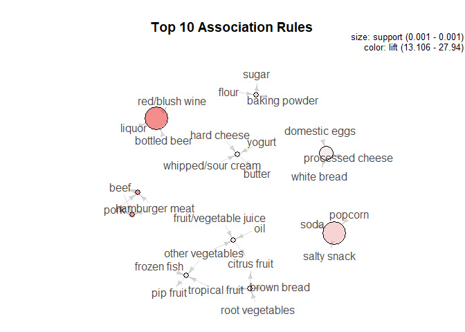

Findings:
---------

-   Whole milk is the most commonly bought item which matches our
    findings from the EDA
-   People frequently add other salty snacks when they buy soda and
    popcorn
-   Liquor, blush wine and bottled beer are sold together
-   Baking items - flour, baking powder and sugar are bought together
-   Dairy products - Hard cheese, butter, whipped/sour cream and yogurt
    are bought together
-   White bread, domestic eggs and processed cheese sell together etc.
