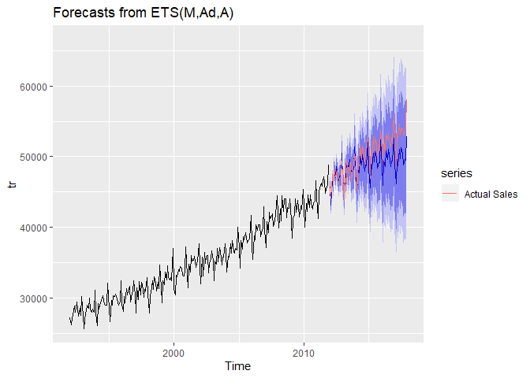

------------------------------------------------------------------------

<center>

### ETS Laboratory

#### (40 points)

#### Due: Nov. 6 (before 9:00am)

</center>

------------------------------------------------------------------------

In this assignment we will focus on longer term forecast as it is
appropriate for aggregate planning and/or facilities planning.

We are interested in obtaining a 5 year forecast (60 months to be
precise) of the size of the grocery store market in the US, and we want
that forecast in monthly (not weekly) intervals. Such a forecast is
useful if you are preparing an infrastructure plan for a grocery store
chain for example: this type of forecast is useful to make decisions
about number of new stores to open, number of distribution centers and
their capacity, personnel and other infrastructure decisions.

The data set “**MRTSSM4451USN.csv**” includes monthly retail sales of
grocery stores in the US from January 1992 through December 2017
expressed in millions of US dollars.  
Source:
<a href="https://fred.stlouisfed.org/series/MRTSSM4451USN" class="uri">https://fred.stlouisfed.org/series/MRTSSM4451USN</a>

The first thing we need to do is load the data file and convert it into
an appropriate time-series object. This is accomplished with the
following code:

``` r
library(fpp2)
library(dplyr)
#
# Read csv file and make it a time series
GS <- read.csv("MRTSSM4451USN.csv") %>%
  select(-DATE) %>%
  ts(start= c(1992,1), frequency=12) 
```

In this assignment we will learn to use the **ets(…)** function to fit
and analyze exponential smoothing models. Before proceeding to fit a
model we examine and divide the data into two sets; a training set
**tr** that we will use to fit the models and a testing (or hold-out)
data set **te** to assess the out-of-sample performance of the models.
This is accomplished with the following code:

``` r
tr <- window(GS, end=c(2011,12))
te <- window(GS, start=c(2012,1))

autoplot(GS) +
  geom_vline(xintercept=2012.0, color="gray") +
  ggtitle("Monthly Sales of US Grocery Stores")
```


1.  (5 pts.) Holt-Winters Model Analysis: part I:

-   Use the **ets(…)** function to fit a Holt-Winters exponential
    smoothing model with additive errors to the training sales data.
    Leave it up to the **ets(…)** function to decide if a damping
    parameter is necessary (i.e., do not specify the damped directive.
    Name this model **f.HW**, and report the model details including the
    optimized value of each of the constants and smoothing parameters
    required by the model, the *AIC*, *AICc* and *BIC* values, as well
    as the in-sample fitting indicators.

-   Use the **forecast(…)** function to obtain a **72-month-ahead**
    forecast (i.e., forecast the entire testing or hold-out dataset),
    name this forecast **fc.HW** and plot it (i.e. call the
    **autoplot(fc.HW)** function); overlay on this plot the actual sales
    observed during this testing period (i.e. call the function **+
    autolayer(te, series = “Actual Sales”)** to overlay the testing set
    data).

-   In this plot it is difficult to appreciate the gap between actuals
    and forecasts; next we reproduce the plot again, but now zooming on
    the forecasting period. To do this, include the **xlim** and
    **ylim** parameters in the **autoplot(…)** call (i.e., call **+
    xlim(2009,2018)**) to focus the plot on the forecast period). Please
    include the above value for the **xlim** parameter in every forecast
    plot in Questions 1 through

-   Calculate the *in-sample* and *out-of-sample* fit statistics. You
    can obtain the in-sample and out-of-sample fit metrics comparison by
    calling the function **accuracy(fc.HW, te)**

<!-- -->

    Based on your analysis above, discuss the forecast bias and compare the in-sample and out-of-sample *MASE*.  What do you think is driving the poor model performance?  Which model/method, **f.HW** or **naive**,  would you choose for forecasting?

Answer:

The best model with additive errors came out to be the one with additive
damped trend and additive seasonality and the in-sample MASE is much
lower than the out-sample MASE i.e 0.4025102 vs 3.8724692.

When the parameter is forced to have additive errors parameter, it’s
picking additive damped trend which together cause the forecasting bias
leading to lower values to be forecasted consistently. This is leading
to poor model performance.

Out-sample MASE is greater than 1 so one should choose naive model
instead of f.HW.

``` r
f.HW = ets(tr, model="AAM", restrict=FALSE )
summary(f.HW)
```

    ## ETS(A,Ad,M) 
    ## 
    ## Call:
    ##  ets(y = tr, model = "AAM", restrict = FALSE) 
    ## 
    ##   Smoothing parameters:
    ##     alpha = 0.2352 
    ##     beta  = 0.0318 
    ##     gamma = 1e-04 
    ##     phi   = 0.9763 
    ## 
    ##   Initial states:
    ##     l = 27872.5978 
    ##     b = 59.8324 
    ##     s = 1.0669 0.9963 0.9961 0.9771 1.0154 1.0326
    ##            1.0005 1.0321 0.9788 0.9997 0.9181 0.9866
    ## 
    ##   sigma:  552.4746
    ## 
    ##      AIC     AICc      BIC 
    ## 4364.637 4367.732 4427.288 
    ## 
    ## Training set error measures:
    ##                   ME     RMSE      MAE      MPE     MAPE      MASE
    ## Training set 57.4813 532.5484 411.8761 0.137036 1.176363 0.4059612
    ##                    ACF1
    ## Training set -0.2370515

``` r
fc.HW = f.HW %>% 
  forecast(h=72)

autoplot(fc.HW) + autolayer(te, series = "Actual Sales") 
```


``` r
autoplot(fc.HW) + autolayer(te, series = "Actual Sales") + xlim(2009,2018) + ylim(35000,60000)
```

    ## Scale for 'x' is already present. Adding another scale for 'x', which
    ## will replace the existing scale.

    ## Warning: Removed 204 rows containing missing values (geom_path).


``` r
accuracy(fc.HW,te)
```

    ##                     ME      RMSE       MAE      MPE     MAPE      MASE
    ## Training set   57.4813  532.5484  411.8761 0.137036 1.176363 0.4059612
    ## Test set     1135.9734 1706.9472 1380.9461 2.166546 2.679437 1.3611144
    ##                    ACF1 Theil's U
    ## Training set -0.2370515        NA
    ## Test set      0.6771641  0.689433

1.  (5 pts.) Holt-Winters Model Analysis: part II:

-   Optimize the parameters of a Holt-Winters model disallowing damping
    of growth (i.e., use the **damped = FALSE** directive in the call to
    the **ets(…)** function). Call the fitted model **f.HW2**, and
    report the model details including the optimized value of each of
    the constants and smoothing parameters required by the model, the
    *AIC, AICc* and *BIC* values, as well as the in-sample fitting
    indicators.

-   Obtain a 72-month-ahead forecast, name this forecast **fc.HW2** and
    plot it.

-   Calculate the *in-sample* and *out-of-sample* fit statistics of the
    **fc.HW2** forecast.

-   As in Question (1), compare the out-of-sample metrics of **fc.HW**
    and **fc.HW2**. Discuss also the confidence interval cone of both
    models, and their implications for operations planning.

Answer:

    ##               ME         RMSE      MAE       MPE        MAPE     MASE       ACF1       Theil's U
    ## f.HW  Test set     1135.9734  1706.9472 1380.9461 2.166546   2.679437 1.3611144  0.6771641  0.689433
    ## 
    ## f.HW2 Test set     820.44312  1104.4465 960.1400  1.5959893  1.889764 0.9463515  0.2475996  0.4566494

The out-sample metrics are performing better for the model with no
damping in trend.

The confidence intervals are wider for f.HW which indicates higher
variability. This will impact the operations planning and cause overage
or underage hurting the profits.

``` r
f.HW2 = ets(tr, model="AAM", damped=FALSE, restrict = FALSE)
summary(f.HW2)
```

    ## ETS(A,A,M) 
    ## 
    ## Call:
    ##  ets(y = tr, model = "AAM", damped = FALSE, restrict = FALSE) 
    ## 
    ##   Smoothing parameters:
    ##     alpha = 0.2454 
    ##     beta  = 0.0032 
    ##     gamma = 0.1442 
    ## 
    ##   Initial states:
    ##     l = 27872.5136 
    ##     b = 47.0513 
    ##     s = 1.0817 0.9867 0.9954 0.9792 1.0154 1.0391
    ##            1.0005 1.0264 0.9822 0.9992 0.9136 0.9806
    ## 
    ##   sigma:  567.6711
    ## 
    ##      AIC     AICc      BIC 
    ## 4376.735 4379.492 4435.906 
    ## 
    ## Training set error measures:
    ##                    ME     RMSE      MAE       MPE     MAPE      MASE
    ## Training set 54.15558 548.4224 415.9123 0.1306936 1.177138 0.4099394
    ##                    ACF1
    ## Training set -0.2539726

``` r
fc.HW2 = f.HW2 %>% 
  forecast(h=72)

autoplot(fc.HW2) + autolayer(te, series = "Actual Sales") 
```


``` r
autoplot(fc.HW2) + autolayer(te, series = "Actual Sales") + xlim(2009,2018) + ylim(35000,60000)
```

    ## Scale for 'x' is already present. Adding another scale for 'x', which
    ## will replace the existing scale.

    ## Warning: Removed 204 rows containing missing values (geom_path).


``` r
accuracy(fc.HW2,te)
```

    ##                     ME      RMSE      MAE       MPE     MAPE      MASE
    ## Training set  54.15558  548.4224 415.9123 0.1306936 1.177138 0.4099394
    ## Test set     820.44312 1104.4465 960.1400 1.5959893 1.889764 0.9463515
    ##                    ACF1 Theil's U
    ## Training set -0.2539726        NA
    ## Test set      0.2475996 0.4566494

1.  (5 pts) Optimal ETS Model Selection:

-   Now we call the **ets(…)** function using the **model=”ZZZ”**
    directive to optimize the model selection including multiplicative
    models (i.e., set the **restrict=FALSE** option). Call the fitted
    model **f.O**, and report the model details, the *AIC, AICc* and
    *BIC* values, as well as the in-sample fitting indicators.

-   Obtain a 72-month-ahead forecast, name this forecast **fc.O** and
    plot it.

-   Calculate the *in-sample* and *out-of-sample* fit statistics of the
    **fc.O** forecast.

-   Compare the out-of-sample accuracy metrics of **fc.HW**, **fc.HW2**
    and **fc.O**. Compare the *AIC AICc* and *BIC* of models **f.HW**,
    **f.HW2** and **f.O**. Which model/method would you choose for
    forecasting?

Answer:

    ##                    ME         RMSE      MAE       MPE        MAPE     MASE       ACF1       Theil's U
    ## f.HW  Test set     1135.9734  1706.9472 1380.9461 2.166546   2.679437 1.3611144  0.6771641  0.689433
    ## 
    ## f.HW2 Test set     820.44312  1104.4465 960.1400  1.5959893  1.889764 0.9463515  0.2475996  0.4566494
    ## 
    ## f.O   Test set     409.13236  836.6561  666.9141  0.76421242 1.316576 0.6573366 -0.07587836 0.3474461
    ## 
    ##        AIC       AICc      BIC 
    ## f.HW   4364.637  4367.732  4427.288  AAdM
    ## 
    ## f.HW2  4376.735  4379.492  4435.906  AAM
    ## 
    ## f.O    4352.540  4355.297  4411.711  MAA

f.HW2 will be chosen as it has the best out-sample metric values of the
three models.

The IC metrics are the best for the f.O model, followed by the f.HW
model.

``` r
f.O = ets(tr, model="ZZZ", restrict=FALSE)
summary(f.O)
```

    ## ETS(M,A,A) 
    ## 
    ## Call:
    ##  ets(y = tr, model = "ZZZ", restrict = FALSE) 
    ## 
    ##   Smoothing parameters:
    ##     alpha = 0.2328 
    ##     beta  = 0.0041 
    ##     gamma = 1e-04 
    ## 
    ##   Initial states:
    ##     l = 27978.8076 
    ##     b = 56.015 
    ##     s = 2378.258 -169.2943 -144.1528 -796.7364 575.0091 1156.585
    ##            38.1926 1153.63 -757.9354 35.1323 -2768.678 -700.0095
    ## 
    ##   sigma:  0.0154
    ## 
    ##      AIC     AICc      BIC 
    ## 4352.540 4355.297 4411.711 
    ## 
    ## Training set error measures:
    ##                    ME     RMSE      MAE        MPE    MAPE      MASE
    ## Training set 45.28612 529.6129 407.5492 0.09263676 1.15639 0.4016964
    ##                    ACF1
    ## Training set -0.2314272

``` r
fc.O = f.O %>% 
  forecast(h=72)

autoplot(fc.O) + autolayer(te, series = "Actual Sales") 
```


``` r
autoplot(fc.O) + autolayer(te, series = "Actual Sales") + xlim(2009,2018) + ylim(35000,60000)
```

    ## Scale for 'x' is already present. Adding another scale for 'x', which
    ## will replace the existing scale.

    ## Warning: Removed 204 rows containing missing values (geom_path).


``` r
accuracy(fc.O,te)
```

    ##                     ME     RMSE      MAE        MPE     MAPE      MASE
    ## Training set  45.28612 529.6129 407.5492 0.09263676 1.156390 0.4016964
    ## Test set     409.13236 836.6561 666.9141 0.76421242 1.316576 0.6573366
    ##                     ACF1 Theil's U
    ## Training set -0.23142723        NA
    ## Test set     -0.07587836 0.3474461

1.  (5 pts) Optimized model using BoxCox-Transformed Data:

-   Select the best value of the “*lambda*” parameter for the BoxCox
    transformation over the training set **tr**, and then use the
    **ets(…)** function to optimize the model selection as you did in
    Question (3). Call the fitted model **fB.O**, and report the model
    details, the *AIC, AICc* and *BIC* values, as well as the in-sample
    fitting indicators.

-   Obtain a 72-month-ahead forecast, name this forecast **fBc.O** and
    plot it.

-   Calculate the in-sample and out-of-sample fit statistics of the
    **fBc.O** forecast.

-   Compare the in-sample and out-of-sample accuracy metrics of
    **fBc.O** and **fc.O**. Which model/method would you choose for
    forecasting? Why?

Answer:

    ##                     ME         RMSE      MAE       MPE        MAPE     MASE       ACF1       Theil's U
    ## fc.O   Training set 45.28612   529.6129  407.5492  0.09263676 1.156390 0.4016964 -0.23142723        NA     
    ## fc.O   Test set     409.13236  836.6561  666.9141  0.76421242 1.316576 0.6573366 -0.07587836 0.3474461
    ## 
    ## fBc.O  Training set 41.79434   517.1069  396.1544  0.08768066 1.125411 0.3904652 -0.24642919        NA
    ## fBc.O  Test set     493.71650  839.8616  681.9229  0.95817270 1.349351 0.6721299 -0.02047443 0.3519391

The f.O model with no Box-Cox transformation with MAA should be chosen
as the out-sample metrics are performing better.

``` r
L = BoxCox.lambda(tr)
z = BoxCox(tr,L)

fB.O = ets(tr, model="ZZZ", restrict=FALSE, lambda=L)
summary(fB.O)
```

    ## ETS(M,A,A) 
    ## 
    ## Call:
    ##  ets(y = tr, model = "ZZZ", lambda = L, restrict = FALSE) 
    ## 
    ##   Box-Cox transformation: lambda= 0.4125 
    ## 
    ##   Smoothing parameters:
    ##     alpha = 0.2389 
    ##     beta  = 0.0025 
    ##     gamma = 1e-04 
    ## 
    ##   Initial states:
    ##     l = 162.7329 
    ##     b = 0.129 
    ##     s = 5.2015 -0.3899 -0.324 -1.642 1.2789 2.4914
    ##            0.1262 2.3842 -1.5531 -7e-04 -6.3331 -1.2395
    ## 
    ##   sigma:  0.0063
    ## 
    ##      AIC     AICc      BIC 
    ## 1388.401 1391.158 1447.572 
    ## 
    ## Training set error measures:
    ##                    ME     RMSE      MAE        MPE     MAPE      MASE
    ## Training set 41.79434 517.1069 396.1544 0.08768066 1.125411 0.3904652
    ##                    ACF1
    ## Training set -0.2464292

``` r
fBc.O = fB.O %>% 
  forecast(h=72)

autoplot(fBc.O) + autolayer(te, series = "Actual Sales") 
```


``` r
autoplot(fBc.O) + autolayer(te, series = "Actual Sales") + xlim(2009,2018) + ylim(35000,60000)
```

    ## Scale for 'x' is already present. Adding another scale for 'x', which
    ## will replace the existing scale.

    ## Warning: Removed 204 rows containing missing values (geom_path).


``` r
accuracy(fBc.O,te)
```

    ##                     ME     RMSE      MAE        MPE     MAPE      MASE
    ## Training set  41.79434 517.1069 396.1544 0.08768066 1.125411 0.3904652
    ## Test set     493.71650 839.8616 681.9229 0.95817270 1.349351 0.6721299
    ##                     ACF1 Theil's U
    ## Training set -0.24642919        NA
    ## Test set     -0.02047443 0.3519391

1.  (5 pts) Optimized model with damping using BoxCox-Transformed Data:

-   Using the best value of “*lambda*” (i.e., the same you used in
    Question (4)), and set **damped=TRUE** in the **ets(…)** function.
    Name the fitted model **fB.OD** and report the model details and
    metrics.

-   Now use the **forecast(…)** function to obtain a 72-month-ahead
    forecast, name this forecast **fBc.OD** and plot it.

-   Use the function **accuracy(…)** to calculate the in-sample and
    out-of-sample fit statistics of the **fBc.OD** forecast.

-   Compare the in-sample and out-of-sample accuracy metrics of
    **fBc.OD**, **fBc.O** and **fc.O**. Which model/method would you
    choose for forecasting? Why?

Answer:

    ##                     ME         RMSE      MAE       MPE        MAPE     MASE       ACF1       Theil's U
    ## fc.O   Training set 45.28612   529.6129  407.5492  0.09263676 1.156390 0.4016964 -0.23142723        NA     
    ## fc.O   Test set     409.13236  836.6561  666.9141  0.76421242 1.316576 0.6573366 -0.07587836 0.3474461
    ## 
    ## fBc.O  Training set 41.79434   517.1069  396.1544  0.08768066 1.125411 0.3904652 -0.24642919        NA
    ## fBc.O  Test set     493.71650  839.8616  681.9229  0.95817270 1.349351 0.6721299 -0.02047443 0.3519391
    ## 
    ## fBc.OD Training set 63.01338   522.228   406.8174  0.1563473  1.15368  0.4009751 -0.2444046        NA
    ## fBc.OD Test set     1522.59359 2180.261  1765.4273 2.8931232  3.40745  1.7400741  0.7565656 0.8769238

MASE for fB.OD is above 1 which means it is performing worse than the
naive model. f.O (MAA without Box-Cox transformation) should be chosen
since it’s performing the best among the three models.

``` r
L = BoxCox.lambda(tr)
z = BoxCox(tr,L)

fB.OD = ets(tr, model="ZZZ", damped=TRUE, restrict=FALSE, lambda=L)
summary(fB.OD)
```

    ## ETS(M,Ad,A) 
    ## 
    ## Call:
    ##  ets(y = tr, model = "ZZZ", damped = TRUE, lambda = L, restrict = FALSE) 
    ## 
    ##   Box-Cox transformation: lambda= 0.4125 
    ## 
    ##   Smoothing parameters:
    ##     alpha = 0.2183 
    ##     beta  = 0.0409 
    ##     gamma = 1e-04 
    ##     phi   = 0.9654 
    ## 
    ##   Initial states:
    ##     l = 163.0008 
    ##     b = 0.1061 
    ##     s = 5.1552 -0.3949 -0.2677 -1.6903 1.258 2.5866
    ##            0.1037 2.3685 -1.5927 -0.0424 -6.2147 -1.2693
    ## 
    ##   sigma:  0.0063
    ## 
    ##      AIC     AICc      BIC 
    ## 1395.301 1398.396 1457.953 
    ## 
    ## Training set error measures:
    ##                    ME    RMSE      MAE       MPE    MAPE      MASE
    ## Training set 63.01338 522.228 406.8174 0.1563473 1.15368 0.4009751
    ##                    ACF1
    ## Training set -0.2444046

``` r
fBc.OD = fB.OD %>% 
  forecast(h=72)

autoplot(fBc.OD) + autolayer(te, series = "Actual Sales") 
```



``` r
autoplot(fBc.OD) + autolayer(te, series = "Actual Sales") + xlim(2009,2018) + ylim(35000,60000)
```

    ## Scale for 'x' is already present. Adding another scale for 'x', which
    ## will replace the existing scale.

    ## Warning: Removed 204 rows containing missing values (geom_path).


``` r
accuracy(fBc.OD,te)
```

    ##                      ME     RMSE       MAE       MPE    MAPE      MASE
    ## Training set   63.01338  522.228  406.8174 0.1563473 1.15368 0.4009751
    ## Test set     1522.59359 2180.261 1765.4273 2.8931232 3.40745 1.7400741
    ##                    ACF1 Theil's U
    ## Training set -0.2444046        NA
    ## Test set      0.7565656 0.8769238

1.  (5 pts) In an effort to improve forecasts, in this question we want
    to assess the value of old information and discard the oldest
    segment of the information that does not have predictive value. To
    this end code and execute the following:

Evaluate the selection of a moving training set starting from 1992,
1993, etc all the way to starting in 2006, but in each case keep the end
of the training set fixed at December of 2011. For each starting year:

-   Select the value of the Box “lambda” for each training set
-   Obtain an optimized model using all the **ets**-options that you
    consider pertinent based on your analysis in previous questions.
-   Extract the in-sample *RMSE*
-   Based on *RMSE*, select the best starting year for the training set
-   Report the lowest *RMSE* and the starting year the generates it
-   Create a “reduced” training set starting the year you identified
    above, and terminating in December of 2011. Name this reduced
    training set **trr**.
-   Explain why we cannot use the *AIC, AICc* or *BIC* criteria to
    select the best starting year for the training data set.

Answer:

The IC criteria - AIC, AICc or BIC - should be used to compare the
models which use the same data. But, the dataset is varies across these
models because of the different starting year. Hence, we cannot use the
IC criteria to compare these models.

``` r
library(rlist)

x <- c(1992,1993,1994,1995,1996,1997,1998,1999,2000,2001,2002,2003,2004,2005,2006)
RMSE_list = rep(0,15)
for (i in 1:15) {
  tr_t <- window(GS, start=c(x[i],1),end=c(2011,12))
  te_t <- window(GS, start=c(2012,1))
  L = BoxCox.lambda(tr_t)
  fT.O = ets(tr_t, model="ZZZ", restrict=FALSE, lambda=L)
 y_hat = fitted.values(fT.O)
 RMSE = function(m, o){
   sqrt(mean((m - o)^2))
 }
 r = RMSE(y_hat,tr_t)
  RMSE_list[i] = r # accuracy[2]
}
best_year = x[which.min(RMSE_list)]
cat('Best year is: ',best_year)
```

    ## Best year is:  2003

``` r
cat('\n')
```

``` r
cat('Best RMSE is: ',RMSE_list[which.min(RMSE_list)])
```

    ## Best RMSE is:  494.2976

``` r
trr = window(GS, start=c(best_year,1),end=c(2011,12))
```

1.  (5 pts) Fitting a model on the reduced training dataset:

-   Figure out the best value of the BoxCox “*lambda*” value for the
    reduced training data set **trr**, and fit the best *ETS* model to
    this data. Report the model parameters and metrics. Name this model
    **f**.

-   Obtain a 72-month-ahead forecast, name this forecast **fc** and plot
    it.

-   Calculate the *in-sample* and *out-of-sample* fit statistics of the
    **fc** forecast.

-   Is the in-sample *AICc* for model **f.O** comparable with the
    in-sample *AICc* for model **f**? Explain.

-   Is the in-sample *MASE* for model **f.O** comparable with the
    in-sample *MASE* for model **f**? Explain.

-   Is the *out-of-sample RMSE* for forecast **fc.O** comparable with
    the *out-of-sample RMSE* for forecast **fc**? Explain. Is the **fc**
    forecast truly an *out-of-sample* forecast? Explain.

Answer:

The in-sample AICc for model f.O is not comparable with the in-sample
AICc for model f as the Box-Cox transformation modifies the data.

The in-sample MASE for model f.O is comparable with the in-sample MASE
for model f because accuracy function uses the inverse transformed
values in computing the MASE metric. That is, we are comparing the
values in the same scale.

Yes, the out-of-sample RMSE for forecast fc.O is comparable with the
out-of-sample RMSE for forecast fc since they are calculated using the
values in the same scale.

The fc forecast is not truly an out-of-sample forecast because an
out-of-sample forecast refers to a forecast where we do not have actual
data and utilize the entire data available to forecast it.

``` r
L = BoxCox.lambda(trr)
f = ets(trr, model="ZZZ", restrict=FALSE, lambda=L)
summary(f)
```

    ## ETS(M,A,A) 
    ## 
    ## Call:
    ##  ets(y = trr, model = "ZZZ", lambda = L, restrict = FALSE) 
    ## 
    ##   Box-Cox transformation: lambda= 0.5078 
    ## 
    ##   Smoothing parameters:
    ##     alpha = 0.3281 
    ##     beta  = 1e-04 
    ##     gamma = 1e-04 
    ## 
    ##   Initial states:
    ##     l = 399.497 
    ##     b = 0.5614 
    ##     s = 12.9022 -0.5055 -0.8228 -5.1962 2.9332 6.4895
    ##            -0.215 7.1264 -4.1232 -0.0609 -17.2713 -1.2564
    ## 
    ##   sigma:  0.0067
    ## 
    ##      AIC     AICc      BIC 
    ## 749.4563 756.2563 795.0526 
    ## 
    ## Training set error measures:
    ##                     ME     RMSE      MAE         MPE     MAPE      MASE
    ## Training set -5.651558 494.2976 371.9078 -0.02931331 0.919973 0.2744728
    ##                    ACF1
    ## Training set -0.1649438

``` r
fc = f %>% 
  forecast(h=72)

autoplot(fc) + autolayer(te, series = "Actual Sales") 
```


``` r
autoplot(fc) + autolayer(te, series = "Actual Sales") + xlim(2009,2018) + ylim(35000,60000)
```

    ## Scale for 'x' is already present. Adding another scale for 'x', which
    ## will replace the existing scale.

    ## Warning: Removed 72 rows containing missing values (geom_path).


``` r
accuracy(fc,te)
```

    ##                       ME     RMSE      MAE         MPE     MAPE      MASE
    ## Training set   -5.651558 494.2976 371.9078 -0.02931331 0.919973 0.2744728
    ## Test set     -145.187830 637.3400 503.6923 -0.29517044 1.010351 0.3717315
    ##                     ACF1 Theil's U
    ## Training set -0.16494376        NA
    ## Test set      0.03156856 0.2657902

``` r
L
```

    ## [1] 0.5078479

1.  (5 pts.) Aggregate Sales Forecast for 2018—2022:

-   Next we need to prepare a monthly sales forecast through
    December 2022. To this end we first set the training set to include
    all the data starting from the year we selected in Question (6)
    through December 2017. Select the *ETS* model you analyzed in
    Question (7), and fit the best parameters to that model. Name the
    resulting model **ff**.

-   Compare the in-sample accuracy of fit statistics of **ff** with
    those of model **f**.

-   Obtain a 60-month-ahead forecast, name this forecast **ffc** and
    plot it (this time do not include the xlim limits on the forecast
    plot.

-   Based on your analysis what would you expect the out-of-sample
    (i.e., the actual) *MAPE* be over the next five years? Why?

-   You must plan for the expansion of capacity of your system. An
    important input in this process is the national-wide aggregate
    grocery store sales. What is the level of nationwide sales that will
    not be exceeded with a probability of 90%

Answer:

    ##                        ME       RMSE       MAE        MPE         MAPE      MASE        ACF1
    ## f  Training set       -5.651558  494.2976  371.9078  -0.02931331  0.919973  0.2744728  -0.16494376
    ## ff Training set       -1.80174   539.558   425.0455  -0.01824347  0.9582303 0.3160245  -0.17874

The in-sample accuracy metric of **f** are lower than **ff**.

We can expect the out-of-sample MAPE to be around 1.010351 which is the
test set MAPE from the previous question. The train dataset in this
question is observed to be split into in-sample and out-sample
(validation set to be precise) in question 7 and the best parameters
have been passed on this model.

The nationwide aggregare grocery store sales will not exceed 67498.09
with a probability of 90%.

``` r
trr_all = window(GS, start=c(best_year,1),end=c(2017,12))

L = BoxCox.lambda(trr_all)

ff = ets(trr_all, model="MAA", restrict=FALSE, lambda=L)
summary(ff)
```

    ## ETS(M,A,A) 
    ## 
    ## Call:
    ##  ets(y = trr_all, model = "MAA", lambda = L, restrict = FALSE) 
    ## 
    ##   Box-Cox transformation: lambda= 0.4171 
    ## 
    ##   Smoothing parameters:
    ##     alpha = 0.2877 
    ##     beta  = 1e-04 
    ##     gamma = 1e-04 
    ## 
    ##   Initial states:
    ##     l = 186.5821 
    ##     b = 0.2109 
    ##     s = 4.658 -0.1021 -0.1958 -2.1199 1.201 2.2679
    ##            -0.0772 2.8424 -1.7866 0.4042 -6.672 -0.42
    ## 
    ##   sigma:  0.0054
    ## 
    ##       AIC      AICc       BIC 
    ##  987.3102  991.0880 1041.5904 
    ## 
    ## Training set error measures:
    ##                    ME    RMSE      MAE         MPE      MAPE      MASE
    ## Training set -1.80174 539.558 425.0455 -0.01824347 0.9582303 0.3160245
    ##                  ACF1
    ## Training set -0.17874

``` r
ffc =  ff %>% 
  forecast(h=60, level = c(80, 90))

autoplot(ffc) 
```


``` r
summary(ffc)['Hi 80']
```

    ## 
    ## Forecast method: ETS(M,A,A)
    ## 
    ## Model Information:
    ## ETS(M,A,A) 
    ## 
    ## Call:
    ##  ets(y = trr_all, model = "MAA", lambda = L, restrict = FALSE) 
    ## 
    ##   Box-Cox transformation: lambda= 0.4171 
    ## 
    ##   Smoothing parameters:
    ##     alpha = 0.2877 
    ##     beta  = 1e-04 
    ##     gamma = 1e-04 
    ## 
    ##   Initial states:
    ##     l = 186.5821 
    ##     b = 0.2109 
    ##     s = 4.658 -0.1021 -0.1958 -2.1199 1.201 2.2679
    ##            -0.0772 2.8424 -1.7866 0.4042 -6.672 -0.42
    ## 
    ##   sigma:  0.0054
    ## 
    ##       AIC      AICc       BIC 
    ##  987.3102  991.0880 1041.5904 
    ## 
    ## Error measures:
    ##                    ME    RMSE      MAE         MPE      MAPE      MASE
    ## Training set -1.80174 539.558 425.0455 -0.01824347 0.9582303 0.3160245
    ##                  ACF1
    ## Training set -0.17874
    ## 
    ## Forecasts:
    ##          Point Forecast    Lo 80    Hi 80    Lo 90    Hi 90
    ## Jan 2018       54336.09 53451.50 55229.15 53202.27 55483.87
    ## Feb 2018       50923.75 50059.64 51796.48 49816.25 52045.47
    ## Mar 2018       55055.57 54090.73 56030.38 53819.02 56308.53
    ## Apr 2018       53914.32 52934.85 54904.27 52659.08 55186.82
    ## May 2018       56728.79 55669.91 57799.32 55371.85 58104.93
    ## Jun 2018       55143.14 54078.55 56219.84 53778.95 56527.28
    ## Jul 2018       56638.50 55517.41 57772.66 55201.98 58096.57
    ## Aug 2018       56135.05 54991.84 57291.99 54670.24 57622.48
    ## Sep 2018       54328.02 53186.76 55483.43 52865.79 55813.55
    ## Oct 2018       55564.70 54373.57 56770.91 54038.63 57115.61
    ## Nov 2018       55742.40 54520.05 56980.58 54176.40 57334.47
    ## Dec 2018       58690.46 57387.45 60010.55 57021.16 60387.90
    ## Jan 2019       55802.97 54523.87 57099.40 54164.40 57470.08
    ## Feb 2019       52336.51 51095.10 53595.33 50746.33 53955.36
    ## Mar 2019       56533.69 55190.06 57896.19 54812.59 58285.89
    ## Apr 2019       55374.59 54026.90 56741.68 53648.36 57132.77
    ## May 2019       58232.78 56806.30 59679.94 56405.66 60093.95
    ## Jun 2019       56622.61 55200.99 58065.35 54801.81 58478.20
    ## Jul 2019       58141.10 56665.70 59638.64 56251.47 60067.22
    ## Aug 2019       57629.89 56139.48 59143.12 55721.10 59576.27
    ## Sep 2019       55794.78 54316.14 57296.62 53901.17 57726.61
    ## Oct 2019       57050.73 55524.22 58601.42 55095.86 59045.43
    ## Nov 2019       57231.17 55677.81 58809.51 55241.98 59261.51
    ## Dec 2019       60224.39 58587.95 61887.16 58128.82 62363.34
    ## Jan 2020       57292.69 55691.38 58920.52 55242.24 59386.82
    ## Feb 2020       53771.86 52220.73 55349.52 51785.81 55801.61
    ## Mar 2020       58034.68 56374.67 59722.83 55909.19 60206.54
    ## Apr 2020       56857.67 55199.99 58544.01 54735.25 59027.29
    ## May 2020       59759.76 58019.95 61529.62 57532.18 62036.83
    ## Jun 2020       58124.97 56397.14 59883.27 55912.84 60387.29
    ## Jul 2020       59666.68 57884.66 61480.28 57385.20 62000.18
    ## Aug 2020       59147.69 57354.87 60972.76 56852.47 61496.03
    ## Sep 2020       57284.36 55510.47 59090.87 55013.50 59608.95
    ## Oct 2020       58559.66 56737.61 60415.36 56227.19 60947.58
    ## Nov 2020       58742.87 56896.14 60624.08 56378.86 61163.68
    ## Dec 2020       61781.43 59847.35 63751.46 59305.58 64316.50
    ## Jan 2021       58805.33 56915.48 60731.25 56386.28 61283.81
    ## Feb 2021       55229.90 53400.70 57095.10 52888.68 57630.44
    ## Mar 2021       59558.64 57612.75 61542.32 57067.96 62111.57
    ## Apr 2021       58363.64 56424.85 60340.71 55882.17 60908.17
    ## May 2021       61309.83 59284.42 63375.01 58717.45 63967.73
    ## Jun 2021       59650.31 57642.52 61698.28 57080.62 62286.20
    ## Jul 2021       61215.35 59151.86 63320.20 58574.38 63924.46
    ## Aug 2021       60688.53 58617.24 62801.87 58037.67 63408.65
    ## Sep 2021       58796.88 56750.40 60885.73 56177.93 61485.64
    ## Oct 2021       60091.60 57995.81 62230.89 57409.56 62845.30
    ## Nov 2021       60277.59 58158.34 62441.19 57565.59 63062.64
    ## Dec 2021       63361.69 61150.16 65619.14 60531.55 66267.49
    ## Jan 2022       60340.99 58181.67 62546.32 57577.86 63179.90
    ## Feb 2022       56710.72 54621.37 58845.93 54037.37 59459.61
    ## Mar 2022       61105.69 58891.49 63367.67 58272.44 64017.64
    ## Apr 2022       59892.60 57689.47 62144.02 57073.65 62791.09
    ## May 2022       62883.08 60588.39 65227.65 59946.91 65901.42
    ## Jun 2022       61198.73 58926.49 63521.24 58291.44 64188.83
    ## Jul 2022       62787.20 60457.23 65168.68 59806.05 65853.21
    ## Aug 2022       62252.52 59917.11 64640.15 59264.50 65326.55
    ## Sep 2022       60332.41 58026.97 62690.38 57382.92 63368.43
    ## Oct 2022       61646.65 59290.30 64056.71 58632.03 64749.74
    ## Nov 2022       61835.43 59456.34 64269.11 58791.79 64969.00
    ## Dec 2022       64965.26 62488.71 67498.09 61796.83 68226.40

    ##             Hi 80
    ## Jan 2018 55229.15
    ## Feb 2018 51796.48
    ## Mar 2018 56030.38
    ## Apr 2018 54904.27
    ## May 2018 57799.32
    ## Jun 2018 56219.84
    ## Jul 2018 57772.66
    ## Aug 2018 57291.99
    ## Sep 2018 55483.43
    ## Oct 2018 56770.91
    ## Nov 2018 56980.58
    ## Dec 2018 60010.55
    ## Jan 2019 57099.40
    ## Feb 2019 53595.33
    ## Mar 2019 57896.19
    ## Apr 2019 56741.68
    ## May 2019 59679.94
    ## Jun 2019 58065.35
    ## Jul 2019 59638.64
    ## Aug 2019 59143.12
    ## Sep 2019 57296.62
    ## Oct 2019 58601.42
    ## Nov 2019 58809.51
    ## Dec 2019 61887.16
    ## Jan 2020 58920.52
    ## Feb 2020 55349.52
    ## Mar 2020 59722.83
    ## Apr 2020 58544.01
    ## May 2020 61529.62
    ## Jun 2020 59883.27
    ## Jul 2020 61480.28
    ## Aug 2020 60972.76
    ## Sep 2020 59090.87
    ## Oct 2020 60415.36
    ## Nov 2020 60624.08
    ## Dec 2020 63751.46
    ## Jan 2021 60731.25
    ## Feb 2021 57095.10
    ## Mar 2021 61542.32
    ## Apr 2021 60340.71
    ## May 2021 63375.01
    ## Jun 2021 61698.28
    ## Jul 2021 63320.20
    ## Aug 2021 62801.87
    ## Sep 2021 60885.73
    ## Oct 2021 62230.89
    ## Nov 2021 62441.19
    ## Dec 2021 65619.14
    ## Jan 2022 62546.32
    ## Feb 2022 58845.93
    ## Mar 2022 63367.67
    ## Apr 2022 62144.02
    ## May 2022 65227.65
    ## Jun 2022 63521.24
    ## Jul 2022 65168.68
    ## Aug 2022 64640.15
    ## Sep 2022 62690.38
    ## Oct 2022 64056.71
    ## Nov 2022 64269.11
    ## Dec 2022 67498.09
