------------------------------------------------------------------------

<center>

### Forecasting Aggregate Electricity Generation in the US:

### Seasonal ARIMA Lab.

#### (Total 40 pts.)

#### Due: Nov. 20 (before 9:00am)

</center>

------------------------------------------------------------------------

In this assignment we will focus on estimation of electricity generation
in the US through December 2022. We will base our analysis on the
monthly data (index) provided by the Federal Reserve in
<a href="https://fred.stlouisfed.org/series/IPG2211N" class="uri">https://fred.stlouisfed.org/series/IPG2211N</a>

``` r
library(fpp)
```

    ## Loading required package: forecast

    ## Registered S3 method overwritten by 'xts':
    ##   method     from
    ##   as.zoo.xts zoo

    ## Registered S3 method overwritten by 'quantmod':
    ##   method            from
    ##   as.zoo.data.frame zoo

    ## Registered S3 methods overwritten by 'forecast':
    ##   method             from    
    ##   fitted.fracdiff    fracdiff
    ##   residuals.fracdiff fracdiff

    ## Loading required package: fma

    ## Loading required package: expsmooth

    ## Loading required package: lmtest

    ## Loading required package: zoo

    ## 
    ## Attaching package: 'zoo'

    ## The following objects are masked from 'package:base':
    ## 
    ##     as.Date, as.Date.numeric

    ## Loading required package: tseries

``` r
library(fpp2)
```

    ## Loading required package: ggplot2

    ## 
    ## Attaching package: 'fpp2'

    ## The following objects are masked from 'package:fpp':
    ## 
    ##     ausair, ausbeer, austa, austourists, debitcards, departures,
    ##     elecequip, euretail, guinearice, oil, sunspotarea, usmelec

``` r
library(dplyr)
```

    ## 
    ## Attaching package: 'dplyr'

    ## The following objects are masked from 'package:stats':
    ## 
    ##     filter, lag

    ## The following objects are masked from 'package:base':
    ## 
    ##     intersect, setdiff, setequal, union

``` r
PG <- read.csv("IPG2211N.csv") %>%
  select(-DATE) %>%
  ts(start=c(1972,1), frequency=12)
plot(PG)
abline(v=c(2005,1), col="gray")
```

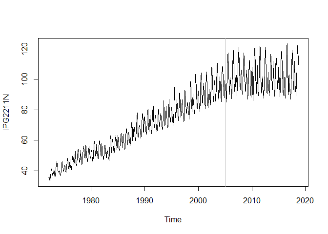

Initially we will set up as training data the series from January 1972
through December 1995, and the testing set as the data from January 1996
through December 2000. First we will analyze the data during the growth
period. To maintain consistency across the class, please execute the
following two command to generate the training and testing data sets as
indicated:

``` r
PG1.tr <- window(PG, end=c(1995,12))
PG1.te <- window(PG, start=c(1996,1), end=c(2000,12))
```

\#\#\#\#1. (5 pts.) Preliminary analysis of training data: \* Obtain the
Box-Cox transformation parameter lambda for the training set PG1.tr

-   Use the **ggtsdisplay(…, lag=48)** function to examine *ACF* and
    *PACF* of the Box-Cox transformed series with a non-seasonal
    difference. Do the differenced and transformed series look
    stationary?

-   Use the **ggtsdisplay(…, lag=48)** function to examine *ACF* and
    *PACF* of the Box-Cox transformed series with a seasonal difference.
    Do the differenced and transformed series look stationary?

-   Use the **ggtsdisplay(…, lag=48)** function to examine *ACF* and
    *PACF* of the Box-Cox transformed series with both a seasonal
    difference and a non-seasonal difference. Do the differenced and
    transformed series look stationary?

-   Run the **adf.test(…)** on the above series. What do you conclude
    from the test?

-   If you were to fit an *ARIMA* model to each of the (three)
    differenced series you obtained above, what would be the maximum
    order of the (*p*, *d*, *q*)(*P*, *D*, *Q*)<sub>12</sub> model in
    each case? (i.e., what is the maximum values of *p*, *P*, *q* and
    *Q* for each of the value combinations of *d* and *D*?)

\#\#\#\#Answer

Lambda value is -0.253.

The non-seasonal differenced data doesn’t look stationary from the ACF
plot as it neither cuts off nor dying down, even though time series
looks stationary.

The seasonally differenced data’s time series doesn’t look stationary.
But ACF has decayed.

The first differenced and the seasonally differenced data, the time
series may not be completely considered stationary as it doesn’t quite
have a constant spikes but the ACF has decayed.

The adf test is significant for all of them with a p-value of 0.01.

    ## 
    ## The maximum values for p,P,q,Q:
    ##                                         p      P      q      Q    
    ## Non-seasonal differencing               9      3      9      4 
    ## Seasonal differencing                   6      2      8      1 
    ## Seasonal and Non-seasonal differencing  4      3      5      3

``` r
L = BoxCox.lambda(PG1.tr)
L
```

    ## [1] -0.2530983

``` r
PG1Z.tr = BoxCox(PG1.tr,L)

# non-seasonal differencing
ggtsdisplay(diff(PG1Z.tr), lag=48)
```

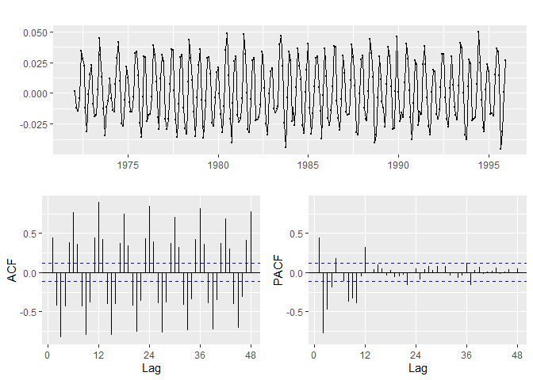

``` r
adf.test(diff(PG1Z.tr),alternative='stationary', k=12)
```

    ## Warning in adf.test(diff(PG1Z.tr), alternative = "stationary", k = 12): p-
    ## value smaller than printed p-value

    ## 
    ##  Augmented Dickey-Fuller Test
    ## 
    ## data:  diff(PG1Z.tr)
    ## Dickey-Fuller = -5.2335, Lag order = 12, p-value = 0.01
    ## alternative hypothesis: stationary

``` r
# seasonal differencing
ggtsdisplay(diff(PG1Z.tr, lag=12), lag=48)
```

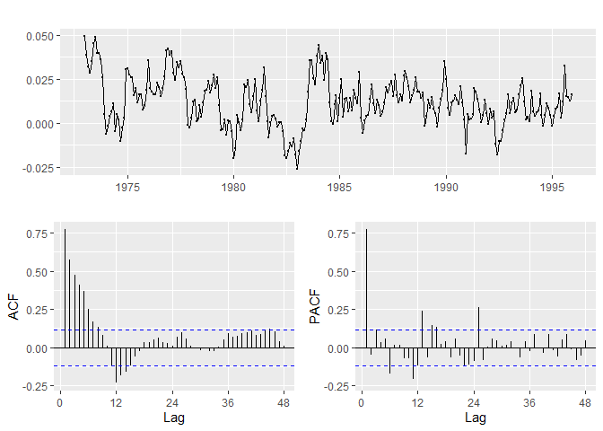

``` r
adf.test(diff(PG1Z.tr, lag=12),alternative='stationary',k=12)
```

    ## Warning in adf.test(diff(PG1Z.tr, lag = 12), alternative = "stationary", :
    ## p-value smaller than printed p-value

    ## 
    ##  Augmented Dickey-Fuller Test
    ## 
    ## data:  diff(PG1Z.tr, lag = 12)
    ## Dickey-Fuller = -4.3727, Lag order = 12, p-value = 0.01
    ## alternative hypothesis: stationary

``` r
# seasonal and non-seasonal differencing
ggtsdisplay(diff(diff(PG1Z.tr, lag=12),1), lag=48)
```

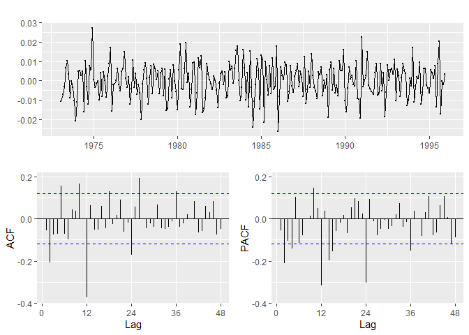

``` r
adf.test(diff(diff(PG1Z.tr, lag=12),1),alternative='stationary',k=12)
```

    ## Warning in adf.test(diff(diff(PG1Z.tr, lag = 12), 1), alternative =
    ## "stationary", : p-value smaller than printed p-value

    ## 
    ##  Augmented Dickey-Fuller Test
    ## 
    ## data:  diff(diff(PG1Z.tr, lag = 12), 1)
    ## Dickey-Fuller = -5.9947, Lag order = 12, p-value = 0.01
    ## alternative hypothesis: stationary

\#\#\#\#2. (5 pts.) Automatic ARIMA model selection:

-   Run the **auto.arima(…)** function to fit an ARIMA model on the
    Box-Cox transformation of the PG1.tr dataset, and report the order
    of the model, the value of the model parameters and the value of the
    AICc and BIC information criteria.

-   Use the **checkresiduals(…)** function to assess the validity of the
    model you obtained in Question 1. Based on the results you obtained
    comment on the validity of the model.

-   Use the **forecast(…)** function to prepare a 60 month-ahead
    (5-year) forecast for the electricity generation and then overlay
    the actual data for electricity generation.

-   Use the **accuracy(…)** function to obtain the training and testing
    fit (PG1.te) metrics for the model obtained. Based on the visual
    inspection of the forecast plot and the out-of-sample fit statistics
    comment on the forecast bias.

\#\#\#\#Answer

The out-sample MPE is -2.64 which indicates forecast bias with the model
over-predicting as also evident from the plot.

P-value should be large to fail to reject the null hypothesis that the
series consists of stationary iid observations. P-value of 0.08272
indicates that the model is valid.

    ## 
    ## ARIMA(2,1,1)(0,1,1)[12] 
    ## 
    ## Coefficients:
    ##          ar1      ar2      ma1     sma1
    ##       0.6187  -0.2491  -0.6813  -0.8008
    ## s.e.  0.1150   0.0655   0.1096   0.0477
    ## 
    ## sigma^2 estimated as 4.918e-05:  log likelihood=970.21
    ## 
    ## AIC=-1930.42   AICc=-1930.19   BIC=-1912.33
    ## 
    ## Order of the model: 
    ##         p         d         q         P         D         Q Frequency 
    ##         2         1         1         0         1         1        12

``` r
L = BoxCox.lambda(PG1.tr)

fit.AA = auto.arima(PG1.tr, lambda = L)
fit.AA
```

    ## Series: PG1.tr 
    ## ARIMA(2,1,1)(0,1,1)[12] 
    ## Box Cox transformation: lambda= -0.2530983 
    ## 
    ## Coefficients:
    ##          ar1      ar2      ma1     sma1
    ##       0.6187  -0.2491  -0.6813  -0.8008
    ## s.e.  0.1150   0.0655   0.1096   0.0477
    ## 
    ## sigma^2 estimated as 4.918e-05:  log likelihood=970.21
    ## AIC=-1930.42   AICc=-1930.19   BIC=-1912.33

``` r
# Order of the arima model
arimaorder(fit.AA)
```

    ##         p         d         q         P         D         Q Frequency 
    ##         2         1         1         0         1         1        12

``` r
checkresiduals(fit.AA) # p-value should be large to fail to reject the null hypothesis of stationary iid observations
```

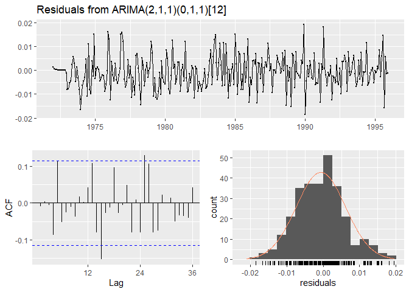

    ## 
    ##  Ljung-Box test
    ## 
    ## data:  Residuals from ARIMA(2,1,1)(0,1,1)[12]
    ## Q* = 29.262, df = 20, p-value = 0.08272
    ## 
    ## Model df: 4.   Total lags used: 24

``` r
fc.AA = fit.AA %>%
  forecast(h=60)

autoplot(fc.AA) + autolayer(PG1.te, series = "Actual")
```

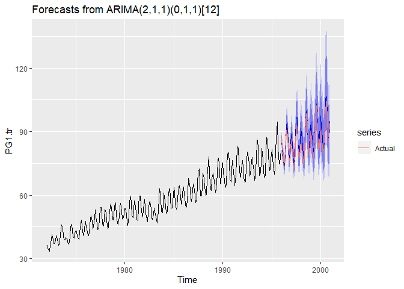

``` r
autoplot(fc.AA) + autolayer(PG1.te, series = "Actual") + xlim(1995,2001)
```

    ## Scale for 'x' is already present. Adding another scale for 'x', which
    ## will replace the existing scale.

    ## Warning: Removed 276 rows containing missing values (geom_path).

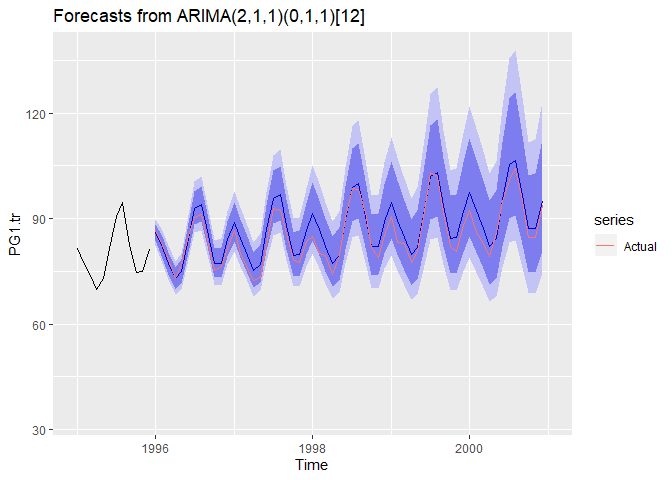

``` r
accuracy(fc.AA,PG1.te)
```

    ##                      ME     RMSE       MAE        MPE     MAPE     MASE
    ## Training set -0.0935554 1.176245 0.8729458 -0.1941531 1.476424 0.385567
    ## Test set     -2.2196194 3.047559 2.5506190 -2.6392460 3.028170 1.126570
    ##                    ACF1 Theil's U
    ## Training set -0.1173698        NA
    ## Test set      0.5894791 0.4885983

\#\#\#\#3. (5 pts.) Manual Model Selection on
(*p*, 0, *q*)(*P*, 1, *Q*)<sub>12</sub>:

-   Search manually for a model on the seasonally differenced series to
    improve on the automatic selection in Question 2. To limit your
    manual search do not exceed the maximum values of *p*, *q*, *P* and
    *Q* that you identified in Question 1.

-   Report on the best model that you identified in each case and
    comment on its *AIC*, *AICc* and *BIC*. How do your model compares
    with the one found by **auto.arima(…)**?

\#\#\#\#Answer

Assumption: The Auto ARIMA model is seasonally differenced apart from
being first differenced but the IC values have been compared with the
manual selection models below. This is because twelve data points
difference would not cause a significant impact for comparing these
models given the size of the dataset.

With manual selection, the AIC and AICc are better than the model
selected by auto.arima while BIC is better for the auto.arima model.

To get a simpler model which performs better, the highest values tried
for p, q, P and Q are 2, 2, 2 and 1 respectively.

    ## 
    ##                                               p      P      q      Q    
    ## Max parameters with Seasonal differencing     6      2      8      1 
    ## 
    ## Auto ARIMA (2,1,1) (0,1,1)_{12} : AIC=-1930.42   AICc=-1930.19   BIC=-1912.33
    ## 
    ## Manual Selection (2,0,2) (0,1,1)_{12} : AIC=-1932.597    AICc=-1932.284  BIC=-1910.874   

``` r
L = BoxCox.lambda(PG1.tr)

param = expand.grid(p = 0:2, q = 0:2, P = 0:2, Q = 0:1)

AIC_AA = -1930.42
AICc_AA = -1930.19
BIC_AA = -1912.33

mape_AA = 3.028170

results = data.frame()

for (i in 1:nrow(param)) {
  p = param[i,1]
  q = param[i,2]
  P = param[i,3]
  Q = param[i,4]
  
  possibleError <- tryCatch(
      Arima(PG1.tr, order=c(p,0,q), seasonal=c(P,1,Q), lambda=L),
      error=function(e) e
  )
  
  if(!inherits(possibleError, "error")){
      model = Arima(PG1.tr, order=c(p,0,q), seasonal=c(P,1,Q), lambda=L)
      
      aicc = model$aicc
      aic = AIC(model)
      bic = model$bic
      
      fc.SA = model %>%
    forecast(h=60)

      mape = accuracy(fc.SA,PG1.te)[2,5]
      
      results = rbind(results, c(p, q, P, Q, aic, aicc, bic, mape))
      
  }
} 

colnames(results) = c('p','q','P','Q','AIC','AICC','BIC','MAPE')
# print(results)
print(results[which.min(results$AICC),])
```

    ##    p q P Q       AIC      AICC       BIC     MAPE
    ## 35 2 2 0 1 -1932.597 -1932.284 -1910.874 2.504441

\#\#\#\#4. (5 pts.) Manual Model Selection on
(*p*, 1, *q*)(*P*, 0, *Q*)<sub>12</sub>:

-   Search manually for a model on the once-differenced series to
    improve on the automatic selection in Question 2. To limit your
    manual search do not exceed the maximum values of *p*, *q*, *P* and
    *Q* that you identified in Question 1.

-   Report on the best model that you identified in each case and
    comment on its *AIC*, *AICc* and *BIC*. How do your model compares
    with the ones found in Questions 2 and 3?

\#\#\#\#Answer

Assumption: The Auto ARIMA model is first differenced apart from being
seasonally differenced but the IC values have been compared with the
manual selection models below. This is because one data point difference
would not cause a significant impact for comparing these models given
the size of the dataset.

With manual selection all the IC metrics are better than the model
selected by auto.arima and the one from Question 3.

To get a simpler model which performs better, the highest values tried
for p, q, P and Q are 2, 2, 2 and 2 respectively.

    ## 
    ##                                                             p      P      q      Q    
    ## Max parameters with Non-seasonal differencing               9      3      9      4
    ## 
    ## Auto ARIMA (2,1,1) (0,1,1)_{12} : AIC=-1930.42   AICc=-1930.19   BIC=-1912.33
    ## 
    ## Q3 - Manual Selection (2,0,2) (0,1,1)_{12} : AIC=-1932.597   AICc=-1932.284  BIC=-1910.874
    ## 
    ## Manual Selection (2,1,1) (1,0,1)_{12} : AIC=-1992.094   AICc=-1991.794   BIC=-1970.137

``` r
L = BoxCox.lambda(PG1.tr)

param = expand.grid(p = 0:2, q = 0:2, P = 0:2, Q = 0:2)

AIC_AA = -1930.42
AICc_AA = -1930.19
BIC_AA = -1912.33

mape_AA = 3.028170

results = data.frame()

for (i in 1:nrow(param)) {
  p = param[i,1]
  q = param[i,2]
  P = param[i,3]
  Q = param[i,4]
  
  possibleError <- tryCatch(
      Arima(PG1.tr, order=c(p,1,q), seasonal=c(P,0,Q), lambda=L),
      error=function(e) e
  )
  
  if(!inherits(possibleError, "error")){
      model = Arima(PG1.tr, order=c(p,1,q), seasonal=c(P,0,Q), lambda=L)
      
      aicc = model$aicc
      aic = AIC(model)
      bic = model$bic
      
      fc.SA = model %>%
    forecast(h=60)

      mape = accuracy(fc.SA,PG1.te)[2,5]
      
      results = rbind(results, c(p, q, P, Q, aic, aicc, bic, mape))
      
  }
} 

colnames(results) = c('p','q','P','Q','AIC','AICC','BIC','MAPE')
# print(results)
print(results[which.min(results$AICC),])
```

    ##    p q P Q       AIC      AICC       BIC     MAPE
    ## 34 2 1 1 1 -1992.094 -1991.794 -1970.137 2.928856

\#\#\#\#5. (5 pts.) ARIMA model for the expanded training set:

-   Now we redefine the training and testing sets as follows:

``` r
PG2.tr <- window(PG, end=c(2011,12))
```

-   Obtain the Box-Cox transformation parameter lambda for the training
    set **PG2.tr**

-   Difference the transformed series once at the seasonal and
    non-seasonal levels (i.e.,*d* = 1 and *D* = 1) and run the
    **adf.test(…)** on the resulting series. What do you conclude from
    the test?

-   If you were to fit an ARIMA model to the time series you obtained
    above, what would be the maximum order of the
    (*p*, 1, *q*)(*P*, 1, *Q*)<sub>12</sub> model? (i.e., what is the
    maximum values of *p*, *P*, *q* and *Q*? )

\#\#\#\#Answer

Lambda value is -0.367202.

P-value is 0.01 indicating that the series is stationary.

    ## 
    ##                                                             p      P      q      Q    
    ## Max parameters with Non-seasonal differencing               4      4      2      2

``` r
L = BoxCox.lambda(PG2.tr)
 
cat(L)
```

    ## -0.367202

``` r
adf.test(diff(diff(BoxCox(PG2.tr,L)),lag=12),alternative='stationary',k=12)
```

    ## Warning in adf.test(diff(diff(BoxCox(PG2.tr, L)), lag = 12), alternative =
    ## "stationary", : p-value smaller than printed p-value

    ## 
    ##  Augmented Dickey-Fuller Test
    ## 
    ## data:  diff(diff(BoxCox(PG2.tr, L)), lag = 12)
    ## Dickey-Fuller = -8.0736, Lag order = 12, p-value = 0.01
    ## alternative hypothesis: stationary

``` r
ggtsdisplay(diff(diff(BoxCox(PG2.tr,L)),lag=12), lag=48)
```

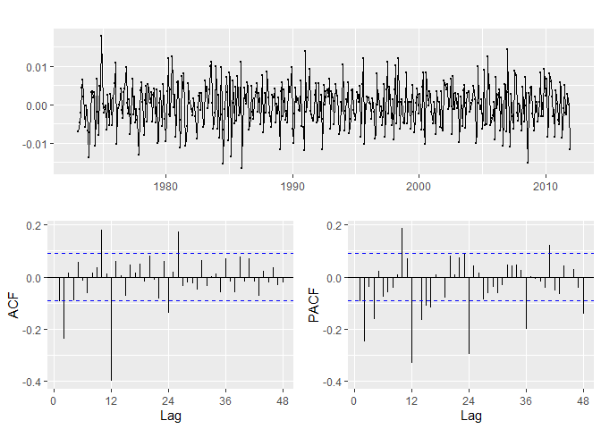

\#\#\#\#6. (5 pts.) Automatic ARIMA model selection on the expanded
dataset:

-   Run the **auto.arima(…)** function to fit an *ARIMA* model on the
    Box-Cox transformation of the **PG2.tr** dataset, and report the
    order of the model, the value of the model parameters and the value
    of the *AIC*, *AICc* and *BIC*?

-   Execute the residual diagnostics and comment on the validity of the
    model.

\#\#\#\#Answer

P-value is 0.03169 and is less than 0.05 which indicates that the model
is not valid i.e. the null hypothesis that the series consists of
stationary iid observations is rejected.

    ## 
    ## AIC=-3761.13   AICc=-3760.95   BIC=-3736.25
    ## 
    ## Order of the model:
    ## p         d         q         P         D         Q Frequency 
    ## 1         1         3         0         1         1        12

``` r
L = BoxCox.lambda(PG2.tr)

fit.AA = auto.arima(PG2.tr, lambda = L)
fit.AA
```

    ## Series: PG2.tr 
    ## ARIMA(1,1,3)(0,1,1)[12] 
    ## Box Cox transformation: lambda= -0.367202 
    ## 
    ## Coefficients:
    ##          ar1      ma1      ma2     ma3     sma1
    ##       0.4588  -0.5969  -0.2423  0.0614  -0.7836
    ## s.e.  0.3294   0.3317   0.0741  0.1345   0.0318
    ## 
    ## sigma^2 estimated as 1.798e-05:  log likelihood=1886.56
    ## AIC=-3761.13   AICc=-3760.95   BIC=-3736.25

``` r
# Order of the arima model
arimaorder(fit.AA)
```

    ##         p         d         q         P         D         Q Frequency 
    ##         1         1         3         0         1         1        12

``` r
checkresiduals(fit.AA) # p-value should be large to fail to reject the null hypothesis of stationary iid observations
```

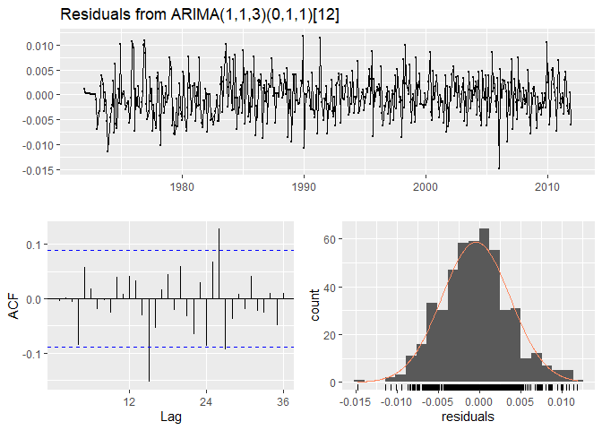

    ## 
    ##  Ljung-Box test
    ## 
    ## data:  Residuals from ARIMA(1,1,3)(0,1,1)[12]
    ## Q* = 31.946, df = 19, p-value = 0.03169
    ## 
    ## Model df: 5.   Total lags used: 24

\#\#\#\#7. (5 pts.) Automatic ARIMA model selection with a reduced
training dataset:

-   As the patterns of consumption and generation changed substantially
    on 2005, before setting on a forecasting model we will try reducing
    the training set to information posterior to 2005. To this end we
    define the training data set as follows:

``` r
PG3.tr <- window(PG, start=c(2005,1), end=c(2011,12))
PG3.te <- window(PG, start=c(2012,1), end=c(2017,12))

tsdisplay(PG3.tr)
```

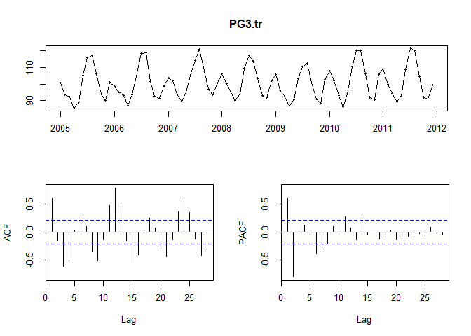

-   Now run the **auto.arima(…)** function to fit a model on the
    **PG3.tr** dataset, and report the order of the model, the value of
    the model parameters, and the values of *AIC*, *AICc* and *BIC*.

-   Diagnose the model’s residuals to assess the validity of the model
    you obtained above. Based on the results you obtained comment on the
    validity of the model.

-   Using the **PG3.tr** dataset, try to get a better model than the one
    obtained by the **auto.arima(…)** function, possibly changing also
    the number of differences. Use the information criteria and the
    validity of the model to select the best model.

-   For the best model found thus far, prepare a 72 month-ahead forecast
    for the electricity generation and then overlay the actual data for
    electricity generation.

-   Based on the visual inspection of the forecast plot and the
    out-of-sample fit statistics comment on the forecast bias.

\#\#\#\#Answer

P-value is 0.2944 which is above 0.05 which indicates that the model is
valid i.e. the null hypothesis that the series consists of stationary
iid observations cannot be rejected.

The out-sample MPE is -0.52 indicating forecasting bias with the model
over-predicting as evident also from the graph.

    ## 
    ## 
    ## AIC=343.61   AICc=344.52   BIC=354.99
    ## 
    ## Order of the model:
    ## p         d         q         P         D         Q Frequency 
    ## 0         0         1         2         1         1        12

``` r
fit.AA = auto.arima(PG3.tr)
fit.AA
```

    ## Series: PG3.tr 
    ## ARIMA(0,0,1)(2,1,1)[12] 
    ## 
    ## Coefficients:
    ##          ma1     sar1     sar2     sma1
    ##       0.6702  -0.0635  -0.2438  -0.6571
    ## s.e.  0.0868   0.3035   0.1998   0.3845
    ## 
    ## sigma^2 estimated as 5.392:  log likelihood=-166.8
    ## AIC=343.61   AICc=344.52   BIC=354.99

``` r
# Order of the arima model
arimaorder(fit.AA)
```

    ##         p         d         q         P         D         Q Frequency 
    ##         0         0         1         2         1         1        12

``` r
checkresiduals(fit.AA) # p-value should be large to fail to reject the null hypothesis of stationary iid observations
```

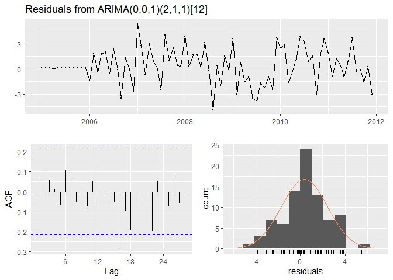

    ## 
    ##  Ljung-Box test
    ## 
    ## data:  Residuals from ARIMA(0,0,1)(2,1,1)[12]
    ## Q* = 15.21, df = 13, p-value = 0.2944
    ## 
    ## Model df: 4.   Total lags used: 17

``` r
# trying combinations for (p,d,q), (P,D,Q)
fit.AA1 = Arima(PG3.tr, order=c(0,0,1), seasonal=c(0,1,0))
fit.AA1
```

    ## Series: PG3.tr 
    ## ARIMA(0,0,1)(0,1,0)[12] 
    ## 
    ## Coefficients:
    ##          ma1
    ##       0.6364
    ## s.e.  0.0881
    ## 
    ## sigma^2 estimated as 8.347:  log likelihood=-178.3
    ## AIC=360.61   AICc=360.78   BIC=365.16

``` r
arimaorder(fit.AA1)
```

    ##         p         d         q         P         D         Q Frequency 
    ##         0         0         1         0         1         0        12

``` r
checkresiduals(fit.AA1)
```

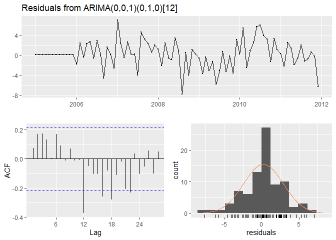

    ## 
    ##  Ljung-Box test
    ## 
    ## data:  Residuals from ARIMA(0,0,1)(0,1,0)[12]
    ## Q* = 35.962, df = 16, p-value = 0.002928
    ## 
    ## Model df: 1.   Total lags used: 17

``` r
fit.AA2 = Arima(PG3.tr, order=c(1,0,0), seasonal=c(0,1,0))
fit.AA2
```

    ## Series: PG3.tr 
    ## ARIMA(1,0,0)(0,1,0)[12] 
    ## 
    ## Coefficients:
    ##          ar1
    ##       0.5746
    ## s.e.  0.0982
    ## 
    ## sigma^2 estimated as 8.418:  log likelihood=-178.55
    ## AIC=361.09   AICc=361.27   BIC=365.64

``` r
arimaorder(fit.AA2)
```

    ##         p         d         q         P         D         Q Frequency 
    ##         1         0         0         0         1         0        12

``` r
checkresiduals(fit.AA2)
```

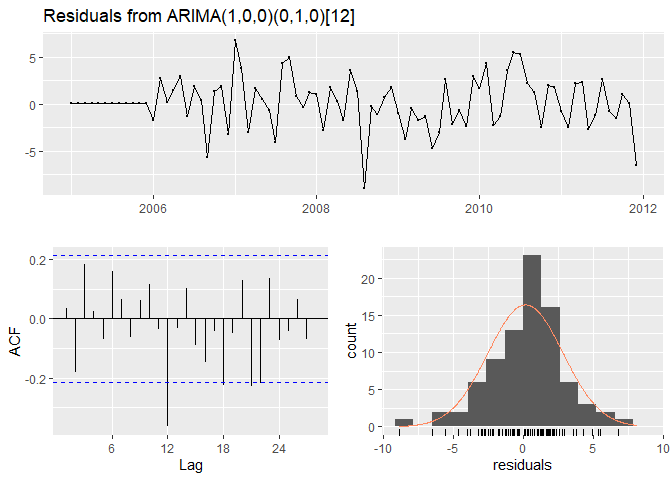

    ## 
    ##  Ljung-Box test
    ## 
    ## data:  Residuals from ARIMA(1,0,0)(0,1,0)[12]
    ## Q* = 29.526, df = 16, p-value = 0.02062
    ## 
    ## Model df: 1.   Total lags used: 17

``` r
fit.AA3 = Arima(PG3.tr, order=c(0,0,1), seasonal=c(0,1,1))
fit.AA3
```

    ## Series: PG3.tr 
    ## ARIMA(0,0,1)(0,1,1)[12] 
    ## 
    ## Coefficients:
    ##          ma1     sma1
    ##       0.6831  -0.8088
    ## s.e.  0.0889   0.2366
    ## 
    ## sigma^2 estimated as 5.353:  log likelihood=-167.91
    ## AIC=341.81   AICc=342.16   BIC=348.64

``` r
arimaorder(fit.AA3)
```

    ##         p         d         q         P         D         Q Frequency 
    ##         0         0         1         0         1         1        12

``` r
checkresiduals(fit.AA3)
```

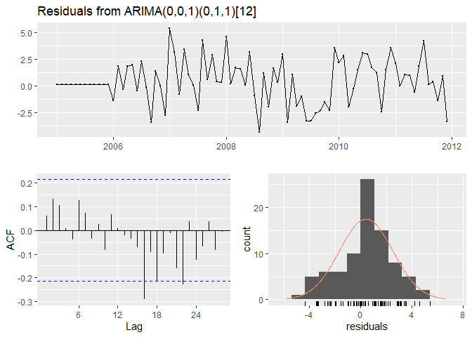

    ## 
    ##  Ljung-Box test
    ## 
    ## data:  Residuals from ARIMA(0,0,1)(0,1,1)[12]
    ## Q* = 16.933, df = 15, p-value = 0.3229
    ## 
    ## Model df: 2.   Total lags used: 17

``` r
fit.AA4 = Arima(PG3.tr, order=c(1,1,1), seasonal=c(1,1,1))
fit.AA4
```

    ## Series: PG3.tr 
    ## ARIMA(1,1,1)(1,1,1)[12] 
    ## 
    ## Coefficients:
    ##          ar1      ma1    sar1     sma1
    ##       0.5893  -1.0000  0.1482  -0.9999
    ## s.e.  0.1009   0.1582  0.1426   0.3935
    ## 
    ## sigma^2 estimated as 4.928:  log likelihood=-167.65
    ## AIC=345.3   AICc=346.22   BIC=356.61

``` r
arimaorder(fit.AA4)
```

    ##         p         d         q         P         D         Q Frequency 
    ##         1         1         1         1         1         1        12

``` r
checkresiduals(fit.AA3)
```


    ## 
    ##  Ljung-Box test
    ## 
    ## data:  Residuals from ARIMA(0,0,1)(0,1,1)[12]
    ## Q* = 16.933, df = 15, p-value = 0.3229
    ## 
    ## Model df: 2.   Total lags used: 17

``` r
fit.AA5 = Arima(PG3.tr, order=c(1,1,2), seasonal=c(1,1,1))
fit.AA5
```

    ## Series: PG3.tr 
    ## ARIMA(1,1,2)(1,1,1)[12] 
    ## 
    ## Coefficients:
    ##           ar1      ma1      ma2    sar1     sma1
    ##       -0.0522  -0.1717  -0.5012  0.1269  -0.9999
    ## s.e.   0.2746   0.2534   0.1364  0.1454   0.3207
    ## 
    ## sigma^2 estimated as 4.918:  log likelihood=-165.41
    ## AIC=342.82   AICc=344.13   BIC=356.4

``` r
arimaorder(fit.AA5)
```

    ##         p         d         q         P         D         Q Frequency 
    ##         1         1         2         1         1         1        12

``` r
checkresiduals(fit.AA5)
```

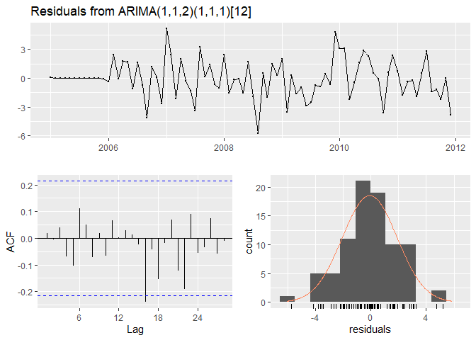

    ## 
    ##  Ljung-Box test
    ## 
    ## data:  Residuals from ARIMA(1,1,2)(1,1,1)[12]
    ## Q* = 10.863, df = 12, p-value = 0.5407
    ## 
    ## Model df: 5.   Total lags used: 17

``` r
fc.AA5 = fit.AA5 %>%
  forecast(h=72)

autoplot(fc.AA5) + autolayer(PG3.te, series = "Actual")
```

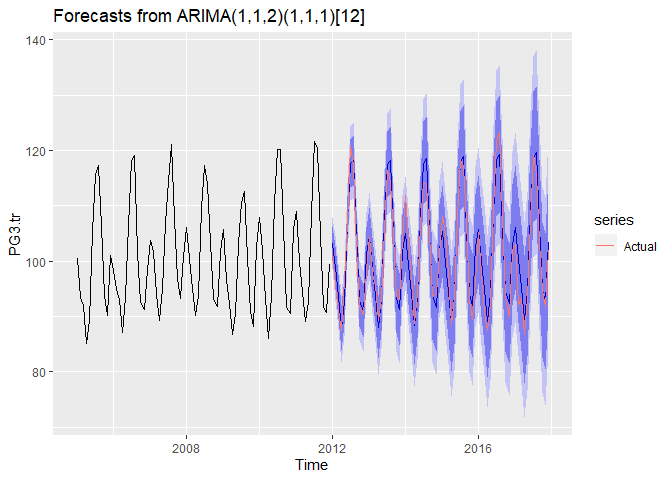

``` r
autoplot(fc.AA5) + autolayer(PG3.te, series = "Actual") + xlim(2011,2017)
```

    ## Scale for 'x' is already present. Adding another scale for 'x', which
    ## will replace the existing scale.

    ## Warning: Removed 72 rows containing missing values (geom_path).

    ## Warning: Removed 11 rows containing missing values (geom_path).

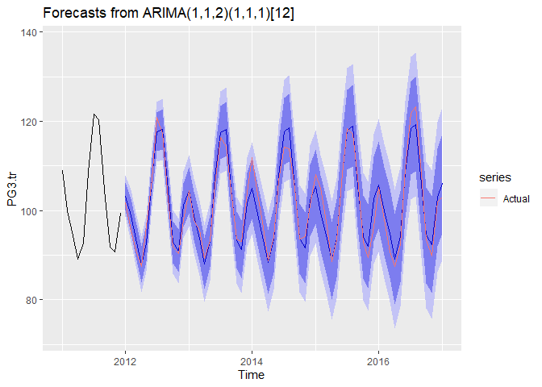

``` r
accuracy(fc.AA5,PG3.te)
```

    ##                      ME     RMSE      MAE        MPE     MAPE      MASE
    ## Training set -0.0799001 1.965806 1.447576 -0.1001184 1.417499 0.5182517
    ## Test set     -0.4663699 2.650957 2.046885 -0.5171845 2.016495 0.7328125
    ##                    ACF1 Theil's U
    ## Training set 0.01923434        NA
    ## Test set     0.50457208 0.3017158

\#\#\#\#8. (5 pts) Forecasting future monthly US electricity generation:

-   Now define the training and testing data set as:

``` r
PG.tr <- window(PG, start=c(2005,1), end=c(2017,12))
PG.te <- window(PG, start=c(2018,1))
```

-   Use the **Arima(…)** function to fit the best model you have found
    thus far on PG.tr, run the model diagnostics to test the model
    validity and use it to extrapolate (forecast) the monthly generation
    of electricity in the US through the end of 2022 (i.e., forecast 60
    months ahead).

-   Overlay the available data for 2018 over the forecast. Comment on
    the model fit and validity.

\#\#\#\#Answer

P-value is 0.1458 which is above 0.05 which indicates that the model is
valid i.e. the null hypothesis that the series consists of stationary
iid observations cannot be rejected.

From the forecast plot, there appears to be some forecasting bias with
the model slightly under-predicting although it’s fitting reasonably
well.

The MPE for the period for which actual data is available is 2.39
indicating a bias with the model under-predicting.

``` r
fit.A = Arima(PG.tr, order=c(1,1,2), seasonal=c(1,1,1))
fit.A
```

    ## Series: PG.tr 
    ## ARIMA(1,1,2)(1,1,1)[12] 
    ## 
    ## Coefficients:
    ##          ar1      ma1      ma2    sar1    sma1
    ##       0.4725  -0.8485  -0.1515  0.1673  -1.000
    ## s.e.  0.1432   0.1720   0.1660  0.0964   0.131
    ## 
    ## sigma^2 estimated as 4.709:  log likelihood=-327.83
    ## AIC=667.65   AICc=668.27   BIC=685.43

``` r
arimaorder(fit.A)
```

    ##         p         d         q         P         D         Q Frequency 
    ##         1         1         2         1         1         1        12

``` r
checkresiduals(fit.A)
```

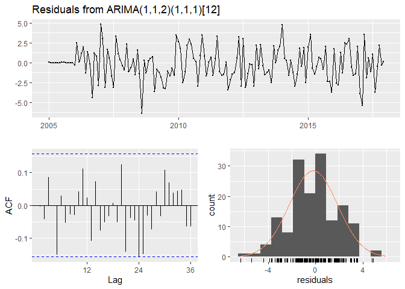

    ## 
    ##  Ljung-Box test
    ## 
    ## data:  Residuals from ARIMA(1,1,2)(1,1,1)[12]
    ## Q* = 25.464, df = 19, p-value = 0.1458
    ## 
    ## Model df: 5.   Total lags used: 24

``` r
fc.A = fit.A %>%
  forecast(h=60)

autoplot(fc.A) + autolayer(PG.te, series = "Actual")
```

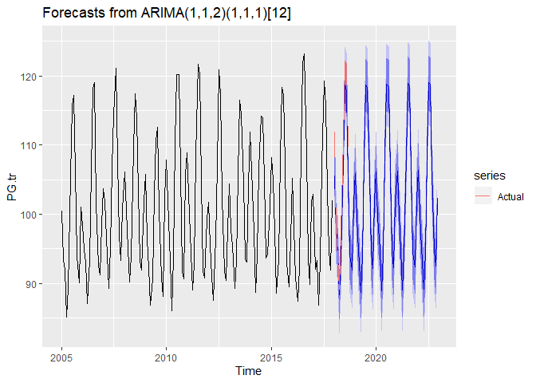

``` r
autoplot(fc.A) + autolayer(PG.te, series = "Actual") + xlim(2017,2023)
```

    ## Scale for 'x' is already present. Adding another scale for 'x', which
    ## will replace the existing scale.

    ## Warning: Removed 144 rows containing missing values (geom_path).

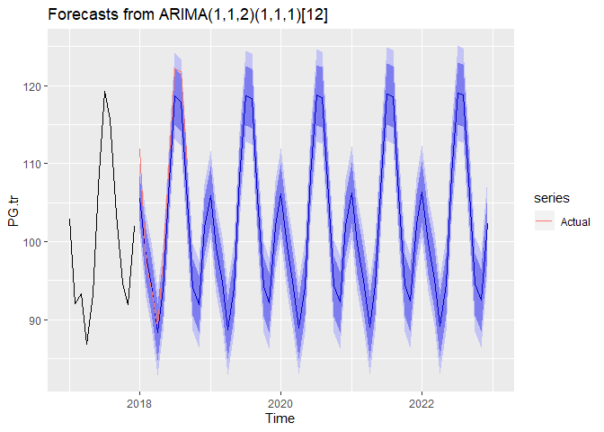

``` r
accuracy(fc.A, PG.te)
```

    ##                      ME     RMSE      MAE       MPE     MAPE      MASE
    ## Training set -0.1791573 2.040949 1.609940 -0.208373 1.581951 0.5948563
    ## Test set      2.6722729 3.511788 2.999205  2.387633 2.729227 1.1081752
    ##                     ACF1 Theil's U
    ## Training set -0.00384867        NA
    ## Test set      0.15051601 0.2989343
