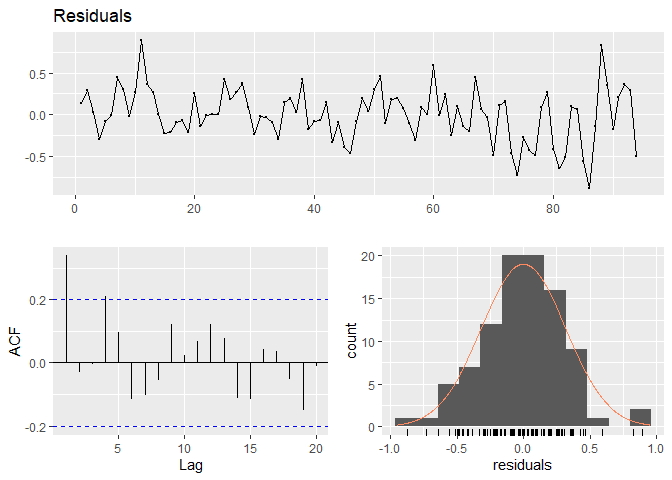
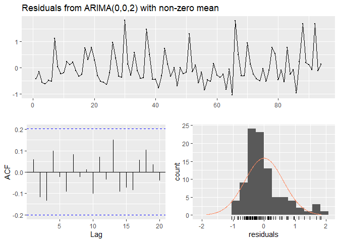
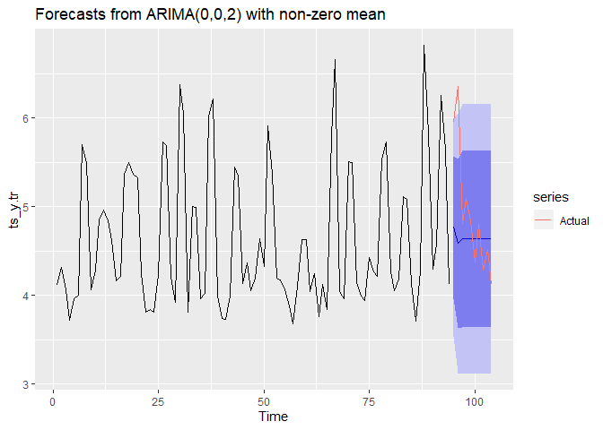
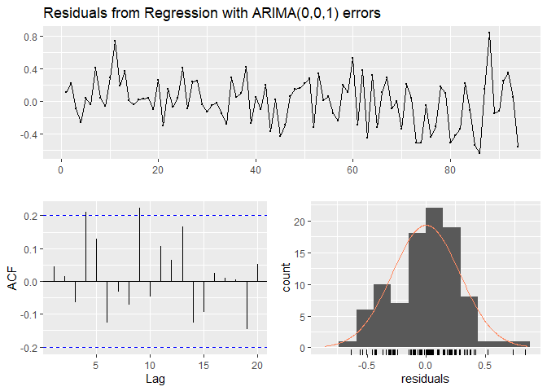
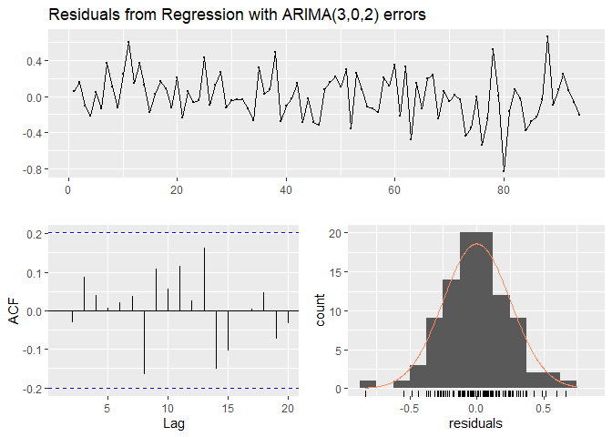
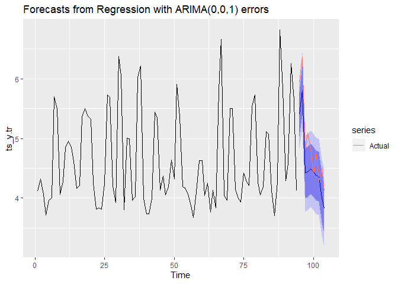

------------------------------------------------------------------------

<center>

### Embeding a Demand Function into an ARIMA Model:

### Dynamic Regression Laboratory.

#### (Total 40 pts.)

#### Due: Dec. 2 (before 9:00am)

</center>

------------------------------------------------------------------------

The sales data is provided in CSV format in the file **“Peanut Butter
Chicago.csv”**. As this is an individual skill-building assignment (as
opposed to an open-ended team assignment), and I would like to achieve
some degree of convergence in your answers, hence I have provided a
common data preprocessing script below. The data set corresponds to the
total weekly sales of peanut butter for a supermarket chain, not for the
individual stores. As you can observe from the file, the data
corresponds to a combination of multiple brands as well as the
supermarket private label (generic) in sizes ranging from 0.75 to 1.5
lbs.

The data includes the following information for each individual stock
keeping unit (SKU) as identified by its UPC code on each week in the
data file:

-   VEND Number identifying the product vendor (48001 corresponds to
    Unilever).
-   UPC The product’s universal product code (bar code)
-   UNITS Sales volume
-   DOLLARS Dollar sales revenue
-   VOL\_EQ Weight in pounds of a units sold
-   PPU Price per unit ($/lb)
-   F Factor specifying advertising in the store weekly flyer:
    -   F = “A” Large size ad.
    -   F = “B” Medium size ad.
    -   F = “C” Small size ad.
-   D Factor specifying In-Store Display
    -   D = 0 No In-Store Display
    -   D = 1 Minor In-Store Display
    -   D = 2 Major In-Store Display

To simplify the modeling process (and the assignment) in the
preprocessing script below I lumped all products into just three
aggregate products (sub-categories): “SK” includes all Skippy brand
products, “OB” includes all other branded products and “PL” includes all
private label products. For each of the three aggregate products I
obtained the total sales (volume) in pounds, the average sale prices
($/lb), and volume-weighted averages of the advertising and display
variables (F and D). Please take a few minutes to examine the
pre-processing script below.

Our goal is to embed a log-log demand model in an ARIMA model
(Regression with ARIMA errors) that accounts for the auto-correlations
in the sales data. As a first attempt we would like to include a demand
function of the following form:

*y* = *e*<sup>*β**x*</sup>*p*<sub>*S*</sub><sup>*α*</sup>*p*<sub>*B*</sub><sup>*γ*</sup>*p*<sub>*P*</sub><sup>*γ*<sub>*o*</sub></sup>

Where the model variables and parameters are defined as follows:

-   *y* : Demand (sales volume)
-   *p*<sub>*S*</sub> : Average price per pound of “Skippy” products
-   *p*<sub>*B*</sub> : Average price per pound of “Other Branded”
    products
-   *p*<sub>*P*</sub> : Average price per pound of “Private Label”
    products
-   *x* : Vector of weighted averages of advertising and display
    variables for each product sub-category
-   *β* : Vector of coefficients for advertising and display variables
-   *α*, *γ*, *γ*<sub>*o*</sub>: Coefficients (elasticity and
    cross-elasticities) of prices

We have a total of 104 weeks of data. In this assignment we will use
weeks 1 through 94 as a training set and weeks 95 through 104 as a
testing set.

``` r
library(fpp)
library(reshape)
library(dplyr)
library(glmnet)

# Data Pre-Processing 
#
PBS <- read.csv("PBS.csv") %>%        # wtd. by sales in pounds average needed hence dummy coding *SK*
  mutate( F_LSA=ifelse(F=="A",1,0),   # Large Size Ad Dummy
          F_MSA=ifelse(F=="B",1,0),   # Medium Size Ad Dummy
          F_SSA=ifelse(F=="C",1,0),   # Small Size Ad Dummy
          D_MIN=ifelse(D==1,1,0),     # Minor In-Store Display Dummy
          D_MAJ=ifelse(D==2,1,0)) %>% # Major In-Store Display Dummy
  # Promotional variables are weighted by sales volume (oz)
  mutate(S_LB = UNITS * VOL_EQ,
         WF_LSA = F_LSA * S_LB,     # Large Size Ad Weighted
         WF_MSA = F_MSA * S_LB,     # Medium Size Ad Weighted
         WF_SSA = F_SSA * S_LB,     # Small Size Ad Weighted
         WD_MIN = D_MIN * S_LB,     # Minor In-Store Display Weighted
         WD_MAJ = D_MAJ * S_LB) %>% # Major In-Store Display Weighted
  mutate(VEND =ifelse(VEND == 48001,"SK",ifelse( VEND == 99998,"PL","OB"))) %>%
  select(-F, -D) # in-store display, F- feature ad in news paper

# Create aggregate variables by product-week
x.pw <- PBS %>% group_by(WEEK, VEND) %>% 
  summarise(S.DOLLARS = sum(DOLLARS),      # Total $ Sales 
            S.S_LB    = sum(S_LB),         # Total L. Sales
            S.WF_LSA  = sum(WF_LSA),       # Total Weighted Large Ad
            S.WF_MSA  = sum(WF_MSA),       # Total Weighted Medium Ad
            S.WF_SSA  = sum(WF_SSA),       # Total Weighted Small Ad
            S.WD_MIN  = sum(WD_MIN),       # Total Weighted Minor Store Disp
            S.WD_MAJ  = sum(WD_MAJ)) %>%   # Total Weighted Major Store Disp
  # Calculate weigted averages of Advertising and Promotion variables
  mutate(A.PPU = log(S.DOLLARS / S.S_LB),  # Log of Avg. Price ($/pound)
         S.WF_LSA  = S.WF_LSA / S.S_LB,    # Avg. Weighted Large Ad
         S.WF_MSA  = S.WF_MSA / S.S_LB,    # Avg. Weighted Medium Ad
         S.WF_SSA  = S.WF_SSA / S.S_LB,    # Avg. Weighted Small Ad
         S.WD_MIN  = S.WD_MIN / S.S_LB,    # Avg. Weighted Minor Store Disp
         S.WD_MAJ  = S.WD_MAJ / S.S_LB)    # Avg. Weighted Major Store Disp

# *SK* log(y) = beta*log(p) # beta is the elasticity of the man, y->sales, P->price, log-log model gives constant elasticity - % change in man with % change in price is constant beta
#
x.pw <- x.pw %>%
  mutate(LS  = log(S.S_LB)) %>% 
  select(-S.DOLLARS, -S.S_LB)

# SK - Skippy brand, OB - other brands, PL - Private Labels/generics
#
# Create separate dataframes for each brand group
x.SK <- x.pw %>% filter(VEND == "SK") %>% select(-VEND)
colnames(x.SK) <- c("WEEK","WF_LSA.SK","WF_MSA.SK","WF_SSA.SK","S.WD_MIN.SK","S.WD_MAJ.SK","PPU.SK","LS.SK" )
x.OB <- x.pw %>% filter(VEND == "OB") %>% select(-VEND,-LS)
colnames(x.OB) <- c("WEEK","WF_LSA.OB","WF_MSA.OB","WF_SSA.OB","S.WD_MIN.OB","S.WD_MAJ.OB","PPU.OB")
x.PL <- x.pw %>% filter(VEND == "PL") %>% select(-VEND,-LS)
colnames(x.PL) <- c("WEEK","WF_LSA.PL","WF_MSA.PL","WF_SSA.PL","S.WD_MIN.PL","S.WD_MAJ.PL","PPU.PL")

#Join the product-specific dataframes to create an expanded dataframe for SK using the 
# data from competing products as additional columns to be used as predicitve variables

xmat <- x.SK %>%
  left_join(x.OB,by="WEEK") %>%
  left_join(x.PL,by="WEEK")

# If your code executed correctly xmat should have 20 cols and 104 rows.
#
xm <- model.matrix(LS.SK ~. - WEEK, data=xmat)[,-1]
y <- xmat$LS.SK

#Separation of Training and Testing sets
xm.tr <- xm[1:94,]
y.tr <-  y[1:94]
xm.te <- xm[95:104,]
y.te <-  y[95:104]
#
```

1.  (5 pts) After pre-processing the data, notice that you have 18
    predictive variables plus the week index and the sales vector.
    Notice that the pre-processing step already computes the log of the
    average prices and sales volumes. Now use The Lasso on the training
    set to obtain (a) a regularized model and (b) the reduced set of
    predictive variables that minimize the cross-validated MSE over the
    training set (i.e., the set of variables included in the
    Lasso-regularized model). (Use set.seed(1) before 10-fold
    cross-validation). Report the coefficients of the regularized model.

Answer:

Reduced set of variables:

    ## 
    ## S.WD_MIN.SK  0.4520653
    ## PPU.SK      -2.3844935

``` r
set.seed(1)

lambda_seq <- 10^seq(2, -2, by = -.1)

cv.lasso <- cv.glmnet(xm.tr, y.tr, alpha = 1, lambda = lambda_seq, nfolds=10)

lasso <- glmnet(xm.tr, y.tr, alpha = 1, lambda = cv.lasso$lambda.min)

coef(lasso)
```

    ## 19 x 1 sparse Matrix of class "dgCMatrix"
    ##                     s0
    ## (Intercept)  6.7273866
    ## WF_LSA.SK    .        
    ## WF_MSA.SK    .        
    ## WF_SSA.SK    .        
    ## S.WD_MIN.SK  0.4520653
    ## S.WD_MAJ.SK  .        
    ## PPU.SK      -2.3844935
    ## WF_LSA.OB    .        
    ## WF_MSA.OB    .        
    ## WF_SSA.OB    .        
    ## S.WD_MIN.OB  .        
    ## S.WD_MAJ.OB  .        
    ## PPU.OB       .        
    ## WF_LSA.PL    .        
    ## WF_MSA.PL    .        
    ## WF_SSA.PL    .        
    ## S.WD_MIN.PL  .        
    ## S.WD_MAJ.PL  .        
    ## PPU.PL       .

1.  (5 pts) Use the training set to fit an unrestricted regression model
    (i.e., **lm(…)** ) on the reduced set of explanatory variables
    identified by The Lasso. Report the coefficients of the full model
    and comment on the fit of the model and examine the
    auto-correlations of the residuals of this model.

Answer:

The Adjusted R-squared value is only 84% which indicates that some of
the variance in the dependent variable has not been captured by the
model. Also, p-value = 0.006632 points to the fact that the residuals
are correlated which defies assumptions of the linear regression model.

    ## 
    ## (Intercept) S.WD_MIN.SK      PPU.SK 
    ##   6.8562574   0.5741423  -2.5493307

``` r
xm.tr1 <- xm.tr[,c('S.WD_MIN.SK', 'PPU.SK')] 
xm.te1 <- xm.te[,c('S.WD_MIN.SK', 'PPU.SK')] 

xm_df.tr = as.data.frame(cbind(xm.tr1,y.tr))

fit.lm <- lm(y.tr~S.WD_MIN.SK + PPU.SK, data=xm_df.tr)
summary(fit.lm)
```

    ## 
    ## Call:
    ## lm(formula = y.tr ~ S.WD_MIN.SK + PPU.SK, data = xm_df.tr)
    ## 
    ## Residuals:
    ##      Min       1Q   Median       3Q      Max 
    ## -0.87268 -0.19213  0.00467  0.19773  0.89398 
    ## 
    ## Coefficients:
    ##             Estimate Std. Error t value Pr(>|t|)    
    ## (Intercept)   6.8563     0.1248  54.950  < 2e-16 ***
    ## S.WD_MIN.SK   0.5741     0.0947   6.063 2.99e-08 ***
    ## PPU.SK       -2.5493     0.1279 -19.937  < 2e-16 ***
    ## ---
    ## Signif. codes:  0 '***' 0.001 '**' 0.01 '*' 0.05 '.' 0.1 ' ' 1
    ## 
    ## Residual standard error: 0.3202 on 91 degrees of freedom
    ## Multiple R-squared:  0.8423, Adjusted R-squared:  0.8388 
    ## F-statistic:   243 on 2 and 91 DF,  p-value: < 2.2e-16

``` r
coef(fit.lm)
```

    ## (Intercept) S.WD_MIN.SK      PPU.SK 
    ##   6.8562574   0.5741423  -2.5493307

``` r
checkresiduals(fit.lm)
```



    ## 
    ##  Breusch-Godfrey test for serial correlation of order up to 10
    ## 
    ## data:  Residuals
    ## LM test = 24.389, df = 10, p-value = 0.006632

1.  (5 pts) Fit a simple ARIMA model (not a dynamic regression model) to
    explain the training set log-of-sales-volume data. Report the
    diagnostic of your model’s residuals and comment on the model’s
    validity.

Answer:

P-value(0.3958) is greater than 0.05 which indicates that the residuals
are not correlated. Hence, the model is valid.

``` r
ts_xm.tr <- ts(xm.tr1, frequency=1)
ts_y.tr <- ts(y.tr, frequency=1)
ts_xm.te <- ts(xm.te1, start=c(95), frequency=1)
ts_y.te <- ts(y.te, start=c(95),frequency=1)

ggtsdisplay(ts_y.tr, lag=100)
```


``` r
adf.test(ts_y.tr, alternative='stationary')
```

    ## Warning in adf.test(ts_y.tr, alternative = "stationary"): p-value smaller
    ## than printed p-value

    ## 
    ##  Augmented Dickey-Fuller Test
    ## 
    ## data:  ts_y.tr
    ## Dickey-Fuller = -4.7333, Lag order = 4, p-value = 0.01
    ## alternative hypothesis: stationary

``` r
fit.AR <- Arima(ts_y.tr, order = c(0,0,2))
summary(fit.AR)
```

    ## Series: ts_y.tr 
    ## ARIMA(0,0,2) with non-zero mean 
    ## 
    ## Coefficients:
    ##          ma1      ma2    mean
    ##       0.6531  -0.3469  4.6358
    ## s.e.  0.1211   0.1175  0.0825
    ## 
    ## sigma^2 estimated as 0.3872:  log likelihood=-89.31
    ## AIC=186.62   AICc=187.07   BIC=196.79
    ## 
    ## Training set error measures:
    ##                        ME      RMSE     MAE      MPE     MAPE      MASE
    ## Training set -0.001016694 0.6122552 0.46372 -1.76028 9.820698 0.7106739
    ##                    ACF1
    ## Training set 0.05784379

``` r
checkresiduals(fit.AR)
```



    ## 
    ##  Ljung-Box test
    ## 
    ## data:  Residuals from ARIMA(0,0,2) with non-zero mean
    ## Q* = 7.3257, df = 7, p-value = 0.3958
    ## 
    ## Model df: 3.   Total lags used: 10

1.  (5 pts) Use the model in Question 3 to prepare a 10 period ahead
    forecast and compare it (overly it) with the testing set
    log-of-sales data. Comment on the usefulness of this model in terms
    of precision and confidence interval.

Answer:

From the plot, it can be observed that confidence interval is very wide
i.e. it is spanning almost the maximum and minimum values in the series.
From the precision standpoint, the model is not performing well as it is
not capturing the patterns in the series.

``` r
fc.AR = fit.AR %>%
  forecast(h=10)

autoplot(fc.AR) + autolayer(ts_y.te, series = "Actual")
```



``` r
accuracy(fc.AR,ts_y.te)
```

    ##                        ME      RMSE       MAE       MPE     MAPE      MASE
    ## Training set -0.001016694 0.6122552 0.4637200 -1.760280 9.820698 0.7106739
    ## Test set      0.270602575 0.7285548 0.5185286  3.868038 9.695961 0.7946709
    ##                    ACF1 Theil's U
    ## Training set 0.05784379        NA
    ## Test set     0.41366377  1.056471

1.  (5 pts) Use the **auto.arima(…)** function to fit a dynamic
    regression (i.e., regression with ARIMA errors) model to explain
    sales data (log) using only the predictive variables identified by
    The Lasso in Question 1. Examine the model’s residuals and comment
    on its validity.

Answer:

P-value(0.02348) is less than 0.05 which indicates that the residuals
are not correlated. Hence, the model is not valid.

``` r
fit.AAD <- auto.arima(ts_y.tr, xreg = ts_xm.tr)
summary(fit.AAD)
```

    ## Series: ts_y.tr 
    ## Regression with ARIMA(0,0,1) errors 
    ## 
    ## Coefficients:
    ##          ma1  intercept  S.WD_MIN.SK   PPU.SK
    ##       0.5109     6.9871       0.3591  -2.6548
    ## s.e.  0.0942     0.1340       0.0928   0.1341
    ## 
    ## sigma^2 estimated as 0.08464:  log likelihood=-15.43
    ## AIC=40.86   AICc=41.54   BIC=53.58
    ## 
    ## Training set error measures:
    ##                        ME      RMSE       MAE        MPE     MAPE
    ## Training set -0.000157446 0.2846773 0.2242023 -0.3514288 4.941856
    ##                   MASE       ACF1
    ## Training set 0.3436012 0.04571852

``` r
checkresiduals(fit.AAD)
```



    ## 
    ##  Ljung-Box test
    ## 
    ## data:  Residuals from Regression with ARIMA(0,0,1) errors
    ## Q* = 14.614, df = 6, p-value = 0.02348
    ## 
    ## Model df: 4.   Total lags used: 10

1.  (5 pts) Obtain a dynamic regression model that improves on the
    auto-arima model in Question 5 in terms of its information
    coefficients and residual diagnostics. Compare the coefficients of
    the explanatory variables in (a) The Lasso model, (b) The
    unrestricted model obtained in Question 2, and (c) The ones obtained
    in this question. Then use the B notation (polynomial) to describe
    the model you obtained.

Answer:

P-value for the improved model is 0.07248 which indicates that the model
is valid and the AIC, AICc values are also lower than the auto.arima
model.

The beta value for S.WD\_MIN.SK is highest for the unrestricted model in
Question 2 and least in the case of dynamic regression. The beta value
for PPU.SK is highest for the lasso model in Question 2 and least in the
case of dynamic regression.

    ## 
    ## Auto.Arima : AIC=40.86   AICc=41.54   BIC=53.58
    ## Manual     : AIC=30.98   AICc=33.13   BIC=53.87
    ## 
    ## Coefficients:
    ##              Lasso       Question 2   Dynamic Regrgression         
    ## S.WD_MIN.SK  0.4520653   0.5741       0.2438
    ## PPU.SK      -2.3844935  -2.5493      -2.5624

*y*<sub>*t*</sub> = 6.92 + 0.24 \* *S*.*W**D*\_*M**I**N*.*S**K* − 2.56 \* *P**P**U*.*S**K* + *n*<sub>*t*</sub>

(1 − 0.49*B* + 0.99*B*<sup>2</sup> − 0.39*B*<sup>3</sup>)*n*<sub>*t*</sub> = (1 + 0.13*B* + 1.00*B*<sup>2</sup>)*e*<sub>*t*</sub>

``` r
fit.AD <- Arima(ts_y.tr, xreg = xm.tr1, order = c(3,0,2)) 
summary(fit.AD)
```

    ## Series: ts_y.tr 
    ## Regression with ARIMA(3,0,2) errors 
    ## 
    ## Coefficients:
    ##          ar1      ar2     ar3     ma1     ma2  intercept  S.WD_MIN.SK
    ##       0.4957  -0.9876  0.3875  0.1324  1.0000     6.9242       0.2438
    ## s.e.  0.1171   0.0544  0.1109  0.0540  0.0603     0.0954       0.0809
    ##        PPU.SK
    ##       -2.5624
    ## s.e.   0.0839
    ## 
    ## sigma^2 estimated as 0.06831:  log likelihood=-6.49
    ## AIC=30.98   AICc=33.13   BIC=53.87
    ## 
    ## Training set error measures:
    ##                        ME      RMSE       MAE        MPE     MAPE
    ## Training set 2.640112e-06 0.2500009 0.1945773 -0.2918471 4.271454
    ##                   MASE         ACF1
    ## Training set 0.2981994 0.0007862222

``` r
checkresiduals(fit.AD)
```



    ## 
    ##  Ljung-Box test
    ## 
    ## data:  Residuals from Regression with ARIMA(3,0,2) errors
    ## Q* = 7.1825, df = 3, p-value = 0.0663
    ## 
    ## Model df: 8.   Total lags used: 11

1.  (5 pts) Use the model in Question 5 to prepare a 10 period ahead
    forecast and compare it (overlay it) with the testing set
    log-of-sales data. You can also obtain the values of the regressors
    used in the forecasting model from the testing data set **xm.te**.
    Comment on the usefulness of this model in terms of precision and
    confidence interval relative to the model without explanatory
    variables in Question 3.

Answer:

The confidence interval cone is narrower than the earlier model. The
model is also performing well in terms of precision as it is chasing
most of the patterns in the data unlike the model in Question.3 although
it is missing certain peaks leading to an overall under-forecasting
bias(MPE=7%).

``` r
fc.AAD = fit.AAD %>%
  forecast(h=10, xreg=xm.te1)

autoplot(fc.AAD) + autolayer(ts_y.te, series = "Actual")
```



``` r
accuracy(fc.AAD,ts_y.te)
```

    ##                        ME      RMSE       MAE        MPE     MAPE
    ## Training set -0.000157446 0.2846773 0.2242023 -0.3514288 4.941856
    ## Test set      0.357910518 0.4286011 0.3849824  7.0052722 7.631250
    ##                   MASE        ACF1 Theil's U
    ## Training set 0.3436012  0.04571852        NA
    ## Test set     0.5900047 -0.13101247 0.7586736

1.  (5 pts) After you complete a project, it is often useful to reflect
    on what would you do different if you were to perform this project
    again. This is no exception. Comment on the training and testing fit
    statistics and discuss how do you think you could improve on the
    performance of the model in terms of (a) additional data, (b)
    different pre-processing of the existing data, and (c) different
    modeling choices. Discuss your assessment of the potential for
    improvement (ex-ante priorities) for the different improvement
    options you suggest.

Answer:

The models are under-forecasting and missing a few peaks. The overall
under-forecasting is reflected in the positive MPE values. MASE values
indicate that the models are performing better than the naive model.

MAPE and RMSE are better for the training set compared to test set
indicating that the model doen’t fit well.

    ## 
    ## Auto ARIMA    ME          RMSE      MAE        MPE       MAPE     MASE       ACF1       Theil's U
    ## Training set -0.000157446 0.2846773 0.2242023 -0.3514288 4.941856 0.3436012  0.04571852        NA
    ## Test set      0.357910518 0.4286011 0.3849824  7.0052722 7.631250 0.5900047 -0.13101247 0.7586736

    ## Recommendations to improve the model:
    ## - Use of lag variables for advertising as the sales becasue of advertising may not always happen during the time the campaign was run. 
    ## - Use of dummy variables that explain the peaks that are not captured by the model.
    ## - Use of sales discount data.
    ## - Use of subset selection models like forward selection, backward selection etc. instead of lasso model.
